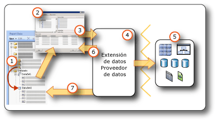

# <a name="report-embedded-datasets-and-shared-datasets-report-builder-and-ssrs"></a>Conjuntos de datos incrustados y compartidos de informe (Generador de informes y SSRS)
  Un conjunto de datos especifica los datos que desea usar de una conexión de datos. Un conjunto de datos se basa en una conexión de datos guardada en el informe como un origen del datos incrustado o una referencia a un origen de datos compartido en un servidor de informes. El conjunto de datos incluye una consulta que especifica un conjunto de campos. Al arrastrar estos campos hacia la superficie de diseño, se crean expresiones que se evalúan como los datos reales cuando se ejecuta el informe.  
  
 Hay dos tipos de conjuntos de datos:  
  
-   **Conjunto de datos compartidos.** Un conjunto de datos compartido se define en el servidor de informes. Puede ir al servidor para crear un conjunto de datos compartidos o seleccionar uno predefinido para agregarlo a su informe. Use un conjunto de datos compartido para proporcionar una consulta que pueda ser usada por más de un informe. Los conjuntos de datos compartidos se almacenan en el servidor de informes y se pueden administrar de forma independiente de los informes u orígenes de datos compartidos. Por ejemplo, un administrador del servidor de informes podría actualizar la consulta para aprovechar la indización mejorada u otra optimización del rendimiento de las consultas.  
  
-   **Conjunto de datos incrustado.** Los conjuntos de datos incrustados solo se pueden definir y usar en el informe en que están incrustados. Use un conjunto de datos incrustado cuando desee recibir los datos desde un origen de datos externo que solo se va a usar en un informe. Los conjuntos de datos incrustados son útiles si se desea crear una consulta que no tenga ninguna otra dependencia y que no sea necesario usar para varios informes.  
  
 Un conjunto de datos también contiene parámetros, filtros y opciones de datos que especifican aspectos de los caracteres, por ejemplo mayúsculas y minúsculas, tipo kana, ancho, acentos e información de intercalación.  
  
   
  
1.  **Conjuntos de datos en el panel Datos de informe** Un conjunto de datos aparece en el panel Datos de informe después de que se crea un conjunto de datos incrustado o un conjunto de datos compartido. Una conjunto de datos se basa en un origen de datos.  
  
2.  **Diseñador de consultas** Al diseñar una consulta de conjunto de datos, se abre el diseñador de consultas asociado al tipo de origen de datos.  
  
3.  **Comando de consulta** El diseñador de consultas le ayuda a crear un comando de consulta. La sintaxis del comando viene determinada por el proveedor de datos.  
  
4.  **Extensión de datos/Proveedor de datos:** la conexión a los datos se puede realizar mediante varios niveles de acceso a datos.  
  
5.  **Orígenes de datos externos** Se recuperan los datos de las bases de datos relacionales, las bases de datos multidimensionales, las listas de SharePoint, los servicios web o los modelos de informe.  
  
6.  **Resultados de consulta** Puede ejecutar la consulta y ver un conjunto de resultados de ejemplo. Debe tener credenciales de tiempo de diseño para ejecutar una consulta.  
  
7.  **Metadatos del esquema** El proveedor de datos ejecuta un comando de consulta de esquema de forma independiente de la consulta para recuperar los metadatos para la colección de campos de conjunto de datos. Por ejemplo, una instrucción [!INCLUDE[tsql](../../includes/tsql-md.md)] **SELECT** statement returns the column names for a database table. Utilice el panel Datos de informe para expandir el conjunto de datos y ver la colección de campos del conjunto de datos.  
  
 Los datos también pueden incluirse en un informe utilizando conjuntos de datos compartidos y elementos de informe predefinidos. Estos elementos ya tienen la información de la conexión de datos que necesita. Para más información, vea [Conjuntos de datos de informe &#40;SSRS&#41;](../../reporting-services/report-data/report-datasets-ssrs.md) y [Elementos de informe &#40;Generador de informes y SSRS&#41;](../../reporting-services/report-design/report-parts-report-builder-and-ssrs.md).  
  
 Para obtener más información sobre tipos de orígenes de datos integrados y extensiones de datos, vea [Agregar datos de orígenes de datos externos &#40;SSRS&#41;](../../reporting-services/report-data/add-data-from-external-data-sources-ssrs.md).  
  
> [!NOTE]  
>  [!INCLUDE[ssRBRDDup](../../includes/ssrbrddup-md.md)]  
  
##  <a name="Overview"></a> Descripción de los conjuntos de datos y las consultas de informe  
 Un conjunto de datos de informe contiene un comando de consulta que se ejecuta en el origen de datos externo y especifica qué datos recuperar. Para crear el comando de consulta, se utiliza el diseñador de consultas asociado a la extensión de datos para el origen de datos externo. En el diseñador de consultas puede ejecutar el comando de consulta y ver un conjunto de resultados. El conjunto de resultados es un conjunto de filas rectangular que tiene nombres de columna y filas con el mismo número de valores en cada fila. No se admiten datos jerárquicos, también conocidos como *jerarquías desiguales*. Los nombres de columna se guardan en la definición del informe en forma de lista de campos de conjunto de datos.  
  
 Después de agregar conjuntos de datos a un informe, puede arrastrar campos desde las colecciones de campos del panel Datos de informe hasta las tablas, gráficos y otros elementos de informe que utiliza para diseñar el informe. Para obtener más información sobre cómo trabajar con campos, vea [Colección Campos del conjunto de datos &#40;Generador de informes y SSRS&#41;](../../reporting-services/report-data/dataset-fields-collection-report-builder-and-ssrs.md).  
  
### <a name="understanding-data-from-a-report-dataset"></a>Descripción de los datos del conjunto de datos de informe  
 Dependiendo de la extensión de los datos, un conjunto de datos de informe puede estar formado por los siguientes tipos de datos:  
  
-   Un conjunto de resultados de una base de datos relacional, que pueden ser el resultado de ejecutar comandos de base de datos, procedimientos almacenados o funciones definidas por el usuario. Si se recuperan varios conjuntos de resultados mediante una única consulta, solo se procesa el primero; el resto de conjuntos de resultados se omiten. Por ejemplo, al ejecutar la consulta siguiente en el diseñador de consultas basado en texto, en el panel de resultados solo aparecerá el conjunto de resultados para `Production.Product` :  
  
    ```  
    SELECT ProductID FROM Production.Product  
    GO  
    SELECT ContactID FROM Person.Contact  
    ```  
  
-   Un conjunto de filas sin información de estructura jerárquica de orígenes de datos multidimensionales que usan el protocolo XML for Analysis (XMLA). Algunos proveedores de datos proporcionan propiedades de dimensión y de celda adicionales del origen de datos que no aparecen en el conjunto de resultados, pero que están disponibles en el informe.  
  
-   Un conjunto de resultados sin información de estructura jerárquica de orígenes de datos XML que incluye elementos XML, sus atributos y sus elementos secundarios.  
  
-   Un conjunto de resultados de cualquier proveedor de datos de [!INCLUDE[dnprdnshort](../../includes/dnprdnshort-md.md)] registrado y configurado.  
  
-   Datos de un modelo de informe que se ha diseñado para un origen de datos concreto, con entidades, relaciones de entidad y campos predefinidos. Para obtener más información, vea "Usar modelos de informe como orígenes de datos" en la [documentación de Reporting Services](http://go.microsoft.com/fwlink/?linkid=121312) , en los Libros en pantalla de SQL Server.  
  
 Cuando el informe se procesa en tiempo de ejecución, el conjunto de resultados real devuelto para una consulta puede tener cero o más filas. También es posible que las columnas definidas en la consulta no estén presentes en el origen de datos. Los valores NULL del origen de datos se asignan al valor de [!INCLUDE[dnprdnshort](../../includes/dnprdnshort-md.md)] **System.DBNull.Value**.  
  
 Para obtener más información sobre los campos del conjunto de datos, vea [Colección Campos del conjunto de datos &#40;Generador de informes y SSRS&#41;](../../reporting-services/report-data/dataset-fields-collection-report-builder-and-ssrs.md).  
  
### <a name="dataset-query"></a>Consulta de conjunto de datos  
 Al ejecutar en tiempo de diseño una consulta de conjunto de datos en un diseñador de consultas, podrá ver un conjunto de filas del origen de datos con datos de ejemplo. Cuando un usuario ve el informe en tiempo de ejecución, la consulta de conjunto de datos puede generar valores diferentes, ya que los datos en el origen de datos han cambiado. Cada vez que se procesa el informe, pueden aparecer nuevos datos.  
  
 Al definir cada conjunto de datos, el Generador de informes abre el diseñador de consultas que corresponde al tipo de origen de datos para ayudarle a diseñar las consultas. Por ejemplo, para definir una consulta para los datos de una base de datos relacional de SQL Server, los asistentes para tablas, matrices, gráficos y mapas abren una interfaz gráfica sencilla que le ayuda a generar la consulta. Simplemente tiene que seleccionar los campos que desea tener en su conjunto de datos.  
  
 En el diseñador de consultas, puede hacer lo siguiente:  
  
-   Alternar entre una vista de consulta basada en gráficos y basada en texto. Usar el gráfico para explorar los esquemas, tablas, vistas, y procedimientos almacenados en el origen de datos. Usar la vista basada en texto para escribir, pegar o ver una consulta existente; normalmente, se usa para una consulta compleja que no se puede mostrar en un diseñador gráfico de consultas. Por ejemplo, puede importar una consulta de un archivo de [!INCLUDE[tsql](../../includes/tsql-md.md)] (.sql), otro informe del servidor de informes, o un archivo de definición de informe (.rdl) de un recurso compartido de archivos.  
  
-   Ejecutar la consulta para ver los datos. La consulta devuelve un conjunto de resultados. Las columnas del conjunto de resultados pasan a ser la colección de campos del conjunto de datos. Las filas del resultado pasan a ser los datos del conjunto de datos. Puede trabajar con la consulta hasta que obtenga las columnas que desea.  
  
-   Agregar parámetros de consulta para ayudar a recuperar solamente los datos que desea para el informe. Los parámetros de consulta generan automáticamente parámetros de informe coincidentes. Para un origen de datos de modelo de informe, el filtro que se especifica genera automáticamente el parámetro de informe correspondiente. Los parámetros de informe permiten a los usuarios especificar los datos del informe que desean ver al ejecutarlo. Por ejemplo, el usuario selecciona las categorías de producto cuyos datos desea y, al ejecutar el informe, en el informe solo aparecen los datos para esas categorías de producto.  
  
-   Importar una consulta existente de otro informe.  
  
 Los diseñadores de consultas pueden proporcionar un modo gráfico o un modo de texto, en función del tipo de origen de datos. Si elige el modo de texto, debe utilizar la sintaxis de consulta adecuada para el origen de datos.  
  
 Al definir un conjunto de datos de informe, puede establecer las propiedades de los datos en la consulta o aceptar los valores predeterminados establecidos por el proveedor de datos. Puede cambiar un tipo de datos usando una de las estrategias siguientes:  
  
-   Vuelva a escribir la consulta de conjunto de datos para convertir específicamente un campo en un tipo de datos diferente.  
  
-   Edite el campo del conjunto de datos y proporcione un formato personalizado.  
  
-   Cree un nuevo campo personalizado basado en un campo de base de datos y proporcione un formato personalizado.  
  
 Para obtener más información, vea [Colección Campos del conjunto de datos &#40;Generador de informes y SSRS&#41;](../../reporting-services/report-data/dataset-fields-collection-report-builder-and-ssrs.md).  
  
### <a name="importing-existing-queries-for-a-dataset"></a>Importar consultas existentes para un conjunto de datos  
 Cuando se crea un conjunto de datos, es posible crear una nueva consulta o importar una ya existente de un archivo o de otro informe. Cuando se importa una consulta de otro informe, es posible elegir qué consulta se debe importar en la lista de conjuntos de datos del informe.  
  
 Solo se admiten los tipos de archivos sql y rdl. Únicamente el diseñador de consultas asociado puede generar consultas de Expresión multidimensional (MDX), de Predicción de minería de datos (DMX) y de modelo (SMQL).  
  
##  <a name="Compare"></a> Comparar y crear conjuntos de datos compartidos y conjuntos de datos incrustados  
 Un conjunto de datos incrustado se define en un informe o en un elemento de informe publicado. Los cambios realizados en un conjunto de datos incrustado afectan solo a ese informe o ese elemento de informe.  
  
 Un conjunto de datos compartido se define en un servidor de informes o un sitio de SharePoint, está basado en un origen de datos compartido y se puede usar en varios informes y elementos de informe. Los cambios realizados en una definición de conjunto de datos compartido afectan a todos los informes y todos los elementos de informe que la usen.  
  
 Al agregar un conjunto de datos compartido a un informe, la colección de campos de conjunto de datos se actualiza para que sea igual que la definición actual en el servidor de informes. No se reciben notificaciones de actualización cuando se realizan cambios en el servidor de informes. Para sincronizar una copia local de la colección de campos con los cambios realizados en la definición del conjunto de datos compartido en el servidor de informes, debe actualizar la colección de campos local. Para obtener más información, consulte [Agregar, editar y actualizar campos en el panel Datos de informe &#40;Generador de informes y SSRS&#41;](../../reporting-services/report-data/add-edit-refresh-fields-in-the-report-data-pane-report-builder-and-ssrs.md).  
  
 Los elementos de informe publicados contienen los conjuntos de datos incrustados y compartidos de los que dependen. Para obtener más información, vea [Elementos de informe y conjuntos de datos en el Generador de informes](../../reporting-services/report-data/report-parts-and-datasets-in-report-builder.md).  
  
 La diferencia entre los orígenes de datos incrustados y compartidos es la manera en que se crean, almacenan y administran. En la tabla siguiente se resumen las diferencias entre los orígenes de datos compartidos y los incrustados:  
  
|Description|Origen de datos<br /><br /> Origen de datos|Compartidos<br /><br /> Origen de datos|  
|-----------------|------------------------------|----------------------------|  
|La conexión de datos se incrusta en la definición de informe.|||  
|El puntero a la conexión de datos en el servidor de informes se incrusta en la definición de informe.|||  
|Se administra en el servidor de informes|||  
|Se requiere para los conjuntos de datos compartidos|||  
|Se requiere para los componentes|||  
  
 En el Diseñador de informes, puede crear conjuntos de datos compartidos como parte de un proyecto de informe y controlar si se han de implementar en un servidor de informes. No puede desplazarse a un servidor de informes y seleccionar un conjunto de datos compartido para agregarlo a su informe.  
  
 En el Generador de informes se puede realizar lo siguiente:  
  
-   Para crear un conjunto de datos compartido, utilice la vista de diseño de conjunto de datos compartido. Puede guardarlo en un servidor de informes o un sitio de SharePoint para compartirlo con otros informes. También puede desplazarse al servidor de informes y editar un conjunto de datos existente. En esta vista, puede generar una consulta y establecer todas las opciones de conjunto de datos. Para más información, vea [Vista de diseño de conjunto de datos compartidos &#40;Generador de informes&#41;](../../reporting-services/report-builder/shared-dataset-design-view-report-builder.md).  
  
-   Para agregar un conjunto de datos compartido a un informe, abra el Generador de informes en la vista de diseño de informe. Desde un asistente o en el panel Datos de informe, vaya al servidor de informes y seleccione el conjunto de datos compartido que desea agregar al informe. En esta vista, no puede cambiar la consulta excepto para agregar los campos. Puede invalidar otras opciones de datos y agregar filtros. No puede quitar los filtros.  
  
 En la tabla siguiente se comparan las propiedades que se pueden configurar para la definición del conjunto de datos compartido en el servidor de informes y la instancia del conjunto de datos compartido en la definición de informe.  
  
|Propiedad|Notas de configuración para la definición|Notas de configuración para la instancia|  
|--------------|--------------------------------------------|------------------------------------------|  
|Texto de consulta|Configure la consulta y defínala como expresión.|No puede cambiar la consulta.|  
|Parámetros de consulta|No puede hacer referencia a los parámetros de informe<br /><br /> Incluye los valores predeterminados<br /><br /> Incluye una marca de solo lectura|Configure los parámetros que no están marcados como de solo lectura en la definición|  
|Filtros|Definir filtros|No se pueden ver ni cambiar los filtros de conjunto de datos que forman parte de la definición<br /><br /> Puede crear filtros adicionales|  
|Origen de datos|Debe ser un origen de datos compartido|No se puede cambiar el origen de datos|  
|Campos|Campos en el comando de consulta<br /><br /> Los campos calculados no forman parte de la definición del conjunto de datos|Se ven los campos, pero no se pueden cambiar<br /><br /> La colección de campos es estática y está basada en la consulta en el momento que agregó el conjunto de datos compartido al informe. Para actualizar, haga clic en **Actualizar campos** en el cuadro de diálogo **Propiedades del conjunto de datos** . La colección de campos actual es cualquier la consulta actual que la definición devuelve.<br /><br /> Agregar campos calculados|  
|Conjunto de datos|Opciones de datos como la distinción entre mayúsculas y minúsculas|Invalidar las opciones de datos en la instancia|  
  
 Para obtener más información sobre cómo crear conjuntos de datos, vea [Crear un conjunto de datos compartido o un conjunto de datos incrustado &#40;Generador de informes y SSRS&#41;](../../reporting-services/report-data/create-a-shared-dataset-or-embedded-dataset-report-builder-and-ssrs.md) y [Herramientas de Reporting Services](../../reporting-services/tools/reporting-services-tools.md) en la [documentación de Reporting Services](http://go.microsoft.com/fwlink/?linkid=121312) en los Libros en pantalla de SQL Server.  
  
##  <a name="SortGroupFilter"></a> Filtrar, ordenar y agrupar los datos de un conjunto de datos  
 Los datos de un conjunto de datos proceden de la ejecución de un comando de consulta en un origen de datos externo. La sintaxis del comando de consulta para una extensión de datos determina si los datos se pueden ordenar o agrupar. Las acciones de ordenación y agrupación tienen lugar en la consulta antes de que los datos se recuperen para un informe. El filtrado tiene lugar después de que se han recuperado los datos para un informe.  
  
 Para obtener más información, vea [Filtrar, agrupar y ordenar datos &#40;Generador de informes y SSRS&#41;](../../reporting-services/report-design/filter-group-and-sort-data-report-builder-and-ssrs.md).  
  
### <a name="filtering-data-in-a-dataset"></a>Filtrar los datos de un conjunto de datos  
 Los filtros forman parte de  la definición del conjunto de datos de un informe. Use filtros de conjunto de datos para especificar qué datos de un conjunto de datos se deben incluir en un informe. Al especificar filtros en un conjunto de datos, todas las regiones de datos que se basan en el conjunto de datos muestran solo los datos que pasan los filtros del conjunto de datos.  
  
 Los filtros forman parte de la definición de un conjunto de datos compartido. Los filtros de conjunto de datos compartido afectan a todos los informes que contienen el conjunto de datos compartido. Después de agregar un conjunto de datos compartido a su informe, o después de agregar un componente con un conjunto de datos compartido dependiente, puede crear más filtros de conjunto de datos. Los filtros que cree solo se usan en su informe, no forman parte de la definición del conjunto de datos compartido del servidor de informes.  
  
 Puede establecer filtros adicionales en una región de datos o un grupo de regiones de datos. También puede utilizar una combinación de parámetros y filtros para que los usuarios puedan elegir los datos que desean ver en un informe. Para obtener más información, vea [Parámetros de informe &#40;Generador de informes y Diseñador de informes&#41;](../../reporting-services/report-design/report-parameters-report-builder-and-report-designer.md).  
  
### <a name="sorting-data-in-a-dataset"></a>Ordenar datos en un conjunto de datos  
 En un conjunto de datos, el orden de los datos es el orden en que se recuperan desde el origen de datos externo. Es el mismo orden que se ve al ejecutar la consulta en el diseñador de consultas. Si la sintaxis del comando de consulta admite ordenación, puede editar la consulta para ordenar los datos en el origen, antes de ser devueltos como datos de informe. Por ejemplo, para una consulta de [!INCLUDE[tsql](../../includes/tsql-md.md)] , la instrucción ORDER BY controla el criterio de ordenación.  
  
 Para ordenar los datos una vez devueltos al informe, defina expresiones de ordenación en las regiones de datos y los grupos de regiones de datos. Para más información, vea el tema relativo al tipo de región de datos concreto, por ejemplo, [Tablas, matrices y listas &#40;Generador de informes y SSRS&#41;](../../reporting-services/report-design/tables-matrices-and-lists-report-builder-and-ssrs.md).  
  
 También puede utilizar una combinación de parámetros y expresiones de ordenación para que los usuarios puedan elegir el criterio de ordenación para los datos de un informe. Para obtener más información, vea [Parámetros de informe &#40;Generador de informes y Diseñador de informes&#41;](../../reporting-services/report-design/report-parameters-report-builder-and-report-designer.md).  
  
### <a name="grouping-data-in-a-dataset"></a>Agrupar datos de un conjunto de datos  
 Los datos de un grupo de datos no se pueden agrupar. Para agregar los datos de un conjunto de datos, puede editar el comando de consulta para calcular los agregados antes de que los datos se recuperen para un informe. Estos se conocen como *agregados de servidor*. En las expresiones, para identificar estos valores como agregados precalculados, use la función de agregado. Para obtener más información, vea [Función de agregado &#40;Generador de informes y SSRS&#41;](../../reporting-services/report-design/report-builder-functions-aggregate-function.md).  
  
##  <a name="Parameters"></a> Usar parámetros y conjuntos de datos  
 En el caso de una consulta de conjunto de datos incrustado que contiene variables, los parámetros de la consulta y los parámetros de informe correspondientes se crean automáticamente. Cuando se ejecuta el informe, el valor del parámetro de informe se vincula al parámetro de consulta de conjunto de datos. De esta manera, el comando de consulta que se ejecuta en el origen de datos externo incluye los valores que se especifican para los parámetros de informe. Los parámetros de informe permiten al usuario elegir los datos que desea ver en el informe. Puede ver cómo se vinculan los parámetros de consulta y los parámetros de informe en la página [Propiedades del conjunto de datos (cuadro de diálogo), Parámetros &#40;Generador de informes&#41;](http://msdn.microsoft.com/library/3a0672ad-c969-455b-b952-585164ce1dda).  
  
 En el caso de un conjunto de datos compartido, los parámetros de consulta forman parte de la definición del conjunto de datos compartido que se puede administrar en el servidor de informes independientemente de un informe. En la siguiente lista se describe la compatibilidad con los valores de parámetro de consulta:  
  
-   Se puede basar en una expresión.  
  
-   Puede incluir los valores predeterminados.  
  
-   Se puede establecer en solo lectura. Los parámetros de solo lectura no se pueden cambiar en una instancia del conjunto de datos compartido en un informe.  
  
-   No pueden contener referencias a la colección de parámetros integrada, que representa los parámetros de informe.  
  
 Para configurar los valores de parámetro de consulta para un conjunto de datos compartido, en el modo de diseño de conjunto de datos, vaya a un conjunto de datos compartido del servidor de informes, ábralo y establezca las opciones en la página [Propiedades del conjunto de datos (cuadro de diálogo), Parámetros &#40;Generador de informes&#41;](http://msdn.microsoft.com/library/3a0672ad-c969-455b-b952-585164ce1dda). Para obtener más información, vea [Crear un conjunto de datos compartido o un conjunto de datos incrustado &#40;Generador de informes y SSRS&#41;](../../reporting-services/report-data/create-a-shared-dataset-or-embedded-dataset-report-builder-and-ssrs.md).  
  
 Para algunos orígenes del datos multidimensionales, por ejemplo [!INCLUDE[ssASnoversion](../../includes/ssasnoversion-md.md)], el diseñador gráfico de consultas le permite especificar filtros de consulta y seleccionar una opción para crear un parámetro de consulta correspondiente. Al seleccionar la opción de parámetro, la extensión de datos crea automáticamente un conjunto de datos de informe independiente para proporcionar los valores disponibles en una lista desplegable de ese parámetro. De forma predeterminada, estos conjuntos de datos ocultos no aparecen en el panel Datos de informe.  
  
 Los parámetros de informe vinculados a los parámetros de consulta ayudan a filtrar los datos antes de que los datos se devuelvan desde el origen de datos externo. También puede filtrar los datos en el informe creando filtros que formen parte de la definición de informe. Para obtener más información, vea [Filtrar, agrupar y ordenar datos &#40;Generador de informes y SSRS&#41;](../../reporting-services/report-design/filter-group-and-sort-data-report-builder-and-ssrs.md).  
  
### <a name="displaying-hidden-datasets"></a>Mostrar conjuntos de datos ocultos  
 Cuando se crea una consulta con parámetros para algunos orígenes de datos multidimensionales, se crean automáticamente conjuntos de datos que proporcionan valores válidos para el parámetro. En algunos diseñadores de consultas, esto se hace especificando filtros y, a continuación, seleccionando la opción para crear parámetros. De forma predeterminada, estos conjuntos de datos no aparecen en el panel Datos de informe, pero se pueden mostrar. Para obtener más información, vea [Mostrar conjuntos de datos ocultos para los valores de parámetro de datos multidimensionales &#40;Generador de informes y SSRS&#41;](../../reporting-services/report-data/show-hidden-datasets-for-parameter-values-multidimensional-data.md).  
  
##  <a name="Maps"></a> Usar mapas y conjuntos de datos  
 Si incluye un mapa en el informe, debe proporcionar datos espaciales. Los datos espaciales pueden proceder de un conjunto de datos de informe, de un mapa de la galería de mapas o de archivos de forma ESRI. Los datos espaciales de un informe o un archivo de forma ESRI no aparecen como conjunto de datos en el panel de Datos de informe. Para obtener más información, vea [Mapas &#40;Generador de informes y SSRS&#41;](../../reporting-services/report-design/maps-report-builder-and-ssrs.md).  
  
##  <a name="Multiple"></a> Mostrar datos de varios conjuntos de datos  
 Normalmente, un informe tiene más de un conjunto de datos. La lista siguiente describe cómo puede usar los conjuntos de datos en un informe:  
  
-   Muestre los datos de cada conjunto de datos usando una región de datos independiente. Para más información, vea [Regiones de datos y mapas &#40;Generador de informes y SSRS&#41;](../../reporting-services/report-design/data-regions-and-maps-report-builder-and-ssrs.md).  
  
-   Puede vincular más de una región de datos a un conjunto de datos y proporcionar varias vistas de los mismos datos. Para obtener más información, vea [Vincular varias regiones de datos al mismo conjunto de datos &#40;Generador de informes y SSRS&#41;](../../reporting-services/report-design/linking-multiple-data-regions-to-the-same-dataset-report-builder-and-ssrs.md).  
  
-   Puede usar conjuntos de datos para proporcionar una lista desplegable de valores disponibles o valores predeterminados para un parámetro de informe. Para obtener más información, vea [Parámetros de informe &#40;Generador de informes y Diseñador de informes&#41;](../../reporting-services/report-design/report-parameters-report-builder-and-report-designer.md).  
  
-   Es posible vincular datos relacionados de varios conjuntos de datos usando parámetros con informes o subinformes detallados. Por ejemplo, un informe de ventas puede mostrar los datos de resumen para todas las tiendas, y un vínculo de obtención de detalles puede especificar el identificador de tienda como un parámetro para un informe con una consulta de conjunto de datos que recupera las ventas individuales para la tienda especificada. Para más información, vea [Obtención de detalles, informes detallados, subinformes y regiones de datos anidadas &#40;Generador de informes y SSRS&#41;](../../reporting-services/report-design/drillthrough-drilldown-subreports-and-nested-data-regions.md) y [Subinformes &#40;Generador de informes y SSRS&#41;](../../reporting-services/report-design/subreports-report-builder-and-ssrs.md).  
  
-   No puede mostrar datos detallados de varios conjuntos de datos en una única región de datos. Sin embargo, puede mostrar valores de agregado o de función integrada para varios conjuntos de datos dentro de una región de datos. Para más información, vea [Referencia a las funciones de agregado &#40;Generador de informes y SSRS&#41;](../../reporting-services/report-design/report-builder-functions-aggregate-functions-reference.md). Si necesita combinar datos detallados de varios conjuntos de datos en una región de datos, debe volver a escribir la consulta para recuperar los datos como un único conjunto de datos.  
  
##  <a name="NoRows"></a> Mostrar un mensaje cuando no hay filas de datos disponibles  
 Durante el procesamiento del informe, cuando se ejecuta la consulta para un conjunto de datos, es posible que el conjunto de resultados no contenga ninguna fila. En el informe representado, una región de datos vinculada a un conjunto de datos vacío aparece como una región de datos vacía. Puede especificar el texto que se debe mostrar en el informe representado en lugar de la región de datos vacía. También puede especificar un mensaje para los subinformes cuando las consultas para todos los conjuntos de datos no generan ningún dato en tiempo de ejecución. Para obtener más información, vea [Establecer un mensaje para cuando no hay datos en una región de datos &#40;Generador de informes y SSRS&#41;](../../reporting-services/report-data/set-a-no-data-message-for-a-data-region-report-builder-and-ssrs.md).  
  
##  <a name="Options"></a> Configurar opciones de conjunto de datos  
 En el caso de orígenes de datos que admiten datos internacionales, podría tener que ajustar las propiedades de un conjunto de datos que afectan al criterio de ordenación, las propiedades de caracteres internacionales y la distinción entre mayúsculas y minúsculas. Algunas de estas propiedades son mayúsculas y minúsculas, el tipo de kana, el ancho, el acento y la intercalación. Para obtener más información, vea "Consideraciones internacionales para bases de datos y aplicaciones con motor de base de datos" y "Trabajar con intercalaciones" en los [Libros en pantalla de SQL Server](http://go.microsoft.com/fwlink/?linkid=98335). Para más información sobre cómo establecer estas propiedades, vea [Propiedades del conjunto de datos (cuadro de diálogo), Opciones &#40;Generador de informes&#41;](../../reporting-services/report-data/dataset-properties-dialog-box-options-report-builder.md).  
  
## <a name="see-also"></a>Vea también  
 [Colección Campos del conjunto de datos &#40;Generador de informes y SSRS&#41;](../../reporting-services/report-data/dataset-fields-collection-report-builder-and-ssrs.md)   
 [Conexiones de datos, orígenes de datos y cadenas de conexión en el Generador de informes](http://msdn.microsoft.com/library/7e103637-4371-43d7-821c-d269c2cc1b34)   
 [Conjuntos de datos de informe &#40;SSRS&#41;](../../reporting-services/report-data/report-datasets-ssrs.md)  
  
  
