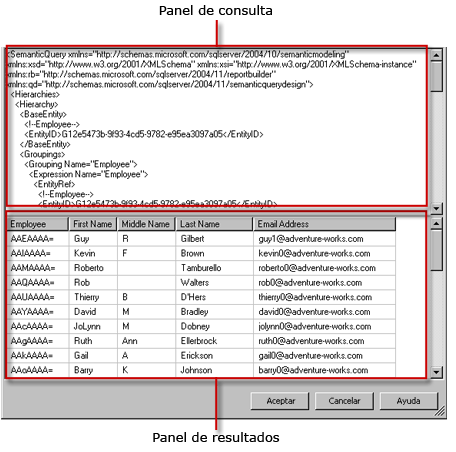

# Interfaz de usuario del Diseñador de consultas de modelo de informe
  El Diseñador de informes proporciona dos diseñadores de consultas; éstos le ayudan a especificar los datos de un origen de datos del modelo de servidor de informes que desea usar en un informe. Utilice el diseñador gráfico de consultas para explorar y elegir las entidades de modelo y los campos de entidad. Use el diseñador de consultas basado en texto para trabajar directamente con una especificación del Lenguaje de definición de modelos semánticos (SMDL) en formato XML.  
  
> [!IMPORTANT]  
>  Los usuarios tienen acceso a los orígenes de datos cuando crean y ejecutan las consultas. Debe conceder permisos mínimos para los orígenes de datos, por ejemplo permisos de solo lectura.  
  
## Diseñador gráfico de consultas  
 El Diseñador de informes proporciona un diseñador gráfico de consultas que puede usar para diseñar y ejecutar consultas SMDL que, durante el procesamiento de los informes, rellenan la colección de campos de un conjunto de datos de informe. El diseñador gráfico de consultas se divide en tres áreas o paneles.  
  
 En la siguiente ilustración se indica el nombre de cada panel.  
  
   
  
 En la siguiente tabla se describe la función de cada panel.  
  
|Panel|Función|  
|----------|--------------|  
|Panel Explorador|Muestra representaciones gráficas de las entidades y los campos de entidad del modelo. Utilice este panel para explorar entidades, sus entidades relacionadas y campos.|  
|Área de diseño|Contiene una lista de campos del modelo. Utilice este panel para organizar el diseño de los campos seleccionados.|  
|Results pane|Muestra los resultados de la consulta. Para ejecutar la consulta, haga clic con el botón derecho en cualquier panel y, después, haga clic en **Ejecutar**, o bien haga clic en el botón **Ejecutar** () en la barra de herramientas.|  
  
 Si efectúa cambios en la información de los paneles Explorador o Área de diseño, se verá afectado el contenido del panel Resultado al hacer clic en **Ejecutar**.  
  
 Para realizar acciones en un determinado panel, como eliminar una columna en el área de diseño, haga clic con el botón secundario en la columna y, a continuación, haga clic en el comando del menú.  
  
### Barra de herramientas del diseñador gráfico de consultas  
 Asimismo, puede usar los botones de la barra de herramientas al diseñar la consulta. En la siguiente tabla se muestran los botones de la barra de herramientas y su función.  
  
|Botón|Description|  
|------------|-----------------|  
|**Editar como texto**|Alterna entre el diseñador de consultas basado en texto y el diseñador gráfico de consultas. La consulta para un origen de datos del modelo del servidor de informes es una especificación del Lenguaje de consulta de modelos semánticos (SMQL) en XML.|  
|**Importar**|Importa una consulta existente desde un archivo de definición de informe (.rdl) del sistema de archivos. Para más información, vea [Conjuntos de datos incrustados y compartidos de informe &#40;Generador de informes y SSRS&#41;](../../reporting-services/report-data/report-embedded-datasets-and-shared-datasets-report-builder-and-ssrs.md).|  
||Deshace la última acción.|  
||Rehace la última acción.|  
||Ejecuta la consulta y muestra las filas resultantes en el panel Resultado.|  
||Abre el cuadro de diálogo **Filtrar datos** , que permite especificar los datos que desea filtrar. Puede especificar filtros independientemente de los datos actuales del Área de diseño.|  
  
## Diseñador de consultas basado en texto  
 Para crear consultas de conjunto de datos del modelo de servidor de informes, de forma predeterminada se usa el diseñador gráfico de consultas. Para cambiar al diseñador de consultas basado en texto, haga clic en el botón de alternancia **Editar como texto** de la barra de herramientas.  
  
 El diseñador de consultas basado en texto consta de dos paneles: un panel de consultas SMQL y un panel de resultados. Esta vista del diseñador de consultas es especialmente útil si ya tiene una especificación de consulta SQML procedente de otro origen y desea pegarla en el panel de consultas. A diferencia del diseñador gráfico de consultas, el diseñador basado en texto no comprueba la sintaxis de la consulta ni procede a reestructurarla. Si hace clic en **Ejecutar** en la barra de herramientas, la consulta se ejecuta en el origen de datos y los resultados se muestran en el panel Resultado.  
  
 En la siguiente ilustración se indica el nombre de cada panel.  
  
   
  
 En la siguiente tabla se describe la función de cada panel.  
  
|Panel|Función|  
|----------|--------------|  
|Panel de consulta|Muestra el texto de especificación SMQL.|  
|Panel Resultado|Muestra los resultados de la consulta. Para ejecutar la consulta, haga clic con el botón derecho en cualquier panel y, después, haga clic en **Ejecutar**, o bien haga clic en el botón **Ejecutar** en la barra de herramientas.|  
  
### Barra de herramientas del diseñador de consultas basado en texto  
 Asimismo, puede usar los botones de la barra de herramientas al diseñar la consulta. En la siguiente tabla se muestran los botones de la barra de herramientas y su función.  
  
|Botón|Description|  
|------------|-----------------|  
|**Editar como texto**|Alterna entre el diseñador de consultas basado en texto y el diseñador gráfico de consultas.|  
|**Importar**|Importa una consulta desde un informe existente.|  
||Ejecuta el texto de consulta y muestra el conjunto de filas resultantes en el panel Resultado.|  
  
## Ver también  
 [Herramientas de diseño de consulta &#40;SSRS&#41;](../../reporting-services/report-data/query-design-tools-ssrs.md)   
 [Agregar datos de orígenes de datos externos &#40;SSRS&#41;](../../reporting-services/report-data/add-data-from-external-data-sources-ssrs.md)   
 [Conexión de modelo de informe &#40;SSRS&#41;](../../reporting-services/report-data/report-model-connection-ssrs.md)   
 [Archivo de configuración RSReportDesigner](../../reporting-services/report-server/rsreportdesigner-configuration-file.md)  
  
  
