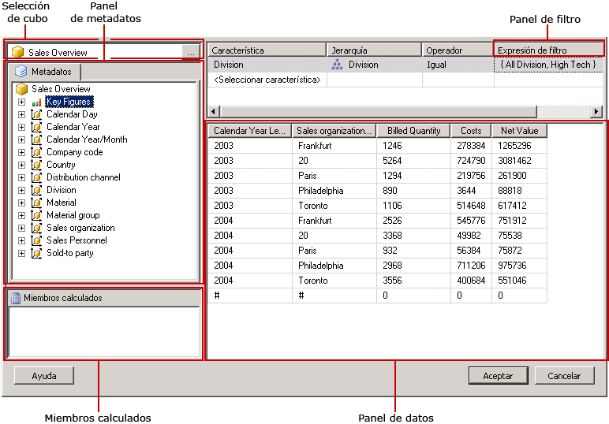
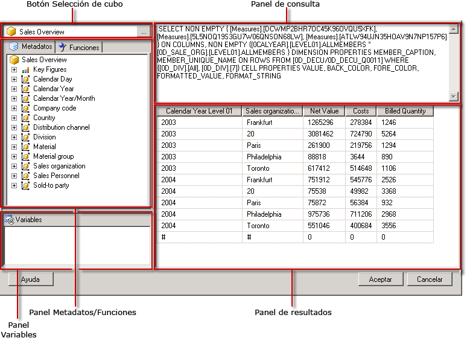

# Interfaz de usuario del Diseñador de consultas SAP NetWeaver BI
  [!INCLUDE[ssRSnoversion](../../includes/ssrsnoversion-md.md)] proporciona un diseñador gráfico de consultas que permite crear consultas MDX (expresiones multidimensionales) para un origen de datos de SAP NetWeaver® Business Intelligence. El diseñador gráfico de consultas MDX tiene dos modos: modo de diseño y modo de consulta. Cada modo proporciona un panel Metadatos desde el que puede arrastrar miembros de un InfoCubo, un MultiSitio, o bien de una consulta habilitada para web definidos en el origen de datos; de esta forma, se puede crear una consulta MDX que recupera datos cuando se procesa el informe.  
  
> [!IMPORTANT]  
>  Los usuarios tienen acceso a los orígenes de datos cuando crean y ejecutan las consultas. Debe conceder permisos mínimos para los orígenes de datos, por ejemplo permisos de solo lectura.  
  
 Para más información sobre cómo trabajar con un origen de datos multidimensionales de SAP, vea [Tipo de conexión BI de SAP NetWeaver &#40;SSRS&#41;](../../reporting-services/report-data/sap-netweaver-bi-connection-type-ssrs.md).  
  
 En esta sección se describen los botones de la barra de tareas y los paneles del diseñador para cada modo del diseñador gráfico de consultas.  
  
## Diseñador gráfico de consultas en modo de diseño  
 Al crear o editar una consulta de conjunto de datos que use un origen de datos de [!INCLUDE[SAP_DPE_BW_1](../../includes/sap-dpe-bw-1-md.md)] , el diseñador gráfico de consultas se abre en el modo de diseño. En la siguiente ilustración se indican los nombres de los paneles del modo de diseño.  
  
   
  
 En la tabla siguiente, aparecen los paneles de este modo.  
  
|Panel|Función|  
|----------|--------------|  
|Botón Selección de cubo|Muestra el InfoCubo, el MultiSitio o la consulta habilitada para web seleccionados actualmente.|  
|Panel Metadatos|Muestra una lista jerárquica de InfoCubos, MultiSitios y consultas. Las consultas creadas en el origen de datos pueden aparecer bajo el cubo correspondiente.|  
|Panel Miembros calculados|Muestra los miembros calculados definidos actualmente que se encuentran disponibles para utilizarse en la consulta.|  
|Panel Datos|Muestra los resultados de la ejecución de la consulta.|  
  
 Puede arrastrar las dimensiones y las cifras clave desde el panel Metadatos, y los miembros calculados desde el panel Miembros calculados al panel Datos. Si el botón de alternancia **Ejecución automática** de la barra de herramientas está activado, el diseñador de consultas ejecuta la consulta cada vez que coloque un objeto en el panel Datos. Si **Ejecución automática** está desactivado, el diseñador de consultas no ejecuta la consulta cuando realice cambios en el panel Datos. Puede ejecutar la consulta manualmente mediante el botón **Ejecutar** de la barra de herramientas.  
  
### Barra de herramientas del diseñador gráfico de consultas en la barra de herramientas del modo de diseño  
 La barra de herramientas del diseñador de consultas proporciona botones que le ayudan a diseñar consultas MDX mediante la interfaz gráfica. En la tabla siguiente, se describen los botones y sus funciones.  
  
|Botón|Descripción|  
|------------|-----------------|  
|**Editar como texto**|Alterna entre el diseñador de consultas basado en texto y el diseñador gráfico de consultas. No está disponible para este tipo de origen de datos.|  
|**Importar**|Importa una consulta existente desde un archivo de definición de informe (.rdl) del sistema de archivos. Para más información, vea [Conjuntos de datos incrustados y compartidos de informe &#40;Generador de informes y SSRS&#41;](../../reporting-services/report-data/report-embedded-datasets-and-shared-datasets-report-builder-and-ssrs.md).|  
||Actualiza los metadatos desde el origen de datos.|  
||Muestra el cuadro de diálogo **Generador de miembros calculados** .|  
||Muestra y oculta las celdas vacías del panel Datos. Esto equivale a utilizar la cláusula NON EMPTY en MDX.|  
||Ejecuta automáticamente la consulta y muestra el resultado cada vez que se realice un cambio, por ejemplo al eliminar una columna en el panel Datos. Los resultados se mostrarán en el panel Datos.|  
||Elimina la columna seleccionada en el panel Datos de la consulta.|  
||Muestra el cuadro de diálogo **Variables** . Este botón se habilita solo cuando el cubo seleccionado es un cubo de consulta; únicamente los cubos de consulta admiten variables. Al asignar un valor predeterminado a una variable, se crea un parámetro de informe correspondiente.|  
||Ejecuta la consulta y muestra los resultados en el panel Datos.|  
||Cancela la consulta.|  
||Alterna el modo de diseño y el modo de consulta.|  
  
## Diseñador gráfico de consultas en modo de consulta  
 Para cambiar el diseñador gráfico de consultas al modo de consulta, haga clic en el botón de alternancia **Modo de diseño** de la barra de herramientas.  
  
 En la siguiente ilustración se indican las partes del diseñador de consultas en el modo de consulta.  
  
   
  
 En la siguiente tabla se describe la función de cada panel.  
  
|Panel|Función|  
|----------|--------------|  
|Botón Selección de cubo|Muestra el InfoCubo, el MultiSitio u otro cubo seleccionados actualmente.|  
|Panel Metadatos/Funciones|Muestra una ventana con pestañas que muestra una lista de metadatos o funciones disponibles para utilizarse en la creación de texto de consulta.|  
|Panel Variables|Muestra las variables definidas actualmente que se encuentran disponibles para utilizarse en la consulta.|  
|Panel de consulta|Muestra el texto de consulta actual.|  
|Panel Resultado|Muestra los resultados de la consulta.|  
  
 En el panel Metadatos, puede arrastrar dimensiones y cifras clave desde la pestaña **Metadatos** hasta el panel Consulta MDX; el nombre técnico de los metadatos se inserta en el cursor. Puede arrastrar funciones desde la pestaña **Funciones** hasta el panel Consulta MDX. Cuando ejecute la consulta, en el panel Resultado se mostrarán los resultados de la consulta MDX actual.  
  
 Si el cubo seleccionado es una consulta habilitada para web, se le pedirá que establezca valores predeterminados estáticos para las variables existentes. A continuación, podrá arrastrar variables al panel Consulta MDX.  
  
 Los paneles Metadatos y Variables muestran nombres sencillos. Al colocar los objetos en el panel Consulta MDX, verá los nombres técnicos que necesita el origen de datos insertado en la consulta MDX.  
  
### Barra de herramientas del diseñador gráfico de consultas en el modo de consulta  
 La barra de herramientas del diseñador de consultas proporciona botones que le ayudan a diseñar consultas MDX mediante la interfaz gráfica. Los botones de la barra de herramientas son idénticos en los modos de diseño y de consulta. Sin embargo, los siguientes botones no están habilitados para el modo de consulta:  
  
-   **Editar como texto**  
  
-   **Agregar miembro calculado** ()  
  
-   **Mostrar celdas vacías** ()  
  
-   **Ejecución automática** ()  
  
-   **Eliminar** ()  
  
## Ver también  
 [Crear un conjunto de datos compartido o un conjunto de datos incrustado &#40;Generador de informes y SSRS&#41;](../../reporting-services/report-data/create-a-shared-dataset-or-embedded-dataset-report-builder-and-ssrs.md)   
 [Archivo de configuración RSReportDesigner](../../reporting-services/report-server/rsreportdesigner-configuration-file.md)  
  
  
