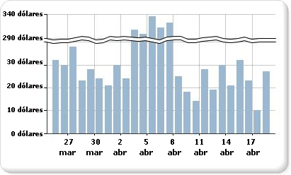

# Agregar quiebres de escala a un gráfico (Generador de informes y SSRS)

  Un quiebre de escala es una franja dibujada a través del área de trazado de un gráfico para hacer ver una interrupción en la continuidad entre los valores altos y bajos de un eje de valores (habitualmente, el eje Y o eje vertical). Use un quiebre de escala para mostrar dos intervalos definidos dentro de la misma área del gráfico.  
  
   
  
> [!NOTE]  
>  No puede especificar dónde se debe colocar un quiebre de escala en un gráfico. El gráfico utiliza sus propios cálculos basados en los valores del conjunto de datos para determinar si hay separación suficiente entre los intervalos de datos para dibujar un quiebre de escala en el eje de valores (eje Y) en tiempo de ejecución.  
  
 Un ejemplo de un gráfico con quiebres de escala está disponible como informe de ejemplo. Para más información acerca de cómo descargar este y otros informes de ejemplo, consulte el tema sobre [informes de ejemplo del Generador de informes y el Diseñador de informes](http://go.microsoft.com/fwlink/?LinkId=198283).  
  
> [!NOTE]  
>  [!INCLUDE[ssRBRDDup](../../includes/ssrbrddup-md.md)]  
  
### Para habilitar quiebres de escala en el gráfico  
  
1.  Haga clic con el botón derecho en el eje vertical y, después, haga clic en **Propiedades del eje**. Se abrirá el cuadro de diálogo **Propiedades del eje vertical** .  
  
2.  Active la casilla **Habilitar quiebres de escala** .  
  
### Para cambiar el estilo del quiebre de escala  
  
1.  Abra el panel de propiedades.  
  
2.  En la superficie de diseño, haga clic con el botón secundario en el eje Y del gráfico. Las propiedades para el objeto del eje Y (que, de forma predeterminada, se denomina Eje del gráfico) se muestran en el panel Propiedades.  
  
3.  En la sección **Scale** , expanda la propiedad ScaleBreakStyle.  
  
4.  Cambie los valores de las propiedades de ScaleBreakStyle, como BreakLineType y Spacing. Para más información sobre las propiedades de quiebres de escala, vea [Mostrar una serie con varios rangos de datos en un gráfico &#40;Generador de informes y SSRS&#41;](../../reporting-services/report-design/displaying-a-series-with-multiple-data-ranges-on-a-chart.md).  

## Pasos siguientes

[Gráficos](../../reporting-services/report-design/charts-report-builder-and-ssrs.md)   
[Dar formato a un gráfico](../../reporting-services/report-design/formatting-a-chart-report-builder-and-ssrs.md)   
[Cuadro de diálogo Propiedades del eje, Opciones del eje](http://msdn.microsoft.com/library/b276e210-7a12-48ae-971b-7dabae51df11)  

¿Tiene alguna pregunta más? [Puede plantear sus dudas en el foro de Reporting Services](http://go.microsoft.com/fwlink/?LinkId=620231).
