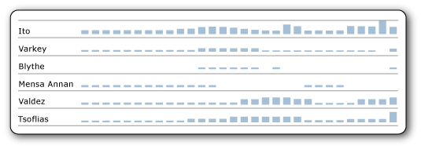

# Alinear los datos en un gráfico en una tabla o una matriz (Generador de informes y SSRS)
  Los minigráficos y barras de datos son gráficos pequeños y sencillos que comunican mucha información con pocos detalles. En un informe paginado de [!INCLUDE[ssRSnoversion_md](../../includes/ssrsnoversion-md.md)] , al activar esta opción, los valores de los minigráficos y las barras de datos se alinearán en todas las celdas distintas de la tabla o matriz, aun cuando falten valores en los datos en que se basan.  
  
   
  
 En esta imagen, el gráfico de columnas muestra las ventas cotidianas para cada empleado. Tenga en cuenta que durante los días que un empleado no tiene ninguna venta, el gráfico deja un espacio en blanco y alinea los días subsiguientes horizontalmente. También alinea verticalmente los gráficos, para lo que hace que los tamaños de los distintos gráficos estén en relación unos con otros. Para obtener más información, vea [Minigráficos y barras de datos &#40;Generador de informes y SSRS&#41;](../../reporting-services/report-design/sparklines-and-data-bars-report-builder-and-ssrs.md).  
  
## Alinear los datos en un minigráfico o una barra de datos  
  
1.  [Agregue un minigráfico o una barra de datos](../../reporting-services/report-design/add-sparklines-and-data-bars-report-builder-and-ssrs.md) a una tabla o matriz.  
  
2. Haga clic en el minigráfico o la barra de datos y, a continuación, haga clic en **Propiedades del Eje horizontal** o **Propiedades del Eje vertical**.  
  
2.  En la pestaña **Opciones del eje** , active el cuadro **Alinear los ejes en** y, a continuación en la lista desplegable, seleccione el grupo en el que alinear el eje.  
  
3.  [!INCLUDE[clickOK](../../includes/clickok-md.md)]  
  
## Ver también  
 [Gráficos &#40;Generador de informes y SSRS&#41;](../../reporting-services/report-design/charts-report-builder-and-ssrs.md)   
 [Agregar minigráficos y barras de datos &#40;Generador de informes y SSRS&#41;](../../reporting-services/report-design/add-sparklines-and-data-bars-report-builder-and-ssrs.md)  
  
  
