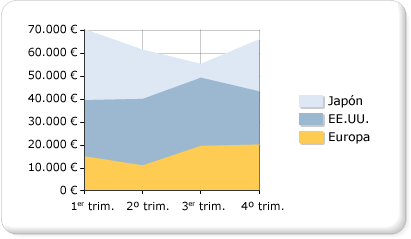

# Gráficos de áreas (Generador de informes y SSRS)
  Un gráfico de áreas muestra una serie como un conjunto de puntos conectados por una línea, con toda el área situada debajo de la línea rellenada. Para obtener más información sobre cómo agregar datos a un gráfico de áreas, vea [Gráficos &#40;Generador de informes y SSRS&#41;](../../reporting-services/report-design/charts-report-builder-and-ssrs.md).  
  
 En la ilustración siguiente se muestra un ejemplo de gráfico de áreas apiladas. Los datos se adaptan perfectamente a un gráfico de áreas apiladas porque en él se pueden mostrar los totales para todas las series y la proporción con la que cada serie contribuye al total.  
  
   
  
> [!NOTE]  
>  [!INCLUDE[ssRBRDDup](../../includes/ssrbrddup-md.md)]  
  
## Variaciones  
  
-   **Área apilada**. Gráfico de áreas donde varias series se apilan verticalmente. Si solo hay una serie en el gráfico, el gráfico de áreas apiladas se mostrará igual que un gráfico de áreas.  
  
-   **Área 100% apilada**. Gráfico de áreas donde varias series se apilan verticalmente para ajustarse a la totalidad del área del gráfico. Si solo hay una serie en el gráfico, el gráfico de áreas apiladas se mostrará igual que un gráfico de áreas.  
  
-   **Área suavizada**. Gráfico de áreas donde los puntos de datos se conectan mediante una línea suavizada en lugar de una línea normal. Use un gráfico de área suavizada en lugar de un gráfico de áreas cuando esté más interesado en mostrar tendencias que en mostrar los valores de los puntos de datos individuales.  
  
## Consideraciones sobre los datos para los gráficos de áreas  
  
-   Junto con el gráfico de líneas, el gráfico de áreas es el único tipo de gráfico que muestra datos contiguos. Por esta razón, el gráfico de áreas se usa normalmente para representar datos que tienen lugar durante un período continuado de tiempo.  
  
-   Un gráfico de áreas apiladas en porcentaje resulta de gran utilidad para mostrar datos proporcionales que tienen lugar a lo largo del tiempo.  
  
-   Si solo hay una serie, el gráfico de áreas apiladas se dibujará como un gráfico de áreas.  
  
-   En un gráfico de áreas sencillo, si los valores de varias series son similares, las áreas se pueden superponer y ocultar valores de puntos de datos importantes. Para resolver este problema, cambie el tipo de gráfico por un gráfico de áreas apiladas, que ha sido diseñado para mostrar varias series en un gráfico de áreas.  
  
-   Si el gráfico de áreas apiladas contiene intervalos, es posible que el conjunto de datos incluya valores vacíos, que se mostrarán como una sección vacía en un gráfico de áreas apiladas. Si el conjunto de datos incluye valores vacíos, es posible que le interese insertar puntos vacíos en el gráfico. Al agregar puntos vacíos, se rellenarán las áreas vacías el gráfico con un color diferente para indicar los valores NULL o valores cero. Para más información, vea [Incorporación de datos vacíos a un gráfico &#40;Generador de informes y SSRS&#41;](../../reporting-services/report-design/add-empty-points-to-a-chart-report-builder-and-ssrs.md).  
  
-   Los tipos de gráfico de área son muy similares a los gráficos de columnas y de líneas en cuanto a comportamiento. Si está realizando una comparación entre varias series, plantéese la posibilidad de usar un gráfico de columnas. Si está analizando tendencias durante un período de tiempo, considere la posibilidad de usar un gráfico de líneas.  
  
## Vea también  
 [Gráficos &#40;Generador de informes y SSRS&#41;](../../reporting-services/report-design/charts-report-builder-and-ssrs.md)   
 [Tipos de gráficos &#40;Generador de informes y SSRS&#41;](../../reporting-services/report-design/chart-types-report-builder-and-ssrs.md)   
 [Gráficos de líneas &#40;Generador de informes y SSRS&#41;](../../reporting-services/report-design/line-charts-report-builder-and-ssrs.md)   
 [Cambiar un tipo de gráfico &#40;Generador de informes y SSRS&#41;](../../reporting-services/report-design/change-a-chart-type-report-builder-and-ssrs.md)   
 [Puntos de datos vacíos y nulos en los gráficos &#40;Generador de informes y SSRS&#41;](../../reporting-services/report-design/empty-and-null-data-points-in-charts-report-builder-and-ssrs.md)  
  
  
