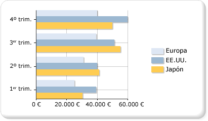

# Gráficos de barras (Generador de informes y SSRS)
  Un gráfico de barras muestra las series como conjuntos de barras horizontales. El gráfico de barras sencillo está estrechamente relacionado con el gráfico de columnas, que muestra las series como conjuntos de barras verticales, y con el gráfico de intervalos de barras, que muestra las series como conjuntos de barras horizontales con puntos iniciales y finales que varían.  
  
 El gráfico de barras es el único tipo de gráfico que muestra los datos horizontalmente. Por esta razón, se usa habitualmente para representar datos que se producen a lo largo del tiempo, con una fecha de inicio y otra de finalización. También se suele usar para mostrar información de categorías, ya que las categorías se pueden mostrar horizontalmente. Para más información sobre cómo agregar datos a un gráfico de barras, vea [Gráficos &#40;Generador de informes y SSRS&#41;](../../reporting-services/report-design/charts-report-builder-and-ssrs.md).  
  
 En la ilustración siguiente se muestra un gráfico de barras. El gráfico de barras se adapta perfectamente a estos datos porque las tres series comparten un período de tiempo común, lo que permite llevar a cabo comparaciones válidas.  
  
   
  
> [!NOTE]  
>  [!INCLUDE[ssRBRDDup](../../includes/ssrbrddup-md.md)]  
  
## Variaciones del gráfico de barras  
  
-   **Barra apilada**: gráfico de barras donde varias series se apilan verticalmente. Si solo hay una serie en el gráfico, el gráfico de barra apilada se mostrará igual que un gráfico de barras.  
  
-   **Barra 100% apilada**: gráfico de barras donde varias series se apilan verticalmente para ajustarse al 100% del área del gráfico. Si solo hay una serie en el gráfico, todas las barras se ajustarán al 100% del área del gráfico.  
  
-   **Barra 3D en clúster**: gráfico de barras que muestra series individuales en filas independientes en un gráfico 3D.  
  
-   **Cilindro 3D**: gráfico de barras 3D en el que las barras tienen forma de cilindros.  
  
## Consideraciones sobre los datos para los gráficos de barras  
  
-   Los gráficos de barras tienen los ejes invertidos. El eje de categorías es el eje vertical (o "eje Y") y el eje de valores es el eje horizontal (o "eje X"). Esto significa que en un gráfico de barras dispone de más espacio para que se muestren las etiquetas de las categorías a lo largo del eje Y como una lista que lee de arriba abajo.  
  
-   Los gráficos de barras y de columnas se usan normalmente para mostrar comparaciones entre grupos. Si en un gráfico hay más de tres series, plantéese la posibilidad de usar un gráfico de barra apilada o un gráfico de columna apilada. Si tiene varias series en el gráfico, también puede combinar gráficos de barra apilada o de columna apilada en varios en grupos.  
  
-   Un gráfico de barras muestra los valores de izquierda a derecha, lo que puede ser más intuitivo a la hora de mostrar datos relacionados con duraciones.  
  
-   Si desea agregar barras a una tabla o a una matriz del informe, considere la posibilidad de usar un medidor lineal en lugar de un gráfico de barras. El medidor lineal está diseñado para mostrar un valor en lugar de varios grupos, por lo que su uso es más flexible dentro de una lista o una región de datos de la tabla. Para obtener más información, vea [Medidores &#40;Generador de informes y SSRS&#41;](../../reporting-services/report-design/gauges-report-builder-and-ssrs.md).  
  
-   Puede agregar estilos de dibujo especiales a las barras de un gráfico de barras para aumentar su impacto visual. En los estilos de dibujo se incluyen cuñas, relieves, cilindros y degradados. Estos efectos han sido diseñados para mejorar el aspecto de los gráficos 2D. Si su gráfico es un gráfico 3D, se aplicarán los estilos de dibujo, pero el efecto puede no ser el mismo. Para más información sobre cómo agregar un estilo de dibujo a un gráfico de barras, vea [Agregar estilos con bisel, relieve y textura a un gráfico &#40;Generador de informes y SSRS&#41;](../../reporting-services/report-design/chart-effects-add-bevel-emboss-or-texture-report-builder.md).  
  
-   Los gráficos de barras apiladas colocan las series una encima de otra para crear una barra apilada. Tiene la opción de separar el gráfico de barras apiladas en varios conjuntos de pilas para cada categoría. Las series apiladas agrupadas se muestran unas junto a las otras. Puede tener cualquier número de series apiladas agrupadas en un gráfico.  
  
-   Cuando las etiquetas de los puntos de datos se muestran en un gráfico de barras, dichas etiquetas se colocan fuera de cada barra. Esto puede hacer que las etiquetas se superpongan cuando las barras ocupen todo el espacio asignado dentro del área del gráfico. Puede cambiar la posición de las etiquetas de los puntos de datos mostradas para cada barra estableciendo la propiedad **BarLabelStyle** en el panel de propiedades.  
  
-   Si hay muchos puntos de datos en el conjunto de datos en relación con el tamaño del gráfico, se reduce el tamaño de las columnas o de las barras, así como el espaciado entre ellas. Para establecer manualmente el ancho de las columnas en un gráfico, modifique su ancho, en píxeles, editando la propiedad **PointWidth** . El valor predeterminado de esta propiedad es 0,8. Al aumentar el ancho de las columnas o de las barras en un gráfico, disminuye el espacio entre columnas o barras.  
  
## Consulte también  
 [Gráficos &#40;Generador de informes y SSRS&#41;](../../reporting-services/report-design/charts-report-builder-and-ssrs.md)   
 [Tipos de gráficos &#40;Generador de informes y SSRS&#41;](../../reporting-services/report-design/chart-types-report-builder-and-ssrs.md)   
 [Puntos de datos vacíos y nulos en los gráficos &#40;Generador de informes y SSRS&#41;](../../reporting-services/report-design/empty-and-null-data-points-in-charts-report-builder-and-ssrs.md)   
 [Gráficos de columnas &#40;Generador de informes y SSRS&#41;](../../reporting-services/report-design/column-charts-report-builder-and-ssrs.md)   
 [Rangos de intervalos &#40;Generador de informes y SSRS&#41;](../../reporting-services/report-design/range-charts-report-builder-and-ssrs.md)   
 [Aplicar formato a los colores de serie de un gráfico &#40;Generador de informes y SSRS&#41;](../../reporting-services/report-design/formatting-series-colors-on-a-chart-report-builder-and-ssrs.md)   
 [Aplicar formato a las etiquetas de los ejes de un gráfico &#40;Generador de informes y SSRS&#41;](../../reporting-services/report-design/formatting-axis-labels-on-a-chart-report-builder-and-ssrs.md)   
 [Aplicar formato a la leyenda de un gráfico &#40;Generador de informes y SSRS&#41;](../../reporting-services/report-design/chart-legend-formatting-report-builder.md)   
 [Agregar estilos con bisel, relieve y textura a un gráfico &#40;Generador de informes y SSRS&#41;](../../reporting-services/report-design/chart-effects-add-bevel-emboss-or-texture-report-builder.md)   
 [Tutorial: Agregar un gráfico de barras a un informe (Generador de informes)](https://go.microsoft.com/fwlink/?LinkId=198052)   
 [Tutorial: Agregar un gráfico de barras a un informe](https://go.microsoft.com/fwlink/?LinkId=198042)  
  
  
