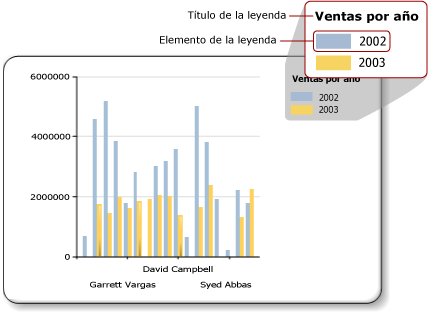

# Leyenda de gráfico: aplicar formato (Generador de informes)
  La leyenda de un gráfico contiene descripciones para cada una de las categorías de un gráfico. Una leyenda siempre contiene uno o varios elementos de leyenda, cada uno de los cuales consta de un cuadro coloreado que representa la serie y una cadena de texto que describe la serie, tal como se ve en la ilustración siguiente.  
  
   
  
 Cada elemento de leyenda está conectado a una serie individual en el gráfico, salvo los gráficos de formas, en que la leyenda está conectada a puntos de datos individuales. El gráfico agrega automáticamente elementos a la leyenda basándose en las series generadas a partir de los datos.  
  
 Puede aplicar formato a una leyenda mediante el cuadro de diálogo **Propiedades de la leyenda** o con el panel de propiedades. Haga clic con el botón derecho en la leyenda y haga clic en **Propiedades de la leyenda** para cambiar los valores para el texto, el color de fondo, los bordes y los efectos 3D de la leyenda. Para cambiar los valores para el título de la leyenda, selecciónela, haga clic con el botón derecho en el título de la leyenda y haga clic en **Propiedades del título de la leyenda**.  
  
 No puede agregar imágenes, columnas adicionales ni otros elementos suplementarios a la leyenda.  
  
> [!NOTE]  
>  [!INCLUDE[ssRBRDDup](../../includes/ssrbrddup-md.md)]  
  
## Ordenar los elementos de leyenda en la leyenda  
 Las series se ordenan en la leyenda según el orden en que las procesa el motor de procesamiento de [!INCLUDE[ssRSnoversion](../../includes/ssrsnoversion-md.md)] . Puede cambiar el orden haciendo lo propio con los campos en la zona de colocación de campos de datos. Si está usando agrupaciones de series, los datos de las series no se conocen hasta su procesamiento, por lo que no hay ninguna manera volver a ordenar estos elementos. Los cambios se pueden ver en la vista previa. Para obtener más información sobre las agrupaciones de series, vea [Gráficos &#40;Generador de informes y SSRS&#41;](../../reporting-services/report-design/charts-report-builder-and-ssrs.md).  
  
 Puede ocultar cualquier serie para que no se muestre en la leyenda. Si está usando agrupaciones de series, se ocultarán todas las series relacionadas con el campo de datos. Para obtener más información, vea [Ocultar elementos de leyenda en el gráfico &#40;Generador de informes y SSRS&#41;](../../reporting-services/report-design/chart-legend-hide-items-report-builder.md).  
  
## Cambiar el texto o el color de un elemento de leyenda en la leyenda  
 Cuando se coloca un campo en la zona de colocación de campos de datos de un gráfico, automáticamente se genera un elemento de leyenda que contiene el nombre de este campo. De forma predeterminada, el texto de cada elemento de leyenda se toma del nombre del campo de datos. Cada elemento de leyenda se conecta a una serie individual del gráfico, a excepción de los gráficos de formas, donde la leyenda se conecta a puntos de datos individuales en lugar de a series individuales. Cuando se define un grupo de categorías en un gráfico de formas, el texto de cada elemento de leyenda procede de la representación de cadena del grupo de categorías. En los gráficos circulares, de anillos y de embudo, puede especificar texto de etiqueta personalizado para mostrar información distinta de la etiqueta de grupo de categorías relacionada con cada punto de datos individual de la leyenda. Para ello, seleccione la leyenda y especifique el texto de leyenda en el cuadro de diálogo **Propiedades de la serie** o la propiedad **LegendText** en el panel de propiedades. Para obtener más información, vea [Cambiar el texto de un elemento de leyenda &#40;Generador de informes y SSRS&#41;](../../reporting-services/report-design/chart-legend-change-item-text-report-builder.md).  
  
 También puede especificar palabras clave específicas del gráfico, con distinción de mayúsculas y minúsculas, para los atributos a los que se hace referencia más habitualmente en la propiedad **LegendText** o en el cuadro de diálogo **Propiedades de la serie** . El control de gráfico reemplaza estas palabras clave por su representación de datos en tiempo de ejecución. Este enfoque resulta útil en los gráficos de formas porque le permite mostrar información relacionada con puntos de datos específicos. Para más información, vea [Aplicar formato a los puntos de datos de un gráfico &#40;Generador de informes y SSRS&#41;](../../reporting-services/report-design/formatting-data-points-on-a-chart-report-builder-and-ssrs.md).  
  
 El cuadro coloreado que se muestra para cada elemento de leyenda se hereda del color de relleno de su serie correspondiente. Si desea cambiar el color mostrado en un elemento de leyenda, tendrá que cambiar el color de la serie correspondiente. Para obtener más información, vea [Aplicar formato a los colores de serie de un gráfico &#40;Generador de informes y SSRS&#41;](../../reporting-services/report-design/formatting-series-colors-on-a-chart-report-builder-and-ssrs.md).  
  
## Quitar elementos de leyenda adicionales de la leyenda  
 La leyenda siempre está conectada a una serie. Si un elemento de leyenda aparece en la leyenda, pero la serie correspondiente no se muestra en el gráfico, lo más probable es que la serie no contenga ningún valor. Debe quitar esta serie para quitar el elemento de leyenda de la leyenda. Para quitar una serie de un gráfico, puede hacer clic con el botón secundario en la serie especificada y seleccionar la opción Eliminar serie.  
  
## Cambiar de posición la leyenda  
 El área de gráfico es el área rectangular que abarca las etiquetas del eje y el área de trazado. Si la leyenda se encuentra fuera del área de gráfico, puede arrastrarla hacia una de doce posiciones disponibles. De manera predeterminada, la leyenda se muestra fuera del área de gráfico. También puede establecer la posición en el cuadro de diálogo **Propiedades de la leyenda** .  
  
 No puede arrastrar la leyenda dentro o fuera del área del gráfico. Si quiere colocar la leyenda dentro del área del gráfico, en el cuadro de diálogo **Propiedades de la leyenda** , en **Acoplamiento**, seleccione **Predeterminado** en la lista desplegable y borre la opción **Mostrar leyenda fuera del área de gráfico** . Si coloca la leyenda dentro del área de gráfico, puede maximizar el espacio dedicado a los puntos de datos en el gráfico. Sin embargo, dependiendo del conjunto de datos, esto puede hacer que la leyenda se superponga a algunos puntos de datos en el área de gráfico, con lo que será más difícil leer el gráfico.  
  
## Mostrar horizontalmente los elementos de leyenda  
 De forma predeterminada, la leyenda tiene el formato de una lista con una o varias filas, cada una de las cuales contiene un elemento de leyenda. El área de la leyenda se expande para que quepan los elementos de leyenda. Si la leyenda no se puede expandir, se muestran puntos suspensivos (...). Dependiendo del estilo de leyenda especificado, la leyenda se puede expandir vertical u horizontalmente. Puede cambiar el estilo de diseño en el cuadro de diálogo **Propiedades de la leyenda** o cambiar el espacio asignado para que se muestren todos los elementos de leyenda.  
  
 Para mostrar la leyenda horizontalmente, acople la leyenda a la parte superior o inferior del gráfico. Esto hace que la leyenda se expanda horizontalmente. También puede establecer la propiedad Layout en **Fila** o en **Tabla ancha**. Establezca la propiedad MaxAutoSize en el panel de propiedades para controlar el espacio vertical asignado a la leyenda cuando se acopla en la parte superior o inferior del área de gráfico.  
  
## Dar formato al texto de la leyenda  
 Puede cambiar la fuente, el tamaño, el estilo y el color del texto de la leyenda en la página **Fuente** del cuadro de diálogo **Propiedades de la leyenda** .  
  
 De forma predeterminada, el texto de la leyenda no se optimiza para que quepa en el área de la leyenda. Para hacer que el texto de la leyenda se ajuste automáticamente al espacio asignado, establezca la propiedad AutoFitTextDisabled en **False** y establezca un tamaño de fuente mínimo para la propiedad MinFontSize de modo que la fuente sea lo más pequeña posible, pero que sea presentable y permita la optimización de la leyenda.  
  
## Consulte también  
 [Cuadro de diálogo de Propiedades de la leyenda, General &#40;Generador de informes y SSRS&#41;](https://msdn.microsoft.com/library/db718f8f-f185-422f-871c-96f0749e5893)   
 [Cambiar el texto de un elemento de leyenda &#40;Generador de informes y SSRS&#41;](../../reporting-services/report-design/chart-legend-change-item-text-report-builder.md)   
 [Aplicar formato a un gráfico &#40;Generador de informes y SSRS&#41;](../../reporting-services/report-design/formatting-a-chart-report-builder-and-ssrs.md)   
 [Aplicar formato a los colores de serie de un gráfico &#40;Generador de informes y SSRS&#41;](../../reporting-services/report-design/formatting-series-colors-on-a-chart-report-builder-and-ssrs.md)   
 [Gráficos &#40;Generador de informes y SSRS&#41;](../../reporting-services/report-design/charts-report-builder-and-ssrs.md)   
 [Ocultar elementos de leyenda en el gráfico &#40;Generador de informes y SSRS&#41;](../../reporting-services/report-design/chart-legend-hide-items-report-builder.md)   
 [Definir los colores de un gráfico mediante una paleta &#40;Generador de informes y SSRS&#41;](../../reporting-services/report-design/define-colors-on-a-chart-using-a-palette-report-builder-and-ssrs.md)  
  
  
