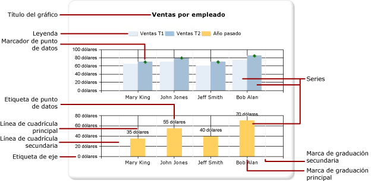
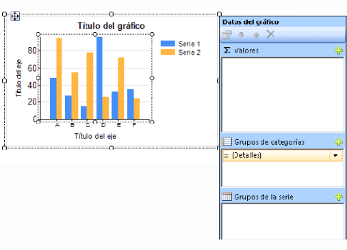
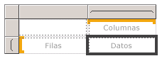
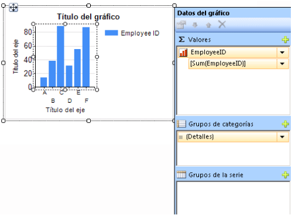

# Gráficos (Generador de informes y SSRS)
Lea sobre el uso de las regiones de datos de gráfico para ayudar a los lectores de los informes paginados de [!INCLUDE[ssRSnoversion_md](../../includes/ssrsnoversion-md.md)] a comprender grandes volúmenes de datos agregados de un vistazo.  

Cuanto más tiempo se dedique a preparar y entender cuidadosamente los datos antes de crear un gráfico, más fácil será diseñar gráficos de forma rápida y eficaz. Para elegir el gráfico que se va a usar, vea [Tipos de gráficos](../../reporting-services/report-design/chart-types-report-builder-and-ssrs.md). Para empezar a experimentar con gráficos de forma inmediata, vea los tutoriales sobre gráficos de barras, columnas, minigráficos y circulares en [Tutoriales del generador de informes](../../reporting-services/report-builder-tutorials.md).  
  
 En la ilustración siguiente se muestran muchos de los distintos elementos que se usan en un gráfico.  
  
   
  
 Puede publicar gráficos con independencia de un informe como *elementos de informe*. Para más información, vea [Elementos de informe](../../reporting-services/report-design/report-parts-report-builder-and-ssrs.md).
  
 
##   Diseñar un gráfico  
 Después de agregar una región de datos de gráfico a la superficie de diseño, puede arrastrar los campos de conjunto de datos de informe para los datos numéricos y no numéricos hasta el panel de Datos del gráfico en el gráfico. Al hacer clic en el gráfico en la superficie de diseño, aparece el panel Datos del gráfico, con tres áreas: Grupos de categorías, Grupos de series y Valores. Si el informe tiene un conjunto de datos compartido o incrustado, los campos del conjunto de datos aparecen en el panel Datos de informe. Arrastre los campos del conjunto de datos al área apropiada del panel Datos del gráfico. De forma predeterminada, cuando se agrega un campo a una de las áreas del gráfico, [!INCLUDE[ssRSnoversion](../../includes/ssrsnoversion-md.md)] calcula un agregado para dicho campo. También puede usar agrupaciones de series para generar series dinámicamente. Un gráfico se [organiza como una matriz](#SimilarMatrix).  
  
   
  
> [!NOTE]  
>  Los datos del gráfico en tiempo de diseño son diferentes de los datos del gráfico cuando se procesa el informe. No son los datos reales. Se trata de datos generados que se han agregado para que pueda diseñar el gráfico y se haga una idea del aspecto que tendrá.  
  
##   En qué se parece un gráfico a una matriz  
 Una forma de analizar el trabajo de los gráficos es compararlos con las matrices.  
  
   
  
 Conceptualmente, su organización es idéntica:  
  
-   El grupo Columnas de la matriz es como el área Grupos de categorías del gráfico.  
  
-   El grupo Filas de la matriz es como el área Grupos de series del gráfico.  
  
-   El área Datos de la matriz es como el área Valores del gráfico.  
  
 
##   Agregar datos al gráfico  
 Imagine que tiene un informe que muestra ventas por nombre. A continuación, coloca el campo Full Name en el área Grupos de categorías y el campo Sales en el área Valores.  
  
 Al agregar el campo Sales al área Valores, el texto del campo de datos aparece en la leyenda y los datos de este campo numérico se agregarán en un valor. De forma predeterminada, el valor se agrega mediante la función integrada Sum. El panel Datos del gráfico contendrá una expresión simple para el campo. En nuestro ejemplo, aparecerá `[Sum(Sales)]` para la expresión de campo `=Sum(Fields!Sales.Value)`. Si no se especifica ningún grupo, el gráfico únicamente mostrará un punto de datos. Para mostrar varios puntos de datos, debe agrupar los datos agregando un campo de agrupación. Al agregar el campo Name al área Grupos de categorías, se agrega automáticamente al gráfico un campo de agrupación con el mismo nombre que el campo. Cuando se agregan los campos que definen los valores a lo largo de los ejes X e Y, el gráfico tiene suficiente información para trazar correctamente los datos.  
  
   
  
 Cuando el área Grupos de series se deja vacía, el número de series se fija en tiempo de diseño. En este ejemplo, Sales es la única serie que aparece en el gráfico.  
  
 
##   Grupos de categorías y de series en un gráfico  
 Un gráfico admite grupos de categorías y de series anidados. Los gráficos no muestran datos detallados. Agregue grupos a un gráfico arrastrando campos de conjunto de datos hasta las zonas de colocación de categorías y de series para un gráfico seleccionado.  
  
 Los gráficos de formas, como los gráficos circulares, admiten grupos de categorías y grupos de categorías anidados. Otros gráficos, como los de barras, admiten grupos de categorías y grupos de series. Puede anidar grupos, pero debe asegurarse de que los números de categorías o de series no ocultan la presentación de información en el gráfico.  
  
### Agregar agrupaciones de series a un gráfico  
 Si agrega un campo al área Grupos de series, el número de series dependerá de los datos que contiene dicho campo. En el ejemplo anterior, imagine que agrega un campo Year al área Grupos de series. El número de valores del campo Year determinará cuántas series aparecerán en el gráfico. Si el campo Year contiene los años 2004, 2005 y 2006, el gráfico mostrará tres series para cada campo del área Valores.  
  
##   Consideraciones de los conjuntos de datos antes de crear el gráfico  
 Los gráficos proporcionan una vista resumida de los datos. Sin embargo, con conjuntos de datos grandes, la información de los gráficos puede quedar oculta o ilegible. Puntos de datos ausentes o nulos, tipos de datos inadecuados para el tipo de gráfico y aplicaciones avanzadas como combinar gráficos con tablas pueden afectar a la legibilidad de los gráficos. Antes de diseñar un gráfico, debería preparar y entender cuidadosamente los datos para que el diseño se realice rápida y eficazmente.  
  
 En un informe puede incluir tantos gráficos como desee. Un gráfico, como cualquier otra región de datos como una matriz o una tabla, está enlazado a un único conjunto de datos. Si desea mostrar varios conjuntos de datos en el mismo gráfico, puede crear un conjunto de datos adicional que use una instrucción JOIN o UNION en la consulta SQL antes de agregar datos al gráfico. Para obtener más información sobre la instrucción UNION y JOIN, vea los Libros en pantalla u otra referencia de SQL.  
  
 Considere la posibilidad de agregar los datos previamente en la consulta del conjunto de datos si no necesita datos detallados o estos no resultarán útiles. Para mostrar cada punto de datos con más claridad, reduzca el número de categorías del conjunto de datos. Puede filtrar el conjunto de datos o agregar una condición a la consulta que reduzca el número de filas devueltas. 
  
##   Prácticas recomendadas para mostrar datos en un gráfico  
 Los gráficos son más efectivos cuando el número de elementos mostrados presenta una imagen clara de la información subyacente. Algunos gráficos, como los gráficos de dispersión, mejoran cuando contienen numerosos puntos de datos, mientras que otros, como los gráficos circulares, son más efectivos con menos puntos de datos. Elija cuidadosamente un tipo de gráfico basándose en los valores del conjunto de datos y en cómo desea mostrar esta información. Para más información, vea [Tipos de gráficos &#40;Generador de informes y SSRS&#41;](../../reporting-services/report-design/chart-types-report-builder-and-ssrs.md).  
  
 Existen varias formas de consolidar los datos en un gráfico:  
  
-   Al utilizar un gráfico circular, reúna los sectores pequeños en un sector denominado "Otros". Esto reducirá el número de sectores del gráfico circular. Para más información, vea [Recopilar segmentos pequeños en un gráfico circular &#40;Generador de informes y SSRS&#41;](../../reporting-services/report-design/collect-small-slices-on-a-pie-chart-report-builder-and-ssrs.md).  
  
-   Evite usar etiquetas de puntos de datos cuando haya numerosos puntos de datos. Las etiquetas de puntos de datos son más eficaces cuando solo hay unos cuantos puntos en el gráfico.  
  
-   Filtre los datos no deseados o irrelevantes. Esto le ayudará a resaltar los datos clave que está intentando mostrar en el gráfico. Para filtrar los puntos de datos de un gráfico, establezca un filtro en un grupo de categorías o en un grupo de series. De manera predeterminada, el gráfico usa la función integrada SUM para agregar valores que pertenecen al mismo grupo en un punto de datos individual de la serie. Si cambia la función de agregado de una serie, deberá cambiar también la función de agregado en la expresión de filtro. Para obtener más información, vea [Filtrar, agrupar y ordenar datos &#40;Generador de informes y SSRS&#41;](../../reporting-services/report-design/filter-group-and-sort-data-report-builder-and-ssrs.md).  
  
-   Para mostrar datos de proporción en una plantilla de tabla o de matriz, considere la posibilidad de usar un medidor lineal en lugar de un gráfico de barras. Los medidores son más adecuados para mostrar un solo valor dentro de una celda. Para más información, vea [Anidar regiones de datos &#40;Generador de informes y SSRS&#41;](../../reporting-services/report-design/nested-data-regions-report-builder-and-ssrs.md).  
   
##   Agregar valores de un campo de datos en el gráfico  
 De forma predeterminada, cuando se agrega un campo al área Valores del gráfico, [!INCLUDE[ssRSnoversion](../../includes/ssrsnoversion-md.md)] calcula un agregado para dicho campo. Si se arrastra un campo hasta el gráfico sin colocarlo en un área concreta, el gráfico determinará si este campo pertenece al eje de categorías (X) o al eje de valores (Y) en función del tipo de datos del campo. Los campos numéricos que se colocan en el área Valores se agregan mediante la función SUM. Si el tipo de datos del campo de valor es String en el área Valores, el gráfico no puede mostrar valores numéricos, incluso si los campos incluyen números, de modo que el gráfico usa la función COUNT. Para evitar este comportamiento, asegúrese de que los campos que usa tienen tipos de datos numéricos, en lugar de cadenas que contienen números con formato. Puede usar una expresión de Visual Basic para convertir los valores de cadena en un tipo de datos numérico usando la constante **CDbl** o **CInt** . Por ejemplo, la expresión compleja siguiente convierte un campo denominado `MyField` que contiene valores numéricos a los que se ha dado formato de cadena.  
  
 `=Sum(CDbl(Fields!MyField.Value))`  
  
 Para más información sobre las expresiones de agregado, vea [Referencia a las funciones de agregado &#40;Generador de informes y SSRS&#41;](../../reporting-services/report-design/report-builder-functions-aggregate-functions-reference.md).  
   
##   En esta sección  
 [Agregar un gráfico a un informe &#40;Generador de informes y SSRS&#41;](../../reporting-services/report-design/add-a-chart-to-a-report-report-builder-and-ssrs.md)  
 Describe los primeros pasos para agregar un gráfico a su informe.  
  
 [Tipos de gráficos &#40;Generador de informes y SSRS&#41;](../../reporting-services/report-design/chart-types-report-builder-and-ssrs.md)  
 Describe todos los tipos y subtipos de gráficos disponibles en [!INCLUDE[ssRSnoversion](../../includes/ssrsnoversion-md.md)]e incluye consideraciones y procedimientos recomendados para el uso de varios tipos de gráficos.  
  
 [Aplicar formato a un gráfico &#40;Generador de informes y SSRS&#41;](../../reporting-services/report-design/formatting-a-chart-report-builder-and-ssrs.md)  
 Use formato para mejorar el aspecto general y resaltar los puntos de datos clave en el gráfico.  
  
 [Puntos de datos vacíos y nulos en los gráficos &#40;Generador de informes y SSRS&#41;](../../reporting-services/report-design/empty-and-null-data-points-in-charts-report-builder-and-ssrs.md)  
 Describe las consideraciones que se deben tener en cuenta al trabajar con gráficos basados en campos vacíos o con valores nulos.  
  
 [Mostrar una serie con varios rangos de datos en un gráfico &#40;Generador de informes y SSRS&#41;](../../reporting-services/report-design/displaying-a-series-with-multiple-data-ranges-on-a-chart.md)  
 Describe cómo agregar quiebres de escala a una serie que contiene más de un intervalo de datos.  
  
 [Mostrar varias series en un gráfico &#40;Generador de informes y SSRS&#41;](../../reporting-services/report-design/multiple-series-on-a-chart-report-builder-and-ssrs.md)  
 Describe diversos métodos para mostrar varias series en el mismo gráfico, incluidos la combinación de tipos de gráfico, el uso del eje secundario, la especificación de tipos de gráficos diferentes y el uso de varias áreas de gráfico.  
  
 [Vincular varias regiones de datos al mismo conjunto de datos &#40;Generador de informes y SSRS&#41;](../../reporting-services/report-design/linking-multiple-data-regions-to-the-same-dataset-report-builder-and-ssrs.md)  
 Proporcione distintas vistas de los datos del mismo conjunto de datos de informe.  
  
 [Agregar o eliminar un grupo en un gráfico &#40;Generador de informes y SSRS&#41;](../../reporting-services/report-design/add-or-delete-a-group-in-a-chart-report-builder-and-ssrs.md)  
 Describe la adición de grupos y de grupos anidados a un gráfico.  
  
 [Agregar una media móvil a un gráfico &#40;Generador de informes y SSRS&#41;](../../reporting-services/report-design/add-a-moving-average-to-a-chart-report-builder-and-ssrs.md)  
 Describe el uso de la fórmula de promedio móvil para calcular el promedio de los datos de la serie.  
  
 [Solucionar problemas de gráficos &#40;Generador de informes y SSRS&#41;](../../reporting-services/report-design/troubleshoot-charts-report-builder-and-ssrs.md)  
 Ofrece sugerencias para trabajar con gráficos.  
  
## Vea también  
 [Imágenes, cuadros de texto, rectángulos y líneas &#40;Generador de informes y SSRS&#41;](../../reporting-services/report-design/images-text-boxes-rectangles-and-lines-report-builder-and-ssrs.md)   
 [Ordenación interactiva, mapas de documento y vínculos &#40;Generador de informes y SSRS&#41;](../../reporting-services/report-design/interactive-sort-document-maps-and-links-report-builder-and-ssrs.md)   
 [Anidar regiones de datos &#40;Generador de informes y SSRS&#41;](../../reporting-services/report-design/nested-data-regions-report-builder-and-ssrs.md)   
 [Tutorial: Agregar un gráfico de columnas a un informe &#40;Generador de informes&#41;](../../reporting-services/tutorial-add-a-column-chart-to-your-report-report-builder.md)   
 [Tutorial: Agregar un gráfico circular a un informe &#40;Generador de informes&#41;](../../reporting-services/tutorial-add-a-pie-chart-to-your-report-report-builder.md)   
 [Tutorial: Agregar un gráfico de barras a un informe &#40;Generador de informes&#41;](../../reporting-services/tutorial-add-a-bar-chart-to-your-report-report-builder.md)  
  
  
