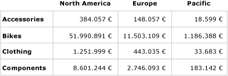
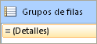
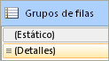
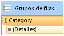
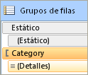
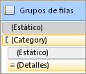

# Controlar los encabezados de fila y de columna (Generador de informes y SSRS)
  Una región de datos de tabla, de matriz o de lista puede abarcar varias páginas en horizontal o vertical. Puede especificar si los encabezados de fila o de columna se repiten en cada página. En un representador interactivo como el Administrador de informes o la vista previa del informe también puede especificar si inmovilizar o no los encabezados de filas o de columnas para mantenerlos a la vista al desplazarse por un informe. En una tabla o matriz, la primera fila suele contener los encabezados de columna que etiquetan los datos de cada columna; la primera columna suele contener los encabezados de fila que etiquetan los datos de cada fila. En los grupos anidados, es posible que desee repetir el conjunto inicial de encabezados de fila y columna que contienen etiquetas de grupo. De forma predeterminada, una región de datos de lista no incluye encabezados.  
  
 El modo de controlar si los encabezados se repiten o se inmovilizan depende de:  
  
-   Para los encabezados de columna que se repiten al principio de cada página:  
  
    -   Si la tabla o matriz tiene un área de un grupo de columnas que se expande en horizontal.  
  
    -   Si se desea controlar todas las filas asociadas a los grupos de columnas como una unidad.  
  
-   Para los encabezados de fila que se repiten en el lateral de cada página:  
  
    -   Si la tabla o matriz tiene un área de un grupo de filas que se expande en vertical. Los encabezados de fila solo se pueden usar en grupos de filas con un encabezado de grupo de filas.  
  
> [!NOTE]  
>  [!INCLUDE[ssRBRDDup](../../includes/ssrbrddup-md.md)]  
  
## Descripción de las filas y columnas de una región de datos Tablix  
 Una tabla o matriz es una plantilla para la región de datos Tablix subyacente. Una región de datos Tablix tiene cuatro áreas posibles: el área de grupo de filas que controla las filas que se expanden un informe, el área de grupo de columnas que controla las columnas que se expanden a través de un informe, el cuerpo que muestra los datos y la esquina. Para entender dónde establecer las propiedades que permiten controlar si los encabezados se repiten o se inmovilizan, es útil saber que hay dos representaciones posibles para una región de datos Tablix:  
  
-   **En la definición de informe** : cada fila o columna de la definición de una región de datos Tablix es un miembro Tablix de un grupo de filas o columnas específico. Un miembro Tablix es estático o dinámico. Si es estático, contiene etiquetas o subtotales y se repite una vez en cada grupo. Si es dinámico, contiene valores de grupo y se repite una vez por cada valor único de un grupo, que también se conoce como instancia de grupo.  
  
-   **En la superficie de diseño** : las líneas de puntos dividen una región de datos Tablix en cuatro áreas. Cada celda de un área de una región de datos Tablix se organiza en filas y columnas. Las filas y columnas se asocian a los grupos, incluidos los grupos de detalles. En una región de datos Tablix seleccionada, los identificadores de columna y de fila, y las barras resaltadas indican la pertenencia a grupos. Las celdas del área del grupo de filas o del grupo de columnas representan los encabezados de grupo de los miembros Tablix. Una sola fila o columna se puede asociar a varios grupos.  
  
     Para obtener más información, vea [Región de datos Tablix &#40;Generador de informes y SSRS&#41;](../../reporting-services/report-design/tablix-data-region-report-builder-and-ssrs.md) y [Celdas, filas y columnas de la región de datos Tablix &#40;Generador de informes y SSRS&#41;](../../reporting-services/report-design/tablix-data-region-cells-rows-and-columns-report-builder-and-ssrs.md).  
  
 En las regiones de datos Tablix con áreas de grupos de filas o columnas, para controlar cómo se asocian las filas y las columnas es necesario establecer propiedades en dichas regiones. En todos los demás casos, para controlar las filas y columnas se establecen las propiedades en el panel Propiedades correspondiente al miembro Tablix seleccionado. Para obtener instrucciones paso a paso, vea [Mostrar encabezados de fila y de columna en varias páginas &#40;Generador de informes y SSRS&#41;](../../reporting-services/report-design/display-row-and-column-headers-on-multiple-pages-report-builder-and-ssrs.md) y [Mantener visibles los encabezados al desplazarse a través de un informe &#40;Generador de informes y SSRS&#41;](../../reporting-services/report-design/keep-headers-visible-when-scrolling-through-a-report-report-builder-and-ssrs.md).  
  
##   Ejemplos  
 Los ejemplos más comunes de regiones de datos Tablix son una matriz, una tabla sin grupos y una tabla con un grupo de filas y un encabezado de grupo de filas, y una tabla con un grupo de filas pero que carece de encabezado de grupo de filas. Para controlar cómo repetir o inmovilizar los encabezados, debe determinar si las filas o columnas que desea controlar están asociadas a un encabezado de grupo en el área de los grupos de filas o de los grupos de columnas.  
  
 En las secciones siguientes se proporcionan ejemplos de diseños comunes para una región de datos Tablix:  
  
-   [Matriz](#Matrix)  
  
-   [Tabla sin grupos](#TableNoGroups)  
  
-   [Tabla con grupos de filas y área de grupos de filas](#TableRowGroupsGroupHeader)  
  
-   [Tabla con grupos de filas, pero sin área de grupos de filas](#TableRowGroupsNoGroupHeader)  
  
###   Matriz  
 De forma predeterminada, una matriz simple tiene un grupo de filas y un grupo de columnas. En la ilustración siguiente se muestra una matriz con un grupo de filas que se basa en la categoría y un grupo de columnas que se basa en la geografía:  
  
   
  
 Las líneas de puntos muestran las cuatro áreas Tablix. El área de un grupo de filas tiene un encabezado de grupo de filas que controla las etiquetas Categoría de la primera columna. De igual modo, el área de un grupo de columnas tiene un encabezado de grupo de columnas que controla las etiquetas Geografía de la primera fila. En la vista previa, a medida que la matriz se expande a través de la página, la primera fila muestra los encabezados de columna, según se ve en la ilustración siguiente:  
  
   
  
 Si desea repetir o inmovilizar los encabezados de columna de la primera fila, puede establecer propiedades para los encabezados de columna de la región de datos Tablix. Los encabezados de columna de los grupos de columnas anidados se incluyen automáticamente.  
  
 Si desea repetir o inmovilizar los encabezados de fila de la primera columna, puede establecer propiedades para los encabezados de fila de la región de datos Tablix. Los encabezados de fila de los grupos de filas anidados se incluyen automáticamente.  
  
 [Volver al principio](#Top)  
  
###   Tabla sin grupos de filas  
 De forma predeterminada, una tabla simple sin grupos incluye el grupo de detalles. En la ilustración siguiente se muestra una tabla que presenta los datos de la categoría, número de pedido y ventas:  
  
   
  
 No hay líneas de puntos porque la tabla únicamente consta del área del cuerpo de Tablix. La primera fila muestra los encabezados de columna y representa un miembro Tablix estático que no está asociado a un grupo. La segunda fila muestra los datos de detalle y representa un miembro Tablix dinámico que está asociado al grupo de detalles. En la ilustración siguiente se muestra la tabla en la vista previa:  
  
   
  
 Si desea repetir o inmovilizar los encabezados de columna, puede establecer propiedades en el miembro Tablix para la fila estática que forma parte de la definición de la región de datos Tablix. Para seleccionar la fila estática, debe usar el modo avanzado del panel Agrupar. La ilustración siguiente muestra el panel Grupos de filas:  
  
   
  
 En el modo avanzado, la ilustración siguiente muestra los miembros Tablix dinámicos y estáticos para los grupos de filas de la tabla:  
  
   
  
 Si quiere repetir o inmovilizar los encabezados de columna para el miembro Tablix, seleccione la fila estática que tenga la etiqueta (**Estático**). En el panel de propiedades se muestran las propiedades del miembro Tablix seleccionado. Al establecer las propiedades de este miembro Tablix, puede controlar cómo se repite o permanece a la vista la primera fila.  
  
 [Volver al principio](#Top)  
  
###   Tabla con grupos de filas y un área de grupos de filas  
 Si agrega un grupo de filas a una tabla sencilla, se agrega un área de grupo de filas a la tabla en el área de diseño. En la ilustración siguiente se muestra una tabla con un grupo de filas que se basa en la categoría.  
  
   
  
 Las líneas de puntos muestran las áreas de grupos de filas y cuerpo de Tablix. El área del grupo de filas tiene un encabezado de grupo de filas, pero carece de encabezado de grupo de columnas. En la ilustración siguiente se muestra esta tabla en la vista previa:  
  
   
  
 Para repetir o inmovilizar los encabezados de columnas, use el mismo enfoque en el ejemplo anterior. La ilustración siguiente muestra la vista predeterminada del panel Grupos de filas:  
  
   
  
 Use el modo **avanzado** del panel Grupos de filas para mostrar los miembros Tablix, según se ve en la ilustración siguiente:  
  
   
  
 Se muestran cuatro miembros Tablix: **Estático**, (**Estático**), Categoría y (**Detalles**). Un miembro Tablix que incluya paréntesis () indica que no hay un encabezado de grupo correspondiente. Si desea repetir o inmovilizar los encabezados de columna, seleccione el miembro Tablix Estático y establezca propiedades en el panel de propiedades.  
  
 [Volver al principio](#Top)  
  
###   Tabla con grupos de filas y sin área de grupos de filas  
 Una tabla puede tener grupos de filas pero carecer de área de grupos de filas de varias formas. Por ejemplo, dos formas de que ocurra esto serían:  
  
-   Comenzar con una tabla con grupos de filas y un área de grupo de filas, y eliminar las columnas del área de grupo de filas. Elimine las columnas únicamente y no los grupos. Por ejemplo, puede que desee controlar el formato de tabla para que sea una cuadrícula simple.  
  
-   Actualizar un informe que se creó para una versión de RDL anterior, antes de que se introdujeran regiones de datos Tablix.  
  
 En la ilustración siguiente se muestra una tabla con un grupo de filas pero que carece de área de grupo de filas en el área de diseño:  
  
   
  
 La tabla tiene tres filas. La primera contiene encabezados de columna. La segunda fila contiene el valor del grupo y los subtotales. La tercera fila contiene datos de detalle. No hay líneas de puntos porque solo hay un área del cuerpo de Tablix. En la ilustración siguiente se muestra esta tabla en la vista previa:  
  
   
  
 Para controlar el modo en que las filas se repiten o permanecen a la vista, debe establecer las propiedades de este miembro Tablix para cada fila. En el modo predeterminado, no hay diferencia entre este ejemplo y el anterior en el caso de una tabla con un grupo de filas y un encabezado de grupo. En la ilustración siguiente se muestra el panel Agrupar en el modo predeterminado para esta tabla:  
  
   
  
 Sin embargo, en el modo avanzado, esta estructura de diseño muestra un conjunto diferente de miembros Tablix. En la ilustración siguiente se muestra el panel Agrupar en el modo avanzado para esta tabla:  
  
   
  
 En el panel Grupos de filas, se enumeran los siguientes miembros Tablix: (**Estático**), (Categoría), (**Estático**) y (**Detalles**). Si quiere repetir o inmovilizar los encabezados de columna, seleccione el miembro Tablix (**Estático**) superior y establezca propiedades en el panel de propiedades.  
  
 [Volver al principio](#Top)  
  
## Compatibilidad de los representadores para repetir o inmovilizar los encabezados  
 La compatibilidad de los representadores para repetir o inmovilizar los encabezados es variada.  
  
 Los que usan páginas físicas (PDF, Image, Print) admiten las características siguientes:  
  
-   Repetir los encabezados de fila cuando una región de datos Tablix se expande en horizontal a través de varias páginas.  
  
-   Repetir los encabezados de columna cuando una región de datos Tablix se expande en vertical hacia abajo en varias páginas.  
  
 Además, los representadores que usan saltos de página no forzados (Administrador de informes, vista previa de informe o el control del visor de informes) admiten las características siguientes:  
  
-   Mantener los encabezados de fila a la vista al desplazarse horizontalmente a través de un informe.  
  
-   Mantener los encabezados de columna a la vista al desplazarse verticalmente hacia abajo en un informe.  
  
 Para más información, vea [Comportamientos de la representación &#40;Generador de informes y SSRS&#41;](../../reporting-services/report-design/rendering-behaviors-report-builder-and-ssrs.md).  
  
## Ver también  
 [Filtrar, agrupar y ordenar datos &#40;Generador de informes y SSRS&#41;](../../reporting-services/report-design/filter-group-and-sort-data-report-builder-and-ssrs.md)   
 [Tablas, matrices y listas &#40;Generador de informes y SSRS&#41;](../../reporting-services/report-design/tables-matrices-and-lists-report-builder-and-ssrs.md)   
 [Paginación en Reporting Services &#40;Generador de informes y SSRS&#41;](../../reporting-services/report-design/pagination-in-reporting-services-report-builder-and-ssrs.md)   
 [Exportación de informes &#40;Generador de informes y SSRS&#41;](../../reporting-services/report-builder/export-reports-report-builder-and-ssrs.md)  
  
  
