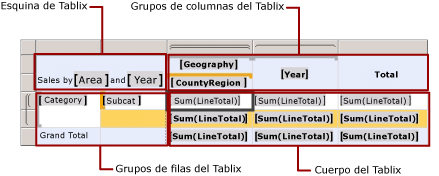

# Controlar la presentación de la región de datos Tablix en una página de informe
Obtenga información sobre las propiedades que puede establecer en un informe paginado de [!INCLUDE[ssRSnoversion_md](../../includes/ssrsnoversion-md.md)] para una región de datos de tabla, matriz o lista, a fin de cambiar su aspecto cuando se visualiza el informe.  
   
## Controlar el aspecto de los datos  
Las regiones de datos de tabla, matriz y lista son ejemplos de regiones de datos *Tablix* . Las características siguientes ayudan a controlar el aspecto de una región de datos Tablix:  
  
-   **Aplicar formato a los datos.** Para dar formato a datos en una tabla, matriz o lista, establezca las propiedades de formato del cuadro de texto en la celda. Puede establecer propiedades para varias celdas al mismo tiempo. Para dar formato a los datos de un gráfico, establezca las propiedades de formato en la serie. Para más información, vea [Aplicar formato a los elementos de informe &#40;Generador de informes y SSRS&#41;](../../reporting-services/report-design/formatting-report-items-report-builder-and-ssrs.md) y [Aplicar formato a un gráfico &#40;Generador de informes y SSRS&#41;](../../reporting-services/report-design/formatting-a-chart-report-builder-and-ssrs.md).  
  
-   **Escribir las expresiones**. Para más información, vea [Usar expresiones en informes &#40;Generador de informes y SSRS&#41;](../../reporting-services/report-design/expression-uses-in-reports-report-builder-and-ssrs.md) y [Ejemplos de expresiones &#40;Generador de informes y SSRS&#41;](../../reporting-services/report-design/expression-examples-report-builder-and-ssrs.md).  
  
-   **Controlar el criterio de ordenación**: Para controlar el criterio de ordenación, debe definir expresiones de ordenación en la región de datos. Para controlar el criterio de ordenación para las filas y columnas asociadas a un grupo, debe definir expresiones de ordenación en el grupo, incluyendo los grupos de detalles. También puede agregar botones de ordenación interactiva para permitir que el usuario ordene una región de datos Tablix o sus grupos. Para más información, vea [Ordenar datos en una región de datos &#40;Generador de informes y SSRS&#41;](../../reporting-services/report-design/sort-data-in-a-data-region-report-builder-and-ssrs.md).  
  
-   **Mostrar un mensaje cuando no hay datos**: cuando no existen datos para un conjunto de datos de informe en tiempo de ejecución, puede escribir su propio mensaje para que se muestre en lugar de la región de datos. Para obtener más información, vea [Establecer un mensaje para cuando no hay datos en una región de datos &#40;Generador de informes y SSRS&#41;](../../reporting-services/report-data/set-a-no-data-message-for-a-data-region-report-builder-and-ssrs.md).  
  
-   **Ocultar condicionalmente los datos**: Para controlar de manera condicional si se debe mostrar u ocultar una región de datos o partes de esta, se puede establecer la propiedad Hidden en **True** o en una expresión. Las expresiones pueden incluir referencias a parámetros de informe. También puede especificar un elemento de alternancia, para que el usuario pueda decidir si se deben mostrar los datos detallados. Para más información, vea [Acción de obtención de detalles &#40;Generador de informes y SSRS&#41;](../../reporting-services/report-design/drilldown-action-report-builder-and-ssrs.md).  
  
-   **Combinar celdas:** existe la posibilidad de combinar en una única celda una serie de celdas contiguas de una tabla. Este proceso se conoce como extensión de columnas o combinación de celdas. Las celdas solo se pueden combinar horizontal o verticalmente. Al combinarlas, se debe tener en cuenta que solo se conservan los datos de la primera celda. Los datos de las otras celdas se quitan. Las celdas combinadas pueden dividirse para que recuperen sus columnas originales. Para más información, vea [Combinar celdas en una región de datos &#40;Generador de informes y SSRS&#41;](../../reporting-services/report-design/merge-cells-in-a-data-region-report-builder-and-ssrs.md).  
  
## Controlar la posición y expansión de la región de datos Tablix en una página  
 Las características siguientes ayudan a controlar el modo en que se muestra una región de datos Tablix en un informe representado:  
  
-   **Controlar la posición de una región de datos Tablix con respecto a otros elementos de informe**: una región de datos Tablix puede colocarse encima, al lado o debajo de otros elementos de informe en la superficie de diseño del informe. En tiempo de ejecución, [!INCLUDE[ssRSnoversion](../../includes/ssrsnoversion-md.md)] expande la región de datos Tablix según sea necesario para los datos recuperados del conjunto de datos vinculado, apartando los elementos de informe del mismo nivel según sea necesario. Para fijar un Tablix junto a otro elemento de informe, debe colocar los elementos de informe al mismo nivel y ajustar sus posiciones relativas. Para más información, vea [Comportamientos de la representación &#40;Generador de informes y SSRS&#41;](../../reporting-services/report-design/rendering-behaviors-report-builder-and-ssrs.md).  
  
-   **Cambiar la dirección de expansión**: Para controlar si una región de datos Tablix se expande por la página de izquierda a derecha (LTR) o de derecha a izquierda (RTL), use la propiedad Direction, a la que puede acceder a través de la ventana Propiedades. Para más información, vea [Representar regiones de datos &#40;Generador de informes y SSRS&#41;](../../reporting-services/report-design/rendering-data-regions-report-builder-and-ssrs.md).  
  
## Controlar cómo se representa una región de datos Tablix en una página  
 En la lista siguiente se describen las formas en que puede ayudar a controlar cómo se muestra en un informe una región de datos Tablix:  
  
-   **Controlar la paginación**: para controlar la cantidad de datos que se muestran en cada página del informe, puede establecer saltos de página en las regiones de datos. También puede establecer saltos de página en los grupos. Los saltos de página pueden afectar al rendimiento del proceso de representación a petición reduciendo la cantidad de datos que deben procesarse en cada página. Para más información, vea [Paginación en Reporting Services &#40;Generador de informes y SSRS&#41;](../../reporting-services/report-design/pagination-in-reporting-services-report-builder-and-ssrs.md) y [Agregar un salto de página &#40;Generador de informes y SSRS&#41;](../../reporting-services/report-design/add-a-page-break-report-builder-and-ssrs.md).  
  
-   **Mostrar datos en cualquier lado de los encabezados de fila**: no existe limitación alguna con respecto a la visualización de los encabezados de fila en el lateral de una región de datos Tablix. Los encabezados de fila pueden moverse entre columnas, de forma que las columnas de datos aparezcan antes que los encabezados de fila. Para ello, modifique la propiedad GroupsBeforeRowHeaders de la matriz. Se puede obtener acceso a esta propiedad mediante la ventana Propiedades. El valor de esta propiedad es un número entero; por ejemplo, un valor de 2 muestra dos instancias de grupo de los datos de columna de la región de datos antes de mostrar la columna que contiene los encabezados de fila.  
  
## Controlar cómo se representan grupos de filas y columnas de Tablix  
 Para controlar cómo se representa un grupo de región de datos Tablix, hay que tener en cuenta la estructura de grupo. Una región de datos Tablix puede tener cuatro áreas, tal y como se muestra en la ilustración siguiente:  
  
   
  
 El área del grupo de filas y el área del grupo de columnas contienen encabezados de grupo. Cuando una región de datos Tablix tiene encabezados de grupo, puede controlar la repetición de las filas y las columnas estableciendo las propiedades en la página **General** del cuadro de diálogo **Propiedades de Tablix** .  
  
 Si una región de datos Tablix solo tiene un área de cuerpo de Tablix, no habrá ningún encabezado de grupo. Solo habrá miembros estáticos y dinámicos de Tablix. Un miembro estático se muestra una vez con respecto a un grupo de filas o columnas de Tablix. Un miembro dinámico se repite una vez para cada valor de grupo único. Por ejemplo, en una región de datos Tablix que muestra un pedido de venta, los nombres de columna del pedido de venta pueden mostrarse en un miembro de fila estático. Cada línea del pedido de venta se muestra en un miembro de fila dinámico.  
  
 Puede ayudar a controlar cómo se representa un miembro de Tablix estableciendo propiedades en el panel Propiedades. Para más información, vea "Modo avanzado" en [Panel de agrupación &#40;Generador de informes&#41;](../../reporting-services/report-design/grouping-pane-report-builder.md).  
  
 En la lista siguiente se describen las formas en que puede ayudar a controlar cómo se muestra en un informe una región de datos Tablix:  
  
-   **Repetir los encabezados de fila y de columna en varias páginas**. Puede mostrar los encabezados de fila y de columna en cada página de una región de datos Tablix. Para obtener más información, vea [Mostrar encabezados de fila y de columna en varias páginas &#40;Generador de informes y SSRS&#41;](../../reporting-services/report-design/display-row-and-column-headers-on-multiple-pages-report-builder-and-ssrs.md).  
  
-   **Mantener visibles los encabezados de fila y de columna al desplazarse por un informe**: puede controlar si deben mantenerse visibles los encabezados de columna y de fila al desplazarse por un informe mediante un explorador. Para más información, vea [Mantener visibles los encabezados al desplazarse a través de un informe &#40;Generador de informes y SSRS&#41;](../../reporting-services/report-design/keep-headers-visible-when-scrolling-through-a-report-report-builder-and-ssrs.md).  
  
 Para más información sobre cómo el hecho de exportar un informe a formatos diferentes afecta al modo de representación de una región de datos Tablix en una página, vea [Comportamientos de la representación &#40;Generador de informes y SSRS&#41;](../../reporting-services/report-design/rendering-behaviors-report-builder-and-ssrs.md).  
  
## Ver también  
 [Vincular varias regiones de datos al mismo conjunto de datos &#40;Generador de informes y SSRS&#41;](../../reporting-services/report-design/linking-multiple-data-regions-to-the-same-dataset-report-builder-and-ssrs.md)   
 [Anidar regiones de datos &#40;Generador de informes y SSRS&#41;](../../reporting-services/report-design/nested-data-regions-report-builder-and-ssrs.md)   
 [Ámbito de expresión para los totales, agregados y colecciones integradas &#40;Generador de informes y SSRS&#41;](../../reporting-services/report-design/expression-scope-for-totals-aggregates-and-built-in-collections.md)   
 [Controlar saltos de página, encabezados, columnas y filas &#40;Generador de informes y SSRS&#41;](../../reporting-services/report-design/controlling-page-breaks-headings-columns-and-rows-report-builder-and-ssrs.md)   
 [Región de datos Tablix &#40;Generador de informes y SSRS&#41;](../../reporting-services/report-design/tablix-data-region-report-builder-and-ssrs.md)   
 [Tablas &#40;Generador de informes y SSRS&#41;](../../reporting-services/report-design/tables-report-builder-and-ssrs.md)   
 [Creación de una matriz](../../reporting-services/report-design/create-a-matrix-report-builder-and-ssrs.md)   
 [Creación de facturas y formularios con listas](../../reporting-services/report-design/create-invoices-and-forms-with-lists-report-builder-and-ssrs.md)   
 [Tablas, matrices y listas &#40;Generador de informes y SSRS&#41;](../../reporting-services/report-design/tables-matrices-and-lists-report-builder-and-ssrs.md)  
  
  
