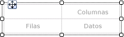
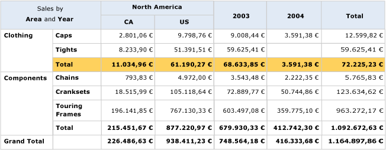
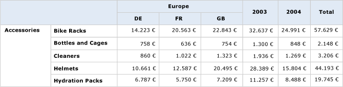

# Crear una matriz (Generador de informes y SSRS)
  Use una matriz para mostrar datos agrupados e información de resumen. Puede agrupar datos por varios campos o expresiones en grupos de filas y de columnas. Las matrices ofrecen funcionalidad similar a la de las tablas de referencias cruzadas (crosstab) y las tablas dinámicas. En tiempo de ejecución, a medida que se combinan los datos del informe y las regiones de datos, la matriz aumenta de tamaño horizontal y verticalmente en la página. Los valores de las celdas de la matriz muestran valores agregados cuyo ámbito es la intersección de los grupos de filas y de columnas a los que pertenece la celda. Puede dar formato a las filas y columnas para resaltar los datos a los que desea dar énfasis. También puede incluir controles de alternancia de obtención de detalles que ocultan inicialmente los datos detallados; de esta forma, el usuario podrá hacer clic en dichos controles para mostrar más o menos detalles, según sea necesario.  
  
 Después del diseño inicial, puede continuar desarrollando la matriz para mejorar la experiencia de visualización del usuario. Para más información, vea [Controlar la presentación de la región de datos Tablix en una página de informe &#40;Generador de informes y SSRS&#41;](../../reporting-services/report-design/controlling-the-tablix-data-region-display-on-a-report-page.md).  
  
 Para empezar a trabajar rápidamente con matrices, vea [Tutorial: Crear un informe de matriz &#40;Generador de informes&#41;](../../reporting-services/tutorial-creating-a-matrix-report-report-builder.md).  
  
> [!NOTE]  
>  Puede publicar listas por separado de un informe como elementos de informe. Lea más sobre [Elementos de informe (Generador de informes y SSRS)](../../reporting-services/report-design/report-parts-report-builder-and-ssrs.md).  
  
##   Agregar una matriz al informe  
 Agregue una matriz a la superficie de diseño desde la pestaña Insertar en la cinta de opciones. Tiene la opción de agregar una matriz mediante el Asistente para tabla o matriz, que incluye la creación de una conexión a un origen de datos y un conjunto de datos, y la configuración de la matriz o la adición de una matriz basada en la plantilla para matrices.  
  
> [!NOTE]  
>  El asistente solamente está disponible solo en [!INCLUDE[ssRBDenali](../../includes/ssrbdenali-md.md)].  
  
 Para describir cómo configurar una tabla de principio a fin, en este tema se utiliza la plantilla para matrices.  Inicialmente, la matriz tiene un grupo de filas, un grupo de columnas, una celda de la esquina y una celda de datos, como se muestra en la ilustración siguiente.  
  
   
  
 Al seleccionar una matriz en la superficie de diseño, aparecerán los identificadores de fila y de columna, como se muestra en la ilustración siguiente.  
  
   
  
 Agregue grupos arrastrando campos de conjunto de datos hasta las áreas Grupos de filas y Grupos de columnas del panel Agrupación. El primer campo que arrastre hasta el panel de grupos de filas o de columnas reemplazará al grupo vacío predeterminado inicial. A continuación, podrá aplicar formato a las celdas, en función de los datos que contengan.  
  
   
  
 En la vista previa, la matriz se expande para mostrar los valores del grupo de filas y de columnas. Las celdas muestran valores de resumen, como se muestra en la ilustración siguiente.  
  
   
  
 La matriz inicial es una plantilla basada en la región de datos Tablix. Puede continuar desarrollando el diseño de la matriz agregando grupos de filas o de columnas anidados o adyacentes, o incluso filas de detalles. Para obtener más información, vea [Explorar la flexibilidad de una región de datos Tablix &#40;Generador de informes y SSRS&#41;](../../reporting-services/report-design/exploring-the-flexibility-of-a-tablix-data-region-report-builder-and-ssrs.md).  
  
  
##   Agregar un grupo primario o un grupo secundario a una matriz  
 Para agregar un grupo basado en un único campo de conjunto de datos, arrastre el campo desde el panel Datos de informe hasta el área Grupos de filas o Grupos de columnas apropiada del panel Agrupación. Coloque el campo en la jerarquía de grupos para establecer su relación con los grupos existentes. Colóquelo encima de un grupo existente para crear un grupo primario o debajo para crear un grupo secundario.  
  
 Al colocar un campo en el panel **Agrupación** , tienen lugar varios hechos:  
  
-   Se crea automáticamente un nuevo grupo con un nombre único basado en el nombre del campo. La expresión de grupo se establece en la referencia de nombre de campo sencilla, como por ejemplo `[Category]`.  
  
-   Aparece una nueva fila o columna en el área del grupo de filas o de columnas correspondiente.  
  
-   En la nueva columna, aparece una celda de grupo de filas para las filas de datos predeterminadas del conjunto de datos de informe. Las celdas del cuerpo del Tablix para esta fila son ahora miembros del grupo de filas. Si hay algún grupo de columnas definido, las celdas que están en las columnas son miembros de esos grupos de columnas. Los indicadores de grupo proporcionan indicaciones visuales sobre la pertenencia al grupo de cada celda.  
  
 Para personalizar el grupo una vez creado, use el cuadro de diálogo **Grupo de Tablix** . Puede cambiar el nombre del grupo, así como modificar o agregar expresiones adicionales a la definición de grupo. Para agregar o quitar filas de la tabla, vea [Insertar o eliminar una fila &#40;Generador de informes y SSRS&#41;](../../reporting-services/report-design/insert-or-delete-a-row-report-builder-and-ssrs.md).  
  
 Al ejecutar el informe, los encabezados de las columnas dinámicas se expanden hacia la derecha (o hacia la izquierda si la propiedad Direction de la matriz se establece en RTL) tantas columnas como valores de grupo únicos haya. Las filas dinámicas se expanden hacia abajo. Los datos que aparecen en las celdas del cuerpo del Tablix son agregados basados en las intersecciones de los grupos de filas y de columnas, como se muestra en la ilustración siguiente.  
  
   
  
 En la vista previa, el informe aparece como se muestra en la ilustración siguiente.  
  
   
  
 Para escribir expresiones que especifiquen un ámbito distinto del predeterminado, debe especificar el nombre de un conjunto de datos, una región de datos o un grupo en la llamada a la función de agregado. Para calcular el porcentaje con el que cada subcategoría contribuye a los valores del grupo de categorías Clothing, agregue una columna dentro del grupo de categorías junto a la columna Total, asigne formato de porcentaje al texto y, por último, agregue una expresión que use el ámbito predeterminado en el numerador y el ámbito del grupo de categorías en el denominador, tal y como se muestra en el ejemplo siguiente.  
  
 `=SUM(Fields!Linetotal.Value)/SUM(Fields! Linetotal.Value,"Category")`  
  
 Para obtener más información, vea [Ámbito de expresión para los totales, agregados y colecciones integradas &#40;Generador de informes y SSRS&#41;](../../reporting-services/report-design/expression-scope-for-totals-aggregates-and-built-in-collections.md).  
  
  
##   Agregar un grupo adyacente a una matriz  
 Para agregar un grupo adyacente basado en un único campo de conjunto de datos, use el menú contextual del panel Agrupación. Para más información, vea [Agregar o eliminar un grupo en una región de datos &#40;Generador de informes y SSRS&#41;](../../reporting-services/report-design/add-or-delete-a-group-in-a-data-region-report-builder-and-ssrs.md). En la siguiente ilustración se muestra un grupo basado en la geografía y un grupo adyacente basado en el año.  
  
   
  
 En este ejemplo, la consulta ha filtrado los valores de los datos para incluir solo los valores correspondientes a Europa durante los años 2003 y 2004. Sin embargo, es posible activar los filtros en cada uno de los grupos de forma independiente. En la vista previa, el informe aparece como se muestra en la ilustración siguiente.  
  
   
  
 Para agregar una columna de totales a un grupo de columnas adyacente, haga clic en la celda de definición de grupo de columnas y use el comando **Agregar total** . Se agrega una columna estática junto al grupo de columnas, con una suma agregada predeterminada para cada campo numérico de las filas existentes. Para cambiar la expresión, edite manualmente el agregado predeterminado; por ejemplo, `Avg([Sales])`. Para obtener más información, vea [Agregar un total a un grupo o a una región de datos Tablix &#40;Generador de informes y SSRS&#41;](../../reporting-services/report-design/add-a-total-to-a-group-or-tablix-data-region-report-builder-and-ssrs.md).  
  
  
## Vea también  
 [Referencia de funciones de agregado &#40; El generador de informes y SSRS &#41;](../../reporting-services/report-design/report-builder-functions-aggregate-functions-reference.md)   
 [Ejemplos de expresiones &#40; El generador de informes y SSRS &#41;](../../reporting-services/report-design/expression-examples-report-builder-and-ssrs.md)  
  
  

