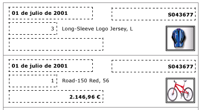
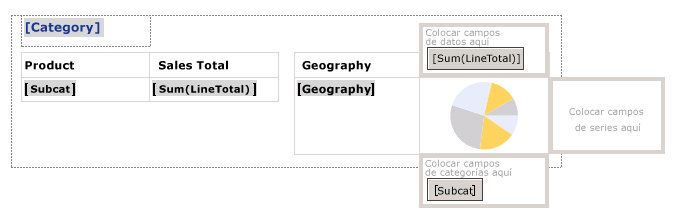
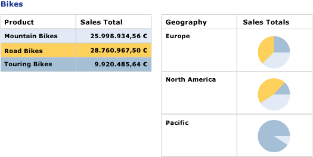

# Crear facturas y formularios con listas (Generador de informes y SSRS)
  Una región de datos de lista se repite con cada grupo o fila del conjunto de datos de informe paginado de [!INCLUDE[ssRSnoversion](../../includes/ssrsnoversion-md.md)] . Las listas se pueden utilizar para crear informes o formularios de forma libre, por ejemplo facturas, o conjuntamente con otras regiones de datos. Puede definir listas que contengan cualquier número de elementos de informe. Una lista se puede anidar  
  
 Para empezar a usar listas rápidamente, vea [Tutorial: Crear un informe de forma libre &#40;Generador de informes&#41;](../../reporting-services/tutorial-creating-a-free-form-report-report-builder.md).  
  
> [!NOTE]  
>  Puede publicar listas por separado de un informe como elementos de informe. Obtenga más información sobre [Elementos de informe (Generador de informes y SSRS)](../../reporting-services/report-design/report-parts-report-builder-and-ssrs.md).  
  
##   Agregar una lista al informe  
 Agregue una lista a la superficie de diseño desde la pestaña Insertar en la cinta de opciones. De forma predeterminada, la lista inicialmente tiene una única celda en una fila asociada al grupo de detalles.  
  
   
  
 Al seleccionar una lista en la superficie de diseño, aparecerán los identificadores de fila y de columna, como se muestra en la ilustración siguiente.  
  
   
  
 La lista inicial es una plantilla basada en la región de datos Tablix. Después de agregar una lista, puede seguir mejorando el diseño cambiando el contenido o la apariencia de la lista especificando expresiones de filtro, de ordenación o de grupo, o cambiando la forma en la que se muestra la lista en las páginas del informe. Para más información, vea [Controlar la presentación de la región de datos Tablix en una página de informe &#40;Generador de informes y SSRS&#41;](../../reporting-services/report-design/controlling-the-tablix-data-region-display-on-a-report-page.md). Aunque la lista comienza con una sola columna y una sola fila, puede seguir desarrollando su diseño agregando grupos de filas o de columnas anidados o adyacentes, o filas de detalles adicionales. Para obtener más información, vea [Explorar la flexibilidad de una región de datos Tablix &#40;Generador de informes y SSRS&#41;](../../reporting-services/report-design/exploring-the-flexibility-of-a-tablix-data-region-report-builder-and-ssrs.md).  
  
  
##   Mostrar datos en un diseño de forma libre  
 Para organizar los datos del informe en un diseño de forma libre en lugar de en una cuadrícula, puede agregar una lista a la superficie de diseño. Arrastre los campos desde el panel Datos de informe hasta la celda. De forma predeterminada, la celda contiene un rectángulo que actúa como contenedor. Mueva cada campo en el contenedor hasta que tenga el diseño que desea. Use las líneas de ajuste que aparecen al arrastrar los cuadros de texto en el contenedor de rectángulo para alinear los bordes vertical y horizontalmente. Quite el espacio en blanco no deseado ajustando el tamaño de la celda. Para más información, vea [Cambiar el alto de fila o el ancho de columna &#40;Generador de informes y SSRS&#41;](../../reporting-services/report-design/change-row-height-or-column-width-report-builder-and-ssrs.md).  
  
 En la ilustración siguiente aparece una lista con información sobre un pedido, incluyendo estos campos: Date, Order, Qty, Product, LineTotal y una imagen.  
  
   
  
 En la vista previa, la lista se repite para mostrar los datos de los campos en el formato de forma libre, como se muestra en la ilustración siguiente:  
  
   
  
> [!NOTE]  
>  Las líneas de puntos que aparecen en estas ilustraciones se incluyen para mostrar el diseño de forma libre para cada valor de campo. Normalmente, no se usan líneas de puntos en un informe de producción.  
  
  
##   Mostrar datos con un nivel de agrupación  
 Dado que una lista proporciona automáticamente un contenedor, puede usarla para mostrar datos agrupados con varias vistas. Para cambiar la lista predeterminada y poder especificar un grupo, modifique el grupo de detalles, especifique un nuevo nombre y, por último, especifique una expresión de grupo.  
  
 Por ejemplo, puede incrustar una tabla y un gráfico que muestren vistas diferentes del mismo conjunto de datos. Puede agregar un grupo a la lista para que los elementos de informe anidados se repitan una vez para cada valor de grupo. En la ilustración siguiente se muestra una lista agrupada por categoría de producto. Observe que no hay ninguna fila de detalles. En la lista aparecen dos tablas anidadas en paralelo. La primera muestra las subcategorías con las ventas totales. La segunda muestra la categoría agrupada por área geográfica, con un gráfico que muestra la distribución de las subcategorías.  
  
   
  
 En la vista previa, una tabla muestra las ventas totales para todas las subcategorías de bicicletas, y la otra muestra el desglose de las ventas por área geográfica. Se usa una expresión para especificar el color de fondo para la tabla y una paleta personalizada para el gráfico; la primera tabla también proporciona la leyenda para los colores del gráfico.  
  
   
  
  
## Vea también  
 [Referencia de funciones de agregado &#40; El generador de informes y SSRS &#41;](../../reporting-services/report-design/report-builder-functions-aggregate-functions-reference.md)   
 [Ejemplos de expresiones &#40; El generador de informes y SSRS &#41;](../../reporting-services/report-design/expression-examples-report-builder-and-ssrs.md)  
  
  

