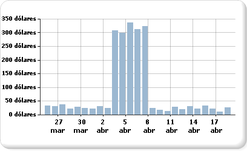

# Mostrar una serie con varios intervalos de datos en un gráfico

  El gráfico usará los valores máximo y mínimo de una serie para calcular la escala de eje. Si una serie del gráfico contiene más de un intervalo de datos, puede ocurrir que algunos puntos de datos queden ocultos y que solo unos pocos se vean con facilidad. Por ejemplo, imagine que un informe muestra los totales de ventas diarios durante un período de 30 días.  
  
   
  
 La mayor parte del mes, las ventas oscilan entre 10 y 40. Sin embargo, una campaña de marketing llevada a cabo por el departamento de ventas durante una semana ha hecho que las ventas aumenten repentinamente durante los primeros días del mes de abril. Este cambio en los datos de ventas produce una distribución desigual de los puntos de datos que hace que disminuya la legibilidad global del gráfico.  
  
 Hay varias maneras de mejorar la legibilidad:  
  
-   **Habilite quiebres de escala**: si los datos forman dos o más conjuntos de intervalos de datos, use un quiebre de escala para quitar el espacio existente entre los intervalos. Un quiebre de escala es una franja dibujada a través del área de trazado para hacer ver una interrupción entre los valores altos y bajos de una serie.  
  
-   **Filtre los valores que no sean necesarios**: si tiene puntos de datos que ocultan el intervalo de datos importante que se debe mostrar en el gráfico, quite los puntos no deseados mediante un filtro de informe. Para obtener información sobre cómo agregar un filtro al gráfico en [!INCLUDE[ssRSnoversion](../../includes/ssrsnoversion-md.md)], vea [Agregar filtros de conjunto de datos, filtros de región de datos y filtros de grupo &#40;Generador de informes y SSRS&#41;](../../reporting-services/report-design/add-dataset-filters-data-region-filters-and-group-filters.md).  
  
-   **Trace cada intervalo de datos como una serie independiente para comparar varias series**: si tiene más de dos intervalos de datos, plantéese la posibilidad de separarlos y convertirlos en series independientes. Para más información, vea [Mostrar varias series en un gráfico &#40;Generador de informes y SSRS&#41;](../../reporting-services/report-design/multiple-series-on-a-chart-report-builder-and-ssrs.md):  
  
> [!NOTE]  
>  [!INCLUDE[ssRBRDDup](../../includes/ssrbrddup-md.md)]  
  
## Mostrar varios intervalos de datos mediante quiebres de escala  
 Cuando se habilita un quiebre de escala, el gráfico calcula dónde debe dibujar una línea en el gráfico. Para dibujar un quiebre de escala, debe existir una separación suficiente entre los intervalos. De forma predeterminada, solo se puede agregar un quiebre de escala si existe una separación entre los intervalos de datos de al menos el 25% del gráfico.  
  
   
  
> [!NOTE]  
>  No puede especificar dónde se debe colocar un quiebre de escala en un gráfico. Sin embargo, sí puede modificar cómo se calcula el quiebre de escala; este proceso se describe más adelante en este tema.  
  
 Si habilita un quiebre de escala, pero este no aparece, aunque exista una distancia suficiente entre los rangos de datos, puede establecer la propiedad CollapsibleSpaceThreshold en un valor menor que 25. La propiedad CollapsibleSpaceThreshold especifica el porcentaje de espacio contraíble necesario entre los rangos de datos. Para más información, vea [Agregar quiebres de escala a un gráfico &#40;Generador de informes y SSRS&#41;](../../reporting-services/report-design/add-scale-breaks-to-a-chart-report-builder-and-ssrs.md).  
  
 Se pueden incluir hasta cinco quiebres de escala en cada gráfico; sin embargo, si se muestra más de un quiebre de escala, el gráfico puede resultar ilegible. Si tiene más de dos intervalos de datos, considere la posibilidad de usar un método diferente para mostrarlos. Para más información, vea [Mostrar varias series en un gráfico &#40;Generador de informes y SSRS&#41;](../../reporting-services/report-design/multiple-series-on-a-chart-report-builder-and-ssrs.md):  
  
## Escenarios en los que no se admiten los quiebres de escala  
 Los quiebres de escala no se admiten en los escenarios de gráfico siguientes:  
  
-   El gráfico tiene habilitado el efecto 3D.  
  
-   Se ha especificado un eje de valores logarítmico.  
  
-   Se ha establecido de forma explícita el valor mínimo o máximo para el eje de valores.  
  
-   El tipo de gráfico es polar, radial, circular, de anillos, de embudo, piramidal o cualquier tipo de gráfico apilado.  
  
 Un ejemplo de gráfico con quiebres de escala está disponible como informe de ejemplo. Para obtener más información acerca de cómo descargar este ejemplo y otros informes, consulte [informes de ejemplo del generador de informes y el Diseñador de informes](http://go.microsoft.com/fwlink/?LinkId=198283).  

## Pasos siguientes

[Mostrar varias Series en un gráfico](../../reporting-services/report-design/multiple-series-on-a-chart-report-builder-and-ssrs.md)   
[Aplicar formato a un gráfico](../../reporting-services/report-design/formatting-a-chart-report-builder-and-ssrs.md)   
[3D, bisel y otros efectos a un gráfico](../../reporting-services/report-design/chart-effects-3d-bevel-and-other-report-builder.md)   
[Gráficos](../../reporting-services/report-design/charts-report-builder-and-ssrs.md)   
[Cuadro de diálogo de propiedades de eje, opciones del eje](http://msdn.microsoft.com/library/b276e210-7a12-48ae-971b-7dabae51df11)   
[Recopilar sectores pequeños en un gráfico circular](../../reporting-services/report-design/collect-small-slices-on-a-pie-chart-report-builder-and-ssrs.md)  

¿Más preguntas? [Pruebe a formular el foro de Reporting Services](http://go.microsoft.com/fwlink/?LinkId=620231)
