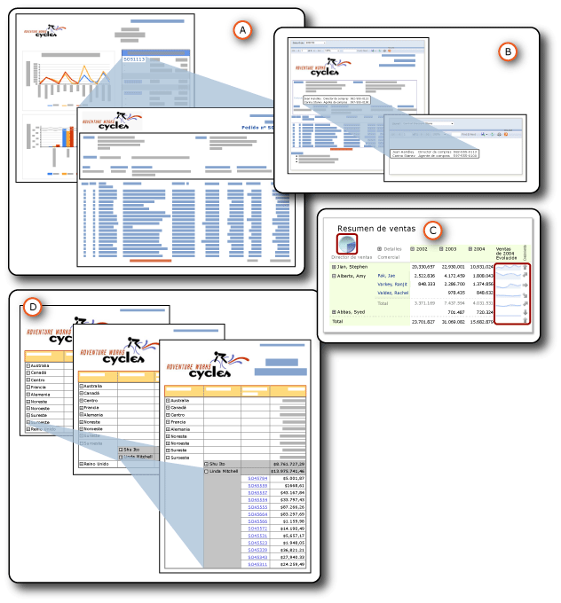

# Obtención de detalles, informes detallados, subinformes y regiones de datos anidadas
  Puede organizar los datos de distintas formas para mostrar la relación entre lo general y lo detallado.  Puede incluir todos los datos en el informe, pero establecer que permanezcan ocultos hasta que un usuario haga clic para mostrar los detalles; esta es una acción *de obtención de detalles* . Puede mostrar los datos en una región de datos, como una tabla o un gráfico, que *está anidada* en otra, como una tabla o matriz. Puede mostrar los datos en un *subinforme* que esté completamente incluido dentro de un informe principal. O también, puede colocar los datos detallados en informes *detallados* , informes independientes que se muestran cuando un usuario hace clic en un vínculo.  
  
   
  
 A. Informe detallado  
  
 B. subinforme  
  
 C. Regiones de datos anidadas  
  
 D. Acción de obtención de detalles  
  
 Todos ellos tienen puntos en común, pero tienen finalidades distintas y características diferentes. Dos de ellos, los informes detallados y los subinformes, son en realidad informes independientes. El anidamiento es una forma de colocar una región de datos dentro de otra. La obtención de detalles es una acción que puede aplicar a cualquier elemento de informe para mostrar u ocultar otros elementos. Todas ellas son formas de organizar y mostrar los datos para ayudar a los usuarios a comprender mejor el informe.  
  
> [!NOTE]  
>  [!INCLUDE[ssRBRDDup](../../includes/ssrbrddup-md.md)]  
  
##   Resumen de características  
 En la tabla que figura a continuación se resumen estas características distintas. Los detalles se incluyen en secciones aparte más adelante en este tema. La obtención de detalles no se incluye en estas comparaciones porque su acción de mostrar u ocultar se puede aplicar a cualquier elemento de informe.  
  
|Característica|subinforme|detallados|está anidada|  
|-----------|---------------|------------------|------------|  
|Uso de conjuntos de datos del informe principal|Iguales o distintos|Iguales o distintos|Iguales|  
|Recuperación de datos|Los datos se recuperan al mismo tiempo que el informe principal.|Los datos se recuperan en un informe detallado cada vez.|Los datos se recuperan todos al mismo tiempo que el informe principal.|  
|Proceso y representación|Con el informe principal|Cuando se hace clic en el vínculo.|Con el informe principal|  
|Rendimiento|Más lento (pero recupera todos los datos con el informe principal).|Más rápido (pero no recupera todos los datos con el informe principal).|Más rápido (y recupera todos los datos con el informe principal).|  
|Uso de parámetros|Sí|Sí|No|  
|Reusabilidad|Como informe, subinforme o informe detallado en otros informes.|Como informe, subinforme o informe detallado en otros informes.|No se puede volver a utilizar.|  
|Ubicación|Fuera del informe principal, en el mismo servidor de informes o en otro distinto.|Fuera del informe principal, en el mismo servidor de informes.|Dentro del informe principal.|  
|Presentación|En el informe principal|En otro informe|En el informe principal|  
  
  
##   Detalles de las características  
  
###   Conjuntos de datos que utilizan  
 Los subinformes y los informes detallados pueden usar el mismo conjunto de datos en el informe principal o pueden utilizar uno diferente. Las regiones de datos anidadas utilizan el mismo conjunto de datos.  
  
###   Recuperación de datos  
 Los subinformes y las regiones de datos anidadas recuperan datos al mismo tiempo que el informe principal. Los informes detallados, no. Cada informe detallado recupera los datos cuando un usuario hace clic en cada uno de los vínculos. Esto tiene importancia si los datos del informe principal y los del informe subordinado se deben recuperar al mismo tiempo.  
  
###   Proceso y representación  
 Un subinforme se procesa como parte del informe principal. Por ejemplo, si un subinforme que muestra información detallada de un pedido se agrega a una celda de la tabla en la fila de detalles, el subinforme se procesa una vez para cada fila de la tabla y se representa como parte del informe principal. Un informe detallado solo se procesa y se representa cuando el usuario hace clic en el vínculo de obtención de detalles en el informe principal de resumen.  
  
###   Rendimiento  
 A la hora de decidir cuál utilizar, plantéese la posibilidad de usar una región de datos en lugar de un subinforme, especialmente si dicho subinforme no se usa con varios informes. Puesto que el servidor de informes procesa cada instancia de un subinforme como un informe independiente, el rendimiento se puede ver afectado. Las regiones de datos ofrecen casi la misma funcionalidad y flexibilidad que los subinformes, pero con un mejor rendimiento. Los informes detallados tienen un mejor rendimiento que los subinformes, también, porque no recuperan todos los datos al mismo tiempo que el informe principal.  
  
###   Uso de parámetros  
 Normalmente, los informes detallados y los subinformes tienen parámetros de informe que especifican los datos del informe que se deben mostrar. Por ejemplo, al hacer clic en un número de pedido de ventas en un informe principal, se abre un informe detallado que acepta dicho número como un parámetro y, a continuación, muestra todos los datos sobre dicho pedido de ventas. Al crear el vínculo en el informe principal, debe especificar los valores que se deben pasar como parámetros al informe detallado.  
  
 Para crear un informe detallado o un subinforme, debe diseñar primero el informe detallado de destino o el subinforme y, a continuación, crear una acción de obtención de detalles o agregar la referencia al informe principal.  
  
###   Reusabilidad  
 Los subinformes y los informes detallados son informes independientes. Por lo tanto, se pueden utilizar en distintos informes o mostrar como informes independientes. Las regiones de datos anidadas no son reutilizables. No se pueden guardar como elementos de informe porque están anidadas en una región de datos. Puede guardar la región de datos que las contiene como un elemento de informe, pero no la región de datos anidada.  
  
###   Ubicación  
 Los subinformes y los informes detallados son informes independientes; por lo tanto, se almacenan fuera del informe principal. Los subinformes pueden estar en el mismo servidor de informes o en otro distinto, pero los informes detallados deben estar en el mismo servidor de informes. Las regiones de datos anidadas forman parte del informe principal.  
  
###   Presentación  
 Los subinformes y las regiones de datos anidadas se muestran en el informe principal. Los informes detallados se muestran solos.  
  
  
##   En esta sección  
 [Informes detallados &#40;Generador de informes y SSRS&#41;](../../reporting-services/report-design/drillthrough-reports-report-builder-and-ssrs.md)  
 Se explican los informes que se abren cuando un usuario hace clic en un vínculo de un informe principal.  
  
 [Subinformes &#40;Generador de informes y SSRS&#41;](../../reporting-services/report-design/subreports-report-builder-and-ssrs.md)  
 Se explican los informes que se muestran dentro del cuerpo de un informe principal.  
  
 [Anidar regiones de datos &#40;Generador de informes y SSRS&#41;](../../reporting-services/report-design/nested-data-regions-report-builder-and-ssrs.md)  
 Se explica cómo anidar una región de datos dentro de otra; por ejemplo, un gráfico anidado en el interior de una matriz.  
  
 [Acción de obtención de detalles &#40;generador de informes y SSRS&#41;](../../reporting-services/report-design/drilldown-action-report-builder-and-ssrs.md)  
 Explica cómo utilizar la acción de obtención de detalles para ocultar y mostrar elementos de informe.  
  
 [Especificar las rutas de acceso a los elementos externos &#40;Generador de informes y SSRS&#41;](../../reporting-services/report-design/specifying-paths-to-external-items-report-builder-and-ssrs.md)  
 Explica cómo hacer referencia a elementos que están fuera del archivo de definición de informe.  
  
## Vea también  
 [Parámetros de informe &#40;Generador de informes y Diseñador de informes&#41;](../../reporting-services/report-design/report-parameters-report-builder-and-report-designer.md)  
  
  
