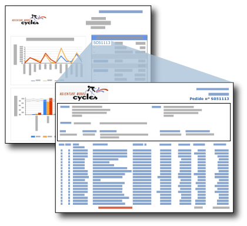

# Informes detallados (Generador de informes y SSRS)
  Un informe detallado es un informe que los usuarios abren al hacer clic en un vínculo de otro informe. Este tipo de informes suele incluir información detallada acerca de los elementos del informe de resumen original. Por ejemplo, en esta ilustración, el informe de resumen de ventas enumera los pedidos de ventas y los totales. Cuando el usuario hace clic en un número de pedido de la lista resumida, se abre otro informe con los detalles del pedido en cuestión.  
  
   
  
 Los datos del informe detallado no se recuperan hasta que el usuario hace clic en el vínculo del informe principal que abre el informe detallado. Si los datos para el informe principal y el informe detallado se deben recuperar al mismo tiempo, considere la posibilidad de usar un subinforme. Para obtener más información, vea [Subinformes &#40;Generador de informes y SSRS&#41;](../../reporting-services/report-design/subreports-report-builder-and-ssrs.md).  
  
> [!NOTE]  
>  Cuando trabaja con el Generador de informes, para ver el informe detallado que se abre al hacer clic en el vínculo de obtención de detalles del informe principal, debe estar conectado a un servidor de informes.  
  
 Para empezar a usar rápidamente los informes detallados, vea [Tutorial: Crear informes principales y de obtención de detalles &#40;Generador de informes&#41;](../../reporting-services/tutorial-creating-drillthrough-and-main-reports-report-builder.md). 
   
## Parámetros de los informes detallados  
 Un informe detallado suele incluir parámetros que le ha pasado el informe de resumen. En el ejemplo de informe de resumen de ventas, el informe incluye el campo [OrderNumber] en un cuadro de texto de una celda de la tabla. El informe detallado contiene un parámetro que toma como valor el número de pedido. Al establecer el vínculo de informe detallado en el cuadro de texto para [OrderNumber], también establece el parámetro para el informe de destino en [OrderNumber]. Cuando el usuario hace clic en el número de pedido del informe de resumen, se abre el informe detallado de destino, que muestra la información relativa a ese número de pedido. Para ver instrucciones sobre cómo personalizar informes detallados basados en valores de parámetros, vea [Parámetros de informe &#40;Generador de informes y Diseñador de informes&#41;](../../reporting-services/report-design/report-parameters-report-builder-and-report-designer.md) y [Función InScope &#40;Generador de informes y SSRS&#41;](../../reporting-services/report-design/report-builder-functions-inscope-function.md).  
  
## Diseñar el informe detallado  
 Para crear un informe detallado, primero debe diseñarlo, antes de crear una acción de obtención de detalles en el informe principal.  
  
 Un informe detallado puede ser cualquier informe. Normalmente, el informe detallado acepta uno o más parámetros que especifican los datos que se deben mostrar, basándose en el vínculo del informe principal. Por ejemplo, si se definió el vínculo del informe principal para un pedido de ventas, el número de pedido de ventas se pasa al informe detallado.  
  
## Crear una acción detallada en el informe principal  
 Puede agregar los vínculos de obtención de detalles a los cuadros de texto (incluyendo el texto de las celdas de una tabla o matriz), imágenes, gráficos, medidores y cualquier otro elemento de informe que tenga una página de propiedades de la acción. Para obtener más información, vea [Agregar una acción de obtención de detalles en un informe &#40;Generador de informes y SSRS&#41;](../../reporting-services/report-design/add-a-drillthrough-action-on-a-report-report-builder-and-ssrs.md).  
  
 Puede crear la acción de obtención de detalles en el informe principal como una acción de informe o como una acción de dirección URL. En una acción de informe, el informe detallado debe estar ubicado en el mismo servidor de informes que el informe principal. En una acción de dirección URL, el informe debe hallarse en la dirección URL completa. La manera de especificar un informe podría ser diferente para un servidor de informes o para un sitio de SharePoint integrado en un servidor de informes. Si el servidor de informes está configurado en el modo integrado de SharePoint, solo se admiten acciones de dirección URL.  
  
 Para obtener más información, vea [Agregar una acción de obtención de detalles en un informe &#40;Generador de informes y SSRS&#41;](../../reporting-services/report-design/add-a-drillthrough-action-on-a-report-report-builder-and-ssrs.md) y [Especificar las rutas de acceso a los elementos externos &#40;Generador de informes y SSRS&#41;](../../reporting-services/report-design/specifying-paths-to-external-items-report-builder-and-ssrs.md).  
  
## Ver un informe detallado  
 Para ver un informe de resumen con vínculos de obtención de detalles una vez publicado, debe asegurarse de que los informes detallados residan en el mismo servidor de informes que el informe de resumen. En todos los casos, los usuarios deben tener permisos sobre el informe detallado para poder verlo.  
  
## Vea también  
 [Obtención de detalles, informes detallados, subinformes y regiones de datos anidadas &#40;Generador de informes y SSRS&#41;](../../reporting-services/report-design/drillthrough-drilldown-subreports-and-nested-data-regions.md)  
  
  
