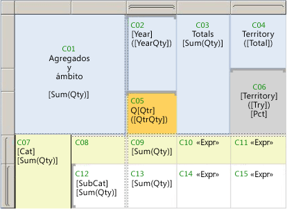

# <a name="expression-scope-for-totals-aggregates-and-built-in-collections"></a>Ámbito de expresión para los totales, agregados y colecciones integradas
  Al escribir expresiones, encontrará que el término *ámbito* se utiliza en varios contextos. El ámbito puede especificar los datos que se deben utilizar para evaluar una expresión, el conjunto de cuadros de texto de una página representada o el conjunto de elementos de informe que se pueden mostrar u ocultar mediante un comando de alternancia. Verá el término *ámbito* en temas relacionados con la evaluación de expresiones, la sintaxis de funciones de agregado, la visibilidad condicional, y también en mensajes de error relacionados con estas áreas. Las siguientes descripciones le ayudarán a diferenciar el significado de *ámbito* que corresponda:  
  
-   **Ámbito de datos** Es una jerarquía de ámbitos que el procesador de informes usa cuando combina los datos del informe y el diseño del informe, y genera regiones de datos como tablas y gráficos en los que se muestran los datos. Entender bien el ámbito de datos le puede ayudar a obtener los resultados que desea al:  
  
    -   **Escribir expresiones que usan funciones de agregado** Especifique los datos que se van a agregar. La ubicación de la expresión en informe afecta a los datos del ámbito para el cálculo de agregados.  
  
    -   **Agregar minigráficos a una tabla o una matriz** Especifique un intervalo mínimo y máximo de los ejes del gráfico para alinear instancias anidadas en una tabla o una matriz.  
  
    -   **Agregar indicadores a una tabla o una matriz** Especifique una escala mínima y máxima para el medidor para alinear instancias anidadas en una tabla o una matriz.  
  
    -   **Escribir expresiones de ordenación** Especifique un ámbito contenedor que se puede usar para sincronizar el criterio de ordenación entre varios elementos de informe relacionados.  
  
-   **Ámbito de celda** Es el conjunto de grupos de filas y de columnas de una región de datos Tablix al que pertenece un celda. De forma predeterminada, cada celda de Tablix contiene un cuadro de texto. El valor del cuadro de texto es la expresión. La ubicación de la celda determina indirectamente qué ámbitos de datos puede especificar para los cálculos de agregados en la expresión.  
  
-   **Ámbito de elemento de informe** Hace referencia a la colección de elementos en una página de informe representada. El procesador de informes combina los elementos de datos y de diseño del informe para producir una definición de informe compilada. Durante este proceso, las regiones de datos como tablas y matrices se expanden según sea necesario para mostrar todos los datos del informe. A continuación, un procesador de informes procesa el informe compilado. El procesador de informes determina qué elementos de informe aparecen en cada página. En un servidor de informes, cada página se representa cuando se visualiza. Al exportar un informe, se representan todas las páginas. Entender bien el ámbito de elemento de informe le puede ayudar a obtener los resultados que desea al:  
  
    -   **Agregar elementos de alternancia de visibilidad** Especifique un cuadro de texto para agregar el comando de alternancia que controla la visibilidad de un elemento de informe. Puede agregar solo un comando de alternancia a los cuadros de texto que están en el ámbito del elemento de informe que desea alternar.  
  
    -   **Escribir expresiones en los encabezados y pies de página** Especifique los valores de expresiones en cuadros de texto u otros elementos de informe que aparecen en la página representada.  
  
 Entender bien los ámbitos le puede ayudar a escribir correctamente expresiones que proporcionan los resultados que desea.  
  
> [!NOTE]  
>  [!INCLUDE[ssRBRDDup](../../includes/ssrbrddup-md.md)]  
  
##  <a name="DataScope"></a> Descripción del ámbito de datos y la jerarquía de datos  
 El ámbito de datos especifica un conjunto de datos del informe. Tiene una jerarquía natural con una relación de contención inherente. Los ámbitos superiores de la jerarquía contienen los ámbitos inferiores de la jerarquía. En la siguiente lista de ámbitos de datos se describe la jerarquía, en orden de más a menos datos:  
  
-   **Conjuntos de datos, después de la aplicación de filtros de conjunto de datos** Especifica el conjunto de datos de informe vinculado a la región de datos o a un elemento de informe del cuerpo del informe. Los datos utilizados para la agregación proceden del conjunto de datos de informe después de aplicar las expresiones de filtro al conjunto de datos. En el caso de conjuntos de datos compartidos, se trata de los filtros en la definición del conjunto de datos compartido y los filtros en la instancia del conjunto de datos compartido del informe.  
  
-   **Regiones de datos** Especifica los datos de la región de datos después de aplicar las expresiones de filtro y de ordenación a la región de datos. Los filtros de grupo no se utilizan al calcular agregados para las regiones de datos.  
  
-   **Grupos de región de datos, después de la aplicación de filtros de grupo** Especifica los datos una vez aplicados los filtros de grupo y las expresiones de grupo al grupo primario y a los grupos secundarios. En el caso de una tabla, son los grupos de filas y columnas. En el caso de un gráfico, son los grupos de series y categorías. A efectos de identificar la inclusión en el ámbito, cada grupo primario contiene sus grupos secundarios.  
  
-   **Regiones de datos anidadas** : especifica los datos para la región de datos anidada en el contexto de la celda a la que se han agregado, después de aplicar las expresiones de filtro y de ordenación a la región de datos anidada.  
  
-   **Grupos de filas y de columnas para las regiones de datos anidadas** Especifica los datos una vez aplicadas las expresiones de grupo y los filtros de grupo para las regiones de datos anidadas.  
  
 Entender bien los ámbitos contenedores y contenidos es importante al escribir expresiones que incluyen funciones de agregado.  
  
##  <a name="Aggregates"></a> Ámbito y expresiones de celda  
 Al especificar un ámbito, está indicando al procesador de informes qué datos se deben usar para un cálculo agregado. Dependiendo de la expresión y su ubicación, pueden ser ámbitos válidos los *ámbitos contenedores*, denominados también ámbitos principales, o los *ámbitos contenidos*, denominados también ámbitos secundarios o anidados. En general, no puede especificar una instancia de grupo individual en un cálculo agregado. Puede especificar un agregado en todas las instancias del grupo.  
  
 Cuando el procesador de informes combina los datos de un conjunto de datos de informe con la región de datos Tablix, evalúa las expresiones de grupo y crea las filas y columnas necesarias para representar las instancias de grupo. El valor de las expresiones de un cuadro de texto de cada celda de Tablix se evalúa en el contexto del ámbito de celda. Dependiendo de la estructura de Tablix, una celda puede pertenecer a varios grupos de filas y grupos de columnas. Para las funciones de agregado, puede especificar qué ámbito usar mediante uno de los siguientes ámbitos:  
  
-   **Ámbito predeterminado** Los datos que están en el ámbito para los cálculos cuando el procesador de informes evalúa una expresión. El ámbito predeterminado es el conjunto de grupos más interno al que pertenece la celda o el punto de datos. En el caso de una región de datos Tablix, el conjunto puede incluir grupos de filas y grupos de columnas. Si se trata de una región de datos de gráfico, puede incluir grupos de categorías y de series.  
  
-   **Ámbito con nombre** El nombre de un conjunto de datos, una región de datos o un grupo de regiones de datos que está en el ámbito de la expresión. En el caso de cálculos agregados, puede especificar un ámbito contenedor. No puede especificar un ámbito con nombre para un grupo de filas y un grupo de columnas en una única expresión. No puede especificar un ámbito contenido a menos que la expresión sea para un agregado de un agregado.  
  
     La siguiente expresión genera los años de intervalo entre SellStartDate y LastReceiptDate. Estos campos están en dos conjuntos de datos distintos, DataSet1 y DataSet2. La [función First &#40;Generador de informes y SSRS&#41;](../../reporting-services/report-design/report-builder-functions-first-function.md), que es una función de agregado, devuelve el primer valor de SellStartDate en DataSet1 y el primer valor de LastReceiptDate en DataSet2.  
  
    ```  
    =DATEDIFF(“yyyy”, First(Fields!SellStartDate.Value, "DataSet1"), First(Fields!LastReceiptDate.Value, "DataSet2"))  
    ```  
  
-   **Ámbito de dominio** También denominado ámbito de sincronización. Es un tipo de ámbito de datos que se aplica a la evaluación de expresiones para regiones de datos anidadas. El ámbito de dominio se utiliza para especificar agregados por todas las instancias de un grupo, de forma que las instancias anidadas se puedan alinear y comparar con facilidad. Por ejemplo, puede alinear el intervalo y el alto de los minigráficos incrustados en una tabla, de forma que los valores estén alineados.  
  
 En algunas ubicaciones de un informe se debe especificar un ámbito. Por ejemplo, en el caso de un cuadro de texto en la superficie de diseño, debe especificar el nombre del conjunto de datos que se va a usar: `=Max(Fields!Sales.Value,"Dataset1")`. En otras ubicaciones, hay un ámbito predeterminado implícito. Por ejemplo, si no especifica un agregado para un cuadro de texto en un ámbito de grupo, se utiliza el agregado predeterminado Primero.  
  
 En cada tema de función de agregado se ofrece una lista de los ámbitos válidos para su uso. Para más información, vea [Referencia a las funciones de agregado &#40;Generador de informes y SSRS&#41;](../../reporting-services/report-design/report-builder-functions-aggregate-functions-reference.md).  
  
##  <a name="Examples"></a> Ejemplo de expresiones de agregado para una región de datos de tabla  
 La escritura de expresiones que especifiquen ámbitos no predeterminado requiere cierta práctica. Como ayuda para entender los distintos ámbitos, estudie la siguiente figura y tabla. En la figura, tiene una etiqueta cada celda de una tabla de información de ventas que muestra la cantidad de elementos vendida por año y trimestre, y también por territorio de ventas. Observe las indicaciones visuales en los identificadores de fila e identificadores de columna que muestran la estructura de grupos de filas y columnas, para indicar los grupos anidados. La tabla tiene la siguiente estructura:  
  
-   Un encabezado de tabla que contiene la celda de esquina y tres filas con los encabezados de grupo de columnas.  
  
-   Dos grupos de filas anidados basados en la categoría, denominado Cat, y en subcategoría, denominado SubCat.  
  
-   Dos grupos de columnas anidados basados en el año, denominado Year, y en el trimestre, denominado Qtr.  
  
-   Una columna de totales estática con la etiqueta Totals.  
  
-   Un grupo de columnas adyacente basado en territorio de ventas, denominado Territory.  
  
 El encabezado de columna del grupo de territorios se ha dividido en dos celdas por razones de presentación. La primera celda muestra el nombre del territorio y los totales, y la segunda celda tiene texto de marcador de posición que calculó la contribución en porcentaje por cada territorio a todas las ventas.  
  
   
  
 Suponga que el conjunto de datos se llama DataSet1 y la tabla se llama Tablix1. En la siguiente tabla se ofrece una lista de la etiqueta de celda, el ámbito predeterminado y ejemplos. Los valores para el texto del marcador de posición se muestran en sintaxis de expresión.  
  
|Celda|Ámbito predeterminado|Etiquetas de marcador de posición|Texto o valores de marcador de posición|  
|----------|-------------------|------------------------|--------------------------------|  
|C01|Tablix1|[Sum(Qty)]|Agregados y ámbito<br /><br /> `=Sum(Fields!Qty.Value)`|  
|C02|Grupo de columnas externo "Year"|[Year]<br /><br /> ([YearQty])|`=Fields!Year.Value`<br /><br /> `=Sum(Fields!Qty.Value)`|  
|C03|Tablix1|[Sum(Qty)]|Totals<br /><br /> `=Sum(Fields!Qty.Value)`|  
|C04|Grupo de columnas del mismo nivel "Territory"|([Total])|Territory<br /><br /> `=Sum(Fields!Qty.Value)`|  
|C05|Grupo interno "Qtr"|[Qtr]<br /><br /> ([QtrQty])|Q<br /><br /> `=Fields!Qtr.Value`<br /><br /> `=Sum(Fields!Qty.Value)`|  
|C06|Grupo de columnas del mismo nivel "Territory"|[Territory]<br /><br /> ([Tty])<br /><br /> [Pct]|`=Fields!Territory.Value`<br /><br /> `=Sum(Fields!Qty.Value)`<br /><br /> `=FormatPercent(Sum(Fields!Qty.Value,"Territory")/Sum(Fields!Qty.Value,"Tablix1"),0) & " of " & Sum(Fields!Qty.Value,"Tablix1")`|  
|C07|Grupo de filas externo "Cat"|[Cat]<br /><br /> [Sum(Qty)]|`=Fields!Cat.Value`<br /><br /> `=Sum(Fields!Qty.Value)`|  
|C08|Igual que C07|||  
|C09|Grupo de filas externo "Cat" y grupo de columnas interno "Qtr"|[Sum(Qty)]|`=Sum(Fields!Qty.Value)`|  
|C10|Igual que C07|<\<Expr>>|`=Sum(Fields!Qty.Value) & ": " & FormatPercent(Sum(Fields!Qty.Value)/Sum(Fields!Qty.Value,"Tablix1"),0) & " of " & Sum(Fields!Qty.Value,"Tablix1")`|  
|C11|Grupo de filas externo "Cat" y grupo de columnas interno "Territory"|<\<Expr>>|`=Sum(Fields!Qty.Value) & ": " & FormatPercent(Sum(Fields!Qty.Value)/Sum(Fields!Qty.Value,"Territory"),0) & " of " & Sum(Fields!Qty.Value,"Territory")`|  
|C12|Grupo de filas interno "Subcat"|[Subcat]<br /><br /> [Sum(Qty)]|`=Fields!SubCat.Value`<br /><br /> `=Sum(Fields!Qty.Value)`|  
|C13|Grupo de filas interno "Cat" y grupo de columnas interno "Qtr"|[Sum(Qty)]|`=Sum(Fields!Qty.Value)`|  
|C14|Grupo de filas interno "Subcat"|<\<Expr>>|`=Sum(Fields!Qty.Value) & ": " & FormatPercent(Sum(Fields!Qty.Value)/Sum(Fields!Qty.Value,"Cat"),0) & " of " & Sum(Fields!Qty.Value,"Cat")`|  
|C15|Grupo de filas interno "SubCat" y grupo de columnas interno "Territory"|<\<Expr>>|`=Sum(Fields!Qty.Value) & ": " & FormatPercent(Code.CalcPercentage(Sum(Fields!Qty.Value),Sum(Fields!Qty.Value,"Cat")),0) & " of " & Sum(Fields!Qty.Value,"Cat")`|  
  
 Para obtener más información sobre la forma de interpretar las indicaciones visuales en las regiones de datos Tablix, vea [Celdas, filas y columnas de la región de datos Tablix &#40;Generador de informes y SSRS&#41;](../../reporting-services/report-design/tablix-data-region-cells-rows-and-columns-report-builder-and-ssrs.md). Para más información sobre la región de datos Tablix, vea [Celdas, filas y columnas de la región de datos Tablix &#40;Generador de informes y SSRS&#41;](../../reporting-services/report-design/tablix-data-region-cells-rows-and-columns-report-builder-and-ssrs.md). Para obtener más información sobre las expresiones y los agregados, vea [Usar expresiones en informes &#40;Generador de informes y SSRS&#41;](../../reporting-services/report-design/expression-uses-in-reports-report-builder-and-ssrs.md) y [Referencia a las funciones de agregado &#40;Generador de informes y SSRS&#41;](../../reporting-services/report-design/report-builder-functions-aggregate-functions-reference.md).  
  
  
##  <a name="Sparklines"></a> Sincronizar las escalas de los minigráficos  
 Para comparar valores a lo largo del tiempo en el eje horizontal de un minigráfico anidado en una tabla o matriz, puede sincronizar los valores de grupo de categorías. Esto se denomina alinear los ejes. Si se selecciona la opción para alinear los ejes, el informe establece automáticamente los valores mínimo y máximo para un eje, y proporciona marcadores de posición para los valores agregados que no existen en todas las categorías. De esta forma, los valores del minigráfico se alinean en todas las categorías, lo que permite comparar los valores para cada fila de datos agregados. Si selecciona esta opción, cambia el ámbito de la evaluación de la expresión al *ámbito de dominio*. Al establecer el ámbito de dominio para un gráfico anidado, también se controla indirectamente la asignación de color a cada categoría en la leyenda.  
  
 Por ejemplo, en un minigráfico que muestra tendencias semanales, imagine que una ciudad tuviera datos de ventas de 3 meses y otra tuviera datos de ventas de 12 meses. Sin escalas sincronizadas, en el minigráfico de la primera ciudad solo habría 3 barras, que serían mucho más anchas y ocuparían el mismo espacio que el conjunto de barras de 12 meses de la segunda ciudad.  
  
 Para obtener más información, vea [Alinear los datos en un gráfico en una tabla o una matriz &#40;Generador de informes y SSRS&#41;](../../reporting-services/report-design/align-the-data-in-a-chart-in-a-table-or-matrix-report-builder-and-ssrs.md).  
  
  
##  <a name="Indicators"></a> Sincronizar los intervalos de los indicadores  
 Para especificar los valores de datos que se van a usar para un conjunto de indicadores, debe especificar un ámbito. Dependiendo del diseño de la región de datos que contenga el indicador, se especifica un ámbito o un ámbito contenedor. Por ejemplo, en una fila de encabezado de grupo asociada a ventas de categoría, un conjunto de flechas (hacia arriba, abajo, y los lados) puede indicar los valores de ventas relativos a un umbral. El ámbito contenedor es el nombre de la tabla o matriz que contiene los indicadores.  
  
 Para obtener más información, vea [Establecer el ámbito de sincronización &#40;Generador de informes y SSRS&#41;](../../reporting-services/report-design/set-synchronization-scope-report-builder-and-ssrs.md).  
  
  
##  <a name="Page"></a> Especificar ámbitos del encabezado de página o pie de página  
 Para mostrar datos diferentes en cada página de un informe, debe agregar expresiones a un elemento de informe que debe estar en la página representada. Dado que un informe se divide en páginas cuando se representa, solo se puede determinar qué elementos hay en una página durante la representación. Por ejemplo, una celda de una fila de detalle tiene un cuadro de texto que tiene muchas instancias en una página.  
  
 Por este motivo, hay una colección global llamada a ReportItems. Es el conjunto de cuadros de texto de la página actual.  
  
 Para obtener más información, vea [Encabezados y pies de página &#40;Generador de informes y SSRS&#41;](../../reporting-services/report-design/page-headers-and-footers-report-builder-and-ssrs.md) y [Usar referencias a la colección ReportItems &#40;Generador de informes y SSRS&#41;](../../reporting-services/report-design/built-in-collections-reportitems-collection-references-report-builder.md).  
  
  
##  <a name="Toggles"></a> Especificar un elemento de alternancia para la obtención de detalles y la visibilidad condicional  
 Los comandos alternantes son signos de más o menos que se agregan a un cuadro de texto, en los que el usuario puede hacer clic para mostrar u ocultar otros elementos de informe. En la página **Visibilidad** de la mayoría de las propiedades de elemento de informe, puede especificar a qué elemento de informe se va a agregar el comando alternante. El elemento de comando alternante debe estar en un ámbito de contención más alto que el elemento que se va a mostrar u ocultar.  
  
 En una región de datos Tablix, para crear un efecto de obtención de detalles en el que se hace clic en un cuadro de texto para expandir la tabla y mostrar más datos, debe establecer la propiedad **Visibilidad** en el grupo y seleccionar como comando alternante un cuadro de texto en un encabezado de grupo que esté asociado a un grupo contenedor.  
  
 Para obtener más información, vea [Agregar una acción de expandir y contraer a un elemento &#40;Generador de informes y SSRS&#41;](../../reporting-services/report-design/add-an-expand-or-collapse-action-to-an-item-report-builder-and-ssrs.md).  
  
  
##  <a name="Sort"></a> Especificar una expresión de orden para sincronizar el criterio de ordenación  
 Al agregar un botón de orden interactivo a una columna de la tabla, puede sincronizar la ordenación para varios elementos que tengan un ámbito contenedor común. Por ejemplo, puede agregar un botón de ordenación a un encabezado de columna en una matriz y especificar el ámbito contenedor como nombre del conjunto de datos enlazado a la matriz. Cuando un usuario hace clic en el botón de ordenación, no solo se ordenan las filas de la matriz, sino que también se ordenan los grupos de series de gráfico de los gráficos que estén enlazados al mismo conjunto de datos. De esta manera, todas las regiones de datos que dependen de ese conjunto de datos se pueden sincronizar para que muestren el mismo criterio de ordenación.  
  
 Para obtener más información, vea [Filtrar, agrupar y ordenar datos &#40;Generador de informes y SSRS&#41;](../../reporting-services/report-design/filter-group-and-sort-data-report-builder-and-ssrs.md).  
  
  
##  <a name="Nulls"></a> Suprimir valores NULL o cero en una celda  
 Para muchos informes, los cálculos cuyo ámbito son grupos pueden crear muchas celdas con valores cero (0) o NULL. Para conseguir que el informe esté más despejado, agregue una expresión que devuelva espacios en blanco si el valor de agregado es 0. Para obtener más información, vea los ejemplos de "Suprimir valores NULL o valores cero" en [Ejemplos de expresiones &#40;Generador de informes y SSRS&#41;](../../reporting-services/report-design/expression-examples-report-builder-and-ssrs.md).  
  
  
## <a name="see-also"></a>Ver también  
 [Ejemplos de expresiones &#40;Generador de informes y SSRS&#41;](../../reporting-services/report-design/expression-examples-report-builder-and-ssrs.md)   
 [Ejemplos de expresión de grupo &#40;Generador de informes y SSRS&#41;](../../reporting-services/report-design/group-expression-examples-report-builder-and-ssrs.md)   
 [Crear grupos de jerarquía recursiva &#40;Generador de informes y SSRS&#41;](../../reporting-services/report-design/creating-recursive-hierarchy-groups-report-builder-and-ssrs.md)   
 [Tablas, matrices y listas &#40;Generador de informes y SSRS&#41;](../../reporting-services/report-design/tables-matrices-and-lists-report-builder-and-ssrs.md)   
 [Aplicar formato a texto y a marcadores de posición &#40;Generador de informes y SSRS&#41;](../../reporting-services/report-design/formatting-text-and-placeholders-report-builder-and-ssrs.md)  
  
  
