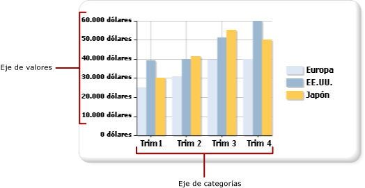

# Aplicar formato a las etiquetas de los ejes de un gráfico (Generador de informes y SSRS)
  Los tipos de gráficos basados en coordenadas (de columnas, de barras, de áreas, de puntos, de líneas y de intervalos) tienen dos ejes que se usan para clasificar y mostrar las relaciones entre los datos. A cada eje se le aplican distintos tipos de formato.  
  
 Puede aplicar formato a los ejes mediante el cuadro de diálogo **Propiedades del eje** o con el panel de propiedades. Haga clic con el botón derecho en el eje al que quiere aplicar formato y haga clic en **Propiedades del eje** para cambiar los valores del texto del eje, de los formatos numéricos y de fecha, de las marcas de graduación principales y secundarias, del ajuste automático de las etiquetas, así como el grosor, el color y el estilo de la línea del eje. Para cambiar los valores para el título de un eje, haga clic con el botón derecho en el título del eje y haga clic en **Propiedades del título del eje**.  
  
 Las etiquetas del eje identifican los intervalos principales del gráfico. De forma predeterminada, el gráfico utiliza un algoritmo para determinar la colocación óptima de las etiquetas en el eje para evitar la superposición del texto.  
  
> [!NOTE]  
>  [!INCLUDE[ssRBRDDup](../../includes/ssrbrddup-md.md)]  
  
## Tipos de ejes  
 El gráfico tiene dos ejes principales: el eje de valores y el eje de categorías.  
  
   
  
 Cuando se arrastra un campo desde un conjunto de datos a la superficie del gráfico, el gráfico determinará si este campo pertenece al eje de categorías o al de valores.  
  
 El eje de valores normalmente es el eje vertical o eje Y, del gráfico. Se usa para mostrar los valores de los datos numéricos que se representan gráficamente. Si se arrastra un campo a la región de datos, se representará en el eje de valores. El eje de categorías normalmente es el eje horizontal o eje X del gráfico. Para los gráficos de barras, estos ejes se invierten. En los tipos de gráficos de barras, el eje de categorías es el eje vertical y el eje de valores es el eje horizontal. Para más información, vea [Gráficos de barras &#40;Generador de informes y SSRS&#41;](../../reporting-services/report-design/bar-charts-report-builder-and-ssrs.md).  
  
## Cómo calcula el gráfico los intervalos de las etiquetas de los ejes  
 Antes de dar formato a las etiquetas de los ejes, debería entender cómo calcula el gráfico los intervalos de las etiquetas de los ejes. Esto le permitirá establecer las propiedades necesarias para lograr que las etiquetas de los ejes se muestren como desea.  
  
 La escala de un eje viene determinada por un valor mínimo y un valor máximo que definen el intervalo de datos que se va a mostrar a lo largo del eje. El gráfico calcula dichos valores mínimo y máximo para cada eje basándose en los valores del conjunto de resultados. En el eje de valores, la escala siempre vendrá determinada por los números más pequeño y más grande del campo de valores. En el eje de categorías, los tipos del valor máximo y del mínimo se determinan dependiendo del tipo de campo de categorías. Cualquier campo de un conjunto de datos se puede clasificar en uno de los tres tipos de campos de categorías posibles. En la tabla siguiente se muestran estos tres tipos de campos de categorías.  
  
|Tipo de campo de categorías|Descripción|Ejemplo|  
|-------------------------|-----------------|-------------|  
|Numeric|Las categorías se muestran por orden numérico a lo largo del eje X.|Un informe de ventas por número de identificación de empleado muestra los números de identificación de los empleados a lo largo del eje X.|  
|Fecha/hora|Las categorías se muestran por orden cronológico a lo largo del eje X.|Un informe de ventas por meses muestra las fechas con formato a lo largo del eje X.|  
|Cadenas|Las categorías se muestran en el orden en que aparecen por primera vez en el origen de datos a lo largo del eje X.|Un informe de ventas por regiones muestra los nombres de las regiones a lo largo del eje X.|  
  
 Todos los tipos de gráficos de dos ejes están diseñados para suprimir algunas etiquetas de los ejes cuando hay más categorías de las que caben, con objeto de obtener una imagen más limpia en el gráfico y evitar colisiones en las etiquetas.  
  
 La aplicación calcula la colocación de las etiquetas en un eje mediante los pasos siguientes:  
  
1.  Se identifican los valores máximo y mínimo basándose en los valores del conjunto de resultados.  
  
2.  En función de dichos valores máximo y mínimo, se calcula un número equidistante de intervalos del eje, normalmente entre cuatro y seis.  
  
3.  De acuerdo con las propiedades de las etiquetas del eje, se muestran las etiquetas en estos intervalos. Las propiedades que afectan a la posición de las etiquetas incluyen el tamaño de fuente, el ángulo en el que se muestran las etiquetas, y las propiedades de ajuste de texto. Estas opciones de ajuste automático de las etiquetas del eje se pueden cambiar.  
  
### Ejemplo de cómo calcula el gráfico las etiquetas de los ejes  
 La tabla que se muestra a continuación contiene datos de ventas de ejemplo que se van a representar en un gráfico de columnas. El campo Nombre se agrega al área Grupos de categorías y el campo Cantidad se agrega al área Valores.  
  
|Nombre|Cantidad|  
|----------|--------------|  
|Michael Blythe|229|  
|Jae Pak|112|  
|Ranjit Varkey Chudukatil|494|  
|Jillian Carson|247|  
|Linda Mitchell|339|  
|Rachel Valdez|194|  
  
 El campo Cantidad se representa a lo largo del eje de valores. El valor mínimo es 112 y el valor máximo es 494. En este caso, el gráfico calcula la escala para que comience en 0 y finalice en 500. El gráfico también calcula cinco intervalos equidistantes de 100 unidades y crea etiquetas en las posiciones 0, 100, 200, 300, 400 y 500.  
  
 El campo Nombre se muestra a lo largo del eje de categorías. El gráfico calcula entre cuatro y seis etiquetas, y calcula valores de ajuste automático para determinar cómo deben situarse las etiquetas en el eje de categorías sin producir colisiones entre ellas. Como consecuencia, es posible que se omitan algunas etiquetas de categoría. Puede invalidar las opciones de ajuste automático para cada eje por separado.  
  
## Mostrar todas las etiquetas en el eje de categorías.  
 En el eje de valores, los intervalos de eje proporcionan una medida coherente de los puntos de datos representados en el gráfico. Sin embargo, en el eje de categorías, esta funcionalidad puede provocar que las categorías aparezcan sin etiquetas en los ejes. Normalmente, deseará que todas las categorías tengan etiquetas. Puede establecer el número de intervalos en 1 para que se muestren todas las categorías.  Para más información, vea [Especificar un intervalo de eje &#40;Generador de informes y SSRS&#41;](../../reporting-services/report-design/specify-an-axis-interval-report-builder-and-ssrs.md).  
  
> [!NOTE]  
>  Cuando se reemplazan las características de etiquetado automático por un intervalo manual en un eje, el gráfico debe cambiar el tamaño de todos los demás elementos en consecuencia. Como resultado, puede que observe resultados imprevisibles en cuanto al tamaño y la posición de las etiquetas o al tamaño de otros elementos del gráfico.  
  
## Intervalos de eje variables  
 El gráfico calcula aproximadamente cinco intervalos de etiquetas del eje sin tener en cuenta el tamaño del gráfico. En gráficos más anchos o más altos, si solo muestra cinco etiquetas en un eje, pueden aparecer grandes huecos entre las etiquetas. Esto hace que resulte más difícil identificar el valor de cada punto de datos con relación al eje. Para evitar este comportamiento en gráficos más anchos o más altos, puede establecer un intervalo de eje variable. El gráfico calculará el número óptimo de etiquetas que pueden aparecer en el eje basándose en el ancho o el alto del gráfico, dependiendo del eje correspondiente. Para más información, vea [Especificar un intervalo de eje &#40;Generador de informes y SSRS&#41;](../../reporting-services/report-design/specify-an-axis-interval-report-builder-and-ssrs.md).  
  
## Ordenar los valores de los ejes  
 Las categorías aparecen a lo largo del eje X en el orden en que aparecen en el conjunto de resultados. Puede cambiar el orden del grupo agregando un comando SORT a la consulta u ordenando el conjunto de datos mediante una expresión. Las regiones de datos del gráfico se ordenan igual que todas las demás regiones de datos. Para más información sobre cómo ordenar datos, vea [Ordenar datos en una región de datos &#40;Generador de informes y SSRS&#41;](../../reporting-services/report-design/sort-data-in-a-data-region-report-builder-and-ssrs.md).  
  
## Especificar valores escalares en el eje de categorías  
 De forma predeterminada, el gráfico solamente mostrará etiquetas en el eje para los puntos de datos del conjunto de datos que contienen valores válidos. Por ejemplo, si tiene los valores 1, 2 y 6 en el eje de categorías, el gráfico solamente mostrará las categorías 1, 2 y 6. Para mantener la escala de los valores de las categorías, puede especificar que el gráfico use un eje escalar. En este escenario, el gráfico mostrará las etiquetas 1 a 6 en el eje X del gráfico, aunque el conjunto de datos no contenga valores para las etiquetas 3 a 5.  
  
 Hay dos maneras de establecer un eje escalar:  
  
-   Seleccione la opción **Eje escalar** en el cuadro de diálogo **Propiedades del eje** . Esto agregará valores numéricos o de fecha u hora al eje donde no existan valores de agrupación de datos. Para más información, vea [Cuadro de diálogo Propiedades del eje, Opciones del eje &#40;Generador de informes y SSRS&#41;](https://msdn.microsoft.com/library/b276e210-7a12-48ae-971b-7dabae51df11).  
  
-   Seleccione un campo o escriba una expresión para la opción **Campo de categorías** en el cuadro de diálogo **Propiedades de la serie** . El gráfico agregará intervalos al eje para todos los valores del campo de categorías que especificó.  
  
## Agregar o quitar los márgenes laterales del eje de categorías  
 En los gráficos de barras, de dispersión y de columnas, el gráfico agrega automáticamente márgenes laterales en los extremos del eje X. No puede cambiar el tamaño del margen. En todos los demás tipos de gráficos, el gráfico no agrega márgenes laterales. Para más información, vea [Agregar o quitar márgenes de un gráfico &#40;Generador de informes y SSRS&#41;](../../reporting-services/report-design/add-or-remove-margins-from-a-chart-report-builder-and-ssrs.md).  
  
## En esta sección  
 [Aplicar formato de fecha o de moneda a las etiquetas de los ejes &#40;Generador de informes y SSRS&#41;](../../reporting-services/report-design/format-axis-labels-as-dates-or-currencies-report-builder-and-ssrs.md)  
  
 [Colocar etiquetas en un gráfico &#40;Generador de informes y SSRS&#41;](../../reporting-services/report-design/position-labels-in-a-chart-report-builder-and-ssrs.md)  
  
 [Especificar un intervalo de eje &#40;Generador de informes y SSRS&#41;](../../reporting-services/report-design/specify-an-axis-interval-report-builder-and-ssrs.md)  
  
 [Agregar o quitar márgenes de un gráfico &#40;Generador de informes y SSRS&#41;](../../reporting-services/report-design/add-or-remove-margins-from-a-chart-report-builder-and-ssrs.md)  
  
 [Especificar una escala logarítmica &#40;Generador de informes y SSRS&#41;](../../reporting-services/report-design/specify-a-logarithmic-scale-report-builder-and-ssrs.md)  
  
## Consulte también  
 [Aplicar formato a un gráfico &#40;Generador de informes y SSRS&#41;](../../reporting-services/report-design/formatting-a-chart-report-builder-and-ssrs.md)   
 [Gráficos &#40;Generador de informes y SSRS&#41;](../../reporting-services/report-design/charts-report-builder-and-ssrs.md)   
 [Aplicar formato a los puntos de datos de un gráfico &#40;Generador de informes y SSRS&#41;](../../reporting-services/report-design/formatting-data-points-on-a-chart-report-builder-and-ssrs.md)  
  
  
