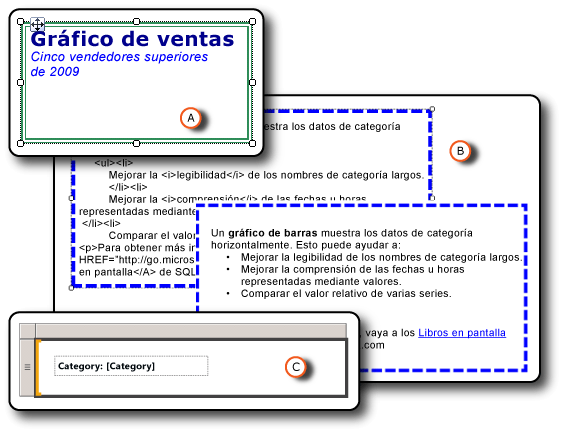

# Aplicar formato a los elementos de informe (Generador de informes y SSRS)
  Aplicar formato a los elementos del informe hace que este tenga una apariencia más atractiva y mejora su legibilidad. En el modo de diseño de informe se puede aplicar formato a los cuadros de texto y a los elementos incluidos en ellos, a las imágenes, a las expresiones y a los datos.  
  
   
  
 A. Cuadro de texto con un borde de línea doble y varios estilos de formato, incluido un vínculo.  
  
 B. Cuadro de texto con un borde de línea discontinua, y con HTML sin formato y HTML representado.  
  
 C. Cuadro de texto con una etiqueta de texto y un marcador de posición.  
  
 Para cambiar las opciones de formato, solo tiene que seleccionar el elemento al que desea dar formato y, a continuación, abrir el cuadro de diálogo de propiedades del elemento. Por ejemplo, si quiere dar formato al contenido de un cuadro de texto completo o a una palabra seleccionada dentro de dicho cuadro, haga clic con el botón derecho en el elemento y seleccione **Propiedades de cuadro de texto**. A continuación, puede aplicar los estilos de formato que desee.  
  
 Para más información, vea [Tutorial: Dar formato a texto &#40;Generador de informes&#41;](../../reporting-services/tutorial-format-text-report-builder.md).  
  
> [!NOTE]  
>  [!INCLUDE[ssRBRDDup](../../includes/ssrbrddup-md.md)]  
  
## En esta sección  
 [Aplicar formato a texto y a marcadores de posición &#40;Generador de informes y SSRS&#41;](../../reporting-services/report-design/formatting-text-and-placeholders-report-builder-and-ssrs.md)  
 Describe cómo dar formato al texto y personalizar las opciones de formato para los distintos bloques de texto de un cuadro de texto.  
  
 [Importar HTML en un informe &#40;Generador de informes y SSRS&#41;](../../reporting-services/report-design/importing-html-into-a-report-report-builder-and-ssrs.md)  
 Describe cómo insertar y usar HTML en un informe.  
  
 [Aplicar formato a números y fechas &#40;Generador de informes y SSRS&#41;](../../reporting-services/report-design/formatting-numbers-and-dates-report-builder-and-ssrs.md)  
 Describe cómo usar las cadenas de formato estándar y personalizadas compatibles con [!INCLUDE[ssRSnoversion](../../includes/ssrsnoversion-md.md)].  
  
 [Aplicar formato a líneas, colores e imágenes &#40;Generador de informes y SSRS&#41;](../../reporting-services/report-design/formatting-lines-colors-and-images-report-builder-and-ssrs.md)  
 Describe cómo dar formato a las líneas, líneas de cuadrícula, colores e imágenes de los elementos de informe y de las regiones de datos.  
  
 [Establecer la configuración regional de un informe o un cuadro de texto &#40;Reporting Services&#41;](../../reporting-services/report-design/set-the-locale-for-a-report-or-text-box-reporting-services.md)  
 Describe cómo cambiar la configuración de los formatos de presentación de datos que difieren en función del idioma y de la región, como fecha, moneda y valores numéricos.  
  
## Vea también  
 [Aplicar formato a un gráfico &#40;Generador de informes y SSRS&#41;](../../reporting-services/report-design/formatting-a-chart-report-builder-and-ssrs.md)  
  
  
