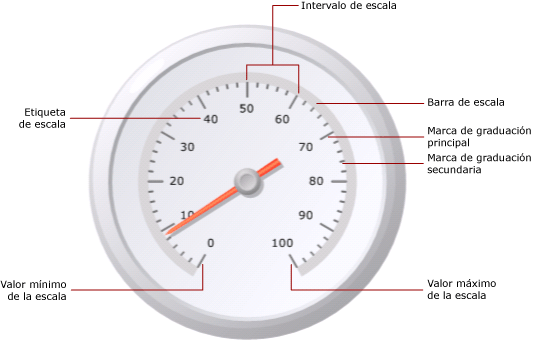
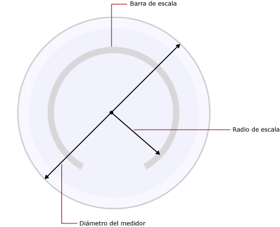

# Aplicar formato a las escalas de un medidor (Generador de informes y SSRS)
  En un informe paginado de [!INCLUDE[ssRSnoversion_md](../../includes/ssrsnoversion-md.md)] , la escala del medidor es el intervalo de números, comprendidos entre un mínimo y un máximo, que se muestran en un medidor. Normalmente, una escala del medidor contiene las etiquetas del medidor y las marcas de graduación que proporcionan una lectura precisa de lo que representa el puntero del medidor. Una escala del medidor generalmente está asociada a uno o más punteros del medidor. Puede haber más de una escala en el mismo medidor.  
  
   
  
 A diferencia del gráfico, donde se definen varios grupos, el medidor solo muestra un valor. Debe definir los valores mínimo y máximo de la escala. Los números del intervalo se calculan automáticamente en función de los valores mínimo y máximo especificados.  
  
 Cuando se agrega una segunda escala en un medidor que ya contiene una, las propiedades de aspecto de la primera escala se clonan en la segunda.  
  
 Para establecer las propiedades de la escala, haga clic con el botón derecho en las etiquetas de la escala o en las marcas de graduación y seleccione **Propiedades de escala radial** o **Propiedades de escala lineal**. Cada tipo de medidor contiene al menos una escala con el mismo conjunto de propiedades. También hay propiedades únicas para cada tipo de medidor:  
  
-   En un medidor radial, puede especificar el radio, el ángulo inicial y el ángulo de barrido de la escala radial.  
  
-   En un medidor lineal, puede especificar el ancho de los márgenes inicial y final en relación con los extremos del medidor.  
  
 Para empezar a usar rápidamente las escalas de formato, vea [Establecer un valor mínimo o máximo en un medidor &#40;Generador de informes y SSRS&#41;](../../reporting-services/report-design/set-a-minimum-or-maximum-on-a-gauge-report-builder-and-ssrs.md).  
  
##   Definir el mínimo, el máximo y los intervalos de una escala  
 Un medidor se suele usar para mostrar indicadores clave de rendimiento (KPI) que se miden en porcentajes de 0 a 100; por ello, estos son los valores predeterminados que se dan a las propiedades de valores mínimo y máximo del medidor. Sin embargo, es posible que estos valores no representen la escala de valores que está intentando mostrar. Dado que no hay ninguna lógica integrada para determinar lo que representa el campo de datos KPI, el medidor no calcula automáticamente los valores mínimo y máximo. Si los valores de un campo de datos KPI no están comprendidos entre 0 y 100, debe establecer explícitamente los valores para las propiedades de valores mínimo y máximo con objeto de dar contexto al valor que se muestra en el medidor.  
  
 En la escala se sitúan las marcas de graduación principales y secundarias. Además, la escala tiene etiquetas que suelen estar asociadas a las marcas de graduación principales. Por ejemplo, una escala podría tener marcas de graduación principales en los valores 0, 20, 40, 60, 80 y 100. Las etiquetas deberían corresponder a esas marcas de graduación. La diferencia entre los valores de las etiquetas se denomina intervalo de escala. En este ejemplo, el intervalo de escala está establecido en 20. Puede establecer la propiedad Intervalo en el cuadro de diálogo **Propiedades de escala radial** o **Propiedades de escala lineal** .  
  
 La aplicación calcula los intervalos de la escala mediante los pasos siguientes:  
  
1.  Especifique los valores mínimo y máximo. Estos valores no se calculan automáticamente en función del conjunto de datos, por lo que debe proporcionarlos en el cuadro de diálogo **Propiedades** del medidor.  
  
2.  Si no especifica ningún valor para el intervalo, el valor predeterminado es Automático. Esto significa que la aplicación calculará un número equidistante de intervalos basándose en los valores mínimo y máximo especificados en el primer paso. Si especifica un valor para el intervalo, el medidor calculará la diferencia entre el valor máximo y el mínimo, y dividirá ese número entre el valor especificado en la propiedad Intervalo.  
  
 También existen propiedades para definir los intervalos para las etiquetas y las marcas de graduación. Si especifica un valor para estas propiedades, se invalidará el valor especificado para la propiedad de intervalo de escala. Por ejemplo, si el intervalo de escala es Automático, pero especifica 4 para el intervalo de etiqueta, las etiquetas se mostrarán como 0, 4, 8 etc., pero el medidor seguirá calculando las marcas de graduación principales basándose en sus propios cálculos. Esto puede dar lugar a situaciones en las que las etiquetas no estén sincronizadas con las marcas de graduación. Considere la posibilidad de ocultar las marcas de graduación si establece un intervalo de etiqueta.  
  
 El desplazamiento del intervalo determina el número de unidades que se omitirán antes de que se muestre la primera etiqueta. Todas las marcas de graduación y etiquetas principales sucesivas que aparezcan en la escala utilizarán el intervalo especificado. El hecho de especificar un valor de 0 para los intervalos de etiquetas o las marcas de graduación es lo mismo que restablecer el intervalo a Automático.  
  
##   Reducir las colisiones de las etiquetas mediante multiplicadores  
 Si los valores contienen muchos dígitos, es posible que afecten a la legibilidad del medidor. Puede usar un multiplicador de escala para aumentar o reducir la escala de los valores. Cuando se especifica un multiplicador de escala, se multiplica por él cada valor original de la escala antes de mostrarlo en la escala. Para reducir la escala de los valores, debe especificar un número decimal. Por ejemplo, si la escala va de 0 a 10000, pero desea mostrar los números 0 a 10 en el medidor, puede usar un valor de multiplicador de 0,001.  
  
> [!NOTE]  
>  Cuando se usa un multiplicador, no se multiplica el valor real del campo de agregado que usa el medidor. Solo se multiplican los valores de las etiquetas mostradas en el medidor una vez definidos el mínimo, el máximo y los intervalos. Cuando use un multiplicador, considere la posibilidad de conservar el cálculo del intervalo como automático.  
  
##   Especificar el ancho de la barra de escala, el radio y los ángulos de una escala radial  
 Use la página **Diseño** del cuadro de diálogo **Propiedades de escala radial** para establecer el ancho de la barra de escala, el radio de escala, el ángulo inicial y ángulo de barrido de la escala. Puede usar estas propiedades para personalizar el tamaño y el formato de la escala. Por ejemplo, si coloca las etiqueta de la escala fuera de la misma, necesitará cambiar el tamaño del radio de la escala para que las etiquetas quepan dentro del medidor.  
  
> [!NOTE]  
>  Al hacer clic en la escala de un medidor, aparece un contorno punteado alrededor de la escala. Este contorno no es la barra de escala y no se usa al calcular las medidas en el medidor. Solo está disponible en tiempo de diseño para que se pueda resaltar la escala para tener acceso a las propiedades de escala.  
  
 Todas las medidas están basadas en la barra de escala. Cuando se selecciona un medidor, no se muestra el ancho de la barra de escala. Si especifica un valor para la barra de escala, le servirá de ayuda con todas las demás medidas relacionadas con la escala. Para ver la barra de escala, establezca en un valor mayor que 0 la propiedad **Ancho de la barra de escala** en la página **Diseño** del cuadro de diálogo **Propiedades de escala radial** . En un medidor radial, la barra de escala se mide como un porcentaje del diámetro del medidor. En un medidor lineal, la barra de escala se mide como un porcentaje del ancho o el alto del medidor, lo que sea más pequeño.  
  
 El radio de la escala es la distancia desde el centro del medidor a la mitad de la barra de escala. El valor del radio de la escala se mide como un porcentaje del diámetro del medidor. Es aconsejable mantener el radio de la escala por debajo de un valor de 35. Si especifica un valor mayor que 35, es posible que la escala se dibuje fuera de los límites del medidor. En la ilustración siguiente se muestra cómo se mide el radio de la escala, con relación al diámetro del medidor, en la barra de escala.  
  
   
  
 El ángulo inicial es el ángulo de giro, entre 0 y 360, en que comenzará la escala. La posición cero (0) se encuentra en la parte inferior del medidor y el ángulo inicial gira en el sentido de las agujas del reloj. Por ejemplo, un ángulo inicial de 90 grados inicia la escala en la posición de las 9 en punto.  
  
 El ángulo de barrido es el número de grados, entre 0 y 360, que la escala barrerá en un círculo. Un ángulo de barrido de 360 grados genera una escala que es un círculo completo. Esto es útil si desea diseñar un medidor que se parezca a un reloj.  
  
##   Colocar etiquetas en una escala lineal o radial  
 Hay dos propiedades que determinan la posición de las etiquetas. La propiedad de colocación de las etiquetas especifica si las etiquetas se muestran dentro, fuera o cruzadas en la barra de escala. La propiedad de distancia establece la distancia de la etiqueta a la escala, comenzando en la barra de escala. Si desea colocar las etiquetas dentro de la barra de escala, especifique un número negativo. Por ejemplo, si las etiquetas están fuera de la escala y ha establecido una distancia desde la escala de 10, las etiquetas se mostrarán 10 unidades más afuera de donde se colocarían normalmente, donde 1 unidad es:  
  
-   1% del diámetro del medidor en un medidor radial, o bien  
  
-   1% del alto o del ancho del medidor, el que sea más pequeño, en un medidor lineal.  
  
## Ver también  
 [Aplicar formato a los rangos de un medidor &#40;Generador de informes y SSRS&#41;](../../reporting-services/report-design/formatting-ranges-on-a-gauge-report-builder-and-ssrs.md)   
 [Aplicar formato a los punteros de un medidor &#40;Generador de informes y SSRS&#41;](../../reporting-services/report-design/formatting-pointers-on-a-gauge-report-builder-and-ssrs.md)   
 [Aplicar formato de fecha o de moneda a las etiquetas de los ejes &#40;Generador de informes y SSRS&#41;](../../reporting-services/report-design/format-axis-labels-as-dates-or-currencies-report-builder-and-ssrs.md)   
 [Aplicar formato a las etiquetas de los ejes de un gráfico &#40;Generador de informes y SSRS&#41;](../../reporting-services/report-design/formatting-axis-labels-on-a-chart-report-builder-and-ssrs.md)   
 [Medidores &#40;Generador de informes y SSRS&#41;](../../reporting-services/report-design/gauges-report-builder-and-ssrs.md)  
  
  
