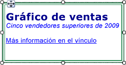

# Aplicar formato a texto y a marcadores de posición (Generador de informes y SSRS)
  Un cuadro de texto puede ser un elemento de informe o una celda individual de una región de datos que contiene texto, un campo calculado, un puntero a un campo de una base de datos, o una combinación de los tres elementos. Puede mezclar fuentes y colores, agregar los estilos negrita y cursiva, y usar estilos de párrafo como la alineación y las sangrías francesas. Puede dar formato a un cuadro de texto completo o a determinados números, expresiones, campos o cadenas de texto del cuadro de texto.  
  
 La fuente, el tamaño, el color y los efectos contribuyen a la legibilidad de un informe. Al texto de un cuadro de texto o de una región de datos se puede aplicar una fuente, un estilo de fuente, un tamaño de fuente y efectos de subrayado. De forma predeterminada, la fuente que se usa para los informes es Arial, 10 puntos, color negro. En los cuadros de diálogo **Cuadro de texto** y **Propiedades de texto** , puede especificar cómo deberá aparecer el texto cuando se represente el informe.  
  
   
  
 En esta ilustración, el propio cuadro de texto tiene un borde y todo el texto se encuentra en el mismo cuadro de texto, pero el texto tiene diferentes formatos.  
  
 Para empezar rápidamente, vea [Tutorial: Dar formato a texto &#40;Generador de informes&#41;](../../reporting-services/tutorial-format-text-report-builder.md).  
  
> [!NOTE]  
>  [!INCLUDE[ssRBRDDup](../../includes/ssrbrddup-md.md)]  
  
## Crear texto de marcador de posición en un cuadro de texto  
 Cuando se define una expresión simple o compleja dentro de un cuadro de texto, la representación resultante de esta expresión en la interfaz de usuario se conoce como *marcador de posición*. En un cuadro de texto, puede definir colores, fuentes, acciones y otros comportamientos de cualquier número de marcadores de posición o de secciones de texto.  
  
 El valor de un marcador de posición siempre es una expresión simple o compleja. Para agregar un marcador de posición a un cuadro de texto, puede crear una expresión mediante uno de los métodos siguientes:  
  
-   Arrastre un campo desde el panel **Datos de informe** y colóquelo en el cuadro de texto. Si arrastra la expresión hasta cualquier otro lugar del cuerpo del informe, se creará un nuevo cuadro de texto con el marcador de posición dentro de él. El valor de este marcador de posición será la expresión de campo correspondiente al campo que se quitó.  
  
-   Haga clic con el botón derecho en cualquier lugar del cuadro de texto y seleccione **Insertar marcador de posición**. En el cuadro de diálogo **Propiedades del marcador de posición** , puede especificar una expresión como el valor del marcador de posición. Para más información, vea [Cuadro de diálogo Propiedades del marcador de posición, General &#40;Generador de informes y SSRS&#41;](./text-boxes-report-builder-and-ssrs.md).  
  
-   Escriba cualquier expresión simple o compleja en el cuadro de texto. Por ejemplo, si escribe **Name: [Name]** en el cuadro de texto, el texto **[Name]** se mostrará como un marcador de posición que representa la expresión `=Fields!Name.Value`.  
  
-   En un cuadro de texto vacío, escriba una expresión que comience por un signo igual (=). Si saca el foco del cuadro de texto, la expresión resultante se convertirá en un marcador de posición que podrá editar. Si el cuadro de texto no está vacío, o si el signo igual se ha insertado en cualquier lugar que no sea el primer carácter del cuadro de texto, el signo igual se considerará un literal de cadena y no se creará ningún marcador de posición. Para más información sobre cómo definir expresiones simples y complejas, vea [Usar expresiones en informes &#40;Generador de informes y SSRS&#41;](../../reporting-services/report-design/expression-uses-in-reports-report-builder-and-ssrs.md).  
  
## Dar formato a los marcadores de posición y al texto estático de un cuadro de texto  
 Puede dar formato a los marcadores de posición con el cuadro de diálogo **Propiedades del marcador de posición** . Solo puede dar formato al marcador de posición completo, no a sus secciones. Si desea ver la expresión subyacente, puede pausar el puntero en el marcador de posición. Para cambiar la expresión subyacente, puede hacer doble clic en el marcador de posición o puede hacer clic con el botón derecho en el marcador de posición y seleccionar **Propiedades del marcador de posición**. También puede especificar una etiqueta de interfaz de usuario con la propiedad **Label** de **General** en el cuadro de diálogo **Propiedades del marcador de posición** . Este será el texto que se mostrará para el marcador de posición en tiempo de diseño.  
  
   
  
 En esta ilustración, un cuadro de texto de una lista contiene una etiqueta con formato de negrita y un marcador de posición sin formato.  
  
 A diferencia del texto de un marcador de posición, puede alinear por separado cadenas de texto individuales de un cuadro de texto, usar varios párrafos dentro de un cuadro de texto y definir otros comportamientos de cualquier subconjunto de texto.  
  
 Puede definir colores, fuentes, acciones y otros comportamientos de cualquier subconjunto de texto de un cuadro de texto y crear así una combinación de correspondencia o una plantilla para el texto del informe. También puede usar varios párrafos dentro de un mismo cuadro de texto. Por ejemplo, si tiene dos párrafos de texto independientes, puede separarlos presionando ENTRAR en el cuadro de texto. También puede establecer un valor de alineación para cualquier cadena de texto individual. Además, puede definir una acción para las distintas cadenas de texto de un cuadro de texto. Esto puede resultar útil si desea agregar un hipervínculo para una cadena de texto de un cuadro de texto.  
  
> [!NOTE]  
>  Las acciones definidas en el cuadro de texto tienen una prioridad más alta que las acciones definidas para una cadena de texto individual de un cuadro de texto.  
  
 Para más información sobre el formato mixto, vea [Dar formato al texto en un cuadro de texto &#40;Generador de informes y SSRS&#41;](../../reporting-services/report-design/format-text-in-a-text-box-report-builder-and-ssrs.md).  
  
## Alinear texto horizontal con General  
 En **Alineación** , en el cuadro de diálogo **Propiedades de cuadro de texto** , puede especificar cómo se debe alinear el texto horizontalmente. Si no especifica un valor para la alineación, el valor predeterminado será **Predeterminado**. Esto significa que el texto se alinea en función del tipo de campo del valor del marcador de posición. Si especifica una expresión que se evalúa como un valor que no es de cadena, es decir, no es un número, el texto se alinea a la derecha. Si la expresión se evalúa como un valor de cadena, como por ejemplo un número, el texto se alinea a la izquierda.  
  
## Consulte también  
 [Expresiones &#40;Generador de informes y SSRS&#41;](../../reporting-services/report-design/expressions-report-builder-and-ssrs.md)   
 [Aplicar formato a las etiquetas de los ejes de un gráfico &#40;Generador de informes y SSRS&#41;](../../reporting-services/report-design/formatting-axis-labels-on-a-chart-report-builder-and-ssrs.md)   
 [Aplicar formato a las escalas de un medidor &#40;Generador de informes y SSRS&#41;](../../reporting-services/report-design/formatting-scales-on-a-gauge-report-builder-and-ssrs.md)   
 [Tablas, matrices y listas &#40;Generador de informes y SSRS&#41;](../../reporting-services/report-design/tables-matrices-and-lists-report-builder-and-ssrs.md)   
 [Cuadro de diálogo Propiedades del marcador de posición, General &#40;Generador de informes y SSRS&#41;](./text-boxes-report-builder-and-ssrs.md)   
 [Exportar a Microsoft Excel &#40;Generador de informes y SSRS&#41;](../../reporting-services/report-builder/exporting-to-microsoft-excel-report-builder-and-ssrs.md)   
 [Cuadros de texto &#40;Generador de informes y SSRS&#41;](../../reporting-services/report-design/text-boxes-report-builder-and-ssrs.md)  
  
