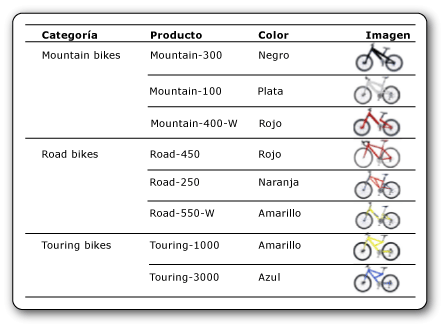

# Imágenes (Generador de informes y SSRS)
  Una imagen es un elemento de informe que contiene una referencia a una imagen incrustada en el informe, o almacenada en una base de datos, en el servidor de informes o en cualquier lugar de Internet. Una imagen puede ser una imagen que se repite con filas de datos. También se puede utilizar una imagen como fondo para determinados elementos del informe.  
  
 Almacenar los logotipos en un servidor es una buena idea porque puede utilizar el mismo logotipo en muchos informes.  
  
> [!NOTE]  
>  [!INCLUDE[ssRBRDDup](../../includes/ssrbrddup-md.md)]  
  
##   Comparar imágenes externas, incrustadas y enlazadas a datos  
 Al utilizar una imagen que está en un servidor o en una ubicación externa, el elemento de imagen contiene una ruta de acceso que señala a una imagen del servidor de informes o de su ubicación en Internet. No obstante, si se utiliza una imagen incrustada, los datos de dicha imagen se almacenan en la definición de informe y no existe en este caso un archivo independiente.  
  
 Las imágenes basadas en servidor están especialmente indicadas para los logotipos e imágenes estáticas que comparten varios informes o páginas web. Las imágenes incrustadas, por su parte, garantizan una disponibilidad permanente en el informe, pero no se pueden compartir. Las definiciones de informe con imágenes externas son más pequeñas que las definiciones con imágenes incrustadas.  
  
 También se pueden mostrar imágenes enlazadas a datos a partir de datos binarios almacenados en una base de datos. Por ejemplo, las imágenes que aparecen junto a los nombres de producto de una lista de productos son imágenes de base de datos. En la siguiente imagen, las imágenes de bicicletas están almacenadas en una base de datos y se recuperan en el informe para ilustrar cada producto.  
  
   
  
  
##   Imágenes como elementos de informe  
 Puede guardar imágenes por separado de un informe como elementos de informe. [!INCLUDE[ssRBrptparts](../../includes/ssrbrptparts-md.md)]  
  
  
##   Incrustar imágenes  
 Se pueden incrustar imágenes en un informe de manera que todos los datos de imagen se almacenen en la definición de informe. Cuando se incrusta una imagen, esta se codifica como MIME y se almacena como texto en la definición de informe. El uso de imágenes incrustadas garantiza su disponibilidad permanente en el informe, pero también aumenta el tamaño de la definición de informe.  
  
 Para obtener más información sobre cómo insertar una imagen, vea [Incrustar una imagen en un informe &#40;Generador de informes y SSRS&#41;](../../reporting-services/report-design/embed-an-image-in-a-report-report-builder-and-ssrs.md).  
  
  
##   Imágenes externas  
 Puede incluir imágenes almacenadas en un informe especificando una dirección URL para la imagen. Cuando se utiliza una imagen externa en un informe, el origen de la imagen se establece en **External** y el valor de la imagen es su dirección URL o ruta de acceso.  
  
 Para más información, vea [Especificar las rutas de acceso a los elementos externos &#40;Generador de informes y SSRS&#41;](../../reporting-services/report-design/specifying-paths-to-external-items-report-builder-and-ssrs.md).  
  
 Cuando el informe se ejecuta en el Generador de informes o en el Diseñador de informes, la vista previa usa las credenciales del usuario para mostrar la imagen. Cuando el informe se ejecuta en el servidor de informes, no se puede mostrar la imagen del informe si las credenciales del servidor no son suficientes para tener acceso a la imagen. En ese caso, póngase en contacto con su administrador del sistema.  
  
 Para obtener más información sobre cómo agregar una imagen externa a un informe, vea [Agregar una imagen externa &#40;Generador de informes y SSRS&#41;](../../reporting-services/report-design/add-an-external-image-report-builder-and-ssrs.md).  
  
  
##   Imágenes de fondo  
 Puede utilizarse una imagen como imagen de fondo en el cuerpo del informe o en el interior de un rectángulo, cuadro de texto, lista, matriz o tabla. Las imágenes de fondo tienen propiedades similares a las de las demás imágenes. También es posible especificar el modo de repetición de una imagen para rellenar el fondo de un elemento.  
  
> [!NOTE]  
>  Algunas extensiones de representación, como la extensión de representación en HTML, representan la imagen de fondo del cuerpo del informe en el cuerpo, el encabezado de página y el pie de página. Se puede definir una imagen de fondo diferente para el encabezado y pie de página, pero, si no se define ninguna, el informe usa la imagen de fondo del cuerpo. Otras extensiones de representación, como la extensión de representación en imágenes, no representan la imagen de fondo del cuerpo en el encabezado y pie de página.  
  
 Para obtener más información sobre cómo agregar una imagen de fondo, vea [Agregar una imagen de fondo &#40;Generador de informes y SSRS&#41;](../../reporting-services/report-design/add-a-background-image-report-builder-and-ssrs.md).  
  
  
##   Imágenes enlazadas a datos  
 Es posible agregar imágenes almacenadas en una base de datos a los informes. Se puede usar el mismo elemento de informe de imagen que para las imágenes estáticas, pero con un conjunto de propiedades que indica que la imagen está almacenada en una base de datos. Para obtener instrucciones sobre cómo trabajar con imágenes enlazadas a datos, vea [Agregar una imagen enlazada a datos &#40;Generador de informes y SSRS&#41;](../../reporting-services/report-design/add-a-data-bound-image-report-builder-and-ssrs.md).  
  
  
##   Temas de procedimientos  
 [Agregar una imagen externa &#40;Generador de informes y SSRS&#41;](../../reporting-services/report-design/add-an-external-image-report-builder-and-ssrs.md)  
  
 [Incrustar una imagen en un informe &#40;Generador de informes y SSRS&#41;](../../reporting-services/report-design/embed-an-image-in-a-report-report-builder-and-ssrs.md)  
  
 [Agregar una imagen de fondo &#40;Generador de informes y SSRS&#41;](../../reporting-services/report-design/add-a-background-image-report-builder-and-ssrs.md)  
  
 [Agregar una imagen enlazada a datos &#40;Generador de informes y SSRS&#41;](../../reporting-services/report-design/add-a-data-bound-image-report-builder-and-ssrs.md)  
  
  
## Vea también  
 [Exportar a un archivo de imagen &#40;Generador de informes y SSRS&#41;](../../reporting-services/report-builder/exporting-to-an-image-file-report-builder-and-ssrs.md)   
 [Comportamientos de representación &#40; El generador de informes y SSRS &#41;](../../reporting-services/report-design/rendering-behaviors-report-builder-and-ssrs.md)  
  
  
