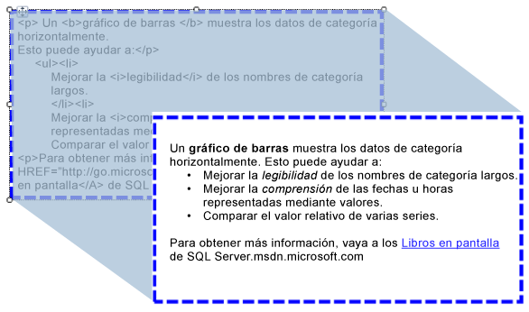

# Importar HTML en un informe (Generador de informes y SSRS)
  Se puede usar un cuadro de texto para insertar en un informe texto con formato HTML recuperado de un campo de conjunto de datos. El texto puede proceder de cualquier expresión simple o compleja que se evalúe como HTML con un formato correcto. El texto con formato se puede representar en todos los formatos de salida compatibles, incluso PDF.  
  
   
  
 Esta ilustración se muestra texto con formato HTML en la vista de diseño de informe y el mismo texto como se representa cuando se ejecuta el informe.  
  
> [!NOTE]  
>  Cuando se importa texto que contiene marcado HTML, el cuadro de texto siempre debe analizar los datos en primer lugar. Dado que solo se admite un subconjunto de etiquetas HTML, el HTML que se muestra en el informe representado puede diferir del HTML original.  
  
 Para más información, vea [Tutorial: Dar formato a texto &#40;Generador de informes&#41;](../../reporting-services/tutorial-format-text-report-builder.md).  
  
> [!NOTE]  
>  [!INCLUDE[ssRBRDDup](../../includes/ssrbrddup-md.md)]  
  
## Etiquetas HTML compatibles  
 La lista siguiente es una lista completa de las etiquetas que se representarán como HTML cuando se definan como texto de marcador de posición:  
  
-   Hipervínculos: \<un HREF >  
  
-   Fuentes: \<fuente >  
  
-   Encabezado, estilo y elementos de bloque: \<H {n} >, \
, \<intervalo >,\
, \
, \<LI >, \<HN >  
  
-   Formato de texto: \<B >, \<I >, \<U >, \<S >  
  
-   Control de listas: \<OL >, \<UL >, \<LI >  
  
 Cualquier otra etiqueta de marcado HTML se omitirá durante el procesamiento del informe. Si el HTML representado por la expresión en el texto del marcador de posición no está bien formado, el marcador de posición se representa como texto simple. Todas las etiquetas HTML distinguen entre mayúsculas y minúsculas.  
  
 Si el texto del cuadro de texto contiene solo un bloque de texto, cualquier HTML del marcador de posición que defina elementos de bloque se representará correctamente. Sin embargo, si el cuadro de texto tiene varios bloques de texto, se omitirán las etiquetas HTML y los bloques de texto definirán la estructura del texto.  
  
 Si se definen varias etiquetas para el texto, y [!INCLUDE[ssRSnoversion](../../includes/ssrsnoversion-md.md)] detecta un conflicto entre las restricciones del HTML y del informe existente, solo se considerará HTML la etiqueta HTML más interna.  
  
 Para más información, vea [Agregar HTML a un informe &#40;Generador de informes y SSRS&#41;](../../reporting-services/report-design/add-html-into-a-report-report-builder-and-ssrs.md).  
  
## Limitaciones de los atributos de las hojas de estilos en cascada  
 Cuando se usan atributos de hoja de estilos en cascada (CSS), solo se define un conjunto básico de etiquetas. La lista siguiente es una lista de los atributos admitidos:  
  
-   text-align, text-indent  
  
-   font-family  
  
-   tamaño de fuente  
  
    -   Solo se admiten valores válidos de tamaño RDL, en unidades de longitud CSS absolutas. Las unidades admitidas son: pda, cm, mm, pt y pc.  
  
    -   Las unidades de longitud de CSS relativas se pasan por algo y no se admiten. Las unidades no admitidas son em, ex, px,%,rem.  
  
     Para más información sobre las unidades de CSS, vea [CSS Values and Units Reference (Referencia de unidades y valores de CSS)](http://msdn.microsoft.com/library/ms531211\(VS.85\).aspx) (http://msdn.microsoft.com/library/ms531211(VS.85).aspx).  
  
-   color  
  
-   padding, padding-bottom, padding-top, padding-right, padding-left  
  
-   font-weight  
  
 Estas son algunas consideraciones sobre el uso de CSS:  
  
-   Los valores de CSS incorrectos se omiten de la misma manera que se omite el HTML incorrecto.  
  
-   Cuando en una misma etiqueta hay un atributo y atributos de estilo CSS, la propiedad de CSS tiene una prioridad más alta. Por ejemplo, si el texto es  **\<estilo p = "Alinear texto: derecha" align = "left" >**, se aplicarán únicamente el atributo Text-align y el texto estará alineado a la derecha.  
  
-   Para los atributos y los estilos CSS, si una propiedad se especifica más de una vez, solo se aplica la última instancia de la propiedad. Por ejemplo, si el texto es  **\
**, el texto estará alineado a la derecha.  
  
## Vea también  
 [Representar en HTML &#40;Generador de informes y SSRS&#41;](../../reporting-services/report-builder/rendering-to-html-report-builder-and-ssrs.md)  
  
  
