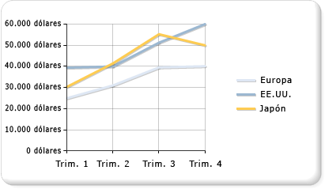

# Gráficos de líneas (Generador de informes y SSRS)
  Los gráficos de líneas muestran una serie como un conjunto de puntos conectados mediante una sola línea. Los gráficos de líneas se usan para representar grandes cantidades de datos que tienen lugar durante un período continuado de tiempo. Para obtener más información sobre cómo agregar datos a un gráfico de líneas, vea [Gráficos &#40;Generador de informes y SSRS&#41;](../../reporting-services/report-design/charts-report-builder-and-ssrs.md).  
  
 La ilustración siguiente muestra un gráfico de líneas que contiene tres series.  
  
   
  
> [!NOTE]  
>  [!INCLUDE[ssRBRDDup](../../includes/ssrbrddup-md.md)]  
  
## Variaciones  
  
-   **Línea suavizada**. Gráfico de líneas que usa una línea curva en lugar de una línea normal.  
  
-   **Línea escalonada**. Gráfico de líneas que usa una línea escalonada en lugar de una línea normal. La línea escalonada conecta puntos mediante una línea que adopta la apariencia de los peldaños de una escalera.  
  
-   **Gráficos sparkline**. Variaciones del gráfico de líneas que muestran solo la serie de líneas en la celda de una tabla o una matriz. Para obtener más información, vea [Minigráficos y barras de datos &#40;Generador de informes y SSRS&#41;](../../reporting-services/report-design/sparklines-and-data-bars-report-builder-and-ssrs.md).  
  
## Consideraciones sobre los datos para los gráficos de líneas  
  
-   Para mejorar el impacto visual del gráfico de líneas predeterminado, considere la posibilidad de cambiar el ancho del borde de la serie a 3 y agregar un desplazamiento de sombra de 1. Esto creará un gráfico de líneas mucho más oscuro. Deberá revertir estas propiedades a sus valores originales si cambia el tipo de gráfico de Línea por otro.  
  
-   Si el conjunto de datos incluye valores vacíos, el gráfico de líneas agregará puntos vacíos en forma de líneas de marcador de posición para mantener la continuidad en el gráfico. Si no desea ver estas líneas, considere la posibilidad de mostrar el conjunto de datos usando un tipo de gráfico no contiguo, como un gráfico de barras o de columnas.  
  
-   Un gráfico de líneas requiere al menos dos puntos para dibujar una línea.  Si el conjunto de datos solo tiene un punto de datos, el gráfico de líneas se mostrará como un marcador de punto de datos único.  
  
-   Una serie que se dibuja como una línea no ocupará mucho espacio dentro de un área de gráfico.  Por este motivo, los gráficos de líneas se combinan con frecuencia con otros tipos de gráficos, como los gráficos de columnas. Sin embargo, no se puede combinar un gráfico de líneas con los tipos de gráficos siguientes: Barras, Polar, Circular o de formas.  
  
## Ver también  
 [Gráficos de barras &#40;Generador de informes y SSRS&#41;](../../reporting-services/report-design/bar-charts-report-builder-and-ssrs.md)   
 [Gráficos de columnas &#40;Generador de informes y SSRS&#41;](../../reporting-services/report-design/column-charts-report-builder-and-ssrs.md)   
 [Gráficos &#40;Generador de informes y SSRS&#41;](../../reporting-services/report-design/charts-report-builder-and-ssrs.md)   
 [Tipos de gráficos &#40;Generador de informes y SSRS&#41;](../../reporting-services/report-design/chart-types-report-builder-and-ssrs.md)   
 [Gráficos de áreas &#40;Generador de informes y SSRS&#41;](../../reporting-services/report-design/area-charts-report-builder-and-ssrs.md)   
 [Puntos de datos vacíos y nulos en los gráficos &#40;Generador de informes y SSRS&#41;](../../reporting-services/report-design/empty-and-null-data-points-in-charts-report-builder-and-ssrs.md)   
 [Gráficos &#40;Generador de informes y SSRS&#41;](../../reporting-services/report-design/charts-report-builder-and-ssrs.md)  
  
  
