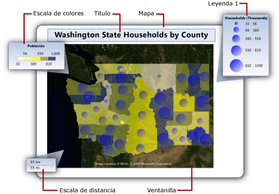
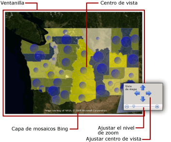
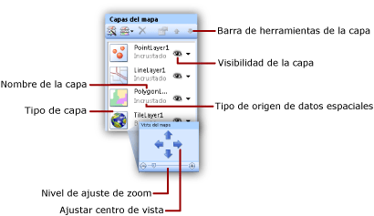

# Mapas (Generador de informes y SSRS)
  Para visualizar datos comerciales con un fondo geográfico, puede agregar un mapa a un informe paginado de [!INCLUDE[ssRSnoversion_md](../../includes/ssrsnoversion-md.md)] . El tipo de mapa que seleccione dependerá de qué información desee comunicar en el informe. Puede agregar un mapa que solo muestre las ubicaciones, un mapa de burbujas que varíe el tamaño de la burbuja en función del número de casas de un área, un mapa de marcadores que varíe el estilo de marcador según el producto más rentable de cada almacén o un mapa de líneas que muestre las rutas entre los almacenes.  
  
 Un mapa contiene un título, una ventanilla que especifica el punto central y la escala, un fondo de mosaico de Bing Maps opcional para la ventanilla, una o más capas que muestran los datos espaciales y diversas leyendas que ayudan a los usuarios a interpretar las visualizaciones de datos. La ilustración siguiente muestra las partes básicas de un mapa.  
  
   
  
 Para empezar a usar un mapa inmediatamente, consulte el [Tutorial: Informe de asignaciones &#40;Generador de informes&#41;](../../reporting-services/tutorial-map-report-report-builder.md) o [Report Samples (Report Builder and SSRS)](https://go.microsoft.com/fwlink/?LinkId=198283) (Ejemplos de informes [Generador de informes y SSRS]).  
  
> [!NOTE]  
>  Puede guardar los mapas de forma independiente de un informe como elementos de informe. Para más información, vea [Elementos de informe](../../reporting-services/report-design/report-parts-report-builder-and-ssrs.md).  
  
##   Agregar un mapa al informe  
 Para agregar un mapa a un informe, a continuación se enumeran los pasos generales que hay que seguir:  
  
-   Determine qué datos analíticos desea mostrar y qué tipos de datos espaciales necesita. Por ejemplo, para mostrar el almacén anual relativo de ventas en un mapa de burbujas, necesita el nombre y las ventas del almacén para los datos analíticos, y el nombre y la ubicación del almacén con la latitud y la longitud para los datos espaciales.  
  
-   Decida el estilo de mapa que desea. Los mapas básicos solo muestran las ubicaciones. Los mapas de burbujas varían el tamaño de las burbujas según un único valor analítico. Los mapas de colores analíticos varían los elementos de los mapas en función de los intervalos de datos analíticos. El estilo que seleccione dependerá tanto de los datos que desee visualizar como del tipo de datos espaciales que use.  
  
-   Recopile la información que debe tener para especificar los orígenes de datos espaciales, datos espaciales, orígenes de datos analíticos y datos analíticos. Esto incluye las cadenas de conexión a los orígenes de datos espaciales, que especifican el tipo de datos espaciales necesarios y garantizan que los datos del informe incluyen los campos coincidentes que asocian los datos espaciales y los datos analíticos.  
  
-   Ejecute el Asistente para mapas para agregar una asignación al informe. Así se agrega la primera capa de mapa al mapa. Ejecute el asistente para capas de mapa para crear otras capas o modificar las existentes. Los asistentes permiten comenzar fácilmente. Para obtener más información, vea [Asistente para mapas y Asistente para capas de mapa &#40;Generador de informes y SSRS&#41;](../../reporting-services/report-design/map-wizard-and-map-layer-wizard-report-builder-and-ssrs.md).  
  
-   Después de obtener una vista previa del mapa en el informe, probablemente deseará ajustar la vista del mapa, cambiar la manera en que los datos varían la presentación de cada capa, proporcionar leyendas para ayudar a los usuarios a interpretar los datos y ajustar la resolución para proporcionar una experiencia de visualización satisfactoria para los usuarios.  
  
 Para obtener más información, vea [Planear un informe de mapa &#40;Generador de informes y SSRS&#41;](../../reporting-services/report-design/plan-a-map-report-report-builder-and-ssrs.md).  
  
##   Agregar datos a un mapa  
 Un mapa utiliza dos tipos de datos: espaciales y analíticos. Los datos espaciales definen la apariencia del mapa, mientras que los datos analíticos proporcionan los valores asociados al mapa. Por ejemplo, los datos espaciales definen las ubicaciones de las ciudades de un área mientras que los datos analíticos proporcionan la población de cada ciudad.  
  
 Un mapa debe tener datos espaciales; los datos analíticos son opcionales. Por ejemplo, puede agregar un mapa que muestre simplemente las ubicaciones de los almacenes de una ciudad.  
  
 Para visualizar los datos de un mapa, los datos analíticos y los datos espaciales deben tener una relación. Cuando los datos espaciales y los datos analíticos proceden del mismo origen, la relación se conoce. Cuando proceden de orígenes diferentes, debe especificar campos coincidentes para relacionarlos.  
  
### Datos espaciales  
 Los datos espaciales están compuestos de conjuntos de coordenadas. Los datos espaciales de un origen de datos pueden ser un único punto, varios puntos, una única línea, varias líneas o un conjunto de polígonos. Cada conjunto de coordenadas define un *elemento de mapa*, por ejemplo, un polígono que representa el contorno de un condado, una línea que representa un camino o un punto que representa la ubicación de una ciudad.  
  
 Los datos espaciales se basan en uno de los sistemas de coordenadas siguientes:  
  
-   **Geográfico** Especifica las coordenadas geodésicas en una superficie esférica utilizando la longitud y la latitud. Cuando los datos espaciales son geográficos, se debe especificar una proyección. Una proyección es un conjunto de reglas que especifica cómo dibujar los objetos que tienen coordenadas esféricas en una superficie planar. Solo se pueden comparar o combinar los datos geográficos con la misma proyección.  
  
-   **Planar** Especifica las coordenadas geométricas en una superficie planar utilizando X e Y.  
  
 Cada capa de mapa muestra un tipo de datos espaciales: polígonos, líneas o puntos. Para mostrar varios tipos de datos espaciales, agregue varias capas al mapa. También puede agregar una capa de mosaico de Microsoft Bing Maps. La capa de mosaico no depende de los datos espaciales. La capa de mosaico muestra los mosaicos de la imagen que corresponden a las coordenadas de la ventanilla de mapa.  
  
#### Orígenes de datos espaciales  
 Se admiten los orígenes siguientes de datos espaciales:  
  
-   **Informes de la Galería de mapas.** Los datos espaciales se incrustan en los informes que se encuentran en la galería de mapas. De forma predeterminada, la Galería de mapas se instala en *\<unidad>*:\Archivos de programa\Microsoft SQL Server\Report Builder\MapGallery.  
  
    > [!NOTE]  
    >  Esta característica de mapas de [!INCLUDE[ssRSnoversion](../../includes/ssrsnoversion-md.md)] usa los datos de archivos de forma TIGER/Line que se proporcionan por cortesía de la Oficina del censo estadounidense ([https://www.census.gov/](https://www.census.gov/)). Los archivos de forma TIGER/Line son un extracto de información geográfica y cartográfica seleccionada de la base de datos MAF/TIGRE del Censo. Los archivos de forma TIGER/Line están disponibles sin cargo en la Oficina del censo estadounidense. Para obtener más información acerca de los archivos de forma TIGER/Line, visite [https://www.census.gov/geo/www/tiger](https://www.census.gov/geo/www/tiger). La información de fronteras de los archivos de forma TIGER/Line está destinada únicamente para la recopilación de datos estadísticos y tabulación; su representación y designación para fines estadísticos no constituye ninguna determinación de autoridad jurisdiccional ni derechos de propiedad ni de titularidad, y no son descripciones legales de territorios. Census TIGER and TIGER/Line son marcas registradas de la Oficina del censo estadounidense.  
  
-   **Archivos de forma ESRI.** Los archivos de forma ESRI contienen datos que cumplen con el formato de datos espaciales de los archivos de forma del Environmental Systems Research Institute, Inc. (ESRI). Hacen referencia a un conjunto de archivos. Los datos del archivo .shp especifican las formas geográficas o geométricas. Los datos del archivo .dbf proporcionan los atributos para las formas. Para ver un mapa en la vista de diseño o ejecutar un mapa desde el servidor de informes, ambos archivos deben estar en la misma carpeta. Al agregar los datos espaciales de un archivo .shp al sistema de archivos local, los datos espaciales se incrustan en el informe. Para recuperar los datos espaciales de forma dinámica en tiempo de ejecución, cargue los archivos de forma en el servidor de informes y especifíquelos como el origen de los datos espaciales. Para obtener más información, vea [Buscar archivos de forma ESRI para un mapa](https://go.microsoft.com/fwlink/?linkid=178814).  
  
-   **Datos espaciales de SQL Server almacenados en una base de datos.** Puede usar una consulta que especifique los tipos de datos **SQLGeometry** o **SQLGeography** de una base de datos relacional de [!INCLUDE[ssNoVersion](../../includes/ssnoversion-md.md)] . Para obtener más información, vea [Información general de los tipos de datos espaciales](../../relational-databases/spatial/spatial-data-types-overview.md).  
  
     En el conjunto de resultados que ve en el diseñador de consultas, cada fila de datos espaciales se trata como una unidad y se almacena en un único elemento de mapa. Por ejemplo, si hay varios puntos que se definen en una fila en el conjunto de resultados, las propiedades de presentación se aplican a todos los puntos de ese elemento de mapa.  
  
-   **Ubicaciones personalizadas que crea.** Puede agregar manualmente ubicaciones como puntos incrustados a una capa de puntos incrustados. Para obtener más información, vea [Agregar ubicaciones personalizadas a un mapa &#40;Generador de informes y SSRS&#41;](../../reporting-services/report-design/add-custom-locations-to-a-map-report-builder-and-ssrs.md).  
  
#### Datos espaciales en la vista de diseño  
 En la vista de diseño, el procesador de informes muestra datos espaciales de ejemplo para ayudarle a diseñar la capa de mapa. Los datos que ve dependen de la disponibilidad de los datos espaciales:  
  
-   **Datos incrustados.** Los datos de ejemplo se recuperan de los elementos de mapa incrustados en las capas de mapa del informe.  
  
-   **Vínculo al archivo de forma ESRI.** Si el archivo de forma (.shp) ESRI y el archivo auxiliar (.dbf) están disponibles, los datos de ejemplo se cargan desde el archivo de forma. De lo contrario, el procesador de informes genera los datos de ejemplo y muestra el mensaje **No hay datos espaciales disponibles**.  
  
-   **Datos espaciales de SQL Server.** Si el origen de datos está disponible y las credenciales son válidas, los datos de ejemplo se cargan desde los datos espaciales de la base de datos. De lo contrario, el procesador de informes genera los datos de ejemplo y muestra el mensaje **No hay datos espaciales disponibles**.  
  
#### Incrustar datos espaciales en la definición de informe  
 A diferencia de lo que ocurre con los datos analíticos, dispone de la opción de incrustar los datos espaciales para una capa de mapa en la definición de informe. Al incrustar los datos espaciales, incrusta los elementos de mapa que se utilizan en la capa de mapa.  
  
 Los elementos incrustados aumentan el tamaño de la definición de informe pero garantizan que los datos espaciales siempre están disponibles cuando se ejecuta el informe, ya sea en la vista previa o en el servidor de informes. Más datos implican más almacenamiento y tiempos de proceso más largos. Siempre es aconsejable limitar los datos espaciales, además de otros datos del informe, simplemente a la información necesaria para el informe.  
  
#### Controlar la resolución de mapa en tiempo de ejecución  
 Al cambiar la resolución de los datos espaciales, está especificando el grado de detalle con que desea que las líneas se dibujen en un mapa. Por ejemplo, para las áreas, ¿necesita una granularidad de hasta cientos de metros del área terrestre o con unas pocas millas estarían suficientemente detalladas?  
  
 Si los datos espaciales se incrustan en el informe, la resolución que utilice afectará al número de elementos de mapa de la definición de informe. Una resolución más alta aumenta el número de elementos que se necesitan para dibujar los bordes en esa resolución. Si los datos espaciales no se incrustan en el informe, el servidor de informes calcula las líneas que se requieren para dibujar los bordes en esa resolución cada vez que se vea el informe. Para diseñar un informe que equilibre la resolución de la pantalla y un tiempo de representación del informe aceptable, simplifique la resolución de mapa al grado de detalle que necesite en el informe para visualizar los datos analíticos.  
  
### Datos analíticos  
 Los datos analíticos son los que desea visualizar en el mapa, por ejemplo, la población de una ciudad o el total de ventas de un almacén. Pueden proceder de alguno de los orígenes siguientes:  
  
-   **Campo de conjunto de datos.** Campo de un conjunto de datos del panel Datos de informe.  
  
-   **Campo de origen de datos espacial.** Campo del origen de datos espacial que se incluye con los datos espaciales. Por ejemplo, un archivo de forma ESRI suele incluir tanto datos espaciales como datos analíticos. Los nombres de campo del origen de datos espaciales comienza con # y aparece en la lista desplegable de campos cuando se especifica el campo de datos para las reglas de una capa.  
  
-   **Datos incrustados para un elemento de mapa.** Después de incrustar polígonos, líneas o puntos en un informe, puede invalidar los campos de datos para elementos de mapa individuales y establecer valores personalizados.  
  
 Al especificar las reglas para una capa y seleccionar el campo de datos analíticos, si el tipo de datos es numérico, el procesador de informes usa automáticamente la función Sum predeterminada para calcular los valores de agregado para el elemento de mapa. Si el campo no es numérico, no se especifica ninguna función de agregado y se usa la función de agregado implícita First. Para cambiar la expresión predeterminada, cambie las opciones de las reglas de la capa. Para obtener más información, vea [Variar la presentación de polígonos, líneas y puntos usando reglas y datos analíticos &#40;Generador de informes y SSRS&#41;](../../reporting-services/report-design/vary-polygon-line-and-point-display-by-rules-and-analytical-data.md).  
  
### Campos coincidentes  
 Para relacionar los datos analíticos con los elementos de mapa en una capa, debe especificar los *campos coincidentes*. Los campos coincidentes se utilizan para generar una relación entre los elementos de mapa y los datos analíticos. Puede utilizar uno o varios campos con los que buscar una coincidencia siempre que especifiquen un valor analítico único para cada ubicación espacial.  
  
 Por ejemplo, para un mapa de burbujas que varíe el tamaño de burbuja según la población de la ciudad, se requieren los datos siguientes:  
  
-   Del origen de datos espaciales:  
  
    -   **Datos espaciales.** Campo con datos espaciales que especifica la latitud y longitud de la ciudad.  
  
    -   **Nombre.** Campo que contiene el nombre de la ciudad.  
  
    -   **Área.** Campo que contiene el nombre de la región.  
  
-   Del origen de datos analíticos:  
  
    -   **Población.** Campo que contiene la población de la ciudad.  
  
    -   **Ciudad.** Campo que contiene el nombre de la ciudad.  
  
    -   **Área.** Campo que contiene el nombre del territorio, estado o región.  
  
 En este ejemplo, el nombre de la ciudad por sí solo no es suficiente para identificar la población de forma unívoca. Por ejemplo, hay muchas ciudades denominadas Albany en los Estados Unidos. Para denominar una ciudad concreta, debe especificar el área además del nombre de la ciudad.  
  
##   Descripción de la ventanilla de mapa  
 Después de especificar los datos de un mapa para un informe, puede limitar el área de presentación del mapa especificando una *ventanilla*del mapa. De forma predeterminada, la ventanilla es la misma área que todo el mapa. Para recortar el mapa, puede especificar el centro, el nivel de zoom y las coordenadas máxima y mínima que definen el área que desea incluir en el informe. Para mejorar la presentación del mapa en el informe, puede mover las leyendas, escala de distancia y escala de colores fuera de la ventanilla. La figura siguiente muestra una ventanilla:  
  
   
  
##   Agregar una capa de mosaico de Bing Map  
 Puede agregar una capa para los mosaicos de Bing Maps que proporcione un fondo geográfico para la vista del mapa actual tal y como se define en la ventanilla. Para agregar una capa de mosaico, debe especificar el sistema de coordenadas **geográfico** y el tipo de proyección **Mercator**. Los mosaicos que coinciden con el centro de la ventanilla y el nivel de zoom que selecciona se recuperan automáticamente en Servicios web de Bing Maps.  
  
 Puede personalizar la capa mediante las siguientes opciones:  
  
-   Tipo de mosaico. Se admiten los estilos siguientes:  
  
    -   **Carretera.** Muestra un estilo de mapa de carreteras que tiene un fondo blanco, caminos y texto de etiqueta.  
  
    -   **Aéreo.** Muestra un estilo de imagen aérea sin texto.  
  
    -   **Híbrido.** Muestra una combinación de los estilos **Carretera** y **Aéreo** .  
  
-   Idioma del texto de la presentación en los mosaicos.  
  
-   Si utilizar una conexión segura para recuperar los mosaicos del servicio web de Bing Maps.  
  
 Para obtener instrucciones paso a paso, vea [Agregar, cambiar o eliminar un mapa o una capa de mapa &#40;Generador de informes y SSRS&#41;](../../reporting-services/report-design/add-change-or-delete-a-map-or-map-layer-report-builder-and-ssrs.md).  
  
 Para obtener más información acerca de los mosaicos, vea [Sistema de mosaicos de Bing Maps](https://go.microsoft.com/fwlink/?linkid=147315). Para obtener más información sobre el uso de mosaicos de Bing Maps en un informe, vea [Condiciones adicionales de uso](https://go.microsoft.com/fwlink/?LinkId=151371).  
  
##   Descripción de las capas de mapa y los elementos de mapa  
 Un mapa puede tener varias capas. Hay tres tipos de capas. Cada capa muestra un tipo de datos espaciales:  
  
-   **Capa de polígono.** Muestra los contornos de áreas o marcadores para el punto central del polígono, que se calcula automáticamente para cada polígono.  
  
-   **Capa de línea.** Muestra las líneas para las rutas de acceso o rutas.  
  
-   **Capa de punto.** Muestra los marcadores para las ubicaciones del punto.  
  
 Al especificar el origen de datos espaciales para una capa, el asistente comprueba el campo de datos espaciales y establece el tipo de capa según su tipo. Un elemento de mapa se agrega a la capa para cada valor del origen de datos.  
  
 Por ejemplo, para mostrar las rutas de entrega de un almacén central a los otros almacenes, podría agregar dos capas: una capa de punto con marcadores de pin para mostrar las ubicaciones de los almacenes y una capa de línea para mostrar las rutas de entrega a cada almacén desde el almacén central. La capa de punto necesita datos espaciales de punto que especifican las ubicaciones de los almacenes y la capa de línea necesita datos espaciales de línea que especifican las rutas de entrega.  
  
 El cuarto tipo de capa es una capa de mosaico. Una capa de mosaico agrega un fondo de mosaicos de Bing Maps que corresponde al centro de la ventanilla de mapa y al nivel de zoom.  
  
 Para trabajar con capas, seleccione un mapa en la superficie de diseño del informe para mostrar el panel Mapa. El panel Mapa muestra la lista de capas definidas para el mapa. Utilice este panel para seleccionar una capa y cambiar las opciones, cambiar el orden del dibujo de capas, agregar una capa o ejecutar el Asistente para capas de mapa, ocultar o mostrar una capa, y cambiar el centro de la vista y el nivel de zoom para la ventanilla de mapa. La figura siguiente muestra una ventanilla:  
  
   
  
 Para obtener más información sobre las capas de mapa, vea [Agregar, cambiar o eliminar un mapa o una capa de mapa &#40;Generador de informes y SSRS&#41;](../../reporting-services/report-design/add-change-or-delete-a-map-or-map-layer-report-builder-and-ssrs.md).  
  
### Variar las propiedades de presentación de los puntos, líneas y polígonos  
 Las opciones de pantalla para los elementos de un mapa se pueden establecer en el nivel de capa, utilizando las reglas para la capa, o en elementos individuales. Por ejemplo, puede establecer las propiedades de presentación para todos los puntos de una capa o puede establecer reglas que controlen las propiedades de presentación de todos los puntos de una capa tanto si están incrustados como si no, o puede invalidar la configuración de las propiedades de presentación para puntos incrustados concretos.  
  
 Al ver un informe, los valores de presentación que ve se controlan con esta jerarquía, enumerada en orden ascendente. Los números mayores tienen prioridad:  
  
1.  **Propiedades de capa.** Propiedades que se aplican a toda la capa. Por ejemplo, utilice las propiedades de capa para establecer el origen de los datos analíticos o la visibilidad de toda la capa.  
  
2.  **Propiedades del polígono, línea o punto, y propiedades del polígono incrustado, línea o punto.** Propiedades que se aplican a todos los elementos de un mapa en una capa, tanto si los elementos son de datos espaciales dinámicos como si son de datos espaciales incrustados. Por ejemplo, utilice las propiedades del punto central del polígono para establecer el color de relleno para las burbujas en un degradado que rellene las áreas de burbuja de azul marino a azul claro y de arriba a abajo.  
  
3.  **Reglas de color, reglas de tamaño, reglas de ancho, reglas de tipo de marcador.** Las reglas aplican propiedades a una capa cuando esta contiene elementos de un mapa que tienen una relación con los datos analíticos. El tipo de reglas varía según de tipo de capa. Por ejemplo, use reglas de tamaño en puntos para variar el tamaño de la burbuja según la población.  
  
4.  **Invalidar las propiedades de polígono incrustado, línea o punto**. Para los elementos de los mapas incrustados, puede seleccionar la opción para invalidar y cambiar cualquier propiedad o valor de los datos. Cualquier cambio que realice para invalidar las reglas de los elementos individuales es irreversible. Por ejemplo, puede resaltar un almacén concreto utilizando un marcador de pin.  
  
 Para obtener más información, vea [Variar la presentación de polígonos, líneas y puntos usando reglas y datos analíticos &#40;Generador de informes y SSRS&#41;](../../reporting-services/report-design/vary-polygon-line-and-point-display-by-rules-and-analytical-data.md).  
  
 Además de variar la apariencia de los elementos de un mapa, puede agregar interactividad a los puntos, líneas y polígonos, o a las capas, de las maneras siguientes:  
  
-   Cree información sobre herramientas para proporcionar detalles adicionales para un elemento de un mapa cuando el usuario desplace el puntero sobre el mapa.  
  
-   Agregue acciones de obtención de detalles para vincular a otras ubicaciones del informe, a otros informes o a páginas web.  
  
-   Agregue parámetros en expresiones que definan la visibilidad de las capas para permitir a un usuario mostrar u ocultar capas concretas de un mapa.  
  
 Para más información, vea [Ordenación interactiva, mapas de documento y vínculos &#40;Generador de informes y SSRS&#41;](../../reporting-services/report-design/interactive-sort-document-maps-and-links-report-builder-and-ssrs.md).  
  
##   Descripción de las leyendas de mapa, la escala de colores y la escala de distancia  
 Puede agregar diversas leyendas a un informe para ayudar a los usuarios a interpretar un mapa. Los mapas pueden incluir los elementos siguientes:  
  
-   **Leyendas.** Puede crear varias leyendas. Los elementos enumerados en una leyenda se generan automáticamente según las reglas que especifique para los elementos de un mapa en cada capa. Para cada regla, se especifica la leyenda que se utilizará para mostrar sus elementos relacionados. De esta manera, puede asignar elementos de varias capas a la misma leyenda o a leyendas diferentes.  
  
-   **Escala de colores.** Puede crear una escala de colores. Como alternativa a proporcionar una leyenda para una regla de color, puede mostrar los elementos de una regla de color en la escala de colores. A la escala de en colores se pueden aplicar varias reglas de color.  
  
-   **Escala de distancia.** Puede mostrar una escala de distancia. La escala de distancia muestra una escala para la vista del mapa actual en kilómetros y millas.  
  
 Puede colocar las leyendas, la escala de color y la escala de distancia en ubicaciones discretas dentro de la ventanilla o fuera de ella. Para obtener más información, vea [Cambiar leyendas de mapa, escala de colores y reglas asociadas &#40;Generador de informes y SSRS&#41;](../../reporting-services/report-design/change-map-legends-color-scale-and-associated-rules-report-builder-and-ssrs.md).  
  
##   Solución de problemas de los mapas  
 Los informes de mapas utilizan datos espaciales y datos analíticos de diversos orígenes de datos. Cada capa de mapa puede utilizar orígenes diferentes de datos. Las propiedades de presentación de cada capa siguen una prioridad concreta según las propiedades de la capa, reglas y propiedades de los elementos de la capa.  
  
 Si no obtiene el resultado deseado cuando vea un informe de un mapa, las causas pueden derivarse de problemas diversos. Para ayudarle a aislar y entender cada problema, es útil trabajar con una capa cada vez. Utilice el panel Mapa para seleccionar una capa y alternar su visibilidad con facilidad.  
  
 Para más información sobre los problemas de asignación de informes, consulte [Solucionar problemas de informes: informes de mapa &#40;Generador de informes y SSRS&#41;](../../reporting-services/report-design/troubleshoot-reports-map-reports-report-builder-and-ssrs.md)  
  
##   Temas de procedimientos  
 En esta sección se enumeran procedimientos que muestran, paso a paso, cómo trabajar con mapas y asignar capas de mapa a un informe.  
  
-   [Agregar, cambiar o eliminar un mapa o una capa de mapa &#40;Generador de informes y SSRS&#41;](../../reporting-services/report-design/add-change-or-delete-a-map-or-map-layer-report-builder-and-ssrs.md)  
  
-   [Cambiar leyendas de mapa, escala de colores y reglas asociadas &#40;Generador de informes y SSRS&#41;](../../reporting-services/report-design/change-map-legends-color-scale-and-associated-rules-report-builder-and-ssrs.md)  
  
-   [Agregar ubicaciones personalizadas a un mapa &#40;Generador de informes y SSRS&#41;](../../reporting-services/report-design/add-custom-locations-to-a-map-report-builder-and-ssrs.md)  
  
##   En esta sección  
 [Planear un informe de mapa &#40;Generador de informes y SSRS&#41;](../../reporting-services/report-design/plan-a-map-report-report-builder-and-ssrs.md)  
  
 [Asistente para mapas y Asistente para capas de mapa &#40;Generador de informes y SSRS&#41;](../../reporting-services/report-design/map-wizard-and-map-layer-wizard-report-builder-and-ssrs.md)  
  
 [Personalizar los datos y la presentación de un mapa o una capa de mapa &#40;Generador de informes y SSRS&#41;](../../reporting-services/report-design/customize-the-data-and-display-of-a-map-or-map-layer-report-builder-and-ssrs.md)  
  
 [Variar la presentación de polígonos, líneas y puntos usando reglas y datos analíticos &#40;Generador de informes y SSRS&#41;](../../reporting-services/report-design/vary-polygon-line-and-point-display-by-rules-and-analytical-data.md)  
  
 [Agregar, cambiar o eliminar un mapa o una capa de mapa &#40;Generador de informes y SSRS&#41;](../../reporting-services/report-design/add-change-or-delete-a-map-or-map-layer-report-builder-and-ssrs.md)  
  
 [Cambiar leyendas de mapa, escala de colores y reglas asociadas &#40;Generador de informes y SSRS&#41;](../../reporting-services/report-design/change-map-legends-color-scale-and-associated-rules-report-builder-and-ssrs.md)  
  
 [Agregar ubicaciones personalizadas a un mapa &#40;Generador de informes y SSRS&#41;](../../reporting-services/report-design/add-custom-locations-to-a-map-report-builder-and-ssrs.md)  
  
 [Solucionar problemas de los informes: informes de mapa &#40;Generador de informes y SSRS&#41;](../../reporting-services/report-design/troubleshoot-reports-map-reports-report-builder-and-ssrs.md)  
  
  
