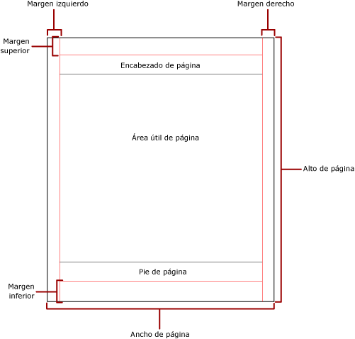
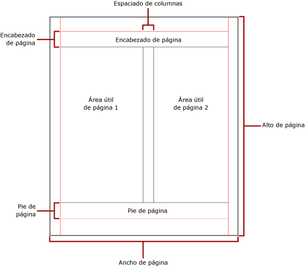

# Paginaci&#243;n en Reporting Services (Generador de informes y SSRS)
  La paginación hace referencia al número de páginas de un informe y al modo en que los elementos de informe se organizan en dichas páginas. La paginación en [!INCLUDE[ssRSnoversion](../../includes/ssrsnoversion-md.md)] varía en función de la extensión de representación usada para ver y entregar el informe. Cuando se ejecuta un informe en el servidor de informes, el informe usa el representador de HTML. HTML sigue un conjunto concreto de reglas de paginación. Si, por ejemplo, exporta el mismo informe a PDF, se usará el representador de PDF y se aplicará otro conjunto de reglas; por consiguiente, el informe se paginará de manera diferente. Para diseñar correctamente un informe que resulte fácil de leer y que esté optimizado para el representador que va a usar para su entrega, es preciso que comprenda las reglas que se usan para controlar la paginación en [!INCLUDE[ssRSnoversion](../../includes/ssrsnoversion-md.md)].  
  
 En este tema se describe cómo afecta el tamaño físico de la página y el diseño del informe al modo en que los representadores de saltos de página duros representan el informe. Se pueden establecer propiedades para modificar el tamaño de página físico y los márgenes y dividir el informe en columnas mediante el panel **Propiedades del informe** , el panel **Propiedades** o el cuadro de diálogo **Configurar página** . Se accede al panel **Propiedades del informe** haciendo clic en el área azul fuera del cuerpo del informe. Se accede al cuadro de diálogo **Configurar página** haciendo clic en **Ejecutar** en la pestaña Inicio y luego haciendo clic en **Configurar página** en la pestaña Ejecutar.  
  
> [!NOTE]  
>  Si ha diseñado un informe para que tenga el ancho de una página, pero dicho informe se representa en varias páginas, compruebe que el ancho del cuerpo del informe, incluidos los márgenes, no sea superior al ancho físico de la página. Para evitar que se agreguen páginas vacías al informe, puede reducir el tamaño del contenedor arrastrando la esquina de éste hacia la izquierda.  
  
> [!NOTE]  
>  [!INCLUDE[ssRBRDDup](../../includes/ssrbrddup-md.md)]  
  
## El cuerpo del informe  
 El cuerpo del informe es un contenedor rectangular que se muestra como un espacio en blanco en la superficie de diseño. Puede aumentar o reducir su tamaño para adaptarse a los elementos de informe incluidos en él. El cuerpo del informe no refleja el tamaño físico de la página y, de hecho, puede aumentar más allá de los límites de dicho tamaño y abarcar varias páginas de informe. Algunos representadores, como [!INCLUDE[ofprexcel](../../includes/ofprexcel-md.md)], Word, HTML y MHTML, representan informes que aumentan o reducen su tamaño en función del contenido de la página. Los informes representados en estos formatos se optimizan para la visualización basada en la presentación pantalla, como en un explorador web. Estos representadores agregan saltos de página verticales cuando es necesario.  
  
 Puede dar formato al cuerpo del informe y asignar un color, un estilo y un ancho a los bordes. También puede agregar un color y una imagen de fondo.  
  
## La página física  
 El tamaño físico de la página es el tamaño del papel. El tamaño del papel especificado para el informe controla cómo se representa el informe. Los informes representados en formatos de saltos de página duros insertan saltos de página horizontales y verticales en función del tamaño físico de la página; el objetivo es optimizar la lectura de los informes cuando se impriman o se vean en un formato de archivo de salto de página duro. Los informes representados en formatos de saltos de página automáticos insertan saltos de página horizontales en función del tamaño físico para optimizar su lectura cuando se vean en un explorador web.  
  
 De manera predeterminada, el tamaño de página es de 8,5 x 11 pulgadas, pero puede cambiarlo en el panel **Propiedades del informe**, en el cuadro de diálogo **Configurar página** o mediante las propiedades PageHeight y PageWidth del panel **Propiedades**. El tamaño de página no aumenta ni se reduce para adaptarse al contenido del cuerpo del informe. Si desea que el informe aparezca en una única página, todo el contenido del cuerpo del informe debe ajustarse a la página física. Si no se ajusta y usa el formato de salto de página duro, el informe requerirá páginas adicionales. Si el cuerpo del informe aumenta más allá del borde derecho de la página física, se inserta un salto de página horizontal. Si el cuerpo del informe aumenta más allá del borde inferior de la página física, se inserta un salto de página vertical.  
  
 Si desea invalidar el tamaño físico de la página definido en el informe, puede especificar otro tamaño físico usando la configuración de la información del dispositivo para el representador específico que está usando para exportar el informe. Para obtener más información, vea [Reporting Services Device Information Settings](http://go.microsoft.com/fwlink/?LinkId=102515).  
  
### Márgenes  
 Los márgenes se trazan a partir del borde físico de la página hasta la configuración de márgenes especificada. Si un elemento de informe se extiende dentro del área de márgenes, se recorta para que el área superpuesta no se represente. Si especifica tamaños de márgenes que provocan que el ancho horizontal o vertical de la página sea cero, la configuración de los márgenes se establece en cero de forma predeterminada. Los márgenes se especifican en el panel **Propiedades del informe**, el cuadro de diálogo **Configurar página** o si cambia las propiedades TopMargin, BottomMargin, LeftMargin y RightMargin en el panel **Propiedades**. Si desea invalidar el tamaño de margen definido en el informe, puede especificar otro tamaño de margen usando la configuración de la información del dispositivo para el representador específico que está usando para exportar el informe.  
  
 El área de la página física que queda después de haber asignado el espacio correspondiente a los márgenes, el espaciado entre columnas, y el encabezado y pie de página, se denomina *área de página utilizable*. Los márgenes se aplican solo cuando se representan y se imprimen informes en formatos de representadores de saltos de página duros. La imagen siguiente muestra el margen y el área de página utilizable de una página física.  
  
   
  
### Columnas de estilo boletín  
 El informe se puede dividir en columnas, como las columnas de un periódico, que se tratan como páginas lógicas representadas en la misma página física. Las columnas se organizan de izquierda a derecha y de arriba abajo, y se separan mediante espacios en blanco. Si el informe se divide en más de una columna, cada página física se divide verticalmente en columnas, cada una de las cuales se considera una página lógica. Por ejemplo, imagine que tiene dos columnas en una página física. El contenido del informe rellena la primera columna y, a continuación, la segunda. Si las dos primeras columnas no son suficientes para la totalidad del informe, se rellena la primera columna de la página siguiente y, a continuación, la segunda. Las columnas continúan rellenándose, de izquierda a derecha y de arriba abajo, hasta que se han representado todos los elementos de informe. Si especifica tamaños de columna que hacen que el ancho horizontal o vertical sea cero, el espaciado entre columnas se establece en cero de forma predeterminada.  
  
 Las columnas se especifican en el panel **Propiedades del informe**, el cuadro de diálogo **Configurar página** o si cambia las propiedades TopMargin, BottomMargin, LeftMargin y RightMargin en el panel **Propiedades**. Si desea usar un tamaño de margen que no está definido, puede especificarlo usando la configuración de la información del dispositivo para el representador específico que está usando para exportar el informe. Las columnas solo se aplican cuando se representan y se imprimen informes en formatos PDF o Imagen. La imagen siguiente muestra el área de página utilizable de una página que contiene columnas.  
  
   
  
## Saltos de página y nombres de página  
 Un informe podría ser más legible y sus datos más fáciles de auditar y exportar si tiene nombres de página. Reporting Services proporciona propiedades para las regiones de datos Tablix (tabla, matriz y lista) e informes, grupos y rectángulos del informe para controlar la paginación, restablecer los números de página y proporcionar nombres nuevos para las páginas del informe en los saltos de página. Estas características pueden mejorar los informes con independencia del formato en el que se representan los informes, pero son especialmente útiles al exportar los informes a los libros de Excel.  
  
 La propiedad InitialPageName proporciona el nombre de página inicial del informe. Si su informe no incluye los nombres de página para los saltos de página, el nombre de página inicial se usa para todas las nuevas páginas creadas por los saltos de página. No es necesario usar un nombre de página inicial.  
  
 Un informe representado puede proporcionar un nuevo nombre de página para una nueva página creada como consecuencia de un salto de página. Para proporcionar el nombre de página, debe establecer la propiedad PageName de una tabla, matriz, lista, grupo o rectángulo. No es necesario especificar los nombres de página los saltos de página. Si no lo hace, se usa el valor de InitialPageName en su lugar. Si InitialPageName también está en blanco, la nueva página no tiene ningún nombre.  
  
 Las regiones de datos Tablix (tabla, matriz y lista), los grupos y los rectángulos admiten saltos de página.  
  
 El salto de página tiene las siguientes propiedades:  
  
-   BreakLocation proporciona la ubicación del salto de página en el elemento de informe habilitado para saltos de página (al principio, al final, o al principio y al final). En los grupos, BreakLocation se puede ubicar entre dos grupos.  
  
-   Disabled indica si se aplica un salto de página al elemento de informe. Si esta propiedad se evalúa en True, se omite el salto de página. Esta propiedad se utiliza para deshabilitar dinámicamente los saltos de página basados en expresiones cuando se ejecuta el informe.  
  
-   ResetPageNumber indica si el número de página se debe restablecer en 1 cuando se produce un salto de página. Si esta propiedad se evalúa en True, se restablece el número de página.  
  
 Puede establecer la propiedad BreakLocation en los cuadros de diálogo **Propiedades de Tablix**, **Propiedades del rectángulo** o **Propiedades de grupo**, pero debe establecer las propiedades Disabled, ResetPageNumber y PageName en el panel Propiedades del Generador de informes. Si las propiedades del panel Propiedades están organizadas por categoría, las propiedades estarán en la categoría **PageBreak** . En el caso de los grupos, la categoría **PageBreak** está en la categoría **Group** .  
  
 Puede usar constantes y expresiones simples o complejas para establecer el valor de las propiedades Disabled y ResetPageNumber. En cambio, no puede usar expresiones con la propiedad BreakLocation. Para más información sobre cómo escribir y usar expresiones, vea [Expresiones &#40;Generador de informes y SSRS&#41;](../../reporting-services/report-design/expressions-report-builder-and-ssrs.md).  
  
 En el informe puede escribir expresiones que hagan referencia a los nombres de página o números de página actuales utilizando la colección **Globals** . Para más información, vea [Referencias a campos globales y de usuario integrados &#40;Generador de informes y SSRS&#41;](../../reporting-services/report-design/built-in-globals-and-users-references-report-builder-and-ssrs.md).  
  
### Denominación de las pestañas de las hojas de cálculo de Excel  
 Estas propiedades resultan útiles al exportar informes a libros de Excel. Use la propiedad InitialPage para especificar un nombre predeterminado para la pestaña de hoja de cálculo cuando exporte el informe, y use saltos de página y la propiedad PageName para proporcionar distintos nombres para cada hoja de cálculo. Cada nueva página del informe definida por un salto de página, se exporta a una hoja de cálculo distinta que recibe el nombre del valor de la propiedad PageName. Si PageName está en blanco, pero el informe tiene un nombre de página inicial, todas las hojas de cálculo del libro de Excel usan el nombre de página inicial.  
  
 Para más información sobre cómo funcionan estas propiedades cuando se exportan informes a Excel, vea [Exportar a Microsoft Excel &#40;Generador de informes y SSRS&#41;](../../reporting-services/report-builder/exporting-to-microsoft-excel-report-builder-and-ssrs.md).  
  
## Vea también  
 [Representación y diseño de páginas &#40;Generador de informes y SSRS&#41;](../../reporting-services/report-design/page-layout-and-rendering-report-builder-and-ssrs.md)  
  
  