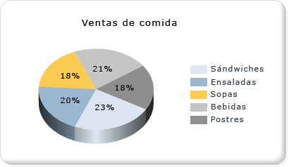

# Gr&#225;ficos circulares (Generador de informes y SSRS)
  Los gráficos circulares y los gráficos de anillos muestran los datos como una proporción del total. Los gráficos circulares se usan normalmente para realizar comparaciones entre grupos. Los gráficos circulares y de anillos, junto con los gráficos piramidales y de embudo, forman parte de un grupo de gráficos conocidos como gráficos de formas. Los gráficos de formas no tienen ejes. Cuando se coloca un campo numérico en un gráfico de formas, el gráfico calcula el porcentaje de cada valor en relación con el total. Para más información sobre los gráficos de formas, vea [Gráficos de formas &#40;Generador de informes y SSRS&#41;](../../reporting-services/report-design/shape-charts-report-builder-and-ssrs.md).  
  
 En la ilustración siguiente se muestra un gráfico circular 3D con etiquetas de datos a las que se ha dado formato de porcentaje.  La leyenda está centrada en el lado derecho.  
  
   
  
> [!NOTE]  
>  [!INCLUDE[ssRBRDDup](../../includes/ssrbrddup-md.md)]  
  
## Variaciones  
  
-   **Círculo seccionado**: gráfico circular cuyos sectores están separados del centro del círculo. Además del gráfico circular seccionado, en el que todos los sectores están separados, también puede crear un gráfico de sectores seccionados, en el que hay un solo sector separado.  
  
-   **Anillos**: gráfico circular con un espacio abierto en el centro.  
  
-   **Anillo seccionado**: gráfico de anillos donde todos los sectores están separados del centro del anillo.  
  
-   **Circular 3D**: gráfico circular al que se ha aplicado un estilo 3D.  
  
-   **Círculo seccionado 3D**: gráfico circular seccionado al que se ha aplicado un estilo 3D.  
  
## Consideraciones sobre los datos para la presentación en un gráfico circular  
  
-   Los gráficos circulares son frecuentes en informes debido a su impacto visual. Sin embargo, los gráficos circulares son un tipo de gráfico muy simplificado que no siempre representa los datos de la mejor manera posible. Plantéese el uso de un gráfico circular solo después de que los datos se hayan agregado en siete puntos de datos o menos.  
  
-   Los gráficos circulares muestran los grupos de datos como sectores independientes dentro del gráfico. Debe agregar al menos un campo de datos y un campo de categorías al gráfico circular. Si se agrega más de un campo de datos a un gráfico circular, éste mostrará los campos de datos en el mismo gráfico.  
  
-   Los valores Null, los valores vacíos y los valores negativos no tienen ningún efecto a la hora de calcular las proporciones. Por esta razón, estos valores no se muestran en un gráfico circular. Si desea indicar visualmente estos tipos de valores en el gráfico, cambie el gráfico circular por otro tipo de gráfico.  
  
-   Si va a definir sus propios colores en un gráfico circular con una paleta personalizada, asegúrese de que dispone de colores suficientes para mostrar cada punto de datos con su propio color. Para más información, vea [Aplicar formato a los colores de serie de un gráfico &#40;Generador de informes y SSRS&#41;](../../reporting-services/report-design/formatting-series-colors-on-a-chart-report-builder-and-ssrs.md).  
  
-   A diferencia de la mayoría de los tipos de gráficos, un gráfico circular muestra los puntos de datos, y no las series individuales, en su leyenda.  
  
-   Un gráfico circular requiere al menos dos valores para realizar una comparación válida entre las proporciones. Si el gráfico circular contiene solamente un color, compruebe que ha agregado un campo de categorías para realizar la agrupación. Si el gráfico circular no contiene categorías, agrega los valores del campo de datos en un valor para la presentación.  
  
-   Al igual que los demás tipos de gráficos, el gráfico circular genera los colores en función de los valores de color de la paleta predeterminada. Esto puede provocar que en un informe con varios gráficos circulares, los puntos de datos se coloreen de manera diferente en cada gráfico circular. Si tiene varios gráficos circulares en el informe, es posible que le interese establecer manualmente los colores para cada grupo de categorías; de este modo, podrá conservar el mismo color en todos los gráficos. Para más información sobre cómo definir colores en un gráfico, vea [Aplicar formato a los colores de serie de un gráfico &#40;Generador de informes y SSRS&#41;](../../reporting-services/report-design/formatting-series-colors-on-a-chart-report-builder-and-ssrs.md).  
  
## Aplicar estilos de dibujo a un gráfico circular  
 Puede agregar estilos de dibujo especiales al gráfico circular para aumentar su impacto visual. Los estilos de dibujo incluyen efectos de bisel y efectos cóncavos. Estos efectos solo están disponibles en los gráficos circulares 2D. En la ilustración siguiente se muestra un ejemplo de estilo de dibujo con bisel y cóncavo en un gráfico circular.  
  
   
  
 Para más información, vea [Agregar estilos con bisel, relieve y textura a un gráfico &#40;Generador de informes y SSRS&#41;](../../reporting-services/report-design/add-bevel-emboss-and-texture-styles-to-a-chart-report-builder-and-ssrs.md).  
  
## Mostrar valores de porcentaje en un gráfico circular  
 Al igual que los demás gráficos de formas, los gráficos circulares representan proporciones del total. Como consecuencia, es frecuente dar formato a las etiquetas del gráfico circular como porcentajes. Para ser coherente con otros tipos de gráficos, el gráfico no muestra las etiquetas de los porcentajes de forma predeterminada. Para más información sobre cómo mostrar valores como porcentajes en el gráfico, vea [Mostrar valores de porcentaje en un gráfico circular &#40;Generador de informes y SSRS&#41;](../../reporting-services/report-design/display-percentage-values-on-a-pie-chart-report-builder-and-ssrs.md). Para más información sobre cómo dar formato a números como porcentajes en el informe, vea [Aplicar formato a números y fechas &#40;Generador de informes y SSRS&#41;](../../reporting-services/report-design/formatting-numbers-and-dates-report-builder-and-ssrs.md).  
  
   
  
## Evitar la superposición de etiquetas en un gráfico circular  
 Si hay muchos puntos de datos en un gráfico circular, las etiquetas de datos se superpondrán. Hay varias maneras de evitar que las etiquetas se superpongan:  
  
-   Reduzca el tamaño de fuente de las etiquetas de los puntos de datos.  
  
-   Aumente el ancho y alto del gráfico para conseguir más espacio para las etiquetas.  
  
-   Muestre las etiquetas del gráfico circular fuera del área de gráfico. Para más información, vea [Mostrar las etiquetas de los puntos de datos fuera de un gráfico circular &#40;Generador de informes y SSRS&#41;](../../reporting-services/report-design/display-data-point-labels-outside-a-pie-chart-report-builder-and-ssrs.md).  
  
-   Combine todos los sectores pequeños del gráfico circular en un solo sector.  
  
## Consolidar sectores pequeños en un gráfico circular  
 Si el gráfico circular tiene demasiados puntos, los datos quedan ocultos y son difíciles de leer. Si los datos tienen muchos puntos de datos pequeños, hay dos maneras de recopilar varios sectores del gráfico circular:  
  
-   Reunir los sectores más pequeños en un sector en el gráfico circular. Esto es útil en situaciones donde, por ejemplo, desea que el gráfico circular tenga un punto de datos "Otros" que recopila los datos restantes. Para más información, vea [Recopilar segmentos pequeños en un gráfico circular &#40;Generador de informes y SSRS&#41;](../../reporting-services/report-design/collect-small-slices-on-a-pie-chart-report-builder-and-ssrs.md).  
  
-   Recopilar los sectores pequeños en un gráfico circular suplementario. El segundo gráfico circular no se muestra en el diseñador. En su lugar, durante el procesamiento del informe, el gráfico calcula si es necesario mostrar un segundo gráfico circular, basándose en los valores de los puntos de datos. En ese caso, los valores se agregan en otro gráfico circular.  
  
## Vea también  
 [Mostrar las etiquetas de los puntos de datos fuera de un gráfico circular &#40;Generador de informes y SSRS&#41;](../../reporting-services/report-design/display-data-point-labels-outside-a-pie-chart-report-builder-and-ssrs.md)   
 [Recopilar segmentos pequeños en un gráfico circular &#40;Generador de informes y SSRS&#41;](../../reporting-services/report-design/collect-small-slices-on-a-pie-chart-report-builder-and-ssrs.md)   
 [Mostrar valores de porcentaje en un gráfico circular &#40;Generador de informes y SSRS&#41;](../../reporting-services/report-design/display-percentage-values-on-a-pie-chart-report-builder-and-ssrs.md)   
 [Tutorial: Agregar un gráfico circular a un informe &#40;Generador de informes&#41;](../../reporting-services/tutorial-add-a-pie-chart-to-your-report-report-builder.md)   
 [Aplicar formato a la leyenda de un gráfico &#40;Generador de informes y SSRS&#41;](../../reporting-services/report-design/formatting-the-legend-on-a-chart-report-builder-and-ssrs.md)   
 [Puntos de datos vacíos y nulos en los gráficos &#40;Generador de informes y SSRS&#41;](../../reporting-services/report-design/empty-and-null-data-points-in-charts-report-builder-and-ssrs.md)   
 [Aplicar formato a los colores de serie de un gráfico &#40;Generador de informes y SSRS&#41;](../../reporting-services/report-design/formatting-series-colors-on-a-chart-report-builder-and-ssrs.md)  
  
  