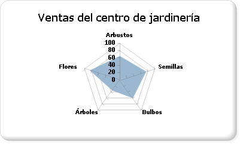

# Gráficos polares (Generador de informes y SSRS)
  Un gráfico polar muestra una serie como un conjunto de puntos agrupados por categorías en un círculo de 360 grados. Los valores se representan por la longitud de los puntos con relación al centro del círculo. Cuanto más lejos del centro esté el punto, mayor será su valor. Las etiquetas de las categorías se muestran en el perímetro del gráfico. Para obtener más información sobre cómo agregar datos a un gráfico polar, vea [Gráficos &#40;Generador de informes y SSRS&#41;](../../reporting-services/report-design/charts-report-builder-and-ssrs.md).  
  
> [!NOTE]  
>  [!INCLUDE[ssRBRDDup](../../includes/ssrbrddup-md.md)]  
  
## Variaciones  
  
-   **Gráfico radial**. Un gráfico radial muestra una serie como una línea o un área circular. A diferencia del gráfico polar, el gráfico radial no muestra los datos en función de las coordenadas polares.  
  
## Consideraciones sobre los datos para los gráficos polares  
  
-   El gráfico radial es útil para realizar comparaciones entre varias series de datos de categorías.  
  
-   Los gráficos polares se usan normalmente para representar datos polares, en los que cada punto de datos viene determinado por un ángulo y una distancia.  
  
-   Los gráficos polares no se pueden combinar con ningún otro tipo de gráfico en la misma área de gráfico.  
  
## Ejemplo  
 En el ejemplo siguiente se muestra el uso de un gráfico radial. La tabla siguiente proporciona los datos de ejemplo para el gráfico.  
  
|Nombre|Sales|  
|----------|-----------|  
|Shrubs|61|  
|Seeds|78|  
|Bulbs|60|  
|Trees|38|  
|Flowers|81|  
  
 En este ejemplo, el campo Nombre se sitúa en el área Grupos de categorías. El campo Ventas se coloca en el área Valores. El campo Sales se agrega automáticamente al gráfico al colocarlo. El gráfico radial calcula dónde se deben situar las etiquetas basándose en el número de valores del campo Sales, que contiene cinco valores, y coloca las etiquetas en cinco puntos equidistantes en un círculo. Si el campo Sales incluyese tres valores, las etiquetas se colocarían en tres puntos equidistantes en un círculo.  
  
 En la ilustración siguiente se muestra un ejemplo de un gráfico radial basado en los datos presentados.  
  
   
  
## Ver también  
 [Gráficos &#40;Generador de informes y SSRS&#41;](../../reporting-services/report-design/charts-report-builder-and-ssrs.md)   
 [Aplicar formato a un gráfico &#40;Generador de informes y SSRS&#41;](../../reporting-services/report-design/formatting-a-chart-report-builder-and-ssrs.md)   
 [Tipos de gráficos &#40;Generador de informes y SSRS&#41;](../../reporting-services/report-design/chart-types-report-builder-and-ssrs.md)   
 [Gráficos de líneas &#40;Generador de informes y SSRS&#41;](../../reporting-services/report-design/line-charts-report-builder-and-ssrs.md)   
 [Puntos de datos vacíos y nulos en los gráficos &#40;Generador de informes y SSRS&#41;](../../reporting-services/report-design/empty-and-null-data-points-in-charts-report-builder-and-ssrs.md)  
  
  
