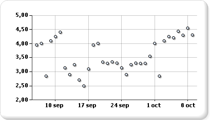

# Gráficos de dispersión (Generador de informes y SSRS)
  Un gráfico de dispersión muestra una serie como un conjunto de puntos. Los valores se representan mediante la posición de los puntos en el gráfico. Las categorías se representan mediante distintos marcadores en el gráfico. Los gráficos de dispersión suelen usarse para comparar datos agregados de las categorías. Para más información sobre cómo agregar datos a un gráfico de dispersión, vea [Gráficos &#40;Generador de informes y SSRS&#41;](../../reporting-services/report-design/charts-report-builder-and-ssrs.md)  
  
 En la ilustración siguiente se muestra un ejemplo de gráfico de dispersión.  
  
   
  
> [!NOTE]  
>  [!INCLUDE[ssRBRDDup](../../includes/ssrbrddup-md.md)]  
  
## Variaciones  
  
-   **Burbuja.** Los gráficos de burbujas muestran la diferencia entre dos valores de un punto de datos basándose en el tamaño de la burbuja. Cuanto mayor sea la burbuja, mayor será la diferencia entre los dos valores.  
  
-   **Burbuja 3D**. Gráfico de burbujas mostrado en tres dimensiones.  
  
## Consideraciones sobre los datos para los gráficos de dispersión  
  
-   Los gráficos de dispersión se usan normalmente para mostrar y comparar valores numéricos, como datos científicos, estadísticos y de ingeniería.  
  
-   Use el gráfico de dispersión cuando desee comparar grandes cantidades de puntos de datos sin tener en cuenta el tiempo. Cuantos más datos incluya en un gráfico de dispersión, mejores comparaciones podrá realizar.  
  
-   El gráfico de burbujas requiere dos valores (superior e inferior) por cada punto de datos.  
  
-   Los gráficos de dispersión son ideales para controlar la distribución de los valores y los clústeres de los puntos de datos. Éste es el mejor tipo de gráfico si el conjunto de datos contiene muchos puntos (por ejemplo, varios miles). Se debe evitar mostrar varias series en un gráfico de puntos porque visualmente puede resultar confuso. En este escenario, puede resultar más factible usar un gráfico de líneas.  
  
-   De forma predeterminada, los gráficos de dispersión muestran los puntos de datos como círculos. Si tiene varias series en un gráfico de dispersión, plantéese la posibilidad de cambiar la forma del marcador de cada punto por un cuadrado, un triángulo, un rombo o cualquier otra forma.  
  
## Consulte también  
 [Gráficos &#40;Generador de informes y SSRS&#41;](../../reporting-services/report-design/charts-report-builder-and-ssrs.md)   
 [Tipos de gráficos &#40;Generador de informes y SSRS&#41;](../../reporting-services/report-design/chart-types-report-builder-and-ssrs.md)   
 [Aplicar formato a un gráfico &#40;Generador de informes y SSRS&#41;](../../reporting-services/report-design/formatting-a-chart-report-builder-and-ssrs.md)   
 [Gráficos de líneas &#40;Generador de informes y SSRS&#41;](../../reporting-services/report-design/line-charts-report-builder-and-ssrs.md)  
  
  
