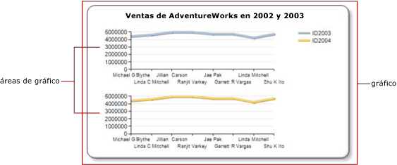

# Especificar un área de gráfico para una serie (Generador de informes y SSRS)
  En los informes paginados de [!INCLUDE[ssRSnoversion_md](../../includes/ssrsnoversion-md.md)] , el *gráfico* es el contenedor de nivel superior que incluye el borde exterior, el título del gráfico y la leyenda. De manera predeterminada, el gráfico contiene un *área de gráfico*. El área de gráfico no está visible en la superficie del gráfico, pero puede imaginarla como un contenedor que incluye únicamente las etiquetas del eje, el título del eje y el área de trazado de una o más series. En la ilustración siguiente se muestra el concepto de varias áreas de gráfico dentro de un único gráfico.  
  
   
  
 De forma predeterminada, todas las series se agregan al área de gráfico predeterminada. Cuando se usan gráficos de áreas, de columnas, de líneas y de dispersión, cualquier combinación de estas series se puede mostrar en la misma área de gráfico. Si tiene varias series en la misma área de gráfico, se reducirá la legibilidad del gráfico. Es recomendable separar los tipos de gráfico en varias áreas de gráfico. El uso de varias áreas de gráfico aumentará la legibilidad, facilitando las comparaciones. Por ejemplo, los gráficos de cotizaciones de volumen y precios suelen tener intervalos de valores diferentes, pero se pueden realizar comparaciones entre los datos de volumen y de precio durante el mismo período de tiempo.  
  
 Las series de tipo barras, polar o de formas solo se pueden combinar con series de los mismos tipos de gráfico en la misma área de gráfico. Si usa un gráfico polar o de formas, considere la posibilidad de usar una región de datos independiente para cada campo que desee mostrar.  
  
> [!NOTE]  
>  [!INCLUDE[ssRBRDDup](../../includes/ssrbrddup-md.md)]  
  
## Para asociar una serie a una nueva área de gráfico  
  
1.  Haga clic con el botón derecho en cualquier lugar del gráfico y seleccione **Agregar una nueva área de gráfico**. Aparecerá una nueva área de gráfico en blanco en el gráfico.  
  
2.  Haga clic con el botón derecho en la serie del gráfico o en un campo de serie o de datos en la zona apropiada del panel Datos del gráfico y, después, haga clic en **Propiedades de la serie**.  
  
3.  En **Ejes y área del gráfico**, seleccione el área de gráfico en la que desea mostrar la serie.  
  
4.  (Opcional) Alinee verticalmente las áreas de gráfico. Para ello, haga clic con el botón derecho en el gráfico y seleccione **Propiedades del área de gráfico**. En **Alineación**, seleccione el área de gráfico con la que desea alinear el área de gráfico seleccionada.  
  
## Consulte también  
 [Mostrar varias series en un gráfico &#40;Generador de informes y SSRS&#41;](../../reporting-services/report-design/multiple-series-on-a-chart-report-builder-and-ssrs.md)   
 [Aplicar formato a los puntos de datos de un gráfico &#40;Generador de informes y SSRS&#41;](../../reporting-services/report-design/formatting-data-points-on-a-chart-report-builder-and-ssrs.md)   
 [Definir los colores de un gráfico mediante una paleta &#40;Generador de informes y SSRS&#41;](../../reporting-services/report-design/define-colors-on-a-chart-using-a-palette-report-builder-and-ssrs.md)   
 [Gráficos polares &#40;Generador de informes y SSRS&#41;](../../reporting-services/report-design/polar-charts-report-builder-and-ssrs.md)   
 [Gráficos de formas &#40;Generador de informes y SSRS&#41;](../../reporting-services/report-design/shape-charts-report-builder-and-ssrs.md)   
 [Gráficos circulares &#40;Generador de informes y SSRS&#41;](../../reporting-services/report-design/pie-charts-report-builder-and-ssrs.md)  
  
  
