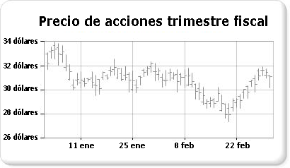

# Gráficos de cotizaciones (Generador de informes y SSRS)

  Los gráficos de cotizaciones están diseñados específicamente para datos financieros o científicos que usen hasta cuatro valores por punto de datos. Estos valores se corresponden con los valores máximo, mínimo, de apertura y de cierre que se usan para trazar datos de acciones financieras. Este tipo de gráfico muestra los valores de apertura y de cierre mediante marcadores, que son normalmente líneas o triángulos. En el ejemplo siguiente, los marcadores de la izquierda muestran los valores de apertura y los marcadores de la derecha muestran los valores de cierre.  
  
   
  
 Un ejemplo de un gráfico de cotizaciones está disponible como un informe del generador de informes de ejemplo. Para obtener más información acerca de cómo descargar este ejemplo y otros informes, consulte [informes de ejemplo del generador de informes y el Diseñador de informes](http://go.microsoft.com/fwlink/?LinkId=198283).  
  
> [!NOTE]  
>  [!INCLUDE[ssRBRDDup](../../includes/ssrbrddup-md.md)]  
  
## Variaciones  
  
-   **Vela japonesa**. El gráfico de vela japonesa es una variante especializada del gráfico de cotizaciones, en el que se usan cuadros para mostrar el intervalo existente entre los valores de apertura y de cierre. Al igual que el gráfico de cotizaciones, el gráfico de vela japonesa puede mostrar hasta cuatro valores por punto de datos.  
  
## Consideraciones sobre los datos para los gráficos de cotizaciones  
  
-   Cuando se presentan muchos puntos de datos de acciones, como la tendencia anual del precio de las acciones, resulta difícil distinguir los valores máximo, mínimo, de apertura y de cierre de cada punto de datos. En este escenario, puede resultar más factible usar un gráfico de líneas en lugar de uno de cotizaciones.  
  
-   Cuando se generan las etiquetas del eje, normalmente se empieza por el cero.  En general, los precios de las acciones no fluctúan tanto como otros conjuntos de datos. Por esta razón, es posible que desee que las etiquetas del eje no empiecen por el cero con el fin de obtener una mejor perspectiva de los datos. Para ello, establezca **IncludeZero** en **false** en el cuadro de diálogo **Propiedades del eje** o en la ventana Propiedades. Para más información sobre cómo genera el gráfico etiquetas de eje, vea [Aplicar formato a las etiquetas de los ejes de un gráfico &#40;Generador de informes y SSRS&#41;](../../reporting-services/report-design/formatting-axis-labels-on-a-chart-report-builder-and-ssrs.md).  
  
-   [!INCLUDE[ssRSnoversion](../../includes/ssrsnoversion-md.md)] proporciona muchas fórmulas calculadas para su uso con los gráficos de cotizaciones, incluyendo indicadores de precio, indicadores de fuerza relativa, convergencia de media móvil, etc.  

## Pasos siguientes

[Gráficos de intervalos](../../reporting-services/report-design/range-charts-report-builder-and-ssrs.md)   
[Gráficos](../../reporting-services/report-design/charts-report-builder-and-ssrs.md)   
[Aplicar formato a un gráfico](../../reporting-services/report-design/formatting-a-chart-report-builder-and-ssrs.md)   
[Cuadro de diálogo de propiedades de eje, opciones del eje](http://msdn.microsoft.com/library/b276e210-7a12-48ae-971b-7dabae51df11)  

¿Más preguntas? [Pruebe a formular el foro de Reporting Services](http://go.microsoft.com/fwlink/?LinkId=620231)
