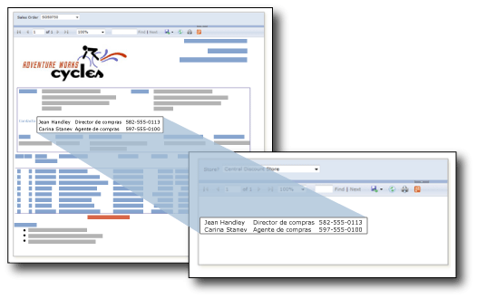

# Subinformes (Generador de informes y SSRS)
  Un subinforme es un elemento de informe que muestra otro informe dentro del cuerpo del informe principal. Como concepto, un subinforme de un informe es como un marco en una página web. Se utiliza para incrustar un informe dentro de un informe. Cualquier informe puede utilizarse como subinforme. El informe que se muestra como el subinforme se almacena en un servidor de informes, normalmente en la misma carpeta que el informe primario. Es posible diseñar el informe primario para que pase sus parámetros al subinforme. Este tipo de informe puede repetirse dentro de las regiones de datos mediante un parámetro que filtre los datos de cada instancia del subinforme.  
  
> [!NOTE]  
>  Si utiliza un subinforme en una región de datos Tablix, el subinforme y sus parámetros se procesarán para cada fila. Si hay muchas filas, considere si un informe detallado resultaría más apropiado.  
  
   
  
 En esta ilustración, la información de contacto que se muestra en el informe de pedido de ventas procede en realidad de un subinforme de Contactos.  
  
> [!NOTE]  
>  [!INCLUDE[ssRBRDDup](../../includes/ssrbrddup-md.md)]  
  
## Comparar subinformes y regiones de datos anidadas  
 Si está pensando en usar subinformes para mostrar grupos independientes de datos, plantéese la posibilidad de usar en su lugar regiones de datos, como tablas, matrices y gráficos. Los informes que solo tienen regiones de datos pueden ofrecer un mejor rendimiento que los informes que incluyen subinformes.  
  
 Utilice regiones de datos para anidar grupos de datos del mismo origen de datos en una única región de datos. Utilice subinformes para anidar grupos de datos de distintos orígenes de datos en una única región de datos, volver a utilizar un subinforme en varios informes primarios o mostrar un informe independiente dentro de otro informe. Por ejemplo, puede crear un "libro de instrucciones" mediante la inclusión de varios subinformes en el cuerpo de otro informe.  
  
 Las regiones de datos ofrecen casi la misma funcionalidad y flexibilidad que los subinformes, pero con un mejor rendimiento. Puesto que el servidor de informes procesa cada instancia de un subinforme como un informe independiente, el rendimiento se puede ver afectado. Para más información, vea [Anidar regiones de datos &#40;Generador de informes y SSRS&#41;](../../reporting-services/report-design/nested-data-regions-report-builder-and-ssrs.md).  
  
## Usar parámetros en subinformes  
 Para pasar parámetros del informe primario al subinforme, defina un parámetro de informe en el informe que utiliza como subinforme. Cuando se coloca el subinforme en el informe primario, se puede seleccionar el parámetro de informe y el valor que se van a pasar desde el informe primario al parámetro de informe del subinforme.  
  
> [!NOTE]  
>  El parámetro que se selecciona en el subinforme es un parámetro de informe, no un parámetro de consulta.  
  
 Se puede colocar un subinforme en el cuerpo principal del informe o en una región de datos. Si se coloca un subinforme en una región de datos, éste se repetirá con cada instancia del grupo o de la fila de la región de datos. Para pasar un valor del grupo o de la fila al subinforme, en la propiedad de valor del subinforme, utilice una expresión de campo para el campo que contiene el valor que se desea pasar al parámetro del subinforme.  
  
 Para más información sobre el trabajo con subinformes, vea [Agregar un subinforme y parámetros &#40;Generador de informes y SSRS&#41;](../../reporting-services/report-design/add-a-subreport-and-parameters-report-builder-and-ssrs.md).  
  
## Especificar nombres y ubicaciones de subinforme  
 Puede diseñar un informe principal que especifique un subinforme situado en una carpeta diferente del mismo servidor de informes.  
  
 La sintaxis usada para especificar el subinforme depende de si el servidor de informes está en modo nativo o en el modo integrado de SharePoint. Para más información, vea [Especificar las rutas de acceso a los elementos externos &#40;Generador de informes y SSRS&#41;](../../reporting-services/report-design/specifying-paths-to-external-items-report-builder-and-ssrs.md).  
  
 En el Generador de informes, para obtener una vista previa de un subinforme en un informe principal, ambos informes se deben encontrar en el mismo servidor de informes o se debe especificar una ruta de acceso completa al subinforme.  
  
## Consulte también  
 [Obtención de detalles, informes detallados, subinformes y regiones de datos anidadas &#40;Generador de informes y SSRS&#41;](../../reporting-services/report-design/drillthrough-drilldown-subreports-and-nested-data-regions.md)  
  
  
