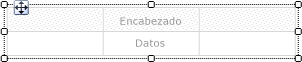
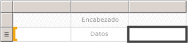
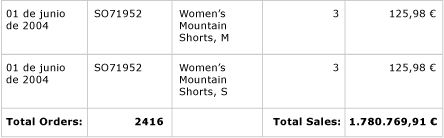
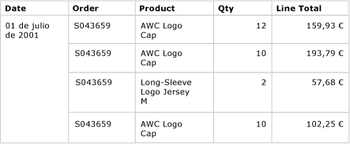
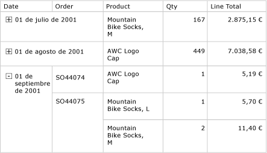

# Tablas (Generador de informes y SSRS)
 En [!INCLUDE[ssRSnoversion_md](../../includes/ssrsnoversion-md.md)], puede usar una tabla para mostrar datos detallados o datos agrupados, o bien una combinación de los dos en un informe paginado.   
   
 Puede agrupar los datos por un solo campo, por varios campos o escribiendo su propia expresión. Puede crear grupos anidados o grupos adyacentes independientes. Para mostrar los valores agregados para los datos agrupados, agregue totales a los grupos. Dé formato a las filas y columnas para resaltar los datos a los que desea dar énfasis. Puede ocultar inicialmente los datos detallados o agrupados, e incluir controles de alternancia de obtención de detalles para permitir a los usuarios elegir interactivamente cuántos datos se van a mostrar.  
  
 Para empezar a usar tablas rápidamente, vea [Tutorial: Crear un informe de tabla básico &#40;Generador de informes&#41;](../../reporting-services/tutorial-creating-a-basic-table-report-report-builder.md) o [Crear un informe de tabla básico &#40;Tutorial de SSRS&#41;](../../reporting-services/create-a-basic-table-report-ssrs-tutorial.md).  
  
> [!NOTE]  
>  Puede publicar tablas por separado de un informe como elementos de informe. Para más información, vea [Elementos de informe](../../reporting-services/report-design/report-parts-report-builder-and-ssrs.md).  
  
  
##   Agregar una tabla para mostrar datos detallados  
 Agregue una tabla a la superficie de diseño desde la pestaña Insertar de la cinta de opciones. Puede agregar una tabla mediante el Asistente para tabla o matriz, para lo que se crea una conexión a un origen de datos y un conjunto de datos y se configura la tabla, o una tabla basada en la plantilla de tabla, que se configura manualmente.  
  
> [!NOTE]  
>  El asistente solamente está disponible en el Generador de informes.  
  
 Para describir cómo configurar una tabla de principio a fin, en este tema se utiliza la plantilla de tabla.  
  
 De forma predeterminada, la nueva tabla tiene un número fijo de columnas con una fila de encabezado para las etiquetas y una fila de datos para los datos detallados. En la siguiente ilustración se muestra una nueva tabla que se ha agregado a la superficie de diseño.  
  
   
  
 Al seleccionar la tabla, aparecen identificadores de columna y de fila fuera de la tabla y corchetes dentro de las celdas. Los identificadores de fila muestran gráficos que le ayudan a comprender el propósito de cada fila. Los corchetes indican la pertenencia al grupo para una celda seleccionada. En la ilustración siguiente se muestra una celda vacía seleccionada en una tabla predeterminada.  
  
   
  
 El identificador de fila para la fila de datos muestra el símbolo de detalles (). Para mostrar datos en estas filas, arrastre los campos desde el panel Datos de informe hasta las celdas de la tabla en la fila de encabezado o la fila de detalles. Ambas filas se rellenan simultáneamente. Para agregar columnas adicionales, arrastre el campo hacia la tabla hasta que vea un punto de inserción. Después de agregar campos de conjunto de datos a la tabla, puede cambiar el formato predeterminado de las fechas y la moneda para controlar su visualización en el informe. El diagrama siguiente muestra una región de datos de tabla con estos campos: Date, Order, Product, Qty, y Line Total.  
  
   
  
 Compruebe el diseño visualizando el informe en vista previa. Si es preciso, la tabla se expande hacia abajo en la página. La fila de etiqueta y la fila de detalles se muestran una sola vez para cada fila en el conjunto de resultados de la consulta de conjuntos de datos. Cada producto vendido en el pedido aparece en una fila independiente, junto con la cantidad y el total de línea para el artículo, como se muestra en la ilustración siguiente:  
  
   
  
 La tabla inicial es una plantilla basada en la región de datos Tablix. Puede mejorar el diseño de la tabla agregando características que son admitidas por la región de datos Tablix subyacente. Para más información, vea [Controlar la presentación de la región de datos Tablix en una página de informe &#40;Generador de informes y SSRS&#41;](../../reporting-services/report-design/controlling-the-tablix-data-region-display-on-a-report-page.md). También puede seguir desarrollando la tabla agregando grupos de filas y grupos de columnas, así como agregando o quitando grupos de detalles. Para obtener más información, vea [Explorar la flexibilidad de una región de datos Tablix &#40;Generador de informes y SSRS&#41;](../../reporting-services/report-design/exploring-the-flexibility-of-a-tablix-data-region-report-builder-and-ssrs.md).  
  
### Agregar totales para datos detallados  
 Para agregar totales, seleccione celdas con datos numéricos y, a continuación, use el menú contextual para agregar automáticamente etiquetas y totales para los datos detallados de los campos numéricos. También puede especificar otras etiquetas y totales manualmente. En la ilustración siguiente se muestra una fila de totales típica que incluye totales especificados de forma automática y manual:  
  
   
  
 En la vista previa, el informe muestra la fila de encabezado y la fila de detalles una vez para cada fila en el conjunto de resultados de la consulta de conjuntos de datos, así como la fila de totales. En la ilustración siguiente se muestran las últimas filas de la tabla, incluida la fila de totales.  
  
   
  
 Para obtener más información, vea [Agregar un total a un grupo o a una región de datos Tablix &#40;Generador de informes y SSRS&#41;](../../reporting-services/report-design/add-a-total-to-a-group-or-tablix-data-region-report-builder-and-ssrs.md).  
  
##   Agregar grupos de filas a una tabla  
 De la misma forma que puede arrastrar un campo desde el panel Datos de informe hasta una celda para mostrar los datos detallados, puede arrastrar un campo hasta el panel Agrupación para agregar un grupo. Para una tabla, arrastre el campo hasta el panel Grupos de filas. Después de agregar un grupo, la tabla agrega automáticamente celdas en nuevas columnas del área de grupo de filas en la que se van a mostrar los valores de grupo. Para obtener más información acerca de las áreas, consulte [áreas Tablix de la región de datos &#40; El generador de informes y SSRS &#41; ](../../reporting-services/report-design/tablix-data-region-areas-report-builder-and-ssrs.md).  
  
 En la ilustración siguiente se muestra una tabla con dos grupos de filas anidados en la vista Diseño. Los grupos de filas se crearon arrastrando el campo Order y el campo Date al panel Grupos de filas, e insertando cada grupo como un grupo primario de los grupos existentes. En la ilustración se muestra un grupo primario basado en la fecha y un grupo secundario basado en el número de pedido, así como el grupo de detalles que se definió de forma predeterminada.  
  
   
  
 En la vista previa, el informe muestra los datos del pedido agrupados primero por fecha y, a continuación, por pedido, como se muestra en la ilustración siguiente.  
  
   
  
 Una manera alternativa de mostrar los datos agrupados es aplicar sangría a la jerarquía de grupos para mostrar la relación anidada de los grupos en lugar de presentar cada valor en su propia columna. Este estilo de formato se denomina informe escalonado. Para obtener más información acerca de cómo dar formato a un informe escalonado información de grupo, consulte [crear un informe escalonadas &#40; El generador de informes y SSRS &#41; ](../../reporting-services/report-design/create-a-stepped-report-report-builder-and-ssrs.md).  
  
### Agregar totales a grupos de filas  
 Para mostrar totales para un grupo, puede usar el comando **Agregar total** contextual. Para un grupo de filas, el comando Agregar total agrega una fila fuera del grupo para que solo se repita una vez respecto al grupo. Para los grupos anidados, la fila de totales para el grupo secundario está fuera de éste, pero dentro del grupo primario. En ese caso, resulta útil establecer el color de fondo de la fila de totales para el grupo secundario con objeto de distinguirla de las filas de detalles. También puede usar un color de fondo diferente para distinguir las filas de encabezado y pie de tabla. En la ilustración siguiente se muestra la tabla con una fila de totales agregada para el grupo basado en números de pedido.  
  
   
  
 Al ver el informe, la fila que muestra los subtotales del pedido se repite una vez para cada número de pedido. El pie de tabla muestra los totales para todas las fechas. En la ilustración siguiente, las últimas filas muestran las tres últimas filas de detalles, el subtotal para el último número de pedido SO71952 y los totales para todas las fechas de la tabla.  
  
   
  
 Para obtener más información, vea [Agregar un total a un grupo o a una región de datos Tablix &#40;Generador de informes y SSRS&#41;](../../reporting-services/report-design/add-a-total-to-a-group-or-tablix-data-region-report-builder-and-ssrs.md).  
  
##   Quitar u ocultar filas de detalles  
 Después de obtener una vista previa de una tabla en un informe, puede decidir quitar las filas de detalles existentes. O bien, podría decidir ocultarlas de forma predeterminada y permitir a los usuarios alternar entre visualizar más o menos detalles, como en un informe de obtención de detalles.  
  
 Para quitar las filas de detalles de una tabla, use el panel Agrupación. Seleccione el grupo de detalles y use el menú contextual para eliminar el grupo y las filas que muestran los datos detallados. En la ilustración siguiente se muestra la vista de diseño para una tabla agrupada por fecha y número de pedido, pero sin filas de detalles. No se ha agregado ninguna fila de totales a esta tabla.  
  
   
  
 Después de eliminar la fila de detalles, el ámbito de los valores corresponde a los grupos de filas. Los datos detallados ya no se muestran.  
  
> [!NOTE]  
>  Compruebe que, después de quitar una fila de detalles, la expresión de cada celda especifica una expresión de agregado donde corresponda. Si es necesario, edite la expresión para especificar las funciones de agregado que se requieran.  
  
 En la ilustración siguiente se muestra este informe en Vista previa.  
  
   
  
 Para agregar o quitar filas de la tabla, vea [Insertar o eliminar una fila &#40;Generador de informes y SSRS&#41;](../../reporting-services/report-design/insert-or-delete-a-row-report-builder-and-ssrs.md).  
  
 También se pueden ocultar las filas de detalles cuando se ve por primera vez el informe. Para ello, puede crear un informe de obtención de detalles en el que solo se muestran los datos del grupo primario. Para cada grupo interno (incluyendo el grupo de detalles), agregue un control de visibilidad a la celda de agrupamiento del grupo contenedor. Por ejemplo, para el grupo de detalles, agregue un control de alternancia al cuadro de texto que muestra el valor de grupo de número de pedido. Para el grupo de número de pedido, agregue un control de alternancia al cuadro de texto que muestra el valor de grupo de fecha. En la ilustración siguiente se muestra la fila para el 1 de septiembre de 2001, expandida para mostrar los primeros pedidos.  
  
   
  
 Para obtener más información, vea [Agregar una acción de expandir y contraer a un elemento &#40;Generador de informes y SSRS&#41;](../../reporting-services/report-design/add-an-expand-or-collapse-action-to-an-item-report-builder-and-ssrs.md).  
  
## Vea también  
 [Filtrar, agrupar y ordenar datos &#40;Generador de informes y SSRS&#41;](../../reporting-services/report-design/filter-group-and-sort-data-report-builder-and-ssrs.md)   
 [Expresiones &#40; El generador de informes y SSRS &#41;](../../reporting-services/report-design/expressions-report-builder-and-ssrs.md)   
 [Ejemplos de expresiones &#40; El generador de informes y SSRS &#41;](../../reporting-services/report-design/expression-examples-report-builder-and-ssrs.md)   
 [Tablas, Matrices y listas de &#40; El generador de informes y SSRS &#41;](../../reporting-services/report-design/tables-matrices-and-lists-report-builder-and-ssrs.md)  
  
  

