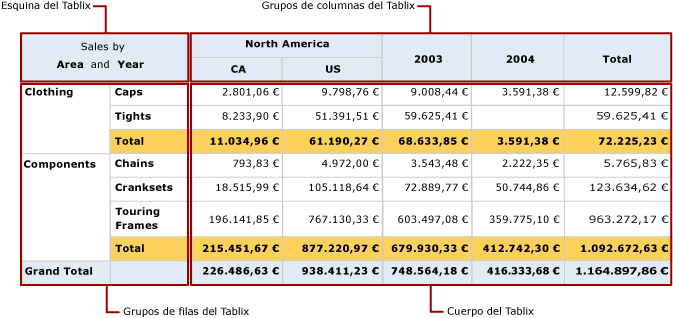

# Describir las áreas de la región de datos Tablix (Generador de informes y SSRS)
 En un informe paginado de [!INCLUDE[ssRSnoversion_md](../../includes/ssrsnoversion-md.md)] , una región de datos Tablix tiene cuatro áreas que contienen celdas de Tablix:   
* Esquina  
* Área de grupo de filas  
* Área de grupo de columnas  
* Cuerpo   
  
En cada área, las celdas tienen una función diferente. Las celdas que se agregan al cuerpo de Tablix tienen como finalidad mostrar datos detallados y agrupados. Si crea un grupo para mostrar valores de instancia de grupo, el Generador de informes y el Diseñador de informes agregan celdas al área de grupo de filas o al área de grupo de columnas. El Generador de informes y el Diseñador de informes crean las celdas de esquina de Tablix si existen grupos de filas y grupos de columnas.  
  
En la superficie de diseño, las líneas de puntos representan las cuatro áreas de la región de datos Tablix que se encuentra seleccionada. En la ilustración siguiente, se muestran las áreas de una región de datos Tablix que tiene grupos de filas anidados basados en la categoría y la subcategoría, grupos de columnas anidados basados en la geografía y el país o región, y un grupo de columnas adyacente basado en el año.  
  
   
  
 En la lista siguiente, se describe cada área:  
  
-   **Área de esquina de Tablix**: (opcional) la esquina de Tablix es la esquina superior izquierda, o la superior derecha en los diseños que se ven de derecha a izquierda (RTL). Esta área se crea automáticamente cuando se agregan grupos de filas y grupos de columnas a una región de datos Tablix. En esta área, puede combinar celdas y agregar una etiqueta o incrustar otro elemento de informe. En la ilustración, las celdas combinadas de la esquina muestran la etiqueta Sales by Area and Year.  
  
-   **Área de grupos de columnas de Tablix**: (opcional) los grupos de columnas de Tablix se encuentran en la esquina superior derecha (o en la esquina superior izquierda en los diseños RTL). Esta área se crea automáticamente cuando se agrega un grupo de columnas. Las celdas de esta área representan miembros de la jerarquía de grupos de columnas y muestran los valores de instancia de los grupos de columnas. En la ilustración, las celdas que muestran [Geography] y [CountryRegion] son grupos de columnas anidados, y la celda que muestra [Year] es un grupo de columnas adyacente. La columna [Total] muestra los totales agregados en cada fila.  
  
-   **Área de grupos de filas de Tablix**: (opcional) los grupos de filas de Tablix se encuentran en la esquina inferior izquierda (o en la esquina inferior derecha en los diseños RTL). Esta área se crea automáticamente cuando se agrega un grupo de filas. Las celdas de esta área representan miembros de la jerarquía de grupos de filas y muestran los valores de instancia de los grupos de filas. En la ilustración, las celdas que muestran [Category] y [Subcat] son grupos de filas anidados. La fila Total situada debajo de Subcat se repite con cada grupo de categorías para mostrar los subtotales agregados de cada columna. La fila que contiene el total general muestra los totales de todas las categorías.  
  
-   **Área de cuerpo de Tablix**: el cuerpo de Tablix se encuentra en la esquina inferior derecha (o en la esquina inferior izquierda en los diseños RTL). El cuerpo de Tablix muestra datos detallados y agrupados. En este ejemplo, solo se usan datos agregados. Los grupos más internos a los que pertenece el cuadro de texto determinan el ámbito de la expresión. Las celdas del cuerpo de Tablix muestran datos detallados si son miembros de una fila de detalles, y representan datos agregados si son miembros de una fila o una columna asociada a un grupo. De forma predeterminada, las celdas de una fila o columna de grupo que contienen expresiones simples sin funciones de agregado se evalúan como el primer valor del grupo. En la ilustración, las celdas muestran los totales de agregado para los totales de línea de todos los pedidos de ventas.  
  
 Al ejecutar el informe, los grupos de columnas se expanden hacia la derecha (o hacia la izquierda si la propiedad Direction de la región de datos Tablix está establecida en RTL) tantas columnas como valores únicos haya para una expresión de grupo. Los grupos de filas se expanden hacia abajo en la página. Para más información, vea [Celdas, filas y columnas de la región de datos Tablix &#40;Generador de informes y SSRS&#41;](../../reporting-services/report-design/tablix-data-region-cells-rows-and-columns-report-builder-and-ssrs.md).  
  
 En la ilustración siguiente, se muestra la región de datos Tablix en Vista previa.  
  
   
  
 El área de grupo de filas muestra dos instancias de grupo de categorías para Clothing y Components. El grupo de columnas muestra una instancia de grupo de geografía para América del Norte, con dos instancias de grupo anidado de país o región para Canadá (CA) y los Estados Unidos (US). Además, la columna adyacente muestra dos instancias de grupo de dos años para 2003 y 2004. La fila de columnas Total muestra los totales de fila; la fila de totales que se repite con el grupo de categorías muestra los totales de subcategoría, y la fila de total general muestra los totales de categoría una vez para la región de datos.  
  
## Consulte también  
 [Tablas, matrices y listas &#40;Generador de informes y SSRS&#41;](../../reporting-services/report-design/tables-matrices-and-lists-report-builder-and-ssrs.md)   
 [Tutoriales del Generador de informes](../../reporting-services/report-builder-tutorials.md)   
 [Tablas &#40;Generador de informes y SSRS&#41;](../../reporting-services/report-design/tables-report-builder-and-ssrs.md)   
 [Creación de una matriz](../../reporting-services/report-design/create-a-matrix-report-builder-and-ssrs.md)   
 [Crear facturas y formularios con listas](../../reporting-services/report-design/create-invoices-and-forms-with-lists-report-builder-and-ssrs.md)   
 [Región de datos Tablix &#40;Generador de informes y SSRS&#41;](../../reporting-services/report-design/tablix-data-region-report-builder-and-ssrs.md)  
  
  
