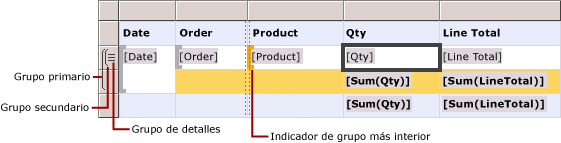
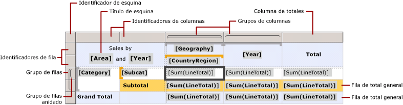
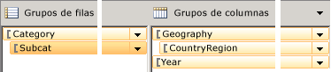
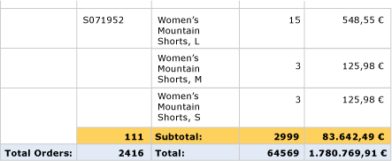

# Celdas, filas y columnas de una región de datos Tablix (Generador de informes y SSRS)

  Para controlar el modo en que las filas y columnas de una región de datos Tablix muestran los datos en un informe paginado de [!INCLUDE[ssRSnoversion_md](../../includes/ssrsnoversion-md.md)] , debe entender cómo especificar las filas y columnas para los datos de detalle, los datos de grupo, las etiquetas y los totales. En muchos casos, puede usar las estructuras predeterminadas de una tabla, matriz o lista para mostrar los datos. Para más información, vea [Tablas &#40;Generador de informes y SSRS&#41;](../../reporting-services/report-design/tables-report-builder-and-ssrs.md), [Matrices](../../reporting-services/report-design/create-a-matrix-report-builder-and-ssrs.md) o [Listas](../../reporting-services/report-design/create-invoices-and-forms-with-lists-report-builder-and-ssrs.md).  
  
 Una región de datos Tablix muestra los datos detallados en filas y columnas de detalles, y los datos agrupados en filas y columnas de grupo. Al agregar grupos de filas y de columnas a una región de datos Tablix, las filas y las columnas en las que van a mostrarse los datos se agregan automáticamente. Puede agregar y quitar manualmente filas y columnas para personalizar una región de datos Tablix y controlar cómo se muestran los datos en el informe.  
  
 Para entender cómo personalizar una región de datos Tablix, debería entender primero cómo interpretar las indicaciones visuales que aparecen al seleccionar una región de datos Tablix en la superficie de diseño.  
  
> [!NOTE]  
>  [!INCLUDE[ssRBRDDup](../../includes/ssrbrddup-md.md)]  
  
## Descripción de las indicaciones visuales de Tablix  
 Las indicaciones visuales de una región de datos Tablix le ayudan a trabajar con una región de datos Tablix para mostrar los datos que desea.  
  
### Identificadores de filas y columnas  
 Al seleccionar una región de datos Tablix, los gráficos de los identificadores de filas y de columnas indican el propósito de cada fila y columna. Los identificadores indican las filas y columnas que están dentro o fuera de un grupo. En la tabla siguiente se muestran diversas presentaciones del identificador.  
  
|Icono|Descripción|  
|----------|-----------------|  
||Solo el grupo de detalles en la jerarquía de grupos de filas|  
||Un grupo exterior y el grupo de detalles secundario|  
||Un grupo exterior y un grupo interno; ningún grupo de detalles|  
||Un grupo exterior, un grupo interno y el grupo de detalles secundario|  
||Un grupo exterior con una fila de pie para los totales y un grupo interno|  
||Un grupo exterior con una fila de pie para los totales, un grupo interno con una fila de pie para los totales y una fila de detalles|  
||Un grupo exterior con un encabezado para las etiquetas y un pie para los totales, y un grupo interno; ningún grupo de detalles|  
  
### Filas de grupos  
 Las filas dentro de un grupo se repiten una vez para cada valor de grupo único y se usan normalmente para los resúmenes agregados. Las filas situadas fuera de un grupo se repiten una vez con respecto al grupo y se usan para las etiquetas o los subtotales. Al seleccionar una celda de Tablix, los identificadores de fila y de columna y los corchetes incluidos en la región de datos Tablix muestran los grupos a los que pertenece una celda. En esta ilustración se muestran las indicaciones visuales siguientes:  
  
-   Identificadores de fila y de columna que indican asociaciones de grupo.  
  
-   Indicadores de grupo resaltados que muestran la pertenencia al grupo más interior para una celda seleccionada.  
  
-   Indicadores de grupo que muestran todas las pertenencias a los grupos para una celda seleccionada.  
  
   
  
### Filas de totales  
 Después de agregar grupos de filas y de columnas, puede agregar una fila para mostrar los totales para las columnas y una columna para mostrar los totales para las filas. En la ilustración siguiente se muestra una matriz con grupos de filas y de columnas, y una fila y una columna de totales.  
  
   
  
### Panel de agrupación  
 El Panel de agrupación muestra los grupos de filas y de columnas para la región de datos Tablix seleccionada actualmente en la superficie de diseño. En la ilustración siguiente se muestra el Panel de agrupación para esta región de datos Tablix.  
  
   
  
 El panel Grupos de filas muestra el grupo primario Category y el grupo secundario Subcat. El panel Grupos de columnas muestra el grupo primario Geography y el grupo secundario CountryRegion, así como el grupo Year, que es un grupo adyacente al grupo Geography. Al seleccionar el grupo Subcat en el panel Grupos de filas, la barra de grupo adquiere un sombreado naranja más oscuro y la celda de miembro del grupo de filas correspondiente se selecciona en la superficie de diseño.  
  
## Mostrar datos en filas y columnas  
 Las filas y los grupos de filas, así como las columnas y los grupos de columnas, tienen relaciones idénticas. La explicación siguiente describe cómo agregar filas para mostrar datos detallados y de grupo en filas de una región de datos Tablix, pero se aplican los mismos principios a la adición de columnas para mostrar datos detallados y agrupados.  
  
 Para cada fila de una región de datos Tablix, hay una fila dentro o fuera de cada grupo de filas. Si la fila está dentro de un grupo de filas, se repite una vez para cada valor único del grupo, denominado *instancia de grupo*. Si la fila está fuera de un grupo de filas, solo se repite una vez con respecto a ese grupo. Las filas situadas fuera de todos los grupos de filas son estáticas y solo se repiten una vez para la región de datos. Por ejemplo, un encabezado de tabla y una fila de pie son filas estáticas. Las filas que se repiten al menos con un grupo son dinámicas.  
  
 En los grupos anidados, una fila puede estar dentro de un grupo primario, pero fuera de un grupo secundario. La fila se repite para cada valor de grupo del grupo primario, pero solo se muestra una vez con respecto al grupo secundario. Para mostrar etiquetas o totales para un grupo, agregue una fila fuera de éste. Para mostrar datos que cambian en cada instancia de grupo, agregue una fila dentro del grupo.  
  
 En el caso de los grupos de detalles, cada fila de detalles está dentro del grupo de detalles. La fila se repite para cada valor del conjunto de resultados de la consulta del conjunto de datos.  
  
 Para más información sobre las jerarquías de grupos, vea [Descripción de los grupos &#40;Generador de informes y SSRS&#41;](../../reporting-services/report-design/understanding-groups-report-builder-and-ssrs.md).  
  
 La ilustración siguiente muestra una región de datos Tablix con grupos de filas anidados y un grupo de detalles.  
  
   
  
 En una región de datos Tablix que muestra datos detallados, el grupo de detalles es el grupo secundario más interior. Las filas que se agregan a un grupo de detalles se repiten una vez para cada fila en el conjunto de resultados de la consulta del conjunto de datos vinculado a esta región de datos Tablix. En la ilustración siguiente se muestra la última página del informe representado. En ella, puede ver las últimas filas de detalles y de subtotal para el último pedido.  
  
   
  
 Se aplican los mismos principios para cada columna de una región de datos Tablix. Por ejemplo, una columna puede estar dentro o fuera de cada grupo de columnas; para mostrar los totales, agregue una columna fuera del grupo.  
  
 Para quitar filas y columnas asociadas a un grupo, puede eliminar éste. Al eliminar un grupo, puede elegir entre eliminar únicamente la definición de grupo o eliminar el grupo y todas sus filas y columnas asociadas. Si se elimina únicamente el grupo, se conservará el diseño de fila y de columna en la región de datos. Si se elimina el grupo y sus filas y columnas relacionadas, se eliminarán todas las filas y columnas estáticas (incluyendo los encabezados y pies de grupo), así como las filas y columnas dinámicas (incluyendo las instancias de grupo), que están asociadas a ese grupo.  
  
 Para obtener instrucciones paso a paso sobre la forma de agregar o eliminar filas y columnas, vea [Insertar o eliminar una fila &#40;Generador de informes y SSRS&#41;](../../reporting-services/report-design/insert-or-delete-a-row-report-builder-and-ssrs.md) e [Insertar o eliminar una columna &#40;Generador de informes y SSRS&#41;](../../reporting-services/report-design/insert-or-delete-a-column-report-builder-and-ssrs.md).  
  
## Descripción de las celdas de Tablix  
 Las celdas de Tablix pertenecen a una de las cuatro áreas del Tablix: el cuerpo del Tablix, las áreas de grupos de filas y grupos de columnas del Tablix, y la esquina del Tablix. Aunque cada celda puede mostrar cualquier valor del conjunto de datos, la función predeterminada para cada celda viene determinada por su ubicación. Para información detallada sobre las áreas de Tablix, vea [Áreas de la región de datos Tablix &#40;Generador de informes y SSRS&#41;](../../reporting-services/report-design/tablix-data-region-areas-report-builder-and-ssrs.md).  
  
 De forma predeterminada, las celdas de las áreas de grupos de filas y de columnas de Tablix representan miembros de grupo. Los miembros de grupo se organizan en varias estructuras de árbol en la definición de informe. La jerarquía de grupos de filas se expande horizontalmente. La jerarquía de grupos de columnas se expande verticalmente. Estas celdas se agregan automáticamente al crear un grupo y muestran los valores únicos para un grupo en tiempo de ejecución.  
  
 Las celdas de la esquina del Tablix se crean cuando hay áreas de grupos de filas y de columnas. Puede combinar las celdas de esta área para crear una etiqueta o incrustar otro elemento de informe.  
  
 Las celdas del área del cuerpo del Tablix pueden mostrar datos detallados cuando la celda está en una fila o columna de detalles, y datos de grupo agregados cuando la celda está en una fila o columna de grupo. El ámbito para los datos de una celda es la intersección del grupo de filas y el grupo de columnas más interiores a los que pertenece la celda.  
  
> [!NOTE]  
>  Los datos reales que se muestran para cada celda son la expresión evaluada para el elemento de informe incluido en la celda, que generalmente es un cuadro de texto. En una celda que pertenece a una fila o columna de detalles, la expresión tiene como valor predeterminado los datos detallados (por ejemplo, **[LineTotal]** ). En una celda que no pertenece a una fila o columna de detalles, la expresión tiene como valor predeterminado una función de agregado (por ejemplo, **Sum[LineTotal]** ). Si una expresión no especifica una función de agregado aunque la celda pertenezca a una fila o columna de grupo, se muestra el primer valor del grupo. Para más información sobre los agregados, vea [Ámbito de expresión para los totales, agregados y colecciones integradas &#40;Generador de informes y SSRS&#41;](../../reporting-services/report-design/expression-scope-for-totals-aggregates-and-built-in-collections.md).  
  
### Combinar y dividir celdas  
 Dentro de un área de Tablix, puede combinar juntas varias celdas adyacentes. Por ejemplo, puede crear celdas para etiquetas que abarcan varias columnas o filas.  
  
 En el área de esquina del Tablix, las celdas solo se pueden combinar en una dirección cada vez: horizontalmente por columnas o verticalmente por filas. Para combinar un bloque de celdas, combine primero las filas horizontalmente. Una vez combinadas todas las celdas en una única celda en cada fila, seleccione las celdas adyacentes (puede seleccionar todas las celdas adyacentes de una columna) y combínelas.  
  
 En el área del cuerpo del Tablix, las celdas solo se pueden combinar horizontalmente. No se admite la combinación vertical de celdas.  
  
 Para más información, vea [Combinar celdas en una región de datos &#40;Generador de informes y SSRS&#41;](../../reporting-services/report-design/merge-cells-in-a-data-region-report-builder-and-ssrs.md).  
  
 Puede dividir una celda combinada con anterioridad. Las celdas se pueden dividir horizontalmente por columnas o verticalmente por filas. Para dividir una celda en un bloque de celdas, primero divida horizontalmente la celda y, a continuación, divídala verticalmente tantas veces como sea necesario.  
  
## Consulte también  
 [Región de datos Tablix &#40;Generador de informes y SSRS&#41;](../../reporting-services/report-design/tablix-data-region-report-builder-and-ssrs.md)  
  
  
