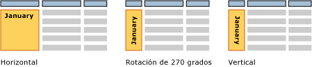

# Cuadros de texto (Generador de informes y SSRS)
  Al pensar en un cuadro de texto, probablemente se imagina un cuadro independiente que contiene el texto en una superficie, como en [!INCLUDE[msCoName](../../includes/msconame-md.md)] Office PowerPoint. En informes paginados de [!INCLUDE[ssRSnoversion_md](../../includes/ssrsnoversion-md.md)], algunos cuadros de texto son así y pueden mostrar texto estático de títulos, descripciones y etiquetas, o bien texto dinámico basado en expresiones. Pero, además, todas las celdas de una tabla o una matriz (región de datos Tablix) contienen un cuadro de texto al que se puede dar formato de la misma forma que a los cuadros de texto independientes de un informe.  
  
> [!NOTE]  
>  Si arrastra un valor de campo de un conjunto de datos de informe directamente hasta la superficie de diseño del informe, o hasta un cuadro de texto situado en la superficie de diseño del informe, al ejecutar el informe solamente verá el primer valor del conjunto de resultados. Para ver todos los valores de un campo, primero necesita crear una tabla, una matriz o una región de datos de lista y, después, arrastrar el campo a una celda en la región de datos. Así, al ejecutar el informe, verá todos los valores en ese campo.  
  
 Para mostrar el texto que se repite en un diseño de forma libre, cree una región de datos de lista y coloque el cuadro de texto en la región. Use una lista si desea repetir un formato para varios valores, por ejemplo, un formato de factura de cliente que se repite una vez para cada cliente. Obtenga más información sobre cómo [crear facturas y formularios con listas](../../reporting-services/report-design/create-invoices-and-forms-with-lists-report-builder-and-ssrs.md).  
  
 Use un contenedor de rectángulo si desea controlar el diseño del cuadro de texto y los espacios en blanco que aparecen debajo del último cuadro de texto. Para más información, vea [Rectángulos y líneas &#40;Generador de informes y SSRS&#41;](../../reporting-services/report-design/rectangles-and-lines-report-builder-and-ssrs.md).  
  
 La expresión de un cuadro de texto puede incluir texto literal, apuntar a un campo de la base de datos o calcular datos. Todas las expresiones se muestran como texto de marcador de posición para que pueda dar formato a los números, colores y otras propiedades de aspecto. También puede combinar marcadores de posición con texto literal en el mismo cuadro de texto.  
  
 Puede dar formato al texto de cada uno de los cuadros de texto con variedad de fuentes, colores, estilos y acciones. Para más información, vea [Aplicar formato a texto y a marcadores de posición &#40;Generador de informes y SSRS&#41;](../../reporting-services/report-design/formatting-text-and-placeholders-report-builder-and-ssrs.md).  
  
> [!NOTE]  
>  [!INCLUDE[ssRBRDDup](../../includes/ssrbrddup-md.md)]  
  
##   Aumentar y disminuir el tamaño de un cuadro de texto  
 De manera predeterminada, los cuadros de texto tienen un tamaño fijo. Puede permitir que un cuadro de texto se reduzca o se expanda verticalmente según su contenido. Para más información, vea [Permitir que un cuadro de texto aumente o se reduzca &#40;Generador de informes y SSRS&#41;](../../reporting-services/report-design/allow-a-text-box-to-grow-or-shrink-report-builder-and-ssrs.md).  
  
## Girar un cuadro de texto  
 Girar los cuadros de texto puede ayudarle a crear informes más legibles, permitir una orientación del texto específica de la configuración regional, ajustar más columnas en un informe impreso con un tamaño de página fijo y crear informes con gráficos más atractivos. Un cuadro de texto se puede girar en diferentes direcciones: horizontal, vertical (girar 90 grados) o 270 grados. La opción vertical se suele utilizar más para los idiomas de Asia oriental que se escriben de arriba abajo. En la mayoría de los representadores, la opción vertical controla el giro de glifo correctamente para que el texto se escriba de arriba abajo y evitar que los caracteres estén en los lados. Para otros idiomas, el texto de las opciones vertical y girado 270 grados se escribe de lado.  
  
 Se pueden girar los cuadros de texto que contengan texto estático, los campos de un conjunto de datos de informe, o bien datos calculados. El cuadro de texto puede ser independiente en el cuerpo del informe, en una tabla o matriz, o en un encabezado y pie de página del informe.  
  
 La siguiente imagen muestra tres versiones de un informe de la tabla que agrupa los datos por mes. El cuadro de texto que contiene el valor del mes utiliza una orientación diferente.  
  
   
  
 La orientación se establece en el cuadro de texto y se aplica a todo el texto del cuadro. No puede especificar una orientación diferente para las partes del cuadro de texto.  
  
 Para empezar, vea la sección sobre cómo girar texto en el [Tutorial: Dar formato a texto &#40;Generador de informes&#41;](../../reporting-services/tutorial-format-text-report-builder.md) y vea [Establecer la orientación del cuadro de texto &#40;Generador de informes y SSRS&#41;](../../reporting-services/report-design/set-text-box-orientation-report-builder-and-ssrs.md).  
  
##   Temas de procedimientos  
 [Agregar, mover o eliminar un cuadro de texto &#40;Generador de informes y SSRS&#41;](../../reporting-services/report-design/add-move-or-delete-a-text-box-report-builder-and-ssrs.md)  
  
 [Dar formato al texto en un cuadro de texto &#40;Generador de informes y SSRS&#41;](../../reporting-services/report-design/format-text-in-a-text-box-report-builder-and-ssrs.md)  
  
 [Establecer la orientación del cuadro de texto &#40;Generador de informes y SSRS&#41;](../../reporting-services/report-design/set-text-box-orientation-report-builder-and-ssrs.md)  
  
 [Permitir que un cuadro de texto aumente o se reduzca &#40;Generador de informes y SSRS&#41;](../../reporting-services/report-design/allow-a-text-box-to-grow-or-shrink-report-builder-and-ssrs.md)  
  
## Vea también  
 [Aplicar formato a texto y a marcadores de posición &#40;Generador de informes y SSRS&#41;](../../reporting-services/report-design/formatting-text-and-placeholders-report-builder-and-ssrs.md)   
 [Aplicar formato a números y fechas &#40;Generador de informes y SSRS&#41;](../../reporting-services/report-design/formatting-numbers-and-dates-report-builder-and-ssrs.md)  
  
  