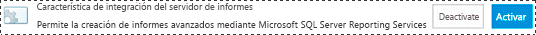
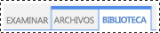
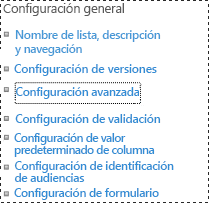
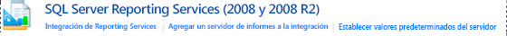
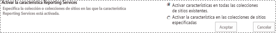

# Agregar tipos de contenido de Reporting Services a una biblioteca de SharePoint

[!INCLUDE[ssrs-appliesto](../../includes/ssrs-appliesto.md)] [!INCLUDE[ssrs-appliesto-2016](../../includes/ssrs-appliesto-2016.md)] [!INCLUDE[ssrs-appliesto-sharepoint-2013-2016i](../../includes/ssrs-appliesto-sharepoint-2013-2016.md)] [!INCLUDE[ssrs-appliesto-not-pbirsi](../../includes/ssrs-appliesto-not-pbirs.md)]

[!INCLUDE [ssrs-previous-versions](../../includes/ssrs-previous-versions.md)]

[!INCLUDE[ssRSnoversion](../../includes/ssrsnoversion-md.md)] proporciona tipos de contenido de SharePoint predefinidos que se usan para administrar archivos de orígenes de datos compartidos (.rsds), modelos de informe (.smdl) y archivos de definición de informe (.rdl) del Generador de informes. Al agregar un tipo de contenido **Informe del Generador de informes**, **Modelo de informe**y **Origen de datos de informe** a una biblioteca se habilita el comando **Nuevo** para que pueda crear nuevos documentos de ese tipo.

> [!NOTE]
> La integración de Reporting Services con SharePoint ya no está disponible a partir de SQL Server 2016.

 Para agregar tipos de contenido a una biblioteca, debe ser administrador del sitio o disponer del nivel de permiso Control total.  
  
 Los tipos de contenido de [!INCLUDE[ssRSnoversion](../../includes/ssrsnoversion-md.md)] y su administración se habilitarán automáticamente en todas las bibliotecas de documentos de las colecciones de sitios existentes creadas a partir de los siguientes tipos de plantilla de sitio:  
  
-   **Centro de Business Intelligence**  
  
 Los sitios creados después de la integración de [!INCLUDE[ssRSnoversion](../../includes/ssrsnoversion-md.md)] no tendrán habilitados los tipos de contenido de [!INCLUDE[ssRSnoversion](../../includes/ssrsnoversion-md.md)] .  
  
> [!TIP]  
>  Si **no** ha configurado previamente los tipos de contenido de una biblioteca, habilite primero la administración de tipos de contenido y, a continuación, habilite los tipos de contenido de [!INCLUDE[ssRSnoversion](../../includes/ssrsnoversion-md.md)] . Vea los procedimientos para habilitar la administración de tipos de contenido en una única biblioteca de documentos.  
  
 **Vídeo corto:** [(SSRS) Enabling Content Types in SharePoint2010.wmv](https://www.youtube.com/watch?v=yqhm3DrtT1w) (https://www.youtube.com/watch?v=yqhm3DrtT1w) (Habilitación de tipos de contenido en SharePoint2010.wmv).  
  
 **En este tema:**  
  
-   [Habilitar tipos de contenido en todas las bibliotecas de documentos de un Centro de inteligencia empresarial](#bkmk_enable_all)  
  
-   [Para habilitar la administración de tipos de contenido para una sola biblioteca de documentos (SharePoint 2013)](#bkmk_enable_content_management)  
  
-   [Para agregar tipos de contenido de Reporting Services (SharePoint 2013)](#bkmk_add_single)  
  
-   [Para habilitar la administración de tipos de contenido para una sola biblioteca de documentos (SharePoint 2010)](#bkmk_enable_content_management_2010)  
  
-   [Para agregar tipos de contenido del servidor de informes (SharePoint 2010)](#bkmk_add_single_2010)  
  
-   [Para habilitar los tipos de contenido y la administración de contenido de varios sitios de BI](#bkmk_enable_multiple_sites)  
  
##   Habilitar tipos de contenido en todas las bibliotecas de documentos de un Centro de inteligencia empresarial  
  
1.  Para habilitar los tipos de contenido y la administración de contenido en todas las bibliotecas de documentos de un sitio de un **Centro de inteligencia empresarial** existente, puede alternar la característica de integración de [!INCLUDE[ssRSnoversion](../../includes/ssrsnoversion-md.md)] .  
  
2.  Vaya a **Configuración del sitio**.  
  
    -   En SharePoint 2013, haga clic en el icono de **Configuración** .   
  
    -   En SharePoint 2010, haga clic en **Acciones del sitio**y, a continuación, haga clic en **Configuración del sitio**.  
  
3.  Haga clic en **Características de la colección de sitios**.  
  
4.  Busque la **Característica de integración del servidor de informes** y haga clic en **Desactivar**.  
  
       
  
5.  Actualice el explorador y haga clic en **Activar** junto a la **Característica de integración del servidor de informes**.  
  
       
  
##   Para habilitar la administración de tipos de contenido para una sola biblioteca de documentos (SharePoint 2013)  
  
1.  Abra la biblioteca para la que desee habilitar varios tipos de contenido.  
  
2.  Haga clic en **Biblioteca** en la cinta de opciones.  
  
       
  
3.  En la cinta **Biblioteca** , haga clic en **Configuración de la biblioteca**. Si no ve **Configuración de la biblioteca** o si el botón está deshabilitado, significa que no tiene permiso para configurar la biblioteca, incluidos los tipos de contenido.  
  
       
  
4.  En la sección **Configuración general** , haga clic en **Configuración avanzada**.  
  
       
  
5.  En la sección **Tipos de contenido** , seleccione **Sí** para permitir la administración de tipos de contenido.  
  
6.  Haga clic en **Aceptar**.  
  
##   Para agregar tipos de contenido de Reporting Services (SharePoint 2013)  
  
1.  Abra la biblioteca para la que desee agregar tipos de contenido de Reporting Services.  
  
2.  En la cinta de opciones, haga clic en **Biblioteca**.  
  
3.  Haga clic en **Configuración de la biblioteca**.  
  
4.  En **Tipos de contenido**, haga clic en **Agregar a partir de tipos de contenido de sitio**.  
  
5.  En **Seleccionar tipos de contenido de sitio**, seleccione **Tipos de contenido de SQL Server Reporting Services**.  
  
6.  En la lista **Tipos de contenido de sitio disponibles** , haga clic en **Generador de informes**y, a continuación, haga clic en **Agregar** para mover el tipo de contenido seleccionado a la lista **Tipos de contenido que agregar** .  
  
7.  Para agregar los tipos de contenido **Modelo de informe** y **Origen de datos de informe** , repita el paso anterior.  
  
8.  Cuando termine de agregar tipos de contenido, haga clic en **Aceptar**.  
  
    > [!NOTE]  
    >  Si el grupo de tipos de contenido de [!INCLUDE[ssRSnoversion](../../includes/ssrsnoversion-md.md)] Tipos de contenido de SQL Server Reporting Services **de** no es visible en la página **Agregar tipos de contenido** , se cumple una de las condiciones siguientes:  
  
    -   No se ha instalado el complemento [!INCLUDE[ssRSnoversion](../../includes/ssrsnoversion-md.md)] para productos de SharePoint. Para obtener más información, vea [Instalar o desinstalar el complemento Reporting Services para SharePoint](../../reporting-services/install-windows/install-or-uninstall-the-reporting-services-add-in-for-sharepoint.md). El tema contiene información sobre la instalación del complemento y la ejecución paso a paso en una instalación solo de archivos del complemento para solucionar problemas.  
  
    -   Se instala el complemento, pero la característica de colección de sitios **Característica de integración del servidor de informes** no está activa. Compruebe la característica de colección de sitios en **Configuración del sitio**.  
  
    -   Ya se han agregado a la biblioteca todos los tipos de contenido de [!INCLUDE[ssRSnoversion](../../includes/ssrsnoversion-md.md)] . Si todos los tipos de contenido forman parte de una biblioteca, el grupo se quita de la página **Agregar tipos de contenido** . Si elimina uno o varios de los tipos de contenido de [!INCLUDE[ssRSnoversion](../../includes/ssrsnoversion-md.md)] , el grupo **Tipos de contenido de SQL Server Reporting Services** será visible en la página **Agregar tipos de contenido** .  
  
##   Para habilitar la administración de tipos de contenido para una sola biblioteca de documentos (SharePoint 2010)  
  
1.  Abra la biblioteca para la que desee habilitar varios tipos de contenido. En la barra de menús de la biblioteca, debería ver los siguientes menús: **Nuevo**, **Cargar**, **Acciones**y **Configuración**. Si no ve **Configuración**, significa que no tiene permiso para agregar un tipo de contenido.  
  
2.  En la cinta **Herramientas de bibliotecas** , haga clic en **Biblioteca**.  
  
       
  
3.  En el grupo de la cinta de opciones de **Configuración** , haga clic en **Configuración de la biblioteca**.  
  
4.  En **Configuración general**, haga clic en **Configuración avanzada**.  
  
5.  En la sección **Tipos de contenido** , seleccione **Sí** para permitir la administración de tipos de contenido.  
  
6.  Haga clic en **Aceptar**.  
  
##   Para agregar tipos de contenido del servidor de informes (SharePoint 2010)  
  
1.  Abra la biblioteca para la que desee agregar tipos de contenido de Reporting Services.  
  
2.  En las pestañas de la cinta de opciones de **Herramientas de biblioteca** , haga clic en la pestaña **Biblioteca**.  
  
3.  En el grupo de la cinta de opciones de **Configuración** , haga clic en **Configuración de la biblioteca**.  
  
4.  En **Tipos de contenido**, haga clic en **Agregar a partir de tipos de contenido de sitio**.  
  
5.  En la sección **Seleccionar tipos de contenido** , en **Seleccionar tipos de contenido de sitio**, haga clic en la flecha para seleccionar **Tipos de contenido de SQL Server Reporting Services**.  
  
6.  En la lista **Tipos de contenido de sitio disponibles** , haga clic en **Generador de informes**y, a continuación, haga clic en **Agregar** para mover el tipo de contenido seleccionado a la lista **Tipos de contenido que agregar** .  
  
7.  Para agregar los tipos de contenido **Modelo de informe** y **Origen de datos de informe** , repita el paso anterior.  
  
8.  Cuando termine de agregar tipos de contenido, haga clic en **Aceptar**.  
  
##   Para habilitar los tipos de contenido y la administración de contenido de varios sitios de BI  
  
1.  En los servidores de informes de SQL Server Reporting Services 2008 y 2008 R2, puede habilitar los tipos de contenido y la administración de contenido para varios sitios de Centro de inteligencia empresarial:  
  
2.  En Administración central de SharePoint, haga clic en la **Configuración de aplicaciones generales**. En la sección **SQL Server Reporting Services (2008 y 2008 R2)** , haga clic en **Integración de Reporting Services**.  
  
       
  
3.  Haga clic en **Activar características en todas las colecciones de sitios existentes**.  
  
       
  
4.  Haga clic en **Aceptar**.  
  
## Vea también  
 [Referencia de permisos de sitio y lista de SharePoint para los elementos del servidor de informes](../../reporting-services/security/sharepoint-site-and-list-permission-reference-for-report-server-items.md)   
 [Iniciar el Generador de informes](../../reporting-services/report-builder/start-report-builder.md)  
  
  
