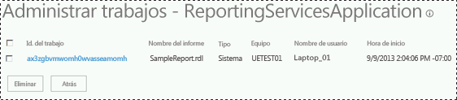

# <a name="manage-a-reporting-services-sharepoint-service-application"></a>Administrar una aplicación de servicio de SharePoint de Reporting Services

[!INCLUDE[ssrs-appliesto](../../includes/ssrs-appliesto.md)] [!INCLUDE[ssrs-appliesto-2016](../../includes/ssrs-appliesto-2016.md)] [!INCLUDE[ssrs-appliesto-sharepoint-2013-2016i](../../includes/ssrs-appliesto-sharepoint-2013-2016.md)] [!INCLUDE[ssrs-appliesto-not-pbirsi](../../includes/ssrs-appliesto-not-pbirs.md)]

[!INCLUDE [ssrs-previous-versions](../../includes/ssrs-previous-versions.md)]

  Las aplicaciones de servicio de [!INCLUDE[ssRSnoversion](../../includes/ssrsnoversion-md.md)] se administran desde Administración central de SharePoint. Las páginas Administración y Propiedades permiten actualizar la configuración de la aplicación de servicio así como las tareas de administración comunes.  

> [!NOTE]
> La integración de Reporting Services con SharePoint ya no está disponible a partir de SQL Server 2016.

## <a name="open-service-application-properties-page"></a>Abrir la página de propiedades de la aplicación de servicio

 Para abrir la página de propiedades de una aplicación de servicio de [!INCLUDE[ssRSnoversion](../../includes/ssrsnoversion-md.md)] , haga lo siguiente:  
  
1.  En Administración central, en el grupo Administración de aplicaciones, haga clic en **Administrar aplicaciones de servicio**.  
  
2.  Haga clic junto al nombre de la aplicación de servicio o en la columna **tipo** (para seleccionar toda la columna) y después haga clic en **Propiedades** en la cinta de opciones de SharePoint.  
  
 Para más información acerca de las propiedades de la aplicación del servicio, vea [Paso 3: Crear una aplicación de servicio de Reporting Services](../../reporting-services/install-windows/install-the-first-report-server-in-sharepoint-mode.md#bkmk_create_serrviceapplication).  
  
## <a name="open-service-application-management-pages"></a>Abrir las páginas de administración de aplicaciones de servicio

 Para abrir las páginas de administración de una aplicación de servicio de [!INCLUDE[ssRSnoversion](../../includes/ssrsnoversion-md.md)] , haga lo siguiente:  
  
1.  En Administración central, en el grupo Administración de aplicaciones, haga clic en **Administrar aplicaciones de servicio**.  
  
2.  Haga clic en el nombre de la aplicación de servicio y la página **Administrar la aplicación de Reporting Services** se abrirá.  
  
3.  También puede hacer clic en el nombre o en la columna **tipo** de la aplicación de servicio (para seleccionar toda la fila) y después hacer clic en **Administrar** en la cinta de opciones de SharePoint.  
  
## <a name="system-settings-page"></a>Página Configuración del sistema

 La página de configuración del sistema le permite configurar el comportamiento y la experiencia del usuario de la aplicación de servicio, incluidos diversos tiempos de espera.
  
### <a name="report-settings"></a>Configuración del informe
  
|Configuración|Comentarios|  
|-------------|--------------|  
|Tiempo de espera de imágenes externas|El valor predeterminado es 600 segundos.|  
|Compresión de instantáneas|El valor predeterminado es SQL.|  
|Tiempo de espera del informe del sistema|El valor predeterminado es 1800 segundos.<br /><br /> Especifique si el procesamiento del informe debe terminar en el servidor de informes después de que hayan transcurrido un número de segundos concreto. Este valor se aplica al procesamiento de informes en un servidor de informes. No afecta al procesamiento de los datos del servidor de base de datos que proporciona los datos del informe. El temporizador de procesamiento del informe empieza cuando se selecciona el informe y termina cuando éste se abre. El valor especificado debe ser el suficiente para completar el procesamiento de datos y el procesamiento de informes.|  
|Límite de instantánea del sistema|El valor predeterminado es -1, que indica que no hay límite.<br /><br /> Establezca un valor predeterminado aplicable a todo el sitio para el número de copias del historial del informe que deben guardarse. El valor predeterminado es un valor de configuración inicial que establece el número de instantáneas que pueden almacenarse para cada informe. Puede especificar distintos límites en las páginas de propiedades de informes específicos.|  
|Duración de los parámetros almacenados|El valor predeterminado es 180.|  
|Umbral de parámetros almacenados|El valor predeterminado es 1500 días.|  
  
### <a name="session-settings"></a>Configuración de sesión
  
|Configuración|Comentarios|  
|-------------|--------------|  
|Tiempo de espera de sesión|El valor predeterminado es 600 segundos.|  
|Usar cookies de sesión|El valor predeterminado es TRUE.|  
|Tiempo de espera del informe de EDLX|El valor predeterminado es 1800 segundos.|  
  
### <a name="system-settings-for-logging"></a>Configuración del sistema para el registro
  
|Configuración|Comentarios|  
|-------------|--------------|  
|Habilitar el registro de la ejecución|El valor predeterminado es TRUE.<br /><br /> Especifique si el servidor de informes genera registros de seguimiento y el número de días que debe guardarse el registro. . Los registros se almacenan en el equipo del servidor de informes, en la carpeta \Microsoft SQL Server\MSSQL.n\ReportServer\Log. Se inicia un nuevo archivo de registro cada vez que se reinicia el servicio. Para obtener más información acerca de los archivos de registro, vea [Report Server Service Trace Log](../../reporting-services/report-server/report-server-service-trace-log.md).|  
|Días de almacenamiento del registro de ejecución|El valor predeterminado es 60 días.|  
  
 [!INCLUDE[ssRSnoversion](../../includes/ssrsnoversion-md.md)] admite el registro ULS de SharePoint.  Para obtener más información, vea [Activar eventos de Reporting Services para el registro de seguimiento de SharePoint &#40;ULS&#41;](../../reporting-services/report-server/turn-on-reporting-services-events-for-the-sharepoint-trace-log-uls.md)  
  
### <a name="security-settings"></a>Configuración de seguridad
  
|Configuración|Comentarios|  
|-------------|--------------|  
|Habilitar la seguridad integrada|El valor predeterminado es TRUE.<br /><br /> Especifica si puede realizarse una conexión a un origen de datos de informe con el token de seguridad de Windows del usuario que solicitó el informe.|  
|Habilitar la definición de informe de carga|El valor predeterminado es TRUE.|  
|Habilitar los errores remotos|El valor predeterminado es FALSE.|  
|Habilitar los errores detallados de la conexión de prueba|El valor predeterminado es TRUE.|  
  
### <a name="client-settings"></a>Configuración de cliente
  
|Configuración|Comentarios|  
|-------------|--------------|  
|Habilitar la descarga del Generador de informes|El valor predeterminado es TRUE.<br /><br /> Especifica si los clientes pueden ver el botón para descargar la aplicación del Generador de informes.|  
|URL de inicio del Generador de informes|Especifique una dirección URL personalizada si el servidor de informes no utiliza la dirección URL predeterminada del Generador de informes. Esta configuración es opcional. Si no especifica un valor, se usará la dirección URL predeterminada, que inicia el Generador de informes. Para iniciar el Generador de informes 3.0 como aplicación ClickOnce, escriba el valor siguiente: https://\<nombreDeEquipo>/ReportServer/ReportBuilder/ReportBuilder_3_0_0_0.application.|  
|Habilitar la impresión de cliente|El valor predeterminado es TRUE.<br /><br /> Especifica si los usuarios pueden descargar el control del lado cliente, que proporciona opciones de impresión.|  
|Tiempo de espera de sesión de edición|El valor predeterminado es 7200 segundos.|  
|Límite de caché de sesión de edición|El valor predeterminado es 5.|  
  
## <a name="manage-jobs"></a>Trabajos de administración

 Puede ver y eliminar los trabajos en ejecución, por ejemplo, los que las suscripciones de informe y las suscripciones controladas por datos crean. La página no se usa para administrar suscripciones sino los trabajos que una suscripción desencadena. Para obtener un ejemplo de suscripción programada para ejecutarse una vez a la hora, generará un trabajo una vez a la hora que aparece en la página **Administrar trabajos** .  
  
   
  
## <a name="key-management"></a>Administración de claves
 En la tabla siguiente se muestran las páginas de administración de claves.  
  
> [!IMPORTANT]  
>  Cambiar periódicamente la clave de cifrado de Reporting Services es una práctica recomendada de seguridad. El momento recomendado para cambiar la clave es el inmediatamente posterior a una actualización de versión principal de Reporting Services. Si se cambia la clave después de una actualización se minimiza la interrupción del servicio adicional que ocasiona el cambio de la clave de cifrado de Reporting Services fuera del ciclo de actualización.  
  
|Página|Descripción|  
|----------|-----------------|  
|Copia de seguridad de clave de cifrado|1) Escriba una contraseña en los cuadros **Contraseña** y **Confirmar contraseña** , y haga clic en **Exportar**. Verá una advertencia si la contraseña especificada no satisface los requisitos de complejidad de la directiva de dominio.<br /><br /> 2) Se le pedirá una ubicación para guardar el archivo de claves. Considere la posibilidad de almacenar el archivo de claves en un equipo distinto del que ejecuta [!INCLUDE[ssRSnoversion](../../includes/ssrsnoversion-md.md)]. El nombre de archivo predeterminado es el mismo que el de la aplicación de servicio.|  
|Restaurar clave de cifrado|1) Escriba o busque el archivo de claves en el cuadro **Ubicación del archivo** .<br /><br /> 2) En el cuadro **Contraseña** , escriba la contraseña que ha usado para realizar la copia de seguridad del archivo de cifrado.<br /><br /> 3) Haga clic en **Aceptar**.|  
|Cambiar la clave de cifrado|Esta operación creará una nueva clave y volverá a cifrar el contenido cifrado. Si tiene mucho contenido, esta operación puede durar varias horas.<br /><br /> Cuando se complete la operación de cambio de la clave de cifrado, es recomendable que haga una copia de seguridad de la nueva clave.|  
|Contenido cifrado eliminado|El contenido eliminado no se puede recuperar.<br /><br /> **\*\* Importante \*\*** La acción de eliminar y volver a crear la clave simétrica no puede revertirse ni deshacerse. Eliminar o regenerar la clave puede tener consecuencias importantes en la instalación actual. Si elimina la clave, los datos existentes cifrados con la clave simétrica también se eliminan. Entre los datos eliminados se incluyen cadenas de conexión a orígenes de datos de informes externos, cadenas de conexión almacenadas y algunos datos de suscripción.|  

## <a name="execution-account"></a>Cuenta de ejecución

 Utilice esta página para configurar una cuenta que se utilizará en el procesamiento en modo desatendido. Esta cuenta se utiliza bajo circunstancias especiales cuando no están disponibles otros orígenes de credenciales:  
  
-   Cuando el servidor de informes se conecta a un origen de datos que no requiere credenciales. Entre los ejemplos de orígenes de datos que quizás no exijan credenciales se incluyen los documentos XML y algunas aplicaciones de base de datos del lado cliente.  
  
-   Cuando el servidor de informes se conecta a otro servidor para recuperar archivos de imágenes u otros recursos externos a los que se hace referencia en un informe.  

 La configuración de esta cuenta es opcional, aunque si no se configura, se limita el uso de las conexiones e imágenes externas a algunos orígenes de datos. Cuando se recuperan archivos de imagen externos, el servidor de informes comprueba si se puede realizar una conexión anónima. Si la conexión está protegida por contraseña, el servidor de informes utiliza la cuenta de procesamiento desatendido de informes para conectar con el servidor remoto. Cuando se recuperan datos de un informe, el servidor de informes suplanta al usuario actual, solicita al usuario que proporcione credenciales, utiliza credenciales almacenadas o utiliza la cuenta de procesamiento desatendido si la conexión de origen de datos especifica **Ninguno** como tipo de credencial. El servidor de informes no permite que sus credenciales de cuenta de servicio sean delegadas ni suplantadas cuando se realiza una conexión con otro equipo, por lo que tiene que utilizar la cuenta de procesamiento desatendido si no hay otras credenciales disponibles.  

 La cuenta que especifique debe ser distinta a la utilizada para ejecutar la cuenta de servicio. Si ejecuta el servidor de informes en una implementación que admita la ampliación a varios servidores, debe configurar esta cuenta del mismo modo en cada servidor de informes.  

 Puede utilizar cualquier cuenta de usuario de Windows. Para obtener mejores resultados, elija una cuenta que tenga permisos de lectura y de inicio de sesión en red para que admita conexiones con otros equipos. Debe tener permisos de lectura para todas las imágenes o archivos de datos externos que desee utilizar en sus informes. No especifique ninguna cuenta local a no ser que todos los orígenes de datos de informe e imágenes externas estén almacenados en el equipo del servidor de informes. Utilice la cuenta solo para el procesamiento de informes en modo desatendido.  

 ### <a name="powershell-command"></a>Comando de PowerShell

 A continuación, se ofrece un ejemplo de comando de PowerShell para devolver la lista de aplicaciones de servicio de [!INCLUDE[ssRSnoversion](../../includes/ssrsnoversion-md.md)] con la propiedad UEAccount:  

```
Get-SPRSServiceApplication | select typename, name, service, ueaccountname  
```

 Para obtener más información, vea [Cmdlets de PowerShell para el modo de SharePoint de Reporting Services](../../reporting-services/report-server-sharepoint/powershell-cmdlets-for-reporting-services-sharepoint-mode.md).  

### <a name="options"></a>Opciones

 **Especificar una cuenta de ejecución**  
 Seleccione para especificar una cuenta.  
  
 **Cuenta**  
 Especifique una cuenta de usuario de dominio de Windows. Use este formato: *\<dominio>\\<cuenta de usuario\>* .  
  
 **Contraseña**  
 Escriba la contraseña.  
  
 **Confirmar contraseña**  
 vuelva a escribir la contraseña.  

## <a name="e-mail-settings"></a>Configuración de correo electrónico

 Utilice esta página para especificar la configuración del Protocolo simple de transferencia de correo (SMTP) que habilita la entrega de correo electrónico del servidor de informes desde este. Puede utilizar la extensión de entrega por correo electrónico del servidor de informes para distribuir informes o notificaciones de procesamiento de informes a través de suscripciones por correo electrónico. La extensión de entrega por correo electrónico del servidor de informes requiere un servidor SMTP y una dirección de correo electrónico para el campo De:.  

### <a name="options"></a>Opciones

 **Utilizar servidor SMTP**  
 Especifica que el correo electrónico del servidor de informes se enruta a través de un servidor SMTP.  
  
 **Servidor SMTP de salida**  
 Especifique el servidor SMTP o la puerta de enlace que se va a usar. Puede utilizar un servidor local o un servidor SMTP en la red.  
  
 **Remitente**  
 Especifica la dirección de correo electrónico que se utiliza en el campo De: de un mensaje de correo electrónico generado. Debe especificar una cuenta de usuario que tenga permiso para enviar correo desde el servidor SMTP.  

## <a name="provision-subscriptions-and-alerts"></a>Aprovisionar suscripciones y alertas

 Utilice esta página para comprobar si el Agente SQL Server se está ejecutando y está proporcionando acceso a Reporting Services. El Agente SQL Server es necesario para las suscripciones, programaciones y alertas de datos de [!INCLUDE[ssRSnoversion](../../includes/ssrsnoversion-md.md)] . [Aprovisionamiento de subscripciones y alertas para aplicaciones de servicio de SSRS](../../reporting-services/install-windows/provision-subscriptions-and-alerts-for-ssrs-service-applications.md)  

## <a name="proxy-association"></a>Asociación del proxy

 Cuando creó la aplicación de servicio de Reporting Services, seleccionó la aplicación web para asociar y proporcionar permisos de acceso a la aplicación. Si decidió no crear una asociación o si desea cambiar la asociación, puede usar el procedimiento siguiente.  
  
1.  En Administración central de SharePoint, en Administración de aplicaciones, haga clic en **Configurar las asociaciones de aplicación de servicio**.  
  
2.  En la página Asociaciones de aplicaciones de servicio, cambie la vista a **Aplicaciones de servicio**.  
  
3.  Busque el nombre de la nueva aplicación de servicio de [!INCLUDE[ssRSnoversion](../../includes/ssrsnoversion-md.md)] y haga clic en él. Puede hacer clic en el **valor predeterminado** del nombre del grupo de proxy de aplicación para agregar el proxy al grupo predeterminado en lugar de completar los pasos siguientes.  
  
4.  Seleccione **Personalizado** en el cuadro de selección **Editar el siguiente grupo de conexiones**.  
  
5.  Active la casilla correspondiente al proxy y haga clic en **Aceptar**.  
  
¿Tiene alguna pregunta más? [Puede plantear sus dudas en el foro de Reporting Services](https://go.microsoft.com/fwlink/?LinkId=620231).
