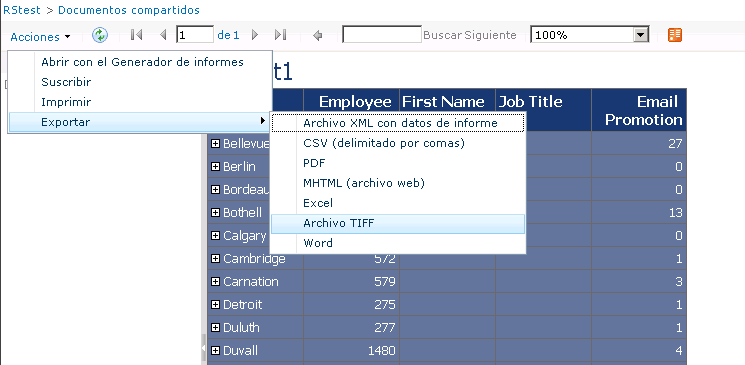

# Elemento web Visor de informes en un sitio de SharePoint
  El elemento web del Visor de informes es un elemento web personalizado que se instala mediante el complemento [!INCLUDE[ssRSnoversion](../../includes/ssrsnoversion-md.md)] para productos de SharePoint. Puede usar el elemento web para ver, navegar, imprimir y exportar informes en un servidor de informes configurado para ejecutarse en el modo integrado de SharePoint. El elemento web Visor de informes está asociado a archivos de definición de informe (.rdl) que procesa el servidor de informes de [!INCLUDE[msCoName](../../includes/msconame-md.md)] [!INCLUDE[ssNoVersion](../../includes/ssnoversion-md.md)] [!INCLUDE[ssRSnoversion](../../includes/ssrsnoversion-md.md)] . No puede usarlo con otros documentos de informe creados en otros productos de software.  
  
 Para instalar el elemento web, debe ejecutar la instalación para el complemento [!INCLUDE[ssRSnoversion](../../includes/ssrsnoversion-md.md)] . No debería instalar o desinstalar el elemento web independientemente. Forma parte del complemento y solamente se puede instalar mediante el paquete de instalación del complemento. El nombre de archivo del elemento web Visor de informes es ReportViewer.dwp. Se encuentra en la carpeta Archivos de programa\Archivos comunes\Microsoft Shared\web server extensions\12\template\features\reportserver y no se debería mover a otras carpetas.  
  
 Para usar el elemento web, debe tener instalado y configurado el complemento [!INCLUDE[ssRSnoversion](../../includes/ssrsnoversion-md.md)] y el servidor de informes debe estar configurado para la integración de SharePoint. También debe tener informes para mostrar en el visor. Solo se pueden abrir informes que estén en una biblioteca, una carpeta de la biblioteca, un historial de informes o un vínculo desde un elemento web Biblioteca a un elemento web Visor de informes. No puede abrir informes guardados como datos adjuntos a un elemento de una lista personalizada.  
  
 Puede establecer las propiedades del elemento web Visor de informes para controlar la apariencia de la barra de herramientas y las áreas de visualización, así como para vincular el elemento web a un informe concreto. En el Visor de informes se muestra un informe que se vincula explícitamente a él o bien, se muestra cualquier archivo .rdl que se abra.  
  
 No puede vincular varios informes con una sola instancia del Visor de informes, pero, si desea agrupar los informes, puede crear un panel o una página de elementos web que incruste varias instancias del elemento web Visor de informes en una sola página.  
  
 El elemento web incluye un área de visualización, una barra de herramientas, un área contraíble para establecer credenciales y parámetros, y propiedades. La siguiente imagen muestra el elemento web con el informe de ejemplo Company Sales y las opciones de exportación que puede seleccionar en la barra de herramientas.  
  
   
  
## Componentes del elemento web  
 En el área de visualización se muestra un informe en HTML. Según el modo en que el elemento web esté configurado, el área de visualización puede maximizarse para mostrar el informe en modo de página completa o bien puede compartir el espacio disponible con paneles adyacentes y una barra de herramientas.  
  
 La barra de herramientas proporciona características de navegación en páginas, búsqueda, zoom y exportación para poder ver un informe en otro formato de aplicación. También proporciona funciones de impresión opcionales, incluidas la salida impresa paginada de informes HTML y la capacidad de cambiar el diseño de página y la configuración de los márgenes. Las funciones**Abrir con el Generador de informes, Suscribir**, **Exportar**e **Imprimir** se proporcionan en el menú **Acciones** de la barra de herramientas. Los controles de navegación en páginas y zoom están directamente en la barra de herramientas.  
  
> [!NOTE]  
>  No puede personalizar la barra de herramientas a menos que escriba código para ello, pero puede establecer las propiedades para ocultar todos o algunos de sus controles.  
  
### Acción de exportación en la barra de herramientas de informe  
 La opción**Exportar** del menú **Acciones** muestra los formatos de aplicación asociados a extensiones de representación implementadas en un servidor de informes. Para determinar la disponibilidad de un formato específico, puede agregar o quitar una extensión de representación en el servidor de informes o bien puede modificar la configuración para quitar un formato de exportación determinado de la lista. También puede especificar la configuración en el servidor de informes para controlar los formatos que están disponibles. Puede modificar el comportamiento predeterminado de un formato concreto; para ello, agregue y modifique la configuración de esa extensión de representación.  
  
### Acción de impresión en la barra de herramientas de informe  
 La opción**Imprimir** del menú **Acciones** es la funcionalidad de impresión personalizada que se proporciona mediante [!INCLUDE[ssRSnoversion](../../includes/ssrsnoversion-md.md)]. Al hacer clic en **Imprimir**, se descarga un control de impresión del lado cliente ActiveX en el equipo cliente. En la mayoría de los casos, el usuario que hace clic en **Imprimir** debe tener permisos de administrador en el equipo local. Una práctica habitual es restringir las descargas de controles ActiveX solo a los usuarios que tienen permisos de administrador. Puede utilizar Administración central de SharePoint para habilitar o deshabilitar la descarga del control de impresión del lado cliente.  
  
### Acción de búsqueda en la barra de herramientas de informe  
 La opción**Buscar** del menú **Acciones** proporciona un método para desplazarse hasta una ubicación de destino del informe. Puede buscar contenido en un informe si escribe una palabra o frase que desee buscar. El valor máximo de un término de búsqueda es de 256 caracteres. Al encontrar un valor coincidente en el informe, el enfoque se desplaza a la parte del informe que contiene el valor.  
  
 Al especificar un valor para buscar, escriba el valor tal y como espera que aparezca en el informe. No plantee ninguna pregunta del tipo "¿cuál es el beneficio medio de este mes?", salvo que esté buscando una frase con todas estas palabras en el informe.  
  
 Solo puede buscar un término o un valor a la vez. No se pueden usar operadores de búsqueda (como **AND** u **OR**) ni símbolos y comodines. No puede realizar una búsqueda en una sección transversal de los datos (por ejemplo, no puede buscar el total de ventas de un producto determinado en un mes concreto). Para ese tipo de análisis, use el Generador de informes para crear informes click-through.  
  
 La configuración de seguridad de modelos y bases de datos que restringe el acceso a los datos de informe se aplica a las operaciones de búsqueda. Si está buscando un valor en un informe click-through que usa un modelo como origen de datos, y no dispone de acceso a parte del modelo, los datos representados por dicha parte del modelo se excluirán de la búsqueda.  
  
### Paneles para especificar credenciales y parámetros  
 Los paneles**Credenciales** y **Parámetros** aparecen al lado del área de visualización. **Credenciales** aparece cuando la conexión del origen de datos del informe está configurada para solicitar al usuario una cuenta y una contraseña con derechos de acceso al origen de datos. **Parámetros** aparece cuando el informe acepta la entrada del usuario para los parámetros definidos en el informe.  
  
### Establecer propiedades en el elemento web Visor de informes  
 Las propiedades del elemento web son propiedades personalizadas específicas para el Visor de informes y propiedades generales que puede establecer para cualquier elemento web. Para obtener más información, vea [Personalizar el elemento web Visor de informes](../../reporting-services/report-server-sharepoint/customize-the-report-viewer-web-part.md).  
  
 De manera predeterminada, los informes se abren en modo de página completa. En el modo de página completa se muestra la barra de herramientas que proporciona las funciones de navegación en páginas, búsqueda y otras. Puede personalizar el elemento web para cambiar la apariencia o el comportamiento predeterminado.  
  
## Vea también  
 [Instalar o desinstalar el complemento Reporting Services para SharePoint](../../reporting-services/install-windows/install-or-uninstall-the-reporting-services-add-in-for-sharepoint.md)   
 [Agregar el elemento web Visor de informes a una página web &#40;Reporting Services en el modo integrado de SharePoint&#41;](../../reporting-services/report-server-sharepoint/add-the-report-viewer-web-part-to-a-web-page.md)  
  
  
