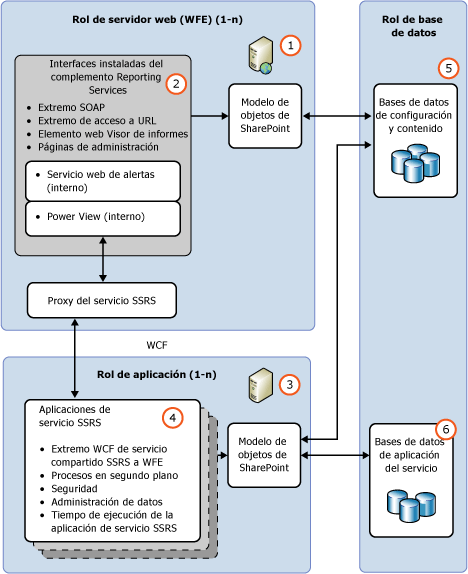

# Comparación de los servidores de informes de Reporting Services nativos y de SharePoint

[!INCLUDE[ssrs-appliesto](../../includes/ssrs-appliesto.md)] [!INCLUDE[ssrs-appliesto-2016-and-later](../../includes/ssrs-appliesto-2016-and-later.md)] [!INCLUDE[ssrs-appliesto-sharepoint-2013-2016i](../../includes/ssrs-appliesto-sharepoint-2013-2016.md)] [!INCLUDE[ssrs-appliesto-pbirsi](../../includes/ssrs-appliesto-pbirs.md)]

[!INCLUDE [ssrs-previous-versions](../../includes/ssrs-previous-versions.md)]

Obtenga información sobre la parte central de una instalación de [!INCLUDE[ssNoVersion](../../includes/ssnoversion-md.md)] Reporting Services. Consta de un motor de procesamiento junto con extensiones para agregar funcionalidad.

> [!NOTE]
> La integración de Reporting Services con SharePoint ya no está disponible a partir de SQL Server 2016.

Un servidor de informes de Reporting Services se ejecuta en uno de dos modos de implementación: modo nativo o modo de SharePoint. Consulte la sección [Comparación de características de SharePoint en modo nativo](#feature-comparison-of-sharepoint-and-native-mode) para obtener una comparación de las características.  
  
 **Instalación:** para obtener información sobre la instalación de Reporting Services, vea [Instalar Reporting Services](../install-windows/install-reporting-services.md).

## Información general de los modos del servidor de informes

 Los motores de procesamiento (procesadores) son el núcleo del servidor de informes. Los procesadores admiten la integridad del sistema de informes y no se pueden modificar ni ampliar. Las extensiones son también procesadores, pero realizan funciones muy específicas. Reporting Services incluye una o varias extensiones predeterminadas para cada tipo de extensión admitida. Puede agregar extensiones personalizadas a un servidor de informes. Ello permite extender un servidor de informes para que admita características que requieren adaptaciones. Ejemplos de funcionalidad personalizada pueden ser la compatibilidad con tecnologías de inicio de sesión único, la salida de informes en formatos de aplicación no controlados por las extensiones de representación predeterminadas, y la entrega de informes a una impresora o aplicación.  
  
 Una instancia de servidor de informes único se define como el conjunto completo de procesadores y extensiones que proporcionan el procesamiento de un extremo a otro, desde el control de la solicitud inicial a la presentación de un informe acabado. A través de sus subcomponentes, el servidor de informes procesa solicitudes de informes y permite que los informes estén disponibles para el acceso a petición o la distribución programada.  
  
 Por lo que respecta a su funcionalidad, los servidores de informes permiten crear, representar y entregar informes en una gran variedad de orígenes de datos, así como de esquemas de autenticación y autorización extensibles. Además, los servidores de informes contienen las bases de datos del servidor de informes que almacenan informes publicados, orígenes de datos compartidos, conjuntos de datos compartidos, elementos de informes, programaciones compartidas, suscripciones, archivos de origen de definición de informes, definiciones de modelos, informes compilados, instantáneas, parámetros y otros recursos. Los servidores de informes permiten además realizar tareas de administración para configurar el servidor de informes a fin de procesar las solicitudes de informes y mantener los historiales de instantáneas, así como administrar los permisos de los informes, los orígenes de datos, los conjuntos de datos y las suscripciones.  
  
 Un servidor de informes de Reporting Services admite dos modos de implementación de las instancias del servidor de informes:  
  
-   **Modo nativo**: incluido el modo nativo con elementos web de SharePoint, donde un servidor de informes se ejecuta como un servidor de aplicaciones que proporciona todas las funcionalidades de procesamiento y administración exclusivamente a través de los componentes de Reporting Services. Para configurar un servidor de informes en modo nativo se usa el administrador de configuración de Reporting Services y SQL Server Management Studio.  
  
-   **Modo de SharePoint**: donde un servidor de informes se instala como parte de una granja de servidores de SharePoint.  Implemente y configure el modo de SharePoint mediante comandos de PowerShell o páginas de administración de contenido de SharePoint.  
  
 En SQL Server Reporting Services, no se puede cambiar un servidor de informes de un modo a otro. Si desea cambiar el tipo de servidor de informes que usa su entorno, debe instalar el modo que desee y, a continuación, copiar o mover los elementos de informe o la base de datos del servidor de informes de la versión anterior a la nueva. Este proceso se conoce normalmente como "migración". Los pasos necesarios para la migración dependen del modo al que se realice la migración y la versión desde la que se migre. Para obtener más información, vea [Upgrade and Migrate Reporting Services](../../reporting-services/install-windows/upgrade-and-migrate-reporting-services.md).  
  
## Comparación de características de SharePoint en modo nativo
  
|Componente o característica|en modo nativo|Modo de SharePoint|  
|--------------------------|-----------------|---------------------|  
|**Direcciones URL**|Sí|El direccionamiento de direcciones URL es distinto en el modo integrado de SharePoint. Las direcciones URL de SharePoint se utilizan para hacer referencia a informes, modelos de informe, orígenes de datos compartidos y recursos. No se utiliza la jerarquía de carpetas del servidor de informes. Si tiene aplicaciones personalizadas que dependen del acceso de direcciones URL como las admitidas en un servidor de informes en modo nativo, esa funcionalidad ya no funcionará cuando el servidor de informes se configure para la integración de SharePoint.   Para más información sobre el acceso URL, vea [Referencia de parámetros de acceso URL](../../reporting-services/url-access-parameter-reference.md).|  
|**Extensiones de seguridad personalizadas**|Sí|Las extensiones de seguridad personalizadas de Reporting Services no se pueden implementar ni usar en el servidor de informes. El servidor de informes incluye una extensión de seguridad para fines especiales que se utiliza siempre que se configura un servidor de informes para que se ejecute en el modo integrado de SharePoint. Esta extensión de seguridad es un componente interno que se requiere para las operaciones integradas.|  
|**Administrador de configuración**|Sí|**\*\* Importante \*\*** El Administrador de configuración no se puede usar para administrar un servidor de informes en modo de SharePoint. En su lugar, utilice Administración central de SharePoint.|  
|**Portal web**|Sí|No se puede administrar el modo de SharePoint en el portal web. Use las páginas de aplicación de SharePoint. Para obtener más información, vea [Aplicaciones de servicio y servicio de SharePoint de Reporting Services](../../reporting-services/report-server-sharepoint/reporting-services-sharepoint-service-and-service-applications.md).|  
|**Informes vinculados**|Sí|No.|  
|**Mis informes**|Sí|No|  
|**Mis suscripciones** y métodos de procesamiento por lotes.|Sí|No|  
|**Alertas de datos**|No|Sí|  
|**Power View**|No|Sí   Requiere Silverlight en el explorador cliente. Para más información sobre los requisitos del explorador, vea [Compatibilidad del explorador de Reporting Services y Power View](../../reporting-services/browser-support-for-reporting-services-and-power-view.md).|  
|**Informes .RDL**|Sí|Sí   Los informes .RDL se pueden ejecutar en servidores de informes de Reporting Services en modo nativo o en modo de SharePoint.|  
|**Informes .RDLX**|No|Sí   Los informes .RDLX de Power View solo se pueden ejecutar en servidores de informes de Reporting Services en modo de SharePoint.|  
|**Credenciales de token de usuario de SharePoint para la extensión de lista de SharePoint**|No|Sí|  
|**Zonas de AAM para implementaciones con conexión a Internet**|No|Sí|  
|**Copias de seguridad y recuperación de SharePoint**|No|Sí|  
|**Compatibilidad con registros de ULS**|No|Sí|  
  
## en modo nativo

 En el modo nativo, un servidor de informes es un servidor de aplicaciones independiente que proporciona todas las operaciones de visualización, administración, procesamiento y entrega de informes y modelos de informe. Se trata del modo predeterminado para las instancias del servidor de informes. Puede instalar un servidor de informes en modo nativo que se configure durante la instalación o puede configurarlo para las operaciones en modo nativo una vez completado el programa de instalación.  
  
 En el diagrama siguiente se muestra la arquitectura de tres niveles de una implementación en modo nativo de Reporting Services. Muestra la base de datos del servidor de informes y los orígenes de datos en el nivel de datos, los componentes del servidor de informes en el nivel intermedio y las aplicaciones cliente y herramientas integradas o personalizadas en el nivel de presentación. Presenta el flujo de solicitudes y datos entre componentes del servidor y los componentes que envían y recuperan contenido de un almacén de datos.  
  
   
  
 El servidor de informes se implementa como un servicio de [!INCLUDE[msCoName](../../includes/msconame-md.md)] Windows, denominado "servicio del servidor de informes", que hospeda un servicio web, el procesamiento en segundo plano y otras operaciones. En la aplicación de consola Servicios, el servicio se muestra como SQL Server Reporting Services (MSSQLSERVER).  
  
 Los programadores de otros fabricantes pueden crear extensiones adicionales para reemplazar o ampliar la capacidad de procesamiento del servidor de informes. Para obtener más información acerca de las interfaces de programación disponibles para los desarrolladores de aplicaciones, vea la [Referencia técnica](../../reporting-services/technical-reference-ssrs.md).  
  
### Modo nativo con elementos web de SharePoint

 Reporting Services proporciona dos elementos web que se pueden instalar y registrar en una instancia de [!INCLUDE[winSPServ](../../includes/winspserv-md.md)] 2.0 o posterior, o bien en SharePoint Portal Server 2003 o posterior. Desde un sitio de SharePoint, puede usar los elementos web para buscar y ver informes almacenados y procesados en el servidor de informes que se ejecuta en modo nativo. Estos elementos web se incluyeron en versiones anteriores de Reporting Services.  
  
## Modo de SharePoint

 En el modo de SharePoint, un servidor de informes se debe ejecutar en una granja de servidores de SharePoint. Las características de administración, representación y procesamiento del servidor de informes se representan mediante un servidor de aplicaciones de Reporting Services SharePoint que ejecuta el servicio compartido de SharePoint y una o varias aplicaciones de servicio de Reporting Services. Un sitio de SharePoint proporciona el acceso front-end al contenido y las operaciones del servidor de informes.  
  
 El modo de SharePoint requiere:  
  
-   [!INCLUDE[SPF2010](../../includes/spf2010-md.md)] o [!INCLUDE[SPS2010](../../includes/sps2010-md.md)].  
  
-   Una versión adecuada del Complemento de Reporting Services para productos de SharePoint 2010.  
  
-   Un servidor de aplicaciones de SharePoint con el servicio compartido Reporting Services instalado y al menos una aplicación del servicio Reporting Services.  
  
 En la ilustración siguiente se muestra un entorno de Reporting Services en modo de SharePoint:  
  
   
  
||Descripción|  
|-|-----------------|  
|**(1)**|Varios servidores web o front-end web (WFE). El complemento de Reporting Services se debe instalar en cada servidor web cuyas características de aplicaciones web quiere usar, por ejemplo, la visualización de informes o páginas de administración de Reporting Services para tareas como administrar los orígenes de datos o las suscripciones.|  
|**(2)**|El complemento instala los puntos de conexión SOAP y las direcciones URL para que los clientes se comuniquen con los servidores de aplicaciones a través de un proxy de servicio de Reporting Services.|  
|**(3)**|Los servidores de aplicaciones ejecutan el servicio compartido Reporting Services. La escalabilidad horizontal del procesamiento de informes se administra como parte de la granja de SharePoint y agregando el servicio Reporting Services a servidores de aplicaciones adicionales.|  
|**(4)**|Se puede crear más de una aplicación de servicio de Reporting Services con diferentes configuraciones, incluidos permisos, correo electrónico, proxy y suscripciones.|  
|**(5)**|Los informes, orígenes de datos, y otros elementos se almacenan en las bases de datos de contenido de SharePoint.|  
|**(6)**|Las aplicaciones de servicio de Reporting Services crean tres bases de datos para las características de alertas de datos, temporales y el servidor de informes. Las opciones de configuración que se aplican a todas las aplicaciones de servicio de SSRS se almacenan en el archivo **RSReportserver.config** .|  
  
## Proceso de informes y proceso de entrega y programación

 El servidor de informes incluye dos motores de procesamiento que realizan el procesamiento de informes previo e intermedio, así como operaciones programadas y de entrega. El Procesador de informes recupera la definición o el modelo de informe, combina información de diseño con datos de la extensión de procesamiento de datos y representa el informe en el formato solicitado. El proceso de entrega y programación procesa los informes desencadenados a partir de una programación y los entrega a los destinos.  
  
## Base de datos del servidor de informes

 El servidor de informes es un servidor sin estado que almacena todas las propiedades, objetos y metadatos de una base de datos de [!INCLUDE[ssNoVersion](../../includes/ssnoversion-md.md)] . Los datos almacenados incluyen informes publicados, informes compilados, modelos de informe y la jerarquía de carpetas que proporciona el direccionamiento de todos los elementos que administra el servidor de informes. Una base de datos del servidor de informes puede proporcionar almacenamiento interno para una única instalación de Reporting Services o para varios servidores de informes que formen parte de la implementación escalada. Si configura un servidor de informes para ejecutarse en una implementación más amplia de un producto o tecnología de SharePoint, el servidor de informes usa las bases de datos de SharePoint además de la base de datos del servidor de informes. Para más información sobre los almacenes de datos usados en la instalación de Reporting Services, vea [Base de datos del servidor de informes &#40;Modo nativo de SSRS&#41;](../../reporting-services/report-server/report-server-database-ssrs-native-mode.md).  
  
## Autenticación, representación, datos y extensiones de entrega

 El servidor de informes admite los siguientes tipos de extensiones: extensiones de autenticación, extensiones de procesamiento de datos, extensiones de procesamiento de informes, extensiones de representación y extensiones de entrega. Un servidor de informes requiere al menos una extensión de autenticación, una extensión de procesamiento de datos y una extensión de representación. Las extensiones de procesamiento de informes personalizadas y de entregas son opcionales, pero necesarias si desea admitir controles personalizados o de distribución de informes.  
  
 Reporting Services proporciona extensiones predeterminadas para que se puedan utilizar todas las características de servidor sin tener que desarrollar componentes personalizados. En la tabla siguiente se describen las extensiones predeterminadas que contribuyen a una instancia del servidor de informes completa con la funcionalidad lista para su uso:  
  
|Tipo|Valor predeterminado|  
|----------|-------------|  
|Authentication|Una instancia del servidor de informes predeterminada admite la autenticación de Windows, incluso las características de suplantación y delegación si están habilitadas en el dominio.|  
|Procesamiento de datos|Una instancia del servidor de informes predeterminada incluye extensiones de procesamiento de datos para orígenes de datos [!INCLUDE[ssNoVersion](../../includes/ssnoversion-md.md)], [!INCLUDE[ssASnoversion](../../includes/ssasnoversion-md.md)], Oracle, Hyperion Essbase, SAPBW, OLE DB, Almacenamiento de datos paralelo y ODBC.|  
|Representación|Una instancia del servidor de informes predeterminada incluye extensiones de representación para HTML, Excel, CSV, XML, Image, Word, lista SharePoint y PDF.|  
|Entrega|Una instancia de servidor de informes predeterminada contiene una extensión de entrega por correo electrónico y una extensión de entrega a recursos compartidos de archivos. Si el servidor de informes se configura para la integración de SharePoint, puede utilizar una extensión de entrega que guarde los informes en una biblioteca de SharePoint.|  
  
> [!NOTE]  
>  Reporting Services incluye un completo conjunto de herramientas y aplicaciones que se pueden utilizar para administrar el servidor, crear contenido y poner el contenido a disposición de los usuarios de la organización.  
  
## Tareas relacionadas

 Los artículos siguientes proporcionan información adicional sobre cómo instalar, usar y mantener un servidor de informes:  
  
|Tarea|Vínculo|  
|----------|----------|  
|Revisar los requisitos de hardware y software.|[Hardware and Software Requirements for Reporting Services in SharePoint Mode](https://msdn.microsoft.com/library/ed91877d-4f74-4266-a932-b824b4810c99).|  
|Instale Reporting Services en modo de SharePoint.|[Instalar el modo de SharePoint de Reporting Services para SharePoint 2010](https://docs.microsoft.com/sql/reporting-services/install-windows/install-the-first-report-server-in-sharepoint-mode)|  
|Explica cómo ajustar la configuración de memoria para el servicio web del servidor de informes y el servicio de Windows.|[Configuración de la memoria disponible para las aplicaciones del servidor de informes](../../reporting-services/report-server/configure-available-memory-for-report-server-applications.md)|  
|Explica los pasos recomendados para configurar el servidor de informes para la administración remota.|[Configuración de un servidor de informes para la administración remota](../../reporting-services/report-server/configure-a-report-server-for-remote-administration.md)|  
|Proporciona instrucciones para configurar la disponibilidad de **Mis informes** en una instancia del servidor de informes nativo.|[Habilitar y deshabilitar Mis informes](../../reporting-services/report-server/enable-and-disable-my-reports.md)|  
|Proporciona las instrucciones para configurar el control RSClientPrint que proporciona la funcionalidad de impresión desde dentro de los exploradores admitidos. Para más información sobre los requisitos del explorador, vea [Compatibilidad del explorador de Reporting Services y Power View](../../reporting-services/browser-support-for-reporting-services-and-power-view.md).|[Habilitar y deshabilitar la impresión del lado cliente para Reporting Services](../../reporting-services/report-server/enable-and-disable-client-side-printing-for-reporting-services.md)|  

## Pasos siguientes

[Extensiones de Reporting Services](../../reporting-services/extensions/reporting-services-extensions.md)   
[Herramientas de Reporting Services](../../reporting-services/tools/reporting-services-tools.md)   
[Suscripciones y entrega &#40;Reporting Services&#41;](../../reporting-services/subscriptions/subscriptions-and-delivery-reporting-services.md)   
[Base de datos del servidor de informes &#40;Modo nativo de SSRS&#41;](../../reporting-services/report-server/report-server-database-ssrs-native-mode.md)   
[Implementación de una extensión de seguridad](../../reporting-services/extensions/security-extension/implementing-a-security-extension.md)   
[Implementar una extensión de procesamiento de datos](../../reporting-services/extensions/data-processing/implementing-a-data-processing-extension.md)   
[Orígenes de datos admitidos por Reporting Services &#40;SSRS&#41;](../../reporting-services/report-data/data-sources-supported-by-reporting-services-ssrs.md)   

¿Tiene alguna pregunta más? [Puede plantear sus dudas en el foro de Reporting Services](https://go.microsoft.com/fwlink/?LinkId=620231).
