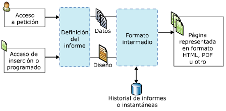

# Conceptos de Reporting Services (SSRS)
  En este tema se proporciona un breve resumen de los conceptos de [!INCLUDE[ssNoVersion](../includes/ssnoversion-md.md)] [!INCLUDE[ssRSnoversion](../includes/ssrsnoversion-md.md)] .  
  
 **[!INCLUDE[applies](../includes/applies-md.md)]**  [!INCLUDE[ssRSnoversion](../includes/ssrsnoversion-md.md)] | Modo de SharePoint de [!INCLUDE[ssRSnoversion](../includes/ssrsnoversion-md.md)]    
  
##   Conceptos del servidor de informes  
 Un servidor de informes es un equipo que tiene instalada una instancia de [!INCLUDE[ssRSnoversion](../includes/ssrsnoversion-md.md)] . Un servidor de informes almacena internamente elementos como informes paginados y móviles, elementos y recursos relacionados con informes, programaciones y suscripciones. Un servidor de informes se puede configurar como un único servidor independiente o como una granja escalada, o se puede integrar con SharePoint Server. Se interactúa con los elementos del servidor de informes mediante el servicio web [!INCLUDE[ssRSnoversion](../includes/ssrsnoversion-md.md)] , un proveedor WMI, acceso mediante dirección URL o mediante programación a través de scripts. La forma en que interactúa con un servidor de informes depende de la topología de implementación y la configuración.  
  
### Servidores de informes en modo nativo
 Un servidor de informes configurado en modo nativo es un equipo que tiene [!INCLUDE[ssNoVersion](../includes/ssnoversion-md.md)] [!INCLUDE[ssRSnoversion](../includes/ssrsnoversion-md.md)] instalado y configurado como un servidor independiente. Para interactuar con el servidor de informes, los informes y los elementos relacionados con informes se usa un explorador con el [!INCLUDE[ssRSWebPortal](../includes/ssrswebportal.md)] o comandos de acceso mediante URL, SQL Server Management Studio o mediante programación a través de scripts. Para obtener más información, vea [Servidor de informes de Reporting Services &#40;modo nativo&#41;](../reporting-services/report-server/reporting-services-report-server-native-mode.md).  
  
### Servidores de informes en modo de SharePoint  
 Un servidor de informes integrado con SharePoint tiene dos configuraciones posibles. En [!INCLUDE[ssRSCurrent](../includes/ssrscurrent-md.md)], [!INCLUDE[ssRSnoversion](../includes/ssrsnoversion-md.md)] se instala con SharePoint Server como un servicio compartido de SharePoint. En versiones anteriores, el servidor de informes se integra con SharePoint Server instalando el complemento [!INCLUDE[ssRSnoversion](../includes/ssrsnoversion-md.md)] SharePoint. En ambos casos, para interactuar con el servidor de informes, los informes y los elementos relacionados con informes se usan páginas de aplicación del sitio de SharePoint. Se usa la biblioteca de documentos de SharePoint y otras bibliotecas que cree para almacenar los tipos de contenido relacionados con los informes. Para obtener más información, vea [Servidor de informes de Reporting Services &#40;modo de SharePoint&#41;](../reporting-services/report-server-sharepoint/reporting-services-report-server-sharepoint-mode.md).  
  
### Elementos del servidor de informes 
 Entre los elementos del servidor de informes se incluyen informes paginados y móviles, indicadores clave de rendimiento, orígenes de datos compartidos, conjuntos de datos compartidos y otros elementos que se pueden publicar, cargar o guardar en un servidor de informes. Organice los elementos en la estructura jerárquica de carpetas del servidor de informes en un servidor de informes nativo o en bibliotecas de contenido de SharePoint en un sitio de SharePoint. Para más información, vea [Administración de contenido del servidor de informes &#40;Modo nativo de SSRS&#41;](../reporting-services/report-server/report-server-content-management-ssrs-native-mode.md).  
  
### Carpetas
 En un servidor de informes nativo, las carpetas proporcionan la estructura jerárquica de navegación y las rutas de acceso de todos los elementos direccionables almacenados en un servidor de informes. Use la jerarquía de carpetas y los permisos de sitio y carpeta para ayudar a controlar el acceso a los elementos del servidor de informes, lo que se denomina *seguridad de nivel de elemento*. De forma predeterminada, las asignaciones de roles que define para carpetas específicas la heredan las carpetas secundarias de la jerarquía de carpetas. Si asigna determinados roles a una carpeta, las reglas de herencia ya no se aplican. La estructura de carpetas consta de un nodo raíz denominado **Inicio**y de carpetas reservadas compatibles con la característica opcional **Mis informes** . En un explorador, el nodo raíz es el nombre del directorio virtual del servidor de informes, por ejemplo, `http://myreportserver/reports`. Para obtener más información, vea [Folders](../reporting-services/report-server/report-server-content-management-ssrs-native-mode.md#bkmk_Folders).  
  
 En un sitio de SharePoint, use carpetas de SharePoint en bibliotecas de documentos y bibliotecas de contenido para organizar los elementos.  
  
### Roles y permisos
 En un servidor de informes nativo, el administrador del sistema del servidor de informes administra los permisos de acceso, configura el servidor de informes para procesar las solicitudes de informes, mantiene los historiales de instantánea, y administra los permisos para los informes, los orígenes de datos, los conjuntos de datos y las suscripciones. Por ejemplo, un informe publicado se protege mediante asignaciones de roles usando el modelo de seguridad basada en roles de [!INCLUDE[ssRSnoversion](../includes/ssrsnoversion-md.md)] . Para obtener más información, vea [Roles y permisos &#40;Reporting Services&#41;](../reporting-services/security/roles-and-permissions-reporting-services.md).  
  
 En un sitio de SharePoint, use la página de administradores de sitios de SharePoint para administrar los permisos de acceso a informes y a contenido de sitios relacionados con informes.  
  
### Programaciones
 En un servidor de informes nativo, es posible programar informes paginados, conjuntos de datos compartidos y suscripciones para recuperar datos y entregar informes y consultas de conjuntos de datos a horas determinadas o cuando haya menos carga de trabajo. Las programaciones pueden ejecutarse una sola vez o bien continuamente a intervalos de horas, días, semanas o meses. Para obtener más información, vea [Schedules](../reporting-services/subscriptions/schedules.md).  
  
### Suscripciones y entrega  
 Una suscripción es una solicitud pendiente para entregar un informe en un momento concreto o en respuesta a un evento, y en un formato de archivo de aplicación especificado en la suscripción. Las suscripciones proporcionan una alternativa a la ejecución de un informe a petición. Los informes a petición requieren que el usuario seleccione el informe de forma activa cada vez que desee verlo. Las suscripciones, en cambio, permiten programar y automatizar la entrega de un informe. Puede entregar informes a una bandeja de entrada de correo electrónico o a un recurso compartido de archivos. Para obtener más información, vea [Suscripciones y entrega &#40;Reporting Services&#41;](../reporting-services/subscriptions/subscriptions-and-delivery-reporting-services.md).  
  
### Extensiones
 [!INCLUDE[ssNoVersion](../includes/ssnoversion-md.md)] [!INCLUDE[ssRSnoversion](../includes/ssrsnoversion-md.md)] proporciona una arquitectura extensible que puede usar para personalizar soluciones de informe. El servidor de informes admite extensiones de autenticación personalizadas, extensiones de procesamiento de datos, extensiones de procesamiento de informes, extensiones de representación y extensiones de entrega, y las extensiones disponibles para los usuarios se pueden configurar en el archivo de configuración RSReportServer.config. Por ejemplo, puede limitar los formatos de exportación que el visor de informes puede usar. Las extensiones de procesamiento de informes y de entrega son opcionales, pero necesarias si desea admitir controles personalizados o de distribución de informes. Para más información, vea [Extensiones de Reporting Services &#40;SSRS&#41;](../reporting-services/extensions-ssrs.md).  
  
### Acceso a informes 
 El acceso a petición permite a los usuarios seleccionar los informes desde una herramienta de visualización de informes. En función de la configuración del servidor de informes, puede usar el [!INCLUDE[ssRSWebPortal](../includes/ssrswebportal.md)], un elemento web de [!INCLUDE[msCoName](../includes/msconame-md.md)] SharePoint 2.0, una biblioteca de SharePoint cuando [!INCLUDE[ssRSnoversion](../includes/ssrsnoversion-md.md)] se instala en modo integrado de SharePoint, un control ReportViewer incrustado o un explorador que usa acceso mediante una dirección URL. Para más información sobre el acceso a petición a los informes, vea [Buscar, ver y administrar informes &#40;Generador de informes y SSRS&#41;](../reporting-services/report-builder/finding-viewing-and-managing-reports-report-builder-and-ssrs.md).  
  
 Las suscripciones proporcionan una alternativa a la ejecución de un informe a petición. Para obtener más información, vea [Suscripciones y entrega &#40;Reporting Services&#41;](../reporting-services/subscriptions/subscriptions-and-delivery-reporting-services.md).  
  
 Para obtener la lista de herramientas que hay que usar para interactuar con el servidor de informes, vea [Herramientas de Reporting Services](../reporting-services/tools/reporting-services-tools.md).  
  
  
##   Informes y conceptos de elementos relacionados  
### Informes y definiciones de informe

 **RDL** 
 
 Una definición de informe es un archivo XML conforme a una gramática XML denominada lenguaje RDL (Report Definition Language). En [!INCLUDE[ssRSnoversion](../includes/ssrsnoversion-md.md)], una definición de informe se crea en una herramienta como el Generador de informes o el Diseñador de informes. Incluye elementos que definen conexiones a orígenes de datos, consultas usadas para recuperar datos, expresiones, parámetros, imágenes, cuadros de texto, tablas y cualquier otro elemento de tiempo de diseño. Para más información, vea [Report Definition Language &#40;SSRS&#41;](../reporting-services/reports/report-definition-language-ssrs.md).  
  
 **RSMOBILE**

Los informes móviles de Reporting Services (archivos .rsmobile) se crean en el Publicador de informes móviles de Microsoft SQL Server. Estos están optimizados para dispositivos móviles y conectados a datos locales, y disponen de una gran variedad de visualizaciones de datos. Obtenga más información sobre [Creación y publicación de informes móviles con el Publicador de informes móviles de SQL Server](../reporting-services/mobile-reports/create-mobile-reports-with-sql-server-mobile-report-publisher.md). 
  
 **RDLC** 
 
 El Diseñador de informes de Visual Studio genera archivos de definición de informe de cliente (.rdlc) en formato XML para su uso con el control ReportViewer.  
  
### Conexiones y orígenes de datos de informe 
 Los informes usan las conexiones de datos para recuperar datos para un informe cuando se ejecuta una consulta o cuando se procesa el informe. En una definición de informe, una conexión de datos es lo mismo que un origen de datos. Puede elegir en una lista de tipos de conexión de datos incrustadas para conectarse a una base de datos relacional, una base de datos multidimensional, un servicio web u otro tipo de origen de datos. Los siguientes términos se usan para describir las conexiones de datos.  
  
-   **Conexión de datos.** También conocido como *origen de datos*. Una conexión de datos consta de un nombre y propiedades de conexión, que dependen del tipo de conexión. Por cuestiones de diseño, una conexión de datos no incluye credenciales. Una conexión de datos no especifica qué datos deben recuperarse del origen de datos externo. Para ello, se especifica una consulta cuando se crea un conjunto de datos.  
  
-   **Definición de origen de datos compartido** .   Un archivo que contiene la representación XML de un origen de datos de informe. Cuando se publica un informe, sus orígenes de datos se guardan en el servidor de informes o sitio de SharePoint como definiciones de origen de datos, independientemente de la definición de informe. Por ejemplo, un administrador del servidor de informes podría actualizar la cadena de conexión o credenciales. En un servidor de informes nativo, el tipo de archivo es .rds. En un sitio de SharePoint, el tipo de archivo es .rsds.  
  
-   **Cadena de conexión** .   Una cadena de conexión es una versión de cadena de las propiedades de conexión necesarias para conectarse a un origen de datos. Las propiedades de conexión son distintas según el tipo de conexión de datos.  
  
-   **Origen de datos compartido** .   Un origen de datos que está disponible en un servidor de informes o sitio de SharePoint que se va a usar en varios informes.  
  
     Los orígenes de datos compartidos resultan útiles cuando se poseen orígenes de datos de uso frecuente. Se recomienda que utilice los orígenes de datos compartidos tanto como sea posible. Facilitan la administración de los informes y del acceso a ellos, y ayudan a mantener una mayor seguridad en el acceso a los informes y los orígenes de datos. Si necesita un origen de datos compartido, pida a su administrador del sistema que le cree uno.  
  
     En el Generador de informes, no puede crear un origen de datos compartido. Puede ir a un origen de datos compartido y seleccionarlo en el servidor de informes.  
  
     En el Diseñador de informes, no puede ir a un origen de datos compartido que esté en el servidor de informes. Puede crear orígenes de datos compartidos como parte de un proyecto en el Explorador de soluciones y decidir si se han de implementar en un servidor de informes. Puede decidir usarlos solo de forma local como consecuencia de las diferencias de las credenciales necesarias del equipo o del servidor de informes.  
  
-   **Origen de datos incrustado.** Un origen de datos insertado, también conocido como *origen de datos específico del informe*, se define en un informe y solo se usa en dicho informe.  
  
     Un origen de datos incrustado es una conexión de datos que se guarda en la definición de informe. La información de conexión a orígenes de datos insertados solo puede utilizarla el informe en el que se incrusta la información.  
  
-   **Credenciales** .   Las credenciales son la información de autenticación que se debe proporcionar para poder tener acceso a datos externos.  
  
     Las credenciales se usan para crear un origen de datos incrustado, para ejecutar una consulta o para recuperar datos durante el procesamiento del informe. El propietario del origen de datos determina el tipo de credenciales que se deben utilizar para tener acceso a los datos. Las credenciales se administran independientemente de la conexión de datos en un servidor de informes, un sitio de SharePoint o en equipo local en un entorno de creación de informes. Dependiendo del tipo de origen de datos, las credenciales se pueden guardar de forma que no se soliciten o establecerse para solicitarlas a cada usuario. Las credenciales necesarias pueden ser distintas si se va a conectar al origen de datos desde el equipo o desde el servidor de informes. Para obtener más información, vea [Especificar credenciales en el Generador de informes](http://msdn.microsoft.com/library/7412ce68-aece-41c0-8c37-76a0e54b6b53).  
  
### Conjuntos de datos de informe 
 En un informe, un conjunto de datos representa los datos del informe que se devuelven como resultado de ejecutar una consulta en un origen de datos externo. El conjunto de datos depende de la conexión de datos que contiene información sobre el origen de datos externo. Los datos en sí no se incluyen en la definición de informe. El conjunto de datos contiene un comando de consulta, una colección de campos, parámetros, filtros y opciones de datos que incluyen la distinción entre mayúsculas y minúsculas y la intercalación. Hay dos tipos de conjuntos de datos:  
  
-   **Conjuntos de datos compartidos.** Un conjunto de datos compartido se publica en un servidor de informes y se puede usar en varios informes. Un conjunto de datos compartido debe basarse en un origen de datos compartido. Un conjunto de datos compartido puede estar almacenado en memoria caché y programarse creando un plan de actualización de la memoria caché.  
  
-   **Conjuntos de datos insertados.** Los conjuntos de datos incrustados se definen en un único informe y se usan en él.  
  
 Para más información, vea [Conjuntos de datos incrustados y compartidos de informe &#40;Generador de informes y SSRS&#41;](../reporting-services/report-data/report-embedded-datasets-and-shared-datasets-report-builder-and-ssrs.md).  
  
### Parámetros de informe 
 Los parámetros de informe son una parte de una definición de informe. Puede agregar parámetros a informes móviles y paginados de Reporting Services para vincular informes relacionados, controlar la apariencia del informe, filtrar datos del informe o restringir el ámbito de un informe a usuarios o ubicaciones específicos. Cuando un informe paginado se publica en un servidor de informes nativo o en un sitio de SharePoint, los parámetros de informe se guardan como un elemento independiente del servidor de informes. Los parámetros se pueden administrar independientemente de la definición de informe. Para crear varios conjuntos de parámetros para el mismo informe, cree *informes vinculados*.  
  
### Elementos de informe 
 Un elemento de informe es un concepto interno pero básico en una definición de informe paginado de Reporting Services. Las propiedades de un elemento de informe se aplican a las regiones de datos, los mapas, los cuadros de texto, las imágenes y otros elementos de diseño que desea agregar a un informe. La comprensión de las propiedades de un elemento de informe puede ayudarle a diseñar un contenido y una apariencia personalizados de un informe. Por ejemplo, todos los elementos de informe tienen una propiedad Hidden para controlar la visibilidad.  
  
### Regiones de datos y mapas 
 Una región de datos es un elemento de diseño que muestra datos de un único conjunto de datos en un informe paginado de Reporting Services. Entre los tipos de regiones de datos se incluyen Tablix, gráficos, medidor e indicador. El mapa es un tipo especial de región de datos porque puede mostrar datos de dos conjuntos de datos: uno que contiene datos espaciales y otro que contiene datos analíticos.  
  
 Las regiones de datos se usan para habilitar visualizaciones comunes de datos: números y texto en una tabla, matriz o lista; presentaciones gráficas en un gráfico o un medidor; y presentaciones geográficas en un mapa. Las tablas, las matrices y las listas están basadas en la región de datos Tablix, que se expande cuando es necesario para mostrar todos los datos del conjunto de datos. Una región de datos Tablix admite varios grupos de filas y columnas, tanto estáticas como dinámicas. En un gráfico se representan diversas series y grupos de categorías en una variedad de formatos de gráfico. Un medidor muestra un valor único o un valor agregado para un conjunto de datos. Un mapa muestra datos espaciales como elementos de mapa cuya apariencia puede variar según los datos agregados de un conjunto de datos.  
  
-   **Tabla.** Una tabla es una región de datos que muestra los datos fila por fila. La columnas de tabla son estáticas: el número de columnas del informe se define al diseñarlo. Las filas de tabla son dinámicas: se expanden hacia abajo para incluir los datos. Se pueden agregar grupos a las tablas, que organizan los datos por campos o expresiones seleccionados. Para obtener más información, vea [Tablas, matrices y listas (Generador de informes y SSRS)](http://msdn.microsoft.com/en-us/9dcf3fc8-bf9c-4a14-a03d-e78254aa4098).  
  
-   **Matriz.** Las matrices también se denominan tablas de referencias cruzadas. Una región de datos de matriz contiene columnas y filas dinámicas: se expanden para dar cabida a los datos. Una matriz puede tener columnas y filas dinámicas y estáticas. Las columnas o las filas pueden contener otras columnas o filas, y se pueden usar para agrupar datos. Para obtener más información, vea [Tablas, matrices y listas (Generador de informes y SSRS)](http://msdn.microsoft.com/en-us/9dcf3fc8-bf9c-4a14-a03d-e78254aa4098).  
  
-   **Lista.** Una lista es una región de datos que muestra los datos organizados con un formato libre. Los elementos de informe se pueden organizar para crear un formulario con cuadros de texto, imágenes y otras regiones de datos colocadas en cualquier lugar de la lista. Para obtener más información, vea [Tablas, matrices y listas (Generador de informes y SSRS)](http://msdn.microsoft.com/en-us/9dcf3fc8-bf9c-4a14-a03d-e78254aa4098).  
  
-   **Gráfico.** Un gráfico muestra los datos de forma gráfica. Los gráficos de barras, circulares y de líneas son algunos ejemplos, pero se admiten muchos más estilos. Para más información, vea [Gráficos &#40;Generador de informes y SSRS&#41;](../reporting-services/report-design/charts-report-builder-and-ssrs.md).  
  
-   **Medidor.** Un medidor presenta los datos como un intervalo con un indicador que apunta a un valor determinado dentro del intervalo. Los medidores se utilizan para mostrar indicadores clave de rendimiento (KPI) y otras métricas. Los medidores pueden ser lineales y circulares. Para obtener más información, vea [Medidores &#40;Generador de informes y SSRS&#41;](../reporting-services/report-design/gauges-report-builder-and-ssrs.md).  
  
-   **Mapa.** Con los mapas podrá presentar los datos en un contexto geográfico. Los datos del mapa pueden ser datos espaciales de una consulta de [!INCLUDE[ssNoVersion](../includes/ssnoversion-md.md)] , un archivo de forma ESRI o mosaicos Bing Map de [!INCLUDE[msCoName](../includes/msconame-md.md)] . Los datos espaciales están formados por conjuntos de coordenadas que definen polígonos que representan formas o áreas, líneas que representan rutas o rutas de acceso, y puntos representados por marcadores. Puede asociar los datos agregados a elementos de asignación para modificar automáticamente su color y tamaño. Por ejemplo, puede cambiar el tipo de marcador para una tienda según la cantidad de ventas o el color de una carretera según el límite de velocidad. Para obtener más información, vea [Mapas &#40;Generador de informes y SSRS&#41;](../reporting-services/report-design/maps-report-builder-and-ssrs.md).  
  
 También puede incluir valores de conjuntos de datos que no están vinculados a la región de datos de las maneras siguientes:  
  
-   Expresiones que incluyen llamadas a funciones de agregado que especifican otro conjunto de datos como parámetro de ámbito; por ejemplo, `=Max(Fields!Sales.Value, "AnnualSales")`.  
  
-   Use la función **Lookup** para buscar valores de pares de nombre y valor en un conjunto de datos diferente.  
  
### Elementos de informe
 Una definición de elemento de informe (.rsc) es un elemento del servidor de informes que es fragmento XML de un archivo de definición de informe. Los elementos de informe se crean mediante una definición de informe y, a continuación, seleccionando elementos de informe en el informe para su publicación por separado como elementos de informe. Son elementos de informe las regiones de datos, los rectángulos y los elementos que contienen, y las imágenes. Puede guardar un elemento de informe con sus conjuntos de datos dependientes y referencias a orígenes de datos compartidos para que se puedan volver a usar en otros informes. Para obtener más información, vea [Elementos de informe en el Diseñador de informes &#40;SSRS&#41;](../reporting-services/report-design/report-parts-in-report-designer-ssrs.md).  
  
### Alertas de datos 
 Una alerta de datos es un elemento almacenado internamente en una base de datos de alertas. Una definición de alerta de datos incluye qué datos se van a usar de fuentes de distribución de datos de informe existentes, las condiciones que se tienen que cumplir, una programación y los destinatarios de la alerta. Las alertas de datos solo están disponibles en los informes publicados en un servidor de informes integrado con SharePoint Server. Las alertas de datos no están disponibles en una instalación nativa del servidor de informes. Para obtener más información, vea [Alertas de datos de Reporting Services](../reporting-services/reporting-services-data-alerts.md).  
  
  
##   Tipos de informes paginados de Reporting Services  
 En [!INCLUDE[ssRSnoversion](../includes/ssrsnoversion-md.md)], el término *informe* puede aplicarse a un tipo específico de elemento del servidor de informes, un diseño de informe o un diseño de solución. Un único informe paginado de Reporting Services puede tener características de más de un tipo; por ejemplo, un informe puede ser, al mismo tiempo, un informe independiente, un subinforme al que hace referencia un informe principal, el destino de un informe de obtención de detalles en otro informe principal diferente y un informe vinculado.  
  
### Informes de exploración en profundidad 
 Un informe de exploración en profundidad es un diseño que oculta la complejidad al principio y permite al usuario alternar los elementos de informe ocultos condicionalmente para controlar cuántos datos detallados desea ver. Los informes de exploración en profundidad deben recuperar todos los datos posibles que se pueden mostrar en el informe. Si los informes usan cantidades grandes de datos, considere la posibilidad de usar informes de obtención de detalles en su lugar. Para más información, vea [Acción de obtención de detalles &#40;Generador de informes y SSRS&#41;](../reporting-services/report-design/drilldown-action-report-builder-and-ssrs.md).  
  
### Subinformes
 Un subinforme es un elemento de informe que se agrega a un informe como un elemento de diseño. Un subinforme apunta a otro informe diferente y se muestra en el cuerpo de un informe principal como una instancia de subinforme. El subinforme puede usar orígenes de datos diferentes a los del informe principal. Aunque un subinforme se puede repetir en las regiones de datos usando un parámetro para filtrar los datos en cada instancia del subinforme, se suele usar con un informe principal como libro de instrucciones o como contenedor de una colección de informes relacionados. Cada instancia de un subinforme cambia el contexto para el procesamiento del informe entre el informe principal y el subinforme. Para los informes que usan muchas instancias de subinformes, considere la posibilidad de usar informes de obtención de detalles en su lugar. Para más información, vea [Subinformes &#40;Generador de informes y SSRS&#41;](../reporting-services/report-design/subreports-report-builder-and-ssrs.md).  
  
 ### Informes principal y de detalle e informes de obtención de detalles
 Una solución de informe principal y de detalle incluye un informe principal que muestra información de resumen con hipervínculos a uno o más informes que muestran información detallada.  El informe de detalle solo se ejecuta si un lector del informe hace clic en un vínculo al mismo. El informe de obtención de detalles se abre de forma independiente del informe principal. Se puede definir un hipervínculo en cualquier elemento de informe que tenga una propiedad Action, como un cuadro de texto, texto marcador de posición o series de gráficos. Para más información, vea [Informes detallados &#40;Generador de informes y SSRS&#41;](../reporting-services/report-design/drillthrough-reports-report-builder-and-ssrs.md).  
  
### informes vinculados 
 Un informe vinculado es un elemento del servidor de informes que contiene un puntero a la definición de informe pero tiene su propio conjunto de propiedades y configuraciones de informe. Esto incluye seguridad, parámetros, ubicación, suscripciones y programaciones. Puesto que los parámetros se administran de forma independiente en el servidor, al volver a publicar un informe principal que usa una nueva configuración de parámetros no se sobrescribe la configuración de parámetros existente del informe principal ni del vinculado.  
  
 Para obtener más información, consulte [Crear un informe vinculado](../reporting-services/reports/create-a-linked-report.md).  
  
### Informes de historial
 El historial de informe es un conjunto de instantáneas de informe. Puede usar el historial de informe para conservar un registro de un informe a lo largo del tiempo. El historial del informe no se ha diseñado para informes que contienen datos confidenciales o personales. Por esta razón, el historial de informe puede incluir solo los informes que consultan un origen de datos mediante un único conjunto de credenciales. O bien, puede crear un historial de un informe definiendo una programación y una suscripción para entregar el informe en un formato de archivo exportado a un recurso compartido de archivos. Para obtener más información, vea [Rendimiento, instantáneas, almacenamiento en caché &#40;Reporting Services&#41;](../reporting-services/report-server/performance-snapshots-caching-reporting-services.md).  
  
### Informes almacenados en caché 
 Un informe almacenado en caché es una copia guardada de un informe compilado y datos de informe. Los informes almacenados en caché se emplean para mejorar el rendimiento reduciendo el número de solicitudes de procesamiento al procesador de informes y reduciendo el tiempo necesario para recuperar conjuntos de datos de informes grandes. Tienen un período de caducidad obligatorio, normalmente de minutos. Para más información sobre cómo usar los informes almacenados en caché, vea [Informes almacenados en caché &#40;SSRS&#41;](../reporting-services/report-server/caching-reports-ssrs.md).  
  
 También puede almacenar en memoria caché los resultados de la consulta de un conjunto de datos compartido. Para más información, vea [Almacenar en caché conjuntos de datos compartidos &#40;SSRS&#41;](../reporting-services/report-server/cache-shared-datasets-ssrs.md).  
  
### Instantáneas
 Una instantánea de informe es un informe que contiene información de diseño y resultados de consultas que se recuperaron en un momento concreto. A diferencia de los informes a petición, que obtienen resultados de consulta actualizados al ver el informe, el servidor de informes recupera el informe compilado y los datos del informe que eran actuales para el informe en el momento en que se creó la instantánea. Las instantáneas de informe no se guardan con un formato de representación concreto. En su lugar, las instantáneas de informe se representan en un formato de visualización final (como HTML) solo cuando un usuario o una aplicación lo solicita. Para obtener más información, vea [Rendimiento, instantáneas, almacenamiento en caché &#40;Reporting Services&#41;](../reporting-services/report-server/performance-snapshots-caching-reporting-services.md).  
   
### Informes guardados  
 Un informe paginado guardado es un archivo de definición de informe (.rdl). Una definición de informe se puede guardar localmente o cargar en un servidor de informes. Si carga una definición de informe en lugar de publicarla, no se realiza ninguna validación de la versión o la expresión. No verá errores hasta que no se ejecute el informe. Para obtener más información, consulte [Guardar e implementar](../reporting-services/tools/design-reporting-services-paginated-reports-with-report-designer-ssrs.md#bkmk_SaveandDeploy).  
  
### Informes publicados
 Un informe publicado es un elemento del servidor de informes que publica en un servidor de informes desde una herramienta de [!INCLUDE[ssRSnoversion](../includes/ssrsnoversion-md.md)] . En un servidor de informes nativo, el informe se publica en una carpeta para la que tiene permisos. En un servidor de informes de SharePoint, puede publicar el informe en una biblioteca de documentos que está habilitada con el tipo de contenido del informe. Para compartir el informe que usan otras personas, deben tener permiso para verlo. Para obtener más información, consulte [Guardar e implementar](../reporting-services/tools/design-reporting-services-paginated-reports-with-report-designer-ssrs.md#bkmk_SaveandDeploy).  
  
### Informes actualizados
 Un informe actualizado es una definición de informe publicado que se convierte a un esquema más reciente cuando se actualiza un servidor de informes desde una versión de [!INCLUDE[ssRSnoversion](../includes/ssrsnoversion-md.md)] a una versión posterior. La definición de informe original se conserva. El informe se actualiza en memoria, se compila y la versión compilada se guarda internamente. Para obtener más información, vea [Actualizar informes](../reporting-services/install-windows/upgrade-reports.md).  
  
  
##   Etapas de los informes paginados de Reporting Services  
 Una definición de informe se pueden crear, publicar o guardar, compilar, procesar, almacenar en caché, representar, ver, exportar y guardar como historial. Al ejecutar un informe, el servidor de informes lo procesa en tres pasos: procesamiento del informe, procesamiento de los datos y representación. El procesamiento de los datos y del informe tiene lugar en una definición de informe, y los resultados tienen un formato intermedio interno. Los informes en formato intermedio se representan posteriormente en un formato de visualización específico. En el diagrama siguiente se muestran las etapas y los elementos del procesamiento de informes.  
  
   
Diagrama de procesamiento de informes  
  
### Definición de informe  
 El archivo de definición de informe (.rdl) almacenado en un servidor de informes. Para más información, vea [Report Definition Language &#40;SSRS&#41;](../reporting-services/reports/report-definition-language-ssrs.md).  
  
### Formato de informe compilado e informe intermedio 
 El informe que usa expresiones evaluadas, parámetros y propiedades de parámetro evaluadas.  

### Instantánea o historial de informe
 Una instantánea es el conjunto de datos de informe en un momento concreto en el tiempo más el formato intermedio que contiene información de diseño del informe. Para obtener más información, vea [Rendimiento, instantáneas, almacenamiento en caché &#40;Reporting Services&#41;](../reporting-services/report-server/performance-snapshots-caching-reporting-services.md).  
  
### Informe procesado  
 Un informe totalmente procesado que contiene datos e información de diseño.  
  
### Informe representado
 Un informe totalmente procesado se envía a un representador de informes para combinar los datos y el diseño de cada página del formato de representación de destino. Las extensiones de representación son personalizables y extensibles. El formato de representación predeterminado para un informe es HTML 4.0. Para más información, vea [Representación y diseño de páginas &#40;Generador de informes y SSRS&#41;](../reporting-services/report-design/page-layout-and-rendering-report-builder-and-ssrs.md) y [Extensiones &#40;SSRS&#41;](../reporting-services/extensions-ssrs.md).  
  
### Informe exportado
 Un informe exportado es un informe totalmente paginado guardado en un formato de archivo específico. Los formatos de exportación dependen de las extensiones de representación instaladas y se pueden personalizar. De forma predeterminada, entre los formatos de exportación se incluyen Excel, Word, XML, PDF, TIFF y CSV. Para más información, vea [Export Reports &#40;Report Builder and SSRS&#41;](../reporting-services/report-builder/export-reports-report-builder-and-ssrs.md).  
  
  
## Vea también  
 [Características y tareas de Reporting Services &#40;SSRS&#41;](../reporting-services/reporting-services-features-and-tasks-ssrs.md)   
 [Referencia técnica &#40;SSRS&#41;](../reporting-services/technical-reference-ssrs.md)   
 [Reporting Services &#40;SSRS&#41;](../reporting-services/create-deploy-and-manage-mobile-and-paginated-reports.md)  
  
  
