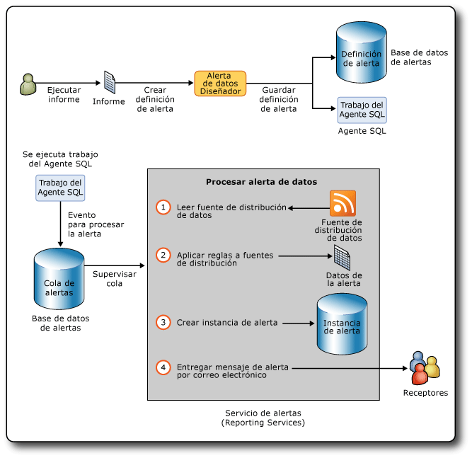

# Alertas de datos de Reporting Services

[!INCLUDE [ssrs-appliesto](../includes/ssrs-appliesto.md)] [!INCLUDE [ssrs-appliesto-2016](../includes/ssrs-appliesto-2016.md)] [!INCLUDE [ssrs-appliesto-not-2017](../includes/ssrs-appliesto-not-2017.md)] [!INCLUDE[ssrs-appliesto-sharepoint-2013-2016i](../includes/ssrs-appliesto-sharepoint-2013-2016.md)] [!INCLUDE [ssrs-appliesto-not-pbirs](../includes/ssrs-appliesto-not-pbirs.md)]

[!INCLUDE [ssrs-previous-versions](../includes/ssrs-previous-versions.md)]

Las alertas de datos de SQL Server Reporting Services son una solución de alertas controladas por datos con la que puede estar informado en un momento dado de los datos de los informes que sean de su interés o considere importantes. Si usa alertas de datos, ya no tendrá que buscar información puesto que la recibirá directamente.

Los mensajes de alertas de datos se envían por correo electrónico. Dependiendo de la importancia de la información, puede elegir enviar mensajes con mayor o menor frecuencia y solo cuando cambien los resultados. Puede especificar varios destinatarios de correo electrónico para mantener informadas a otras personas y mejorar la eficacia y la colaboración.

> [!NOTE]
> La integración de Reporting Services con SharePoint ya no está disponible a partir de SQL Server 2016.

##   Arquitectura y flujo de trabajo de alertas de datos

A continuación se resumen las áreas clave de las alertas de datos de [!INCLUDE[ssRSnoversion](../includes/ssrsnoversion-md.md)] :

-   **Definir y guardar definiciones de alertas de datos**: ejecute un informe, cree reglas que identifiquen valores de datos interesantes, defina un patrón de periodicidad para enviar el mensaje de alerta de datos y especifique los destinatarios del mensaje de alerta.  
  
-   **Ejecutar definiciones de alertas de datos**: el servicio de alertas procesa las definiciones de alertas a la hora programada, recupera datos de informe y crea instancias de alertas de datos en función de las reglas de la definición de alerta.  
  
-   **Entregar mensajes de alertas de datos a los destinatarios**: el servicio de alertas crea una instancia de alerta y envía un mensaje de alerta por correo electrónico a los destinatarios.  
  
 Además, como propietario de la alerta de datos, puede ver información sobre sus alertas de datos, y eliminar y editar sus definiciones de alertas de datos. Una alerta solo tiene un propietario: la persona que la creó.  
  
 Los administradores de alertas y los usuarios con el permiso Administrar alertas de SharePoint pueden administrar alertas de datos en el nivel de sitio. Pueden ver las listas de alertas de cada usuario del sitio y eliminar alertas.  
  
 [!INCLUDE[ssRSnoversion](../includes/ssrsnoversion-md.md)] son distintas de las alertas de SharePoint. Las alertas de SharePoint pueden definirse en cualquier tipo de documento, incluidos los informes. Las alertas de SharePoint se envían cuando cambia el documento. Por ejemplo, cuando se agrega una columna a una tabla en un informe. En cambio, las alertas de datos se envían cuando los datos mostrados en un informe satisfacen las reglas de las definiciones de alerta. Las reglas normalmente hacen referencia a los datos que se muestran en un informe.  
  
 Mediante la creación de alertas de datos basadas en informes, puede supervisar los cambios que se realizan en los datos de los informes, y enviar mensajes de alerta de datos por correo electrónico cuando los datos de informe satisfagan las reglas que definen datos que usted y otras personas consideren interesantes, a intervalos que satisfagan las necesidades de su negocio. También puede ejecutar alertas de datos a petición. Si tiene el permiso Crear alertas de SharePoint, podrá crear alertas para todos aquellos informes para los que tenga permiso de visualización. Puede crear varias alertas para un informe y varios usuarios pueden crear la misma o distintas alertas en un informe. Para colaborar con otras personas, puede especificar a estas personas como destinatarios de los mensajes de alerta en las definiciones de alerta de datos que cree.  
  
 El siguiente diagrama muestra el flujo de trabajo para crear y guardar una definición de alerta de datos, crear un trabajo del Agente SQL para comenzar a procesar una instancia de la alerta de datos, y enviar por correo electrónico mensajes de alerta de datos que contienen los datos del informe que desencadenaron la alerta a uno o varios destinatarios.  
  
   
  
### Informes admitidos por las alertas de datos  
 Puede crear alertas de datos para todos los tipos de informes profesionales escritos en el lenguaje de definición de informes (RDL) y creados en el Diseñador de informes o en el Generador de informes. Informes que incluyen regiones de datos como tablas y gráficos, informes con subinformes, e informes complejos con múltiples grupos de columnas paralelos y regiones de datos anidadas. Los únicos requisitos son que el informe incluya al menos una región de datos de cualquier tipo y que el origen de datos del informe esté configurado para utilizar credenciales almacenadas o ninguna credencial. Si el informe no tiene ninguna región de datos, no puede crear una alerta para él.  
  
 No puede crear alertas de datos en los informes creados con [!INCLUDE[ssCrescent](../includes/sscrescent-md.md)].  
  
 Cuando instale [!INCLUDE[ssRSnoversion](../includes/ssrsnoversion-md.md)] en modo nativo o en modo de SharePoint, o cuando use la versión independiente del Generador de informes, puede guardar informes en un servidor de informes, en el equipo o en una biblioteca de SharePoint. Para crear alertas de datos para los informes, estos se deben guardar o cargar en una biblioteca de SharePoint. Esto significa que no se pueden crear alertas para informes guardados en un servidor de informes en modo nativo o en su equipo. Además, no puede crear alertas incrustadas en aplicaciones personalizadas.  
  
 [!INCLUDE[ssRSnoversion](../includes/ssrsnoversion-md.md)] admite diversos tipos de credenciales en los informes. Puede crear alertas de datos para informes cuyo origen de datos está configurado para utilizar la autenticación de Windows, credenciales almacenadas o no usar credenciales. No puede crear alertas para informes configurados para usar credenciales de seguridad integradas ni para los que pidan credenciales. El informe se ejecuta como parte del procesamiento de la definición de la alerta y el procesamiento produce un error si no dispone de las credenciales. Para obtener más información, vea lo siguiente:  
  
-   [Especificación de información de credenciales y conexión para los orígenes de datos de informes](../reporting-services/report-data/specify-credential-and-connection-information-for-report-data-sources.md)  
  
-   [Roles y permisos &#40;Reporting Services&#41;](../reporting-services/security/roles-and-permissions-reporting-services.md)  
  
-   [Autenticación con el servidor de informes](../reporting-services/security/authentication-with-the-report-server.md)  
  
### Ejecutar informes  
 El primer paso para crear una definición de alerta de datos es buscar el informe que desee en la biblioteca de SharePoint y después ejecutarlo. Si un informe no contiene datos cuando se ejecuta, no puede crear una alerta para él en ese momento.  
  
 Si el informe contiene parámetros, especificará los valores de parámetro que se deben usar cuando ejecute el informe. Los valores de parámetro se guardarán en las definiciones de alerta de datos que crea para un informe. Los valores se utilizan cuando se vuelve a ejecutar el informe durante el procesamiento de la definición de alerta de datos. Si desea cambiar los valores de parámetro, tendrá que volver a ejecutar el informe con esos valores de parámetro y crear una definición de alerta para esa versión del informe.  
  
### Crear definiciones de alerta de datos  
 La característica de alertas de datos de [!INCLUDE[ssRSnoversion](../includes/ssrsnoversion-md.md)] incluye el Diseñador de alertas de datos, que se utiliza para crear definiciones de alerta de datos.  
  
 Para crear una definición de alerta de datos, tendrá que ejecutar el informe y abrir el Diseñador de alerta de datos desde el menú **Acciones** del visor de informes de SharePoint. Se generan las fuentes de distribución de datos del informe y se muestran las 100 primeras filas de la fuente de distribución de datos en una tabla de vista previa de los datos en el Diseñador de alertas de datos. Todas las fuentes de distribución de datos de un informe se almacenan en caché siempre que utilice el Diseñador de alertas de datos para trabajar con la definición de alerta. El almacenamiento en caché permite cambiar rápidamente entre las fuentes de distribución de datos. Al volver a abrir una definición de alerta en el Diseñador de alertas de datos, se actualizan las fuentes de distribución de datos.  
  
 Las definiciones de alertas de datos constan de reglas y cláusulas que los datos del informe deben satisfacer para desencadenar un mensaje de alerta de datos, una programación que define la frecuencia con que se envía el mensaje de alerta y, opcionalmente, las fechas de inicio y detención del envío del mensaje de alerta, información como la línea de asunto y una descripción que se incluyen en el mensaje de alerta y los destinatarios del mensaje. Después de crear una definición de alerta, esta se guarda en la base de datos de alertas de SQL Server.  
  
### Guardar definiciones de alertas de datos y metadatos de alertas  
 Cuando instala [!INCLUDE[ssRSnoversion](../includes/ssrsnoversion-md.md)] en modo de SharePoint, se crea automáticamente la base de datos de alertas de SQL Server.  
  
 Las definiciones de alerta de datos y los metadatos de las alertas se guardan en la base de datos de alertas. De forma predeterminada, esta base de datos se denomina ReportingServices\<GUID>_Alerting.  
  
 Cuando se guarda la definición de una alerta de datos, el sistema de alertas crea un trabajo del Agente SQL para la definición de alerta. El trabajo incluye una programación del trabajo. La programación se basa en el patrón de periodicidad que defina en la definición de alerta. Al ejecutar el trabajo se inicia el procesamiento de la definición de alerta de datos.  
  
### Procesar definiciones de alerta de datos  
 Cuando la programación del trabajo del Agente SQL Server inicia el procesamiento de la definición de alerta, se ejecuta el informe para actualizar las fuentes de distribución de datos. El servicio de alertas lee las fuentes de distribución de datos y aplica a los valores de los datos las reglas que especifican las definiciones de las alertas de datos. Si uno o más valores de datos satisfacen las reglas, se crea una instancia de alerta de datos y se envía por correo electrónico un mensaje de alerta de datos a todos los destinatarios. Los resultados son las filas de los datos del informe que satisfacían todas las reglas en el momento en que se creó la instancia de alerta. Para evitar que se envíen varios mensajes de alerta con los mismos resultados, puede especificar que los mensajes solo se envíen cuando cambien los resultados. En este caso, se crea una instancia de alerta y se guarda en la base de datos de alertas, pero no se genera ningún mensaje de alerta. Si ocurre un error, la instancia de alerta se guarda también en la base de datos de alertas y se envía un mensaje de alerta con los detalles del error a los destinatarios. En la sección Diagnósticos y registro, incluida más adelante en este tema, se proporciona más información sobre el registro y la solución de problemas.  
  
### Enviar mensajes de alerta de datos  
 El mensaje de alerta de datos se envía por correo electrónico.  
  
 La línea **De** contiene un valor determinado por la configuración de entrega de correo electrónico de [!INCLUDE[ssRSnoversion](../includes/ssrsnoversion-md.md)] . La línea **Para** incluye los destinatarios especificados al crear la alerta en el Diseñador de alertas de datos.  
  
 Además de la línea de asunto de correo electrónico, que se especifica en el Diseñador de alertas de datos, el mensaje de alerta de datos incluye la información siguiente:  
  
-   Nombre de la persona que creó la definición de alerta de datos.  
  
-   Si proporcionó una descripción en la definición de alerta, esta se muestra sobre el texto del mensaje de correo electrónico.  
  
-   Los resultados de las alertas, consistentes en las filas de la fuente de distribución de datos que satisfacen las reglas especificadas en la definición de alerta.  
  
-   Un vínculo al informe en el que se basa la definición de alerta.  
  
-   Las reglas de la definición de alerta.  
  
-   Los parámetros y los valores que usó para ejecutar el informe.  
  
-   Los valores contextuales de los elementos de informe que se encuentran fuera de las regiones de datos del informe.  
  
 Si no se puede crear una instancia de alerta de datos o un mensaje de alerta de datos, se envía un mensaje de error a todos los destinatarios. En lugar de los resultados de la alerta, el mensaje incluye una descripción del error.  
  
 Para más información, consulte [Data Alert Messages](../reporting-services/data-alert-messages.md).  
  
##   Instalar alertas de datos  
 La característica de alertas de datos solo está disponible cuando [!INCLUDE[ssRSnoversion](../includes/ssrsnoversion-md.md)] está instalado en el modo de SharePoint. Cuando se instala [!INCLUDE[ssRSnoversion](../includes/ssrsnoversion-md.md)] en modo de SharePoint, el programa de instalación crea automáticamente la base de datos de alertas donde se guardan las definiciones de alertas de datos y los metadatos de las alertas, y dos páginas de SharePoint para administrar alertas; también agrega el Diseñador de alertas de datos al sitio de SharePoint. No hay que realizar pasos especiales ni configurar opciones para las alertas durante la instalación.  
  
 Si desea más información sobre cómo instalar [!INCLUDE[ssRSnoversion](../includes/ssrsnoversion-md.md)] en modo de SharePoint, incluido el servicio compartido de [!INCLUDE[ssRSnoversion](../includes/ssrsnoversion-md.md)] que es nuevo en [!INCLUDE[ssSQL11](../includes/sssql11-md.md)] y la aplicación de servicio de [!INCLUDE[ssRSnoversion](../includes/ssrsnoversion-md.md)] que debe crear y configurar para poder usar las características de [!INCLUDE[ssRSnoversion](../includes/ssrsnoversion-md.md)], consulte [Instalar el modo de SharePoint de Reporting Services para SharePoint 2010](https://msdn.microsoft.com/47efa72e-1735-4387-8485-f8994fb08c8c) en MSDN Library.  
  
 Como se muestra en el diagrama del tema anterior, las alertas de datos usan trabajos del Agente SQL Server. Para poder crear los trabajos, es necesario que el Agente SQL Server se esté ejecutando. Es posible que haya configurado el Agente SQL Server para que se inicie automáticamente cuando instaló [!INCLUDE[ssRSnoversion](../includes/ssrsnoversion-md.md)]. Si no es así, puede iniciar el Agente SQL Server manualmente. Para obtener más información, vea [Configurar el Agente SQL Server](../ssms/agent/configure-sql-server-agent.md) e [Iniciar, detener, pausar, reanudar y reiniciar el motor de base de datos, Agente SQL Server o el Servicio SQL Server Browser](../database-engine/configure-windows/start-stop-pause-resume-restart-sql-server-services.md).  
  
 Puede usar la página **Aprovisionar suscripciones y alertas** en Administración central de SharePoint para averiguar si el Agente SQL Server se está ejecutando y crear y descargar scripts de [!INCLUDE[tsql](../includes/tsql-md.md)] personalizados que puede ejecutar después para conceder permisos al Agente SQL Server. Si puede también generar los scripts de [!INCLUDE[tsql](../includes/tsql-md.md)] mediante PowerShell. Para más información, vea [Aprovisionar suscripciones y alertas para aplicaciones de servicio SSRS](../reporting-services/install-windows/provision-subscriptions-and-alerts-for-ssrs-service-applications.md).  
  
##   Configurar alertas de datos  
 A partir de [!INCLUDE[ssSQL11](../includes/sssql11-md.md)] , la configuración de las características de [!INCLUDE[ssRSnoversion](../includes/ssrsnoversion-md.md)] , incluidas las alertas de datos, se distribuyen entre el archivo de configuración del servidor de informes (rsreportserver.config) y una base de datos de configuración de SharePoint siempre que instala [!INCLUDE[ssRSnoversion](../includes/ssrsnoversion-md.md)] en modo de SharePoint. Cuando crea la aplicación de servicio como parte de la instalación y configuración de [!INCLUDE[ssRSnoversion](../includes/ssrsnoversion-md.md)], la base de datos de configuración de SharePoint se crea automáticamente. Para obtener más información, vea [El archivo de configuración RSReportServer.config](../reporting-services/report-server/rsreportserver-config-configuration-file.md) y [Archivos de configuración de Reporting Services](../reporting-services/report-server/reporting-services-configuration-files.md).  
  
 La configuración de las alertas de datos de [!INCLUDE[ssRSnoversion](../includes/ssrsnoversion-md.md)] incluye los intervalos de limpieza de los datos y metadatos de alertas y el número de reintentos al enviar mensajes de alerta de datos por correo electrónico. Puede actualizar el archivo de configuración y la base de datos de configuración para utilizar valores diferentes para la configuración de alertas de datos.  
  
 El archivo de configuración del servidor de informes se actualiza directamente. La base de datos de configuración de SharePoint se actualiza mediante los cmdlets de Windows PowerShell.  
  
 En la tabla siguiente se enumeran los elementos de configuración de las alertas de datos, sus valores predeterminados, sus descripciones y sus ubicaciones.  
  
|Configuración|Valor predeterminado|Descripción|Location|  
|-------------|-------------------|-----------------|--------------|  
|AlertingCleanupCycleMinutes|20|Número de minutos entre inicios del ciclo de limpieza.|Archivo de configuración del servidor de informes|  
|AlertingExecutionLogCleanupMinutes|10080|Número de minutos que se deben conservar las entradas del registro de ejecución.|Archivo de configuración del servidor de informes|  
|AlertingDataCleanupMinutes|360|Número de minutos que se deben conservar los datos temporales.|Archivo de configuración del servidor de informes|  
|AlertingMaxDataRetentionDays|180|Número de días que faltan para eliminar los metadatos de ejecución de las alertas, las instancias de las alertas y los resultados de la ejecución.|Archivo de configuración del servidor de informes|  
|MaxRetries|3|Número de reintentos para procesar alertas de datos.|Base de datos de configuración del servicio|  
|SecondsBeforeRetry|900|Número de segundos que se deben esperar entre cada reintento.|Base de datos de configuración del servicio|  
  
 De forma predeterminada, los valores de MaxRetries y SecondsBeforeRetry se aplican a todos los eventos que desencadenan alertas de datos. Si desea tener más control sobre los reintentos y los intervalos entre reintentos, puede agregar elementos para cada uno de los controladores de eventos que especifican valores de MaxRetries y SecondsBeforeRetry diferentes.  
  
### Controladores de eventos y reintentos  
 Los controladores de eventos son:  
  
|Controlador de eventos|Descripción|  
|-------------------|-----------------|  
|FireAlert|Para iniciar inmediatamente el procesamiento de una definición de alerta, haga clic en **Ejecutar**  en el Administrador de alertas de datos.|  
|FireSchedule|El Agente SQL Server inicia la programación del trabajo para una definición de alerta.|  
|CreateSchedule|Crea una definición de alerta de datos y se crea una programación de trabajo del Agente SQL Server en función del intervalo de frecuencia especificado en la definición de alerta.|  
|UpdateSchedule|Actualiza el intervalo de frecuencia de la definición de alerta de datos y se actualiza la programación del trabajo del Agente SQL Server.|  
|DeleteSchedule|Elimina la definición de alerta de datos y se elimina el trabajo del Agente SQL Server correspondiente.|  
|GenerateAlert|El motor de tiempo de ejecución de alertas procesa la fuente de distribución de datos, aplica las reglas especificadas en la definición de alerta de datos, determina si debe crear una instancia de la alerta de datos y, si es necesario, crea una instancia de la alerta de datos.|  
|DeliverAlert|El motor de tiempo de ejecución crea el mensaje de alerta de datos y lo envía a todos los destinatarios por correo electrónico.|  
  
 En la tabla siguiente se resumen los controladores de eventos y cuándo se activará el reintento:  
  
|Categoría del error|<|\<|Tipo de evento||>|>|>|  
|--------------------|--------|--------|----------------|-|--------|--------|--------|  
||**FireAlert**|**FireSchedule**|**CreateSchedule**|**UpdateSchedule**|**DeleteSchedule**|**GenerateAlert**|**DeliverAlert**|  
|No hay memoria suficiente|X|X|X|X|X|X|X|  
|Anulación de subproceso|X|X|X|X|X|X|X|  
|El Agente SQL no está en ejecución.|X||X|X|X|||  
|Transitorio. Se debe principalmente a problemas de conexión, tiempos de espera y bloqueos.|X|X|X|X|X|X|X|  
|IOException|||||||X|  
|WebException|||||||X|  
|SocketException|||||||X|  
|SMTPException **(\*)**|||||||X|  
  
 **(\*)** Errores de SMTP que desencadenarán un reintento:  
  
-   SmtpStatusCode.ServiceNotAvailable  
  
-   SmtpStatusCode.MailboxBusy  
  
-   SmtpStatusCode.MailboxUnavailable  
  
###   Deshabilitar alertas de datos  
 Si desea deshabilitar la característica de alertas de datos, actualice la sección Service del archivo de configuración. El código siguiente muestra la sección Service del archivo de configuración.  
  
 `<Service>`  
  
 `<IsSchedulingService>True</IsSchedulingService>`  
  
 `<IsNotificationService>True</IsNotificationService>`  
  
 `<IsEventService>True</IsEventService>`  
  
 `<IsAlertingService>True</IsAlertingService>`  
  
 `...`  
  
 `</Service>`  
  
 Para deshabilitar las alertas, cambie True por False en `<IsAlertingService>True</IsAlertingService>`.  
  
##   Permisos para alertas de datos  
 Para poder crear alertas de datos para informes, debe tener permiso para ejecutar informes y crear alertas en el sitio de SharePoint. Para obtener más información sobre los permisos de informes, vea lo siguiente.  
  
-   [Generar fuentes de distribución de datos a partir de informes &#40;Generador de informes y SSRS&#41;](../reporting-services/report-builder/generating-data-feeds-from-reports-report-builder-and-ssrs.md)  
  
-   [Establecer permisos para elementos del servidor de informes en un sitio de SharePoint &#40;Reporting Services en el modo integrado de SharePoint&#41;](../reporting-services/security/set-permissions-for-report-server-items-on-a-sharepoint-site.md)  
  
 [!INCLUDE[ssRSnoversion](../includes/ssrsnoversion-md.md)] admiten dos niveles de permisos: trabajador de la información y administrador de alertas. En la tabla siguiente se enumeran los permisos de SharePoint y las tareas relacionados para cada tipo de usuario.  
  
|Tipo de usuario|Permiso de SharePoint|Descripción de la tarea|  
|---------------|---------------------------|----------------------|  
|Trabajador de la información|Ver elementos   Creación de alertas|Ver elementos como informes y crear alertas de datos para los informes. Modificar y eliminar alertas.|  
|Administrador de alertas|Administrar alertas|Ver una lista de todas las alertas de datos guardadas en el sitio de SharePoint y eliminar alertas.|  
  
##   Diagnósticos y registro  
 Las alertas de datos proporcionan varias maneras de ayudar a los trabajadores de la información y a los administradores a realizar un seguimiento de las alertas y a entender por qué se producen errores en las alertas, así como ayudar a los administradores a usar los registros de ejecución para saber a quién se envió cada mensaje de alerta, el número de instancias de alertas enviadas, etcétera.  
  
### Administrador de alertas de datos  
 El Administrador de alertas de datos muestra listas de definiciones de alertas e información sobre errores que ayudan a los trabajadores de la información y a los administradores de alertas a entender las causas de los errores. Algunos de los motivos comunes de los errores son:  
  
-   La fuente de distribución de datos del informe ha cambiado y las columnas que se usaron en las reglas de la definición de la alerta de datos ya no están incluidas en la fuente de distribución de datos.  
  
-   El permiso para ver el informe se ha revocado.  
  
-   El tipo de datos del origen de datos subyacente ha cambiado y la definición de la alerta ya no es válida.  
  
### Registros  
 [!INCLUDE[ssRSnoversion](../includes/ssrsnoversion-md.md)] proporciona varios registros que pueden ayudarle a obtener más información sobre los informes que se ejecutan al procesar definiciones de alerta de datos, las instancias de alertas de datos que se crean, etc. Hay tres registros particularmente útiles: el registro de ejecución de la alerta, el registro de ejecución del servidor de informes y el registro de seguimiento del servidor de informes.  
  
 Para obtener información sobre otros registros de [!INCLUDE[ssRSnoversion](../includes/ssrsnoversion-md.md)] , vea [Archivos de registro y orígenes de Reporting Services](../reporting-services/report-server/reporting-services-log-files-and-sources.md).  
  
#### Registro de ejecución de alertas  
 El servicio de tiempo de ejecución de alertas escribe entradas en la tabla ExecutionLogView de la base de datos de alertas. Puede consultar la tabla o ejecutar los procedimientos almacenados siguientes para obtener una información de diagnóstico más completa sobre las alertas de datos que se guardan en la base de datos de alertas.  
  
-   ReadAlertData  
  
-   ReadAlertHistory  
  
-   ReadAlertInstances  
  
-   ReadEventHistory  
  
-   ReadFeedPollHistory  
  
-   ReadFeedPools  
  
-   ReadPollData  
  
-   ReadSentAlerts  
  
 Puede utilizar el Agente SQL para ejecutar el procedimiento almacenado de acuerdo con una programación. Para obtener más información, consulte [SQL Server Agent](../ssms/agent/sql-server-agent.md).  
  
#### Registro de ejecución del servidor de informes  
 Los informes se ejecutan para generar fuentes de distribución de datos en las que se basan las definiciones de alerta de datos. El registro de ejecución del servidor de informes de la base de datos del servidor de informes recopila información cada vez que se ejecuta el informe. Puede realizar una consulta de la vista ExecutionLog2 en la base de datos para obtener información detallada. Para obtener más información, vea [Registro de ejecución del servidor de informes y la vista ExecutionLog3](../reporting-services/report-server/report-server-executionlog-and-the-executionlog3-view.md).  
  
#### Registro de seguimiento del servidor de informes  
 El registro de seguimiento del servidor de informes contiene información bastante detallada de las operaciones del servicio del servidor de informes, incluidas las operaciones realizadas por el servicio web del servidor de informes y el procesamiento en segundo plano. La información del registro de seguimiento resulta útil si se está depurando una aplicación que incluye un servidor de informes o se investiga un problema específico que se incluyó en el registro de eventos o de ejecución. Para obtener más información, consulte [Report Server Service Trace Log](../reporting-services/report-server/report-server-service-trace-log.md).  
  
##   Performance Counters  
 Las alertas de datos proporcionan sus propios contadores de rendimiento. Todos los contadores de rendimiento excepto uno están relacionados con un evento que forma parte del servicio de ejecución de alertas. El contador de rendimiento relacionado con la cola de eventos informa de la longitud de la cola de todos los eventos activos.  
  
|Evento o cola de eventos|Contador de rendimiento|  
|--------------------------|-------------------------|  
|ALERTINGQUEUESIZE|Alertas: longitud de la cola de eventos|  
|FireAlert|Alertas: eventos procesados - FireAlert|  
|FireSchedule|Alertas: eventos procesados - FireSchedule|  
|CreateSchedule|Alertas: eventos procesados - CreateSchedule|  
|UpdateSchedule|Alertas: eventos procesados - UpdateSchedule|  
|DeleteSchedule|Alertas: eventos procesados - DeleteSchedule|  
|GenerateAlert|Alertas: eventos procesados - GenerateAlert|  
|DeliverAlert|Alertas: eventos procesados - DeliverAlert|  
  
 [!INCLUDE[ssRSnoversion](../includes/ssrsnoversion-md.md)] proporciona contadores de rendimiento para otras características de [!INCLUDE[ssRSnoversion](../includes/ssrsnoversion-md.md)] . Para obtener más información, vea [Contadores de rendimiento de los objetos ReportServer:Service y ReportServerSharePoint:Service](../reporting-services/report-server/performance-counters-reportserver-service-performance-objects.md), [Contadores de rendimiento para los objetos de rendimiento de MSRS 2011 Web Service y MSRS 2011 Windows Service &#40;modo nativo&#41;](../reporting-services/report-server/performance-counters-msrs-2011-web-service-performance-objects.md) y [Contadores de rendimiento para los objetos de rendimiento en modo SharePoint de MSRS 2011 Web Service y SharePoint de MSRS 2011 Windows Service &#40;modo SharePoint&#41;](../reporting-services/report-server/performance-counters-msrs-2011-sharepoint-mode-performance-objects.md).  
  
##   Compatibilidad con SSL  
 [!INCLUDE[ssRSnoversion](../includes/ssrsnoversion-md.md)] puede usar el servicio SSL (Capa de sockets seguros) de HTTP para establecer conexiones cifradas con un servidor de informes o un sitio de SharePoint.  
  
 El servicio de ejecución de alertas y la interfaz de usuario de alertas de datos admiten SSL y funcionan de un modo similar tanto si se utiliza SSL como HTTP; sin embargo, hay algunas pequeñas diferencias. Cuando la definición de alerta de datos se crea mediante una conexión SSL, la dirección URL que se utiliza como vínculo a la biblioteca de SharePoint desde el mensaje de alerta de datos también utiliza SSL. Puede identificar que se trata de una conexión SSL porque utiliza HTTPS en lugar de HTTP en su URL. Asimismo, si la definición de alerta de datos se creó mediante una conexión HTTP, el vínculo al sitio de SharePoint utiliza HTTP. Independiente de cómo se creara la definición de alerta, con SSL o con HTTP, la experiencia de los usuarios y administradores de alertas es la misma cuando utilizan el Diseñador de alertas de datos o el Administrador de alertas de datos. Si el protocolo (HTTP o SSL) debe cambiarse entre en el momento en que se creó la definición de alerta y después de actualizarse y volverse a guardar, el protocolo original se mantiene y se utiliza en las direcciones URL del vínculo.  
  
 Si crea una alerta de datos en un sitio de SharePoint configurado para usar SSL y, a continuación, quita el requisito de SSL, la alerta continúa vigente en el sitio. Si se elimina el sitio, en su lugar se utiliza el sitio de zona predeterminada.  
  
##   Interfaz de usuario de alertas de datos  
 Las alertas de datos proporcionan páginas de SharePoint para administrar alertas y un diseñador para crear y editar definiciones de alertas de datos.  
  
-   **Diseñador de alertas de datos** , en el que se crean o editan definiciones de alertas de datos. Para obtener más información, vea [Diseñador de alertas de datos](../reporting-services/data-alert-designer.md), [Crear una alerta de datos en el Diseñador de alertas de datos](../reporting-services/create-a-data-alert-in-data-alert-designer.md) y [Modificar una alerta de datos en el Diseñador de alertas](../reporting-services/edit-a-data-alert-in-alert-designer.md).  
  
-   **Administrador de alertas de datos** , en el que puede ver listas de alertas de datos, eliminar alertas y abrir alertas para su edición. Existen dos versiones del Administrador de alertas de datos: una que permite a los usuarios administrar las alertas que han creado y otra que permite a los administradores administrar las alertas que pertenecen a los usuarios del sitio.  
  
     Para obtener más información sobre cómo administrar alertas de datos que ha creado, vea [Administrador de alertas de datos para los usuarios de SharePoint](../reporting-services/data-alert-manager-for-sharepoint-users.md) y [Administrar mis alertas de datos en el Administrador de alertas de datos](../reporting-services/manage-my-data-alerts-in-data-alert-manager.md).  
  
     Para obtener más información sobre cómo administrar todas las alertas de datos de un sitio, vea [Administrador de alertas de datos para administradores de alertas](../reporting-services/data-alert-manager-for-alerting-administrators.md) y [Administrar todas las alertas de datos de un sitio de SharePoint en el Administrador de alertas de datos](../reporting-services/manage-all-data-alerts-on-a-sharepoint-site-in-data-alert-manager.md).  
  
-   **Aprovisionar suscripciones y alertas de datos** , en donde puede saber si Reporting Services puede usar el Agente SQL Server para las alertas de datos y descargar scripts que permitan acceder al Agente SQL Server. Para más información, vea [Aprovisionar suscripciones y alertas para aplicaciones de servicio SSRS](../reporting-services/install-windows/provision-subscriptions-and-alerts-for-ssrs-service-applications.md).  
  
##   Globalización de las alertas de datos  
 Algunos tipos de escritura, como el árabe y el hebreo, son de derecha a izquierda. Las alertas de datos admiten la escritura de derecha a izquierda y de izquierda a derecha. Las alertas de datos detectan la configuración regional, y modifican la apariencia y el comportamiento de la interfaz de usuario y del diseño de los mensajes de alertas de datos según corresponda. La referencia cultural se obtiene de la configuración regional del sistema operativo del equipo del usuario. Se guarda cada vez que se actualiza y después se vuelve a guardar la definición de alerta de datos.  
  
 La configuración regional de la definición de alerta puede afectar a si los datos satisfacen las reglas de la definición de alerta. Las reglas específicas de la configuración regional afectan sobre todo a las comparaciones de cadenas.  
  
 Saber si los datos del informe satisfacen o no las reglas de la definición de alerta puede resultar afectado por la configuración regional de la definición de alerta. Esto ocurre sobre todo con las cadenas. Por ejemplo, en una definición de alerta con la referencia cultural alemana, no se satisfaría una regla que comparara la letra inglesa "o" con la letra alemana "ö". En la misma definición de alerta, se satisfaría la regla con la configuración regional inglesa.  
  
 El formato de los datos también se basa en la configuración regional de la definición de alerta. Por ejemplo, si la configuración regional utiliza un punto como símbolo decimal, el valor se muestra como 45.67, mientras que si se utiliza una coma como símbolo decimal, se muestra como 45,67.  
  
 Dependiendo de la interfaz de usuario de alertas de datos que utilice, la compatibilidad con la escritura de derecha a izquierda será diferente. El Diseñador de alertas de datos admite la escritura de derecha a izquierda en los cuadros de texto, pero su diseño no es de derecha a izquierda. Es de izquierda a derecha al igual que otras herramientas. Si una definición de alerta se crea con la orientación de derecha a izquierda y después se modifica en un entorno de izquierda a derecha, la orientación del texto de derecha a izquierda se mantiene cuando se guarda la definición de alerta. El Administrador de alertas de datos se comporta del mismo modo que una página de SharePoint. Su diseño es de derecha a izquierda, al igual que otras páginas de SharePoint. En los mensajes de alertas de datos que se basan en definiciones de alertas de datos de derecha a izquierda, el texto se muestra de derecha a izquierda y el diseño del mensaje es de izquierda a derecha.  
  
##   Tareas relacionadas  
  
-   [Guardar un informe en una biblioteca de SharePoint &#40;Generador de informes&#41;](../reporting-services/report-builder/save-a-report-to-a-sharepoint-library-report-builder.md)  
  
-   [Creación de una alerta de datos en el Diseñador de alertas de datos](../reporting-services/create-a-data-alert-in-data-alert-designer.md)  
  
-   [Modificación de una alerta de datos en el Diseñador de alertas](../reporting-services/edit-a-data-alert-in-alert-designer.md)  
  
-   [Administración de mis alertas de datos en el Administrador de alertas de datos](../reporting-services/manage-my-data-alerts-in-data-alert-manager.md)  
  
-   [Administrar todas las alertas de datos de un sitio de SharePoint en el Administrador de alertas de datos](../reporting-services/manage-all-data-alerts-on-a-sharepoint-site-in-data-alert-manager.md)  
  
-   [Concesión de permisos a los usuarios y envío de alertas a los administradores](../reporting-services/grant-permissions-to-users-and-alerting-administrators.md)  
  
## Consulte también

[Diseñador de alertas de datos](../reporting-services/data-alert-designer.md)   
[Administrador de alertas de datos para administradores de alertas](../reporting-services/data-alert-manager-for-alerting-administrators.md)   
[Administrador de alertas de datos para los usuarios de SharePoint](../reporting-services/data-alert-manager-for-sharepoint-users.md)  

¿Tiene alguna pregunta más? [Puede plantear sus dudas en el foro de Reporting Services](https://go.microsoft.com/fwlink/?LinkId=620231).
