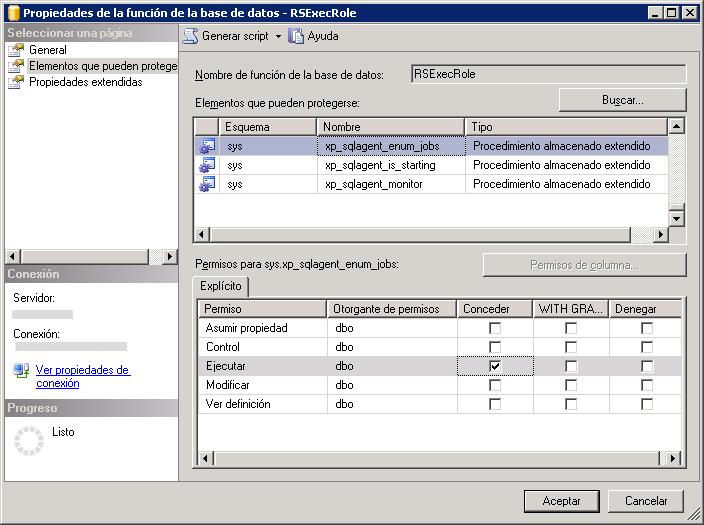

# Crear el RSExecRole

  [!INCLUDE[ssRSnoversion](../../includes/ssrsnoversion-md.md)] utiliza un rol de base de datos predefinido denominado **RSExecRole** para conceder permisos de servidor de informes a la base de datos del servidor de informes. El rol **RSExecRole** se crea automáticamente con la base de datos del servidor de informes. Por lo general, nunca se debe modificar el rol ni asignar otros usuarios al mismo. Sin embargo, cuando se mueve una base de datos del servidor de informes a un [!INCLUDE[ssNoVersion](../../includes/ssnoversion-md.md)] [!INCLUDE[ssDE](../../includes/ssde-md.md)], must re-create the role in the Master and MSDB system databases.  
  
 Usando estas instrucciones realizará los siguientes pasos:  
  
-   Crear y aprovisionar el rol **RSExecRole** en la base de datos del sistema Master.  
  
-   Crear y aprovisionar el rol **RSExecRole** en la base de datos del sistema MSDB.  
  
> [!NOTE]  
>  Las instrucciones de este tema están destinadas a los usuarios que no desean ejecutar un script o escribir código WMI para proporcionar la base de datos del servidor de informes. Si administra una implementación grande y va a mover las bases de datos habitualmente, debe escribir un script para automatizar estos pasos. Para más información, vea [Obtener acceso al proveedor WMI de Reporting Services](../../reporting-services/tools/access-the-reporting-services-wmi-provider.md).  
  
## Antes de empezar  
  
-   Realice una copia de seguridad de las claves de cifrado para poder restaurarlas después de mover la base de datos. Este paso no afecta directamente a la capacidad personal para crear y proporcionar el rol **RSExecRole**, pero se debe disponer de una copia de seguridad de las claves para comprobar el trabajo. Para obtener más información, vea [Hacer copia de seguridad y restaurar claves de cifrado de Reporting Services](../../reporting-services/install-windows/ssrs-encryption-keys-back-up-and-restore-encryption-keys.md).  
  
-   Compruebe que ha iniciado sesión con una cuenta de usuario que tenga permisos **sysadmin** en la instancia de [!INCLUDE[ssNoVersion](../../includes/ssnoversion-md.md)] .  
  
-   Compruebe que el servicio Agente [!INCLUDE[ssNoVersion](../../includes/ssnoversion-md.md)] está instalado y se está ejecutando en la instancia de [!INCLUDE[ssDE](../../includes/ssde-md.md)] que piensa utilizar.  
  
-   Adjunte las bases de datos reportservertempdb y reportserver. No es necesario que adjunte las bases de datos para crear el rol real, pero deben estar adjuntas para poder probar el trabajo.  
  
 Las instrucciones para crear manualmente el rol **RSExecRole** están destinadas a utilizarse en el contexto de migración de una instalación del servidor de informes. Las tareas importantes como realizar una copia de seguridad y mover la base de datos del servidor de informes no se tratan en este tema, pero se incluyen en la documentación del motor de base de datos.  
  
## Crear RSExecRole en la base de datos maestra  
 [!INCLUDE[ssRSnoversion](../../includes/ssrsnoversion-md.md)] utiliza procedimientos almacenados extendidos para que el servicio Agente [!INCLUDE[ssNoVersion](../../includes/ssnoversion-md.md)] admita las operaciones programadas. En los pasos siguientes se explica cómo conceder permisos de ejecución para los procedimientos al rol **RSExecRole** .  
  
#### Para crear el rol RSExecRole en la base de datos del sistema maestra mediante Management Studio  
  
1.  Inicie [!INCLUDE[ssNoVersion](../../includes/ssnoversion-md.md)] [!INCLUDE[ssManStudio](../../includes/ssmanstudio-md.md)] y conéctese a una instancia de [!INCLUDE[ssDE](../../includes/ssde-md.md)] que hospede la base de datos del servidor de informes.  
  
2.  Abra **Bases de datos**.  
  
3.  Abra **Bases de datos del sistema**.  
  
4.  Abra **Maestra**.  
  
5.  Abra **Seguridad**.  
  
6.  Abra **Roles**.  
  
7.  Haga clic con el botón derecho en **Roles de base de datos**y seleccione **Nuevo rol de la base de datos**. Aparece la página General.  
  
8.  En **Nombre de rol**, escriba **RSExecRole**.  
  
9. En **Propietario**, escriba **DBO**.  
  
10. Haga clic en **Elementos protegibles**.  
  
11. Haga clic en **Buscar**. Aparece el cuadro de diálogo **Agregar objetos** . La opción **Especificar objetos** está seleccionada de forma predeterminada.  
  
12. Haga clic en **Aceptar**. Aparece el cuadro de diálogo **Seleccionar objetos** .  
  
13. Haga clic en **Tipos de objeto**.  
  
14. Haga clic en **Procedimientos almacenados extendidos**.  
  
15. Haga clic en **Aceptar**.  
  
16. Haga clic en **Examinar**.  
  
17. Desplácese hacia abajo en la lista de procedimientos almacenados extendidos y seleccione los siguientes:  
  
    1.  xp_sqlagent_enum_jobs  
  
    2.  xp_sqlagent_is_starting  
  
    3.  xp_sqlagent_notify  
  
18. Haga clic en **Aceptar**y, a continuación, vuelva a hacer clic en **Aceptar** .  
  
19. En la fila **Ejecutar** , en la columna **Conceder** , haga clic en la casilla y, a continuación, haga clic en **Aceptar**.  
  
20. Repita este paso con cada uno de los procedimientos almacenados restantes. **RSExecRole** debe tener concedidos permisos de ejecución para los tres procedimientos almacenados.  
  
   
  
## Crear el rol RSExecRole en la base de datos MSDB  
 Reporting Services utiliza procedimientos almacenados para el servicio Agente SQL Server y recupera información de los trabajos en las tablas del sistema para admitir las operaciones programadas. En los pasos siguientes se explica cómo conceder al rol RSExecRole permisos de ejecución para los procedimientos y permisos de selección en las tablas.  
  
#### Para crear el rol RSExecRole en la base de datos del sistema MSDB  
  
1.  Repita los pasos similares para conceder permisos a procedimientos almacenados y tablas en MSDB. Para simplificar los pasos, proporcionará los procedimientos almacenados y las tablas de forma independiente.  
  
2.  Abra **MSDB**.  
  
3.  Abra **Seguridad**.  
  
4.  Abra **Roles**.  
  
5.  Haga clic con el botón derecho en **Roles de base de datos**y seleccione **Nuevo rol de la base de datos**. Aparece la página General.  
  
6.  En Nombre de rol, escriba **RSExecRole**.  
  
7.  En Propietario, escriba **DBO**.  
  
8.  Haga clic en **Elementos protegibles**.  
  
9. Haga clic en **Agregar**. Aparece el cuadro de diálogo **Agregar objetos** . La opción **Especificar objetos** está seleccionada de forma predeterminada.  
  
10. Haga clic en **Aceptar**.  
  
11. Haga clic en **Tipos de objeto**.  
  
12. Haga clic en **Procedimientos almacenados**.  
  
13. Haga clic en **Aceptar**.  
  
14. Haga clic en **Examinar**.  
  
15. Desplácese hacia abajo en la lista de elementos y seleccione los siguientes:  
  
    1.  sp_add_category  
  
    2.  sp_add_job  
  
    3.  sp_add_jobschedule  
  
    4.  sp_add_jobserver  
  
    5.  sp_add_jobstep  
  
    6.  sp_delete_job  
  
    7.  sp_help_category  
  
    8.  sp_help_job  
  
    9. sp_help_jobschedule  
  
    10. sp_verify_job_identifiers  
  
16. Haga clic en **Aceptar**y, a continuación, vuelva a hacer clic en **Aceptar** .  
  
17. Seleccione el primer procedimiento almacenado: sp_add_category.  
  
18. En la fila **Ejecutar** , en la columna **Conceder** , haga clic en la casilla y, a continuación, haga clic en **Aceptar**.  
  
19. Repita este paso con cada uno de los procedimientos almacenados restantes. Se deben conceder al rol RSExecRole permisos de ejecución para los diez procedimientos almacenados.  
  
20. En la pestaña Elementos protegibles, haga clic en **Agregar** de nuevo. Aparece el cuadro de diálogo **Agregar objetos** . La opción **Especificar objetos** está seleccionada de forma predeterminada.  
  
21. Haga clic en **Aceptar**.  
  
22. Haga clic en **Tipos de objeto**.  
  
23. Haga clic en **Tablas**.  
  
24. Haga clic en **Aceptar**.  
  
25. Haga clic en **Examinar**.  
  
26. Desplácese hacia abajo en la lista de elementos y seleccione los siguientes:  
  
    1.  syscategories  
  
    2.  sysjobs  
  
27. Haga clic en **Aceptar**y, a continuación, vuelva a hacer clic en **Aceptar** .  
  
28. Seleccione la primera tabla: syscategories.  
  
29. En la fila **Seleccionar** , en la columna **Conceder** , haga clic en la casilla y, a continuación, haga clic en **Aceptar**.  
  
30. Repita este procedimiento con la tabla sysjobs. Se deben conceder al rol RSExecRole permisos de selección para ambas tablas.  
  
## Mover la base de datos del servidor de informes  
 Después de crear los roles, puede mover la base de datos del servidor de informes a una instancia nueva de SQL Server. Para más información, vea [Mover las bases de datos del servidor de informes a otro equipo](../../reporting-services/report-server/moving-the-report-server-databases-to-another-computer-ssrs-native-mode.md).  
  
 Si va a actualizar [!INCLUDE[ssDE](../../includes/ssde-md.md)] a SQL Server 2016, puede hacerlo antes o después de mover la base de datos.  
  
 La base de datos del servidor de informes se actualiza automáticamente cuando el servidor de informes se conecta a ella. No hay ningún paso concreto requerido para actualizar la base de datos.  
  
## Restaurar las claves de cifrado y comprobar el trabajo  
 Si ha adjuntado las bases de datos del servidor de informes, ahora debe poder completar los pasos siguientes para comprobar el trabajo.  
  
#### Para comprobar la capacidad de operación del servidor de informes después de mover una base de datos  
  
1.  Inicie la herramienta Configuración de Reporting Services y conéctese al servidor de informes.  
  
2.  Haga clic en **Base de datos**.  
  
3.  Haga clic en **Cambiar base de datos**.  
  
4.  Haga clic en **Elija una base de datos del servidor de informes existente**.  
  
5.  Escriba el nombre del servidor del motor de base de datos. Si ha adjuntado las bases de datos del servidor de informes a una instancia con nombre, debe escribir el nombre de la instancia con este formato: \<nombreDeServidor>\\<nombreDeInstancia\>.  
  
6.  Haga clic en **Probar conexión**.  
  
7.  Haga clic en **Siguiente**.  
  
8.  En Base de datos, seleccione la base de datos del servidor de informes.  
  
9. Haga clic en **Siguiente** y complete el asistente.  
  
10. Haga clic en **Claves de cifrado**.  
  
11. Haga clic en **Restaurar**.  
  
12. Seleccione el archivo seguro (.snk) que tiene la copia de seguridad de la clave simétrica utilizada para descifrar las credenciales almacenadas y la información de conexión en la base de datos del servidor de informes.  
  
13. Escriba la contraseña y haga clic en **Aceptar**.  
  
14. Haga clic en **Dirección URL del Administrador de informes**.  
  
15. Haga clic en el vínculo para abrir el Administrador de informes. Debe ver los elementos del servidor de informes de la base de datos del servidor de informes.  

## Pasos siguientes

[Mover las bases de datos del servidor de informes a otro equipo &#40;Modo nativo de SSRS&#41;](../../reporting-services/report-server/moving-the-report-server-databases-to-another-computer-ssrs-native-mode.md)   
[Administrador de configuración de Reporting Services &#40;modo nativo&#41;](../../reporting-services/install-windows/reporting-services-configuration-manager-native-mode.md)   
[Crear una base de datos del servidor de informes de modo nativo &#40;Administrador de configuración de SSRS&#41;](../../reporting-services/install-windows/ssrs-report-server-create-a-native-mode-report-server-database.md)   
[Copia de seguridad y restauración de claves de cifrado de Reporting Services](../../reporting-services/install-windows/ssrs-encryption-keys-back-up-and-restore-encryption-keys.md)  

¿Tiene alguna pregunta más? [Puede plantear sus dudas en el foro de Reporting Services](http://go.microsoft.com/fwlink/?LinkId=620231).
