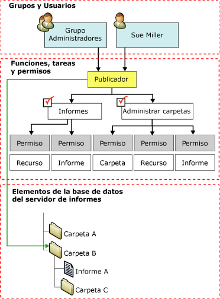

# Asignaciones de roles
  En [!INCLUDE[ssRSnoversion](../../includes/ssrsnoversion-md.md)], las *asignaciones de roles* determinan el acceso a los elementos almacenados y al propio servidor de informes. Una asignación de roles consta de las siguientes partes:  
  
-   Un elemento protegible para el que desea controlar el acceso. Ejemplos de elementos protegibles son carpetas, informes y recursos.  
  
-   Una cuenta de usuario o grupo que se pueda autenticar con seguridad de Windows u otro mecanismo de autenticación.  
  
-   Definiciones de rol que definen un conjunto de tareas. Algunos ejemplos de definiciones de rol son **Administrador del sistema**, **Administrador de contenido**y **Publicador**.  
  
 Las asignaciones de roles se heredan en la jerarquía de carpetas. La asignación de roles que se ha definido para una carpeta se hereda automáticamente en todos los informes, orígenes de datos compartidos, recursos y subcarpetas que ésta contenga. Al definir asignaciones de roles para elementos individuales, se puede reemplazar la seguridad heredada. Todas las partes de la jerarquía de carpetas deben estar protegidas por al menos una asignación de roles. No puede crear un elemento no protegido ni manipular la configuración de tal manera que produzca un elemento no protegido.  
  
 El siguiente diagrama muestra una asignación de roles que asigna un grupo y un usuario específico al rol **Publicador** para la carpeta B.  
  
   
Diagrama de asignaciones de roles  
  
## Asignaciones de roles de nivel de sistema y de nivel de elemento  
 La seguridad basada en roles en [!INCLUDE[ssRSnoversion](../../includes/ssrsnoversion-md.md)] se organiza en los siguientes niveles:  
  
-   Las asignaciones de roles de nivel de elemento controlan el acceso a informes, carpetas, modelos de informe, orígenes de datos compartidos y recursos en la jerarquía de carpetas del servidor de informes. Estas asignaciones de roles se definen cuando se crea una asignación de roles para un elemento específico o la carpeta Inicio.  
  
-   Las asignaciones de roles del sistema autorizan operaciones cuyo ámbito abarca el servidor como un todo (por ejemplo, la capacidad de administrar trabajos es una operación de nivel de sistema). Una asignación de roles del sistema no es equivalente a un administrador del sistema. No confiere permisos avanzados que concedan control total de un servidor de informes.  
  
 Una asignación de roles del sistema no autoriza el acceso a elementos en la jerarquía de carpetas. La seguridad del sistema y la del elemento se excluyen mutuamente. Para cualquier usuario o grupo dado, puede ser necesario crear ambas asignaciones de roles, de nivel del sistema y de nivel de elemento, para proporcionar acceso suficiente a un servidor de informes.  
  
## Usuarios y grupos en asignaciones de roles  
 Las cuentas de usuario o grupo que especifique en asignaciones de roles son cuentas de dominio. El servidor de informes hace referencia a usuarios y a grupos de un dominio de [!INCLUDE[msCoName](../../includes/msconame-md.md)] Windows (u otro modelo de seguridad si se usa una extensión de seguridad personalizada), pero no los crea ni los administra.  
  
 Entre todas las asignaciones de roles aplicables a un elemento determinado, no puede haber dos que especifiquen el mismo usuario o grupo. Si una cuenta de usuario también forma parte de una cuenta de grupo y tiene asignaciones de roles para ambas, el conjunto combinado de tareas para ambas asignaciones de roles está disponible para el usuario.  
  
 Si se agrega un usuario a un grupo que ya forma parte de una asignación de roles, debe restablecerse Internet Information Services (IIS) para que dicha asignación surta efecto para el usuario.  
  
## Asignaciones de roles predefinidos  
 De manera predeterminada, las asignaciones de roles predefinidos se implementan para permitir a los administradores locales administrar el servidor de informes. Es preciso agregar asignaciones de roles adicionales para conceder acceso a otros usuarios.  
  
 Para obtener más información sobre las asignaciones de roles predefinidos que proporcionan la seguridad predeterminada, vea [Roles predefinidos](../../reporting-services/security/role-definitions-predefined-roles.md).  
  
## Ver también  
 [Crear, eliminar o modificar un rol &#40;Management Studio&#41;](../../reporting-services/security/role-definitions-create-delete-or-modify.md)   
 [Conceder a un usuario acceso a un servidor de informes &#40;Administrador de informes&#41;](../../reporting-services/security/grant-user-access-to-a-report-server-report-manager.md)   
 [Modificar o eliminar una asignación de roles &#40;Administrador de informes&#41;](../../reporting-services/security/role-assignments-modify-or-delete.md)   
 [Establecer permisos para elementos del servidor de informes en un sitio de SharePoint &#40;Reporting Services en el modo integrado de SharePoint&#41;](../../reporting-services/security/set-permissions-for-report-server-items-on-a-sharepoint-site.md)   
 [Concesión de permisos en un servidor de informes en modo nativo](../../reporting-services/security/granting-permissions-on-a-native-mode-report-server.md)  
  
  
