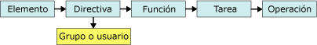

# Tareas y permisos
  En [!INCLUDE[ssRSnoversion](../../includes/ssrsnoversion-md.md)], *tareas* son las acciones que un usuario o administrador puede llevar a cabo. Las tareas están predefinidas. No se puede crear tareas personalizadas ni modificar las que se proporcionan ni mediante programación ni con una herramienta. En total, hay veinticinco tareas. Estas tareas comprenden todo el conjunto de operaciones que están disponibles en la seguridad basada en roles. Algunos ejemplos de tareas son "Ver informes", "Administrar informes" y "Administrar propiedades del servidor de informes".  
  
 Cada tarea se compone de un conjunto de permisos, también predefinidos. Por ejemplo, la tarea "Administrar carpetas" contiene los permisos necesarios para crear y eliminar carpetas, así como para ver y actualizar propiedades de carpetas. Los permisos de cada tarea están documentos para proporcionar una descripción más exacta de cada tarea. No es posible interactuar con permisos directamente ni especificarlos en las asignaciones de roles. Los permisos se conceden a los usuarios indirectamente mediante las tareas que se incluyen en las definiciones de rol.  
  
 Las tareas solo se pueden llevar a cabo si forman parte de un rol y dicho rol se incluye en una asignación de roles. Por lo tanto, si la tarea Ver modelos no está incluida en un rol, o ese rol no está incluido en una asignación de roles, los usuarios no podrán ver los modelos de informes. El siguiente diagrama muestra cómo los permisos se combinan para crear tareas y éstas se combinan para crear roles que se pueden utilizar para asignaciones de roles específicas.  
  
   
Diagrama de tareas y permisos  
  
## Tareas de nivel de sistema y de elemento  
 Las tareas se clasifican en dos categorías: nivel de sistema y nivel de elemento. Un rol puede incluir tareas solo de una categoría. La siguiente tabla describe cada categoría de tareas.  
  
|Categoría|Description|  
|--------------|-----------------|  
|[Tareas de nivel de elemento](../../reporting-services/security/item-level-tasks.md)|Acciones que se realizan con elementos administrados por un servidor de informes, como carpetas, informes, modelos de informe y recursos.   Las tareas de nivel de elemento se centran en el espacio de nombres de las carpetas del servidor de informes. Todos los elementos a los que tiene acceso mediante las carpetas en un servidor de informes o mediante una dirección URL están protegidos por las asignaciones de roles que incluyen tareas de nivel de elemento.|  
|[Tareas de nivel de sistema](../../reporting-services/security/system-level-tasks.md)|Acciones que se realizan en el nivel de sistema, como administrar trabajos o programaciones compartidas que se pueden utilizar con muchos elementos. Las tareas de nivel de sistema se centran fuera del espacio de nombres de carpetas del servidor de informes.|  
  
## Vea también  
 [Definiciones de roles](../../reporting-services/security/role-definitions.md)   
 [Roles predefinidos](../../reporting-services/security/predefined-roles.md)   
 [Conceder permisos en un servidor de informes en modo nativo](../../reporting-services/security/granting-permissions-on-a-native-mode-report-server.md)  
  
  