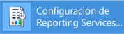
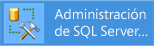
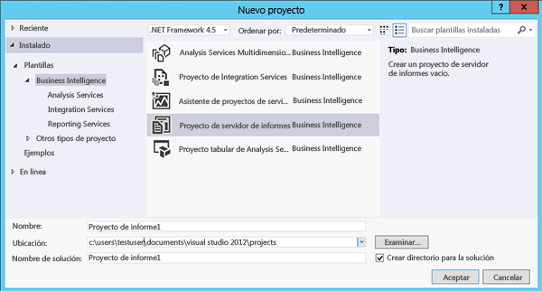

# Tutorial: Cómo buscar e iniciar herramientas de Reporting Services (SSRS)

En este tutorial se presentan las herramientas utilizadas para configurar un servidor de informes, administrar las operaciones y el contenido del servidor de informes y crear y publicar informes paginados y móviles de [!INCLUDE[ssRSnoversion](../../includes/ssrsnoversion-md.md)] . Si ya está familiarizado con estas herramientas, puede pasar a los otros tutoriales, donde podrá adquirir conocimientos para utilizar [!INCLUDE[ssRSnoversion](../../includes/ssrsnoversion-md.md)]. Para otros tutoriales, vea [Tutoriales de Reporting Services &#40;SSRS&#41;](../../reporting-services/reporting-services-tutorials-ssrs.md).

##  Administrador de configuración de Reporting Services (modo nativo)
Use el administrador de configuración en modo nativo para completar lo siguiente:

- Especifique la cuenta de servicio.
- Cree o actualice la base de datos del servidor de informes.
- Modifique las propiedades de conexión.
- Especifique las direcciones URL.
- Administre las claves de cifrado.
- Configure el procesamiento desatendido de informes y la entrega de informes por correo electrónico.

**Instalación:** [!INCLUDE[ssRSnoversion](../../includes/ssrsnoversion-md.md)] Configuration Manager se instala al instalar el modo nativo de [!INCLUDE[ssRSnoversion](../../includes/ssrsnoversion-md.md)]. Para más información, consulte [Instalar el servidor de informes en modo nativo de Reporting Services](../../reporting-services/install-windows/install-reporting-services-native-mode-report-server.md).

### Para iniciar el Administrador de configuración de Reporting Services

1. En la pantalla de inicio de Windows, escriba **reporting** y, en los resultados de búsqueda de **Aplicaciones** , haga clic en **Administrador de configuración de Reporting Services**.

    

    **O**

    Haga clic en **Inicio**, en **Programas**, [!INCLUDE[ssCurrentUI](../../includes/sscurrentui-md.md)], **Herramientas de configuración**y, por último, en **Administrador de configuración de Reporting Services**.

    Se abrirá el cuadro de diálogo **Selección de instancia de instalación del servidor de informes** para que seleccione la instancia del servidor de informes que desee configurar.

2. En **Nombre del servidor**, especifique el nombre del equipo en el que está instalada la instancia del servidor de informes. De manera predeterminada aparece el nombre del equipo local, pero también puede escribir el nombre de una instancia de [!INCLUDE[ssNoVersion](../../includes/ssnoversion-md.md)] remota.

    Si especifica un equipo remoto, haga clic en **Buscar** para establecer una conexión. Previamente, debe haber configurado el servidor de informes para la administración remota. Para obtener más información, vea [Configurar un servidor de informes para la administración remota](../../reporting-services/report-server/configure-a-report-server-for-remote-administration.md).

3. En **Nombre de instancia**, elija la instancia de [!INCLUDE[ssNoVersion](../../includes/ssnoversion-md.md)] [!INCLUDE[ssRSnoversion](../../includes/ssrsnoversion-md.md)] que desee configurar. En la lista solo aparecen instancias del servidor de informes de SQL Server 2008 y versiones posteriores. No es posible configurar versiones anteriores de [!INCLUDE[ssRSnoversion](../../includes/ssrsnoversion-md.md)].

4. Haga clic en **Conectar**.

5. Para comprobar que se haya iniciado la herramienta, compare sus resultados con los de la siguiente imagen:

    

 **Pasos siguientes:** [Configurar y administrar un servidor de informes &#40;modo nativo de SSRS&#41;](../../reporting-services/report-server/configure-and-administer-a-report-server-ssrs-native-mode.md) y [Administrador de configuración de Reporting Services &#40;modo nativo&#41;](../../reporting-services/install-windows/reporting-services-configuration-manager-native-mode.md).

## Portal web (modo nativo)

Use [Web portal (SSRS Native Mode)](../../reporting-services/web-portal-ssrs-native-mode.md) para establecer permisos, administrar suscripciones y programaciones, y trabajar con informes. También puede usar el portal web para ver informes.

**Instalación:** el portal web se instala al instalar el modo nativo de [!INCLUDE[ssRSnoversion](../../includes/ssrsnoversion-md.md)]: [Instalar el servidor de informes en modo nativo de Reporting Services](../../reporting-services/install-windows/install-reporting-services-native-mode-report-server.md)

Antes de abrir el portal web, necesita tener permisos suficientes (inicialmente, solo los miembros del grupo de administradores locales tienen permisos que proporcionan acceso a las características del portal web). El portal web proporciona distintas páginas y opciones, según las asignaciones de roles del usuario actual. Los usuarios que no poseen permisos verán una página vacía. Los usuarios que posean permisos para ver informes contarán con vínculos en los que podrán hacer clic para abrir los informes. Para obtener más información sobre permisos, vea [Roles y permisos &#40;Reporting Services&#41;](../../reporting-services/security/roles-and-permissions-reporting-services.md).

### Para iniciar el portal web

1. Abra el explorador. Para obtener información sobre los exploradores y las versiones de los exploradores compatibles, vea [Compatibilidad del explorador de Reporting Services y Power View](../../reporting-services/browser-support-for-reporting-services-and-power-view.md).

2. En la barra de direcciones del explorador web, escriba la URL del portal web. De forma predeterminada, la dirección URL es `https://<serverName>/reports`. Puede utilizar la herramienta de configuración de Reporting Services para confirmar el nombre del servidor y la dirección URL. Para obtener más información sobre las direcciones URL que se usan en [!INCLUDE[ssRSnoversion](../../includes/ssrsnoversion-md.md)], vea [Configuración de las direcciones URL del servidor de informes &#40;Administrador de configuración de SSRS&#41;](../../reporting-services/install-windows/configure-report-server-urls-ssrs-configuration-manager.md).

3. El portal web se abre en la ventana del explorador. La página de inicio es la carpeta Inicio. Según los permisos que posea, podrá ver otras carpetas, hipervínculos a informes y archivos de recursos dentro de la página de inicio. También puede ver otros botones y comandos en la barra de herramientas.

4. Si ejecuta el portal web en el servidor de informes local, vea [Configurar un servidor de informes en modo nativo para la administración local &#40;SSRS&#41;](../../reporting-services/report-server/configure-a-native-mode-report-server-for-local-administration-ssrs.md).

##  Management Studio

Los administradores del servidor de informes pueden utilizar [!INCLUDE[ssManStudio](../../includes/ssmanstudio-md.md)] para administrar un servidor de informes junto con otros servidores de componentes de [!INCLUDE[ssNoVersion](../../includes/ssnoversion-md.md)] . Para obtener más información, vea el tutorial de [SQL Server Management Studio](https://docs.microsoft.com/sql/ssms/tutorials/tutorial-sql-server-management-studio).

### Para iniciar SQL Server Management Studio

1. En la pantalla de inicio de Windows, escriba **sql server** y, en los resultados de búsqueda de **Aplicaciones** , haga clic en **SQL Server Management Studio**.

    

    **O**

    Haga clic en **Inicio**, en **Todos los programas**, en [!INCLUDE[ssCurrentUI](../../includes/sscurrentui-md.md)]y, después, en **SQL Server Management Studio**. Aparecerá el cuadro de diálogo **Conectar con el servidor** .

2. Si no se muestra el cuadro de diálogo **Conectar con el servidor** , en el **Explorador de objetos**, haga clic en **Conectar** y luego seleccione **Reporting Services**.

3. En la lista **Tipo de servidor** , seleccione **Reporting Services**. Si [!INCLUDE[ssRSnoversion](../../includes/ssrsnoversion-md.md)] no está instalado, no aparecerá en la lista.

4. En la lista **Nombre del servidor** , seleccione una instancia del servidor de informes. La lista incluye instancias locales. También puede escribir el nombre de una instancia remota de [!INCLUDE[ssNoVersion](../../includes/ssnoversion-md.md)] .

5. Haga clic en **Conectar**. Puede expandir el nodo raíz para establecer propiedades del servidor, modificar definiciones de roles o desactivar características del servidor de informes.

##  Herramientas de datos de SQL Server con el Diseñador de informes y el Asistente para informes

Puede usar dos herramientas diferentes para crear informes paginados de [!INCLUDE[ssNoVersion](../../includes/ssnoversion-md.md)]: el Diseñador de informes y el [Generador de informes](#bkmk_report_builder).

El Diseñador de informes está disponible en [!INCLUDE[ssBIDevStudioFull](../../includes/ssbidevstudiofull-md.md)] (Visual Studio). La superficie de diseño del Diseñador de informes incluye ventanas con pestañas, asistentes y menús que se utilizan para acceder a características de creación de informes. La herramienta del diseñador de informes está disponible al elegir un proyecto de servidor de informes o una plantilla del Asistente del servidor de informes en [!INCLUDE[ssBIDevStudioFull](../../includes/ssbidevstudiofull-md.md)]. Para más información, vea [Reporting Services en SQL Server Data Tools &#40;SSDT&#41;](../../reporting-services/tools/reporting-services-in-sql-server-data-tools-ssdt.md).

Descargar [SQL Server Data Tools](https://go.microsoft.com/fwlink/?LinkID=616714).

### Para iniciar el Diseñador de informes

1. Abra **SQL Server Data Tools**.

2. En el menú **Archivo** , seleccione **Nuevo**y haga clic en **Proyecto**.

3. En la lista **Tipos de proyecto** , haga clic en **Proyectos de Business Intelligence**.

4. En la lista **Plantillas** , haga clic en **Proyecto de servidor de informes**. El siguiente diagrama muestra cómo aparecen las plantillas de proyecto en el cuadro de diálogo:

    

5. Escriba un nombre y ubicación para el proyecto, o haga clic en **Examinar** y seleccione una ubicación.

6. [!INCLUDE[clickOK](../../includes/clickok-md.md)] [!INCLUDE[ssBIDevStudioFull](../../includes/ssbidevstudiofull-md.md)] se abre en la página de inicio de [!INCLUDE[vsprvs](../../includes/vsprvs-md.md)]. El Explorador de soluciones proporciona categorías para crear informes y orígenes de datos. Puede utilizar estas categorías para crear nuevos informes y orígenes de datos. Las ventanas con pestañas aparecen cuando crea una definición de informe. Las ventanas con pestañas son Datos, Diseño y Vista previa.

Para empezar a crear su primer informe, vea [Crear un informe de tabla básico &#40;Tutorial de SSRS&#41;](../../reporting-services/create-a-basic-table-report-ssrs-tutorial.md). Para más información sobre los diseñadores de consultas que puede usar en el Diseñador de informes, vea [Herramientas de diseño de consulta &#40;SSRS&#41;](../../reporting-services/report-data/query-design-tools-ssrs.md).

##  [!INCLUDE[ssRBnoversion](../../includes/ssrbnoversion.md)]

[Generador de informes en SQL Server](../../reporting-services/report-builder/report-builder-in-sql-server-2016.md) es una aplicación independiente que puede usar para crear informes paginados fuera de [!INCLUDE[ssNoVersion](../../includes/ssnoversion-md.md)]. Puede personalizar y actualizar todos los informes existentes, independientemente de que se hayan creado en el Diseñador de informes o en las versiones anteriores del [!INCLUDE[ssRBnoversion](../../includes/ssrbnoversion.md)]. Se instala desde el portal web de [!INCLUDE[ssNoVersion](../../includes/ssnoversion-md.md)] o desde el Centro de descarga de Microsoft.

Cuando el informe paginado esté listo, puede publicarlo en un servidor de informes o [guardarlo en el servicio Power BI](https://docs.microsoft.com/power-bi/paginated-reports-save-to-power-bi-service).\
[Descargue el Generador de informes](https://go.microsoft.com/fwlink/?LinkID=219138) del Centro de descarga de Microsoft.

### Para iniciar el [!INCLUDE[ssRBnoversion](../../includes/ssrbnoversion.md)]

1. En el portal web de [!INCLUDE[ssNoVersion](../../includes/ssnoversion-md.md)], en el menú **New** (Nuevo), seleccione **Paginated Report** (Informe paginado).

    

2. Si [!INCLUDE[ssRBnoversion](../../includes/ssrbnoversion.md)] aún no está instalado en el equipo, seleccione **Get [!INCLUDE[ssRBnoversion](../../includes/ssrbnoversion.md)]** (Obtener el Publicador de informes móviles).

    Or

    [Descargue el Generador de informes](https://go.microsoft.com/fwlink/?LinkID=219138) del Centro de descarga de Microsoft.

3. [!INCLUDE[ssRBnoversion](../../includes/ssrbnoversion.md)] se abre y, a continuación, ya se puede crear o abrir un informe paginado.

##  [!INCLUDE[SS_MobileReptPub_Long](../../includes/ss-mobilereptpub-long.md)]

Use el [Publicador de informes móviles de Microsoft SQL Server](../mobile-reports/create-mobile-reports-with-sql-server-mobile-report-publisher.md) para crear informes para dispositivos móviles que puede ver en el portal web de [!INCLUDE[ssNoVersion](../../includes/ssnoversion-md.md)] y en dispositivos móviles, como iPad y iPhone.\
Puede instalarlo desde el portal web de [!INCLUDE[ssNoVersion](../../includes/ssnoversion-md.md)] o desde el Centro de descarga de Microsoft.

[Descargue el Publicador de informes móviles de SQL Server](https://go.microsoft.com/fwlink/?LinkID=733527) desde el Centro de descarga de Microsoft.

### Para iniciar el [!INCLUDE[SS_MobileReptPub_Short](../../includes/ss-mobilereptpub-short.md)]

1. En el portal web de [!INCLUDE[ssNoVersion](../../includes/ssnoversion-md.md)], en el menú **New** (Nuevo), seleccione **Mobile Report** (Informe para dispositivos móviles).

     

2. Si [!INCLUDE[SS_MobileReptPub_Short](../../includes/ss-mobilereptpub-short.md)] aún no está instalado en el equipo, seleccione **Get [!INCLUDE[SS_MobileReptPub_Short](../../includes/ss-mobilereptpub-short.md)]** (Obtener el Publicador de informes móviles).

    Or

    [Descargue el Publicador de informes móviles de SQL Server](https://go.microsoft.com/fwlink/?LinkID=733527) desde el Centro de descarga de Microsoft.

3. [!INCLUDE[SS_MobileReptPub_Short](../../includes/ss-mobilereptpub-short.md)] se abre y, a continuación, ya se puede crear o abrir un informe móvil.

## Pasos siguientes

[Descargue el Publicador de informes móviles de SQL Server](https://go.microsoft.com/fwlink/?LinkID=733527)  
[Descargue el Generador de informes](https://go.microsoft.com/fwlink/?LinkID=219138)  
[Descargar SQL Server Data Tools](https://go.microsoft.com/fwlink/?LinkID=616714)  
[Instalar el modo de SharePoint de Reporting Services](../../reporting-services/install-windows/install-reporting-services-sharepoint-mode.md)  
[Servidor de informes de Reporting Services](../../reporting-services/report-server-sharepoint/reporting-services-report-server.md)  
[Herramientas de diseño de consulta](../../reporting-services/report-data/query-design-tools-ssrs.md)  
[Tutoriales de Reporting Services](../../reporting-services/reporting-services-tutorials-ssrs.md)  

¿Tiene alguna pregunta más? [Puede plantear sus dudas en el foro de Reporting Services](https://go.microsoft.com/fwlink/?LinkId=620231).
