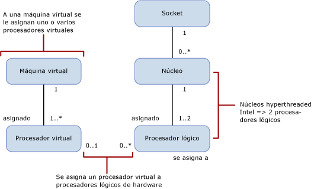

# Límites de la capacidad de cálculo de cada edición de SQL Server
[!INCLUDE[appliesto-ss-xxxx-xxxx-xxx-md](../includes/appliesto-ss-xxxx-xxxx-xxx-md.md)] En este artículo se describen los límites de la capacidad de cálculo para las ediciones de [!INCLUDE[ssCurrent](../includes/sscurrent-md.md)] y sus diferencias en entornos físicos y virtualizados con los procesadores con hyperthreading.  
  
   
  
 En esta tabla se describen las notaciones del diagrama anterior:  
  
|Valor|Descripción|  
|-----------|-----------------|  
|0..1|Cero o uno|  
|1|Exactamente uno|  
|1..\*|Uno o más|  
|0..\*|Cero o más|  
|1..2|Uno o dos|  
  
> [!IMPORTANT]  
> Información ampliada:  
>   
> - Una máquina virtual tiene uno o varios procesadores virtuales.  
> - Uno o más procesadores virtuales se asignan exactamente a una máquina virtual.  
> - Cero o un procesador virtual se asigna a cero o más procesadores lógicos. En la asignación de núcleos a procesadores lógicos: 
>     -   Uno a cero representa un procesador lógico desenlazado no utilizado por los sistemas operativos invitados.  
>     -   Uno a muchos representa un esfuerzo excesivo.  
>     -   Cero a muchos representa la ausencia de máquinas virtuales en el sistema host. Las máquinas virtuales no usan ningún procesador lógico.  
> - Un socket se asigna a cero o más núcleos. En la asignación de socket a núcleo:  
>     -   Uno a cero representa un socket vacío. No se instala ningún chip.  
>     -   Uno a uno representa un único chip de núcleo instalado en el socket. Esta asignación es poco frecuente hoy en día.  
>     -   Uno a muchos representa un chip de varios núcleos instalado en el socket. Los valores típicos son 2, 4 y 8.  
> - Un núcleo se asigna a uno o dos procesadores lógicos. En la asignación de núcleos a procesadores lógicos:  
>     -   Uno a uno representa que el hyperthreading está desactivado.  
>     -   Uno a dos representa que el hyperthreading está activado.  
  
 Las definiciones siguientes se aplican a los términos usados en este artículo:  
  
-   Un subproceso o procesador lógico es un motor de cálculo lógico desde la perspectiva de [!INCLUDE[ssNoVersion](../includes/ssnoversion-md.md)], el sistema operativo, una aplicación o un controlador.  
  
-   Una núcleo es una unidad de procesador. Puede constar de uno o varios procesadores lógicos.  
  
-   Un procesador físico puede estar formado por uno o varios núcleos. Un procesador físico es igual que un paquete de procesadores, o socket.  
  
Los sistemas con más de un procesador físico o con procesadores físicos que tienen varios núcleos y/o hyperthreads permiten al sistema operativo ejecutar varias tareas simultáneamente. Cada subproceso de ejecución aparece como procesador lógico. Por ejemplo, si su equipo tiene dos procesadores de cuatro núcleos con el la función de hyperthreading habilitada y dos subprocesos por núcleo, tiene 16 procesadores lógicos: 2 procesadores x 4 núcleos por procesador x 2 subprocesos por núcleo. Cabe mencionar que:  
  
-   La capacidad de cálculo de un procesador lógico de un solo subproceso de un núcleo hyperthreaded es menor que la capacidad de cálculo de un procesador lógico del mismo núcleo con el hyperthreading deshabilitado.  
  
-   Sin embargo, la capacidad de cálculo de los dos procesadores lógicos del núcleo con hyperthreading es mayor que la capacidad de cálculo del mismo núcleo con el hyperthreading deshabilitado.  
  
Cada edición de [!INCLUDE[ssNoVersion](../includes/ssnoversion-md.md)] tiene dos límites de capacidad de cálculo:  
  
- Un número máximo de sockets (o procesadores físicos o paquetes de procesador)  
  
- Un número máximo de núcleos de los que ha informado el sistema operativo  
  
Estos límites se aplican a una sola instancia de [!INCLUDE[ssNoVersion](../includes/ssnoversion-md.md)]. Representan la capacidad máxima de cálculo que una sola instancia usará. No restringen el servidor en el que se puede implementar la instancia. De hecho, implementar varias instancias de [!INCLUDE[ssNoVersion](../includes/ssnoversion-md.md)] en el mismo servidor físico es una manera eficaz de usar la capacidad de procesamiento de un servidor físico con más sockets o núcleos que los límites de capacidad siguientes.  
  
En la siguiente tabla se especifican los límites de la capacidad de cálculo para una sola instancia de cada edición de [!INCLUDE[ssCurrent](../includes/sscurrent-md.md)]:  
  
|Edición de[!INCLUDE[ssNoVersion](../includes/ssnoversion-md.md)] |Capacidad máxima de cálculo para una sola instancia ([!INCLUDE[ssNoVersion](../includes/ssnoversion-md.md)][!INCLUDE[ssDE](../includes/ssde-md.md)])|Capacidad máxima de cálculo para una sola instancia (AS, RS)|  
|---------------------------------------|--------------------------------------------------------------------------------------------------------|-------------------------------------------------------------------|  
|Enterprise Edition: licencia basada en núcleo\*|Sistema operativo máximo|Sistema operativo máximo|  
|Desarrollador|Sistema operativo máximo|Sistema operativo máximo|  
|Standard|Limitada a menos de 4 sockets o 24 núcleos|Limitada a menos de 4 sockets o 24 núcleos|  
|Express|Limitada a menos de 1 socket o 4 núcleos|Limitada a menos de 1 socket o 4 núcleos|  

\*La licencia Enterprise Edition con licencia de servidor y acceso de cliente (CAL) está limitada a 20 núcleos por instancia de [!INCLUDE[ssNoVersion](../includes/ssnoversion-md.md)]. Esta licencia de licencias no está disponible para nuevos contratos. No hay ningún límite en el modelo de licencias de servidor basado en núcleos.  
  
En un entorno virtualizado, el límite de capacidad de cálculo se basa en el número de procesadores lógicos, no de núcleos. Esto se debe a que la arquitectura de procesador no es visible para las aplicaciones invitadas. 

Por ejemplo, un servidor con cuatro sockets poblados con procesadores de cuatro núcleos y la capacidad de habilitar dos hiperprocesos por núcleo contiene 32 procesadores lógicos con el hyperthreading habilitado, pero solo 16 procesadores lógicos con el hyperthreading deshabilitado. Estos procesadores lógicos se pueden asignar a las máquinas virtuales del servidor. La carga de cálculo de las máquinas virtuales de este procesador lógico se asigna a un subproceso de ejecución en el procesador lógico del servidor host.  
  
Puede que quiera deshabilitar el hyperthreading cuando el rendimiento de cada procesador virtual sea importante. Puede habilitar o deshabilitar el hyperthreading mediante una opción de BIOS del procesador durante la configuración del BIOS. Sin embargo, normalmente se trata de una operación de ámbito de servidor que afectará a todas las cargas de trabajo que se ejecutan en el servidor. Esto puede sugerir que se deben separar las cargas de trabajo que se ejecutarán en entornos virtualizados de aquellas que se beneficiarían de aumentar el rendimiento de hyperthreading en un entorno físico del sistema operativo.  
  
## Vea también  
 [Ediciones y componentes de SQL Server 2016](../sql-server/editions-and-components-of-sql-server-2016.md)   
 [Características compatibles con las ediciones de SQL Server 2016](~/sql-server/editions-and-supported-features-for-sql-server-2016.md)   
 [Especificaciones de capacidad máxima para SQL Server](../sql-server/maximum-capacity-specifications-for-sql-server.md)   
 [Quick-Start Installation of SQL Server 2016](http://msdn.microsoft.com/library/672afac9-364d-4946-ad5d-8a2d89cf8d81) (Instalación rápida de SQL Server 2016)  
  
  

