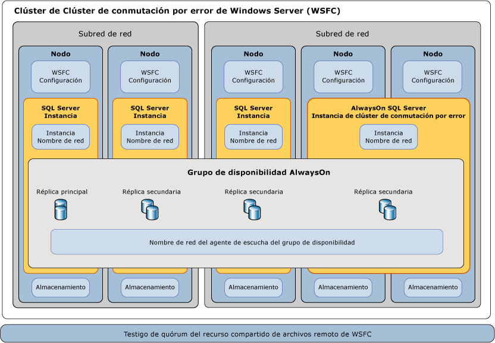

# Clústeres de conmutación por error de Windows Server (WSFC) con SQL Server
  Un clúster de *clústeres de conmutación por error de Windows Server* (WSFC) es un grupo de servidores independientes que funcionan conjuntamente para aumentar la disponibilidad de aplicaciones y servicios. [!INCLUDE[ssCurrent](../../../includes/sscurrent-md.md)] aprovecha los servicios y las capacidades de WSFC para admitir instancias de clúster de conmutación por error de [!INCLUDE[ssHADR](../../../includes/sshadr-md.md)] y [!INCLUDE[ssNoVersion](../../../includes/ssnoversion-md.md)] .  
  
   
##   Términos y definiciones  
 Clúster de WSFC  
 Un clúster de clústeres de conmutación por error de Windows Server (WSFC) es un grupo de servidores independientes que funcionan conjuntamente para aumentar la disponibilidad de aplicaciones y servicios.  
  
 Instancia de clúster de conmutación por error  
 Una instancia de un servicio de Windows que administra un recurso de dirección IP, un recurso de nombre de red y recursos adicionales necesarios para ejecutar una o varias aplicaciones o servicios. Los clientes pueden utilizar el nombre de red para tener acceso a los recursos del grupo de modo similar a utilizar un nombre de equipo para tener acceso a los servicios en un servidor físico. Sin embargo, dado que una instancia de clúster de conmutación por error es un grupo, puede ser objeto de conmutación por error a otro nodo sin que se vean afectados el nombre o la dirección subyacentes.  
  
 Nodo  
 Un sistema de Microsoft Windows Server que es miembro activo o inactivo de un clúster de servidores.  
  
 Recurso de clúster  
 Una entidad física o lógica que puede ser propiedad de un nodo, ser puesta en línea y sin conexión, ser movida entre nodos y ser administrada como un objeto de clúster. Un recurso de clúster puede ser propiedad de un único nodo en cualquier momento.  
  
 Grupo de recursos  
 Una colección de recursos de clúster administrados como un único objeto de clúster. Normalmente, un grupo de recursos contiene todos los recursos de clúster necesarios para ejecutar una aplicación o un servicio específicos. La conmutación por error y la conmutación por recuperación siempre actúan en grupos de recursos.  
  
 Dependencia de recursos  
 Un recurso del que depende otro recurso. Si el recurso A depende del recurso B, B es una dependencia de A.  
  
 Recurso de nombre de red  
 Un nombre de servidor lógico que se administra como un recurso de clúster. Un recurso de nombre de red debe utilizarse con un recurso de dirección IP.  
  
 Propietario preferido  
 Un nodo en el que un grupo de recursos prefiere ejecutarse. Cada grupo de recursos está asociado a una lista de propietarios preferidos clasificados en orden de preferencia. Durante la conmutación por error automática, el grupo de recursos se pasa al nodo preferido siguiente en la lista de propietarios preferidos.  
  
 Posible propietario  
 Un nodo secundario en el que se puede ejecutar un recurso. Cada grupo de recursos está asociado a una lista de posibles propietarios. Los grupos de recursos pueden ser objeto de conmutación por error solo en los nodos enumerados como posibles propietarios.  
  
 Modo de quórum  
 La configuración de quórum en un clúster de conmutación por error que determina el número de errores de nodo que el clúster puede admitir.  
  
 Quórum forzado  
 El proceso para iniciar el clúster aunque solo una minoría de los elementos necesarios para el quórum esté en comunicación.  
  

##   Información general de clústeres de conmutación por error de Windows Server  
 Los clústeres de conmutación por error de Windows Server proporcionan características de infraestructura que admiten escenarios de alta disponibilidad y recuperación ante desastres de aplicaciones de servidor hospedadas, como Microsoft [!INCLUDE[ssNoVersion](../../../includes/ssnoversion-md.md)] y Microsoft Exchange. Si un nodo o un servicio de clúster tiene un error, los servicios hospedados en ese nodo se pueden transferir automática o manualmente a otro nodo disponible en un proceso denominado *conmutación por error*.  
  
 Los nodos del clúster de WSFC trabajan juntos para proporcionar colectivamente estos tipos de funciones:  
  
-   **Notificaciones y metadatos distribuidos.** El servicio de WSFC y lo metadatos de aplicaciones hospedadas se mantiene en cada nodo del clúster. Estos metadatos incluyen la configuración y el estado de WSFC además de la configuración de la aplicación hospedada. Los cambios en los metadatos o el estado de un nodo se propagan automáticamente a los demás nodos del clúster.  
  
-   **Administración de recursos.** Los nodos individuales del clúster pueden proporcionar recursos físicos como almacenamiento asociado directo, interfaces de red y acceso al almacenamiento en disco compartido. Las aplicaciones hospedadas se registran como un recurso de clúster y pueden configurar dependencias de inicio y de estado en otros recursos.  
  
-   **Supervisión de estado.** La detección del estado del nodo principal y entre nodos se realiza mediante una combinación de comunicaciones de red de tipo latido y supervisión de recursos. Los votos de un quórum de nodos del clúster determinan el estado general del clúster.  
  
-   **Coordinación de conmutación por error.** Cada uno de los recursos se configura para ser hospedado en un nodo principal y se pueden transferir automática o manualmente a uno o varios nodos secundarios. Una directiva de conmutación por error basada en el estado controla la transferencia automática de la propiedad de recursos entre los nodos. Los nodos y las aplicaciones hospedadas son informadas cuando se produce la conmutación por error para puedan reaccionar correctamente.  
  
 Para más información, consulte: [Failover Clustering Overview - Windows Server](https://technet.microsoft.com/library/hh831579(v=ws.11).aspx)(Introducción a los clústeres de conmutación por error - Windows Server).  
  
##   Tecnologías de SQL Server AlwaysOn y WSFC  
 [!INCLUDE[ssCurrent](../../../includes/sscurrent-md.md)] *AlwaysOn* es una solución de alta disponibilidad y recuperación ante desastres que aprovecha las ventajas de WSFC. AlwaysOn proporciona una solución integrada y flexible que aumentar la disponibilidad de las aplicaciones, proporciona mejores réditos en inversiones de hardware y simplificar la implementación y administración de alta disponibilidad.  
  
 Tanto las instancias de clúster de conmutación por error [!INCLUDE[ssHADR](../../../includes/sshadr-md.md)] como AlwaysOn usan WSFC como tecnología de plataforma, registrando los componentes como recursos de clúster de WSFC.  Los recursos relacionados se combinan en un *grupo de recursos*que pueden hacerse dependientes de otros recursos de clúster de WSFC. El servicio de clúster de WSFC puede detectar y designar la necesidad de reiniciar la instancia de [!INCLUDE[ssNoVersion](../../../includes/ssnoversion-md.md)] o realizar automáticamente la conmutación por error a otro nodo del servidor del clúster de WSFC.  
  
> **IMPORTANTE:** Para aprovechar las tecnologías de [!INCLUDE[ssNoVersion](../../../includes/ssnoversion-md.md)] AlwaysOn, se deben aplicar varios requisitos previos relacionados con WSFC.  
>   
>  Para más información, consulte: [Requisitos previos, restricciones y recomendaciones para grupos de disponibilidad AlwaysOn &#40;SQL Server&#41;](../../../database-engine/availability-groups/windows/prereqs-restrictions-recommendations-always-on-availability.md).  
  
### Alta disponibilidad en el nivel de instancia con instancias de clúster de conmutación por error AlwaysOn  
 Una *instancia de clúster de conmutación por error* (FCI) de AlwaysOn es una instancia de [!INCLUDE[ssNoVersion](../../../includes/ssnoversion-md.md)] que está instalada en los nodos de un clúster de WSFC. Este tipo de instancia depende de los recursos de almacenamiento y el nombre de red virtual. El almacenamiento puede usar Canal de fibra, iSCSI, FCoE o SAS para almacenamiento en disco compartido o usar almacenamiento conectado localmente con [Espacios de almacenamiento directo (S2D)](http://technet.microsoft.com/windows-server-docs/storage/storage-spaces/storage-spaces-direct-overview). El recurso de nombre de red virtual depende de una o más direcciones IP virtuales, cada una en una subred diferente. El servicio SQL Server y el servicio del Agente SQL Server también son recursos, y ambos dependen de los recursos de nombre de red virtual y almacenamiento.  
  
 En caso de conmutación por error, el servicio de WSFC transfiere la propiedad de los recursos de la instancia a un nodo de conmutación por error designado. La instancia de [!INCLUDE[ssNoVersion](../../../includes/ssnoversion-md.md)] vuelve a iniciarse en el nodo de conmutación por error y las bases de datos se recuperan de la forma habitual. En cualquier momento determinado, solo un nodo del clúster puede hospedar la FCI y los recursos subyacentes.  
  
> **NOTA:**  Una instancia de clúster de conmutación por error AlwaysOn requiere almacenamiento en disco compartido simétrico como una red de área de almacenamiento (SAN) o un recurso compartido de archivos SMB.  Los volúmenes de almacenamiento en disco compartido deben estar disponible para todos los nodos potenciales de conmutación por error en el clúster de WSFC.  
  
 Para más información, consulte: [Instancias de clúster de conmutación por error de AlwaysOn &#40;SQL Server&#41;](../../../sql-server/failover-clusters/windows/always-on-failover-cluster-instances-sql-server.md)  
  
### Alta disponibilidad en el nivel de base de datos con [!INCLUDE[ssHADR](../../../includes/sshadr-md.md)]  
 Un *grupo de disponibilidad* es un conjunto de bases de datos de usuario que realizan la conmutación por error conjuntamente. Un grupo de disponibilidad consta de una *réplica de disponibilidad* principal y de una a cuatro réplicas secundarias que se mantienen mediante el movimiento de datos basado en registros de SQL Server para la protección de datos sin necesidad de almacenamiento compartido. Cada réplica está hospedada en una instancia de [!INCLUDE[ssNoVersion](../../../includes/ssnoversion-md.md)] en otro nodo del clúster de WSFC. El grupo de disponibilidad y un nombre de red virtual correspondiente se registran como recursos del clúster de WSFC.  
  
 Un *agente de escucha de grupo de disponibilidad* del nodo de la réplica principal responde a las solicitudes de cliente entrantes para conectarse al nombre de red virtual y, en función de los atributos de la cadena de conexión, redirige cada solicitud a la instancia adecuada de [!INCLUDE[ssNoVersion](../../../includes/ssnoversion-md.md)] .  
  
 En el caso de una conmutación por error, en lugar de transferir la propiedad de los recursos físicos compartidos a otro nodo, WSFC aprovecha para volver a configurar una réplica secundaria en otra instancia de [!INCLUDE[ssNoVersion](../../../includes/ssnoversion-md.md)] y que se convierta en la réplica principal del grupo de disponibilidad. El recurso de nombre de red virtual del grupo de disponibilidad se transfiere después a esa instancia.  
  
 En cualquier momento dado, solo una instancia de [!INCLUDE[ssNoVersion](../../../includes/ssnoversion-md.md)] puede hospedar la réplica principal de las bases de datos de un grupo de disponibilidad, todas las réplicas secundarias asociadas deben residir cada una en una instancia independiente, y cada instancia debe residir en nodos físicos distintos.  
  
> **NOTE:** [!INCLUDE[ssHADR](../../../includes/sshadr-md.md)] do not require deployment of a Failover Cluster Instance or use of symmetric shared storage (SAN or SMB).  
>   
>  Una instancia de clúster de conmutación por error (FCI) se puede usar junto con un grupo de disponibilidad para mejorar la disponibilidad de una réplica de disponibilidad. Sin embargo, para evitar posibles condiciones de carrera en el clúster de WSFC, la conmutación automática por error del grupo de disponibilidad no se admite en o desde una réplica de disponibilidad hospedada en una FCI.  
  
 Para más información, consulte: [Información general de los grupos de disponibilidad AlwaysOn (SQL Server)](../../../database-engine/availability-groups/windows/overview-of-always-on-availability-groups-sql-server.md).  
  
##   Seguimiento de estado y conmutación por error de WSFC  
 La alta disponibilidad para una solución de AlwaysOn se consigue mediante la supervisión de estado proactiva de los recursos de clúster de WSFC físicos y lógicos, junto con la conmutación por error automática y la reconfiguración de hardware redundante.  Un administrador del sistema también puede iniciar una *conmutación por error manual* de un grupo de disponibilidad o una instancia de [!INCLUDE[ssNoVersion](../../../includes/ssnoversion-md.md)] entre nodos.  
  
### Directivas de conmutación por error para nodos, instancias de clúster de conmutación por error y grupos de disponibilidad  
 Una *directiva de conmutación por error* se configura en los siguientes niveles: nodo de clúster de WSFC, instancia de clúster de conmutación por error (FCI) de [!INCLUDE[ssNoVersion](../../../includes/ssnoversion-md.md)] y grupo de disponibilidad.  Estas directivas, basadas en la gravedad, duración y frecuencia del estado incorrecto de los recursos de clúster y la capacidad de respuesta de los nodos, puede desencadenar el reinicio de un servicio o una *conmutación automática por error* de los recursos de clúster entre nodos, o puede desencadenar el paso de la réplica principal de un grupo de disponibilidad desde una instancia de [!INCLUDE[ssNoVersion](../../../includes/ssnoversion-md.md)] a otra.  
  
 La conmutación por error de la réplica de un grupo de disponibilidad no afecta a la instancia de [!INCLUDE[ssNoVersion](../../../includes/ssnoversion-md.md)] subyacente.  La conmutación por error de una FCI mueve las réplicas hospedadas de grupo de disponibilidad con la instancia.  
  
 Para obtener más información, vea: [Directiva de conmutación por error para instancias de clústeres de conmutación por error](../../../sql-server/failover-clusters/windows/failover-policy-for-failover-cluster-instances.md).  
  
### Detección del estado de los recursos de WSFC  
 Cada recurso de un nodo de clúster de WSFC puede notificar su condición y estado periódicamente o a petición. Una variedad de circunstancias puede indicar el error de recursos. Por ejemplo, una interrupción del suministro eléctrico, errores de disco o de memoria, errores de la comunicación de red o servicios que no responden.  
  
 Los recursos de clúster de WSFC como redes, almacenamiento o servicios se pueden hacer dependientes unos de otros. El estado acumulativo de un recurso está determinado por la acumulación sucesiva de su condición con el estado de cada una de sus dependencias de recursos.  
  
### Detección del estado entre nodos de WSFC y votos de quórum  
 Cada nodo de un clúster WSFC participa en la comunicación periódica de latido para compartir el estado de mantenimiento del nodo con los demás nodos. Los nodos que no responden se consideran que se encuentran en estado de error.  
  
 Un conjunto de nodos de *quórum* es una mayoría de los nodos con derecho a voto y testigos en el clúster WSFC. Un *voto de quórum*periódico determina el estado general de un clúster WSFC. La presencia de un quórum significa que el clúster es correcto y puede proporcionar tolerancia a errores de nivel de nodo.  
  
 En el nivel de clúster de WSFC se configura un *modo de quórum* que dicta la metodología empleada para los votos de quórum y cuándo se ha de realizar una conmutación por error automática o poner el clúster sin conexión.  
  
> **SUGERENCIA** Se recomienda tener siempre un número impar de votos de quórum en un clúster de WSFC.  A efectos de los votos de quórum, no es necesario que [!INCLUDE[ssNoVersion](../../../includes/ssnoversion-md.md)] esté instalado en todos los nodos del clúster. Un servidor adicional puede actuar como miembro de quórum, o el modelo de quórum de WSFC se puede configurar para que se use un recurso compartido de archivos remoto como factor de desempate.  
>   
>  Para más información, consulte [Configuración de los votos y modos de cuórum WSFC (SQL Server)](../../../sql-server/failover-clusters/windows/wsfc-quorum-modes-and-voting-configuration-sql-server.md).  
  
### Recuperación ante desastres mediante quórum forzado  
 Dependiendo de las prácticas operativas y la configuración del clúster de WSFC, se puede incurrir en conmutaciones por error automáticas y manuales manteniendo al mismo tiempo una solución sólida y con tolerancia a errores de [!INCLUDE[ssNoVersion](../../../includes/ssnoversion-md.md)] AlwaysOn. Sin embargo, si un quórum de los nodos con derecho a voto del clúster de WSFC no puede comunicarse con otro, o si el clúster de WSFC tiene un error en la validación del estado, el clúster de WSFC puede pasar a estar sin conexión.  
  
 Si el clúster de WSFC pasa a estar sin conexión debido a un desastre imprevisto o debido a un error persistente de hardware o de comunicaciones, se requiere la intervención manual administrativa para *forzar un cuórum* y poner de nuevo en línea los nodos de clúster supervivientes en una configuración sin tolerancia a errores.  
  
 Posteriormente, también debe realizarse una serie de pasos para volver a configurar el clúster de WSFC, recuperar las réplicas de base de datos afectadas y restablecer un nuevo quórum.  
  
 Para más información, consulte: [Recuperación ante desastres del clúster WSFC mediante cuórum forzado (SQL Server)](../../../sql-server/failover-clusters/windows/wsfc-disaster-recovery-through-forced-quorum-sql-server.md)  
  
##   Relación de los componentes de SQL Server AlwaysOn con WSFC  
 Existen varios niveles de relaciones entre [!INCLUDE[ssNoVersion](../../../includes/ssnoversion-md.md)] AlwaysOn y las características y los componentes de WSFC.  
  
 Los grupos de disponibilidad AlwaysOn se hospedan en instancias de [!INCLUDE[ssNoVersion](../../../includes/ssnoversion-md.md)] .  
 Una solicitud de cliente que especifica un nombre de red de agente de escucha del grupo de disponibilidad lógico para conectarse a la base de datos principal o secundaria se redirige al nombre de red de instancia adecuado de la instancia de [!INCLUDE[ssNoVersion](../../../includes/ssnoversion-md.md)] o de la Instancia de clúster de conmutación por error (FCI) de [!INCLUDE[ssNoVersion](../../../includes/ssnoversion-md.md)] subyacente.  
  
 Las instancias de SQL Server se hospedan activamente en un solo nodo.  
 Si está presente, una Instancia de [!INCLUDE[ssNoVersion](../../../includes/ssnoversion-md.md)] independiente reside siempre en un único Nodo con un nombre de red de instancia estático.  Si está presente, una FCI de [!INCLUDE[ssNoVersion](../../../includes/ssnoversion-md.md)] está activa en uno de dos o más nodos de conmutación por error posibles con un único Nombre de red de instancia virtual.  
  
 Los nodos son miembros de un clúster de WSFC.  
 Los metadatos de configuración de WSFC y el estado de todos los nodos se almacenan en cada nodo. Cada servidor puede proporcionar volúmenes asimétricos de almacenamiento o almacenamiento compartido (SAN) para las bases de datos del sistema o de usuario. Cada servidor tiene al menos una interfaz de red física en una o varias subredes IP.  
  
 El servicio WSFC supervisa el estado y administra la configuración de un grupo de servidores.  
 El servicio de Clúster de conmutación por error de Windows Server (WSFC) propaga los cambios en los metadatos y el estado de Configuración de WSFC a todos los nodos del clúster. Los metadatos y el estado parciales se pueden almacenar en un recurso compartido de archivos remoto de testigo de quórum de WSFC. Dos o más nodos o testigos activos constituyen un quórum para votar sobre el estado del clúster de WSFC.  
  
 [!INCLUDE[ssHADR](../../../includes/sshadr-md.md)] son subclaves del clúster de WSFC.  
 Si elimina y vuelve a crear un clúster de WSFC, debe deshabilitar y volver a habilitar la característica de [!INCLUDE[ssHADR](../../../includes/sshadr-md.md)] en cada instancia del servidor habilitada para [!INCLUDE[ssHADR](../../../includes/sshadr-md.md)] en el clúster de WSFC original. Para obtener más información, vea [Habilitar y deshabilitar grupos de disponibilidad AlwaysOn &#40;SQL Server&#41;](../../../database-engine/availability-groups/windows/enable-and-disable-always-on-availability-groups-sql-server.md).  
  
   
  
##   Tareas relacionadas  
  
-   [Ver la configuración de NodeWeight de quórum de clúster](../../../sql-server/failover-clusters/windows/view-cluster-quorum-nodeweight-settings.md)  
  
-   [Configurar los valores de NodeWeight de quórum de clúster](../../../sql-server/failover-clusters/windows/configure-cluster-quorum-nodeweight-settings.md)  
  
-   [Forzar el inicio de un clúster WSFC sin un quórum](../../../sql-server/failover-clusters/windows/force-a-wsfc-cluster-to-start-without-a-quorum.md)  
  
##   Contenido relacionado  
  
-   [Tecnologías de Windows Server: clústeres de conmutación por error](http://technet.microsoft.com/library/cc732488\(v=WS.10\).aspx)  

-   [Información general de los Espacios de almacenamiento directo \(S2D\)](http://technet.microsoft.com/windows-server-docs/storage/storage-spaces/storage-spaces-direct-overview)

-   [Clústeres de conmutación por error de Windows Server 2008 R2](http://technet.microsoft.com/library/ff182338\(WS.10\).aspx)  
  
-   [Ver eventos y registros para un clúster de conmutación por error](http://technet.microsoft.com/library/cc772342\(WS.10\).aspx)  
  
-   [Cmdlet de clúster de conmutación por error Get-ClusterLog](http://technet.microsoft.com/library/ee461045.aspx)  
  
## Vea también  
 [Instancias de clúster de conmutación por error de AlwaysOn (SQL Server)](../../../sql-server/failover-clusters/windows/always-on-failover-cluster-instances-sql-server.md)   
 [Información general de los grupos de disponibilidad AlwaysOn (SQL Server)](../../../database-engine/availability-groups/windows/overview-of-always-on-availability-groups-sql-server.md)   
 [Configuración de los votos y modos de cuórum WSFC (SQL Server)](../../../sql-server/failover-clusters/windows/wsfc-quorum-modes-and-voting-configuration-sql-server.md)   
 [Directiva de conmutación por error para instancias de clústeres de conmutación por error](../../../sql-server/failover-clusters/windows/failover-policy-for-failover-cluster-instances.md)   
 [Recuperación ante desastres del clúster WSFC mediante cuórum forzado (SQL Server)](../../../sql-server/failover-clusters/windows/wsfc-disaster-recovery-through-forced-quorum-sql-server.md)  
 [SQL Server 2016 Supports Windows Server 2016 Storage Spaces Direct](http://blogs.technet.microsoft.com/dataplatforminsider/2016/09/27/sql-server-2016-now-supports-windows-server-2016-storage-spaces-direct/) (SQL Server 2016 admite ahora Espacios de almacenamiento directo en Windows Server 2016)
  

