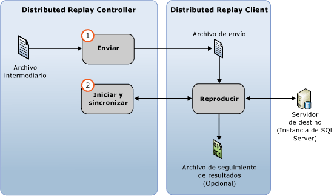

# Reproducir datos de seguimiento
[!INCLUDE[appliesto-ss-xxxx-xxxx-xxx-md](../../includes/appliesto-ss-xxxx-xxxx-xxx-md.md)]
  Puede iniciar una reproducción distribuida con la característica Distributed Replay de [!INCLUDE[msCoName](../../includes/msconame-md.md)] [!INCLUDE[ssNoVersion](../../includes/ssnoversion-md.md)] después de haber preparado los datos de seguimiento de entrada. Para obtener más información, vea [Preparar los datos de seguimiento de entrada](../../tools/distributed-replay/prepare-the-input-trace-data.md).  
  
 Utilice la opción **replay** de la herramienta de administración para iniciar la fase de reproducción de eventos de Distributed Replay. Esta fase consta de dos partes: la distribución de los datos de seguimiento y el inicio y sincronización de la reproducción distribuida.  
  
   
  
 Puede reproducir los datos de seguimiento en uno de estos dos modos de secuenciación: modo "stres" o modo "synchronization". El comportamiento predeterminado es reproducir los datos de seguimiento en modo "stress". Para obtener más información sobre la fase de reproducción de eventos y los modos de secuenciación, vea [SQL Server Distributed Replay](../../tools/distributed-replay/sql-server-distributed-replay.md).  
  
> [!NOTE]  
>  Los datos de seguimiento de entrada se deben capturar en una versión de [!INCLUDE[ssNoVersion](../../includes/ssnoversion-md.md)] compatible con Distributed Replay. Los datos de seguimiento de entrada también deben ser compatibles con el servidor de destino con el que se desea reproducir los datos de seguimiento. Para obtener más información acerca de los requisitos de versión, vea [Distributed Replay Requirements](../../tools/distributed-replay/distributed-replay-requirements.md).  
  
### Para reproducir el seguimiento  
  
1.  **(Opcional) Modifique los valores de configuración de reproducción**: si quiere modificar los valores de configuración de reproducción, como el modo de secuenciación y los diversos valores de escalado, debe modificar el elemento `<ReplayOptions>` del archivo de configuración de reproducción basado en XML `DReplay.exe.replay.config`. También puede modificar el elemento `<OutputOptions>` para especificar los valores de configuración de salida, como el registro del recuento de filas. Si modifica el archivo de configuración de reproducción, se recomienda modificar una copia en lugar del original. Para modificar los valores de configuración, siga estos pasos:  
  
    1.  Realice una copia del archivo de configuración de reproducción predeterminado, `DReplay.exe.replay.config`, y cambie el nombre del nuevo archivo. El archivo de configuración de reproducción predeterminado se encuentra en la carpeta de instalación de la herramienta de administración.  
  
    2.  Modifique los valores de configuración de reproducción en el nuevo archivo de configuración.  
  
    3.  Al iniciar la fase de reproducción de eventos (el paso siguiente), use el parámetro *config_file* de la opción **replay** para especificar la ubicación del archivo de configuración modificado.  
  
     Para obtener más información sobre el archivo de configuración de reproducción, vea [Configurar Distributed Replay](../../tools/distributed-replay/configure-distributed-replay.md).  
  
2.  **Iniciar la fase de reproducción de eventos**: para iniciar Distributed Replay, debe ejecutar la herramienta de administración con la opción **replay** . Para obtener más información, vea [Opción Replay &#40;herramienta de administración de Distributed Replay&#41;](../../tools/distributed-replay/replay-option-distributed-replay-administration-tool.md).  
  
    1.  Abra la utilidad de símbolo del sistema de Windows (**CMD.exe**) y navegue hasta la ubicación de instalación de la herramienta de administración de Distributed Replay (**DReplay.exe**).  
  
    2.  (Opcional) Use el parámetro *controller* , **-m**, para especificar el controlador, si el servicio del controlador se está ejecutando en un equipo diferente al de la herramienta de administración.  
  
    3.  Use el parámetro *controller_working_directory* , **-d**, para especificar dónde se guardó el archivo intermedio en el controlador durante la fase de preprocesamiento.  
  
    4.  (Opcional) Use el parámetro **-o** para capturar la actividad de reproducción en un archivo de seguimiento de resultados en cada cliente.  
  
    5.  (Opcional) Use el parámetro *target_server* , **-s**, para especificar la instancia de [!INCLUDE[ssNoVersion](../../includes/ssnoversion-md.md)] donde los clientes de Distributed Replay deben reproducir la carga de trabajo de seguimiento. Este parámetro no es necesario si se ha usado el elemento `<Server>` para especificar el servidor de destino en el elemento `<ReplayOptions>` del archivo de configuración de reproducción.  
  
    6.  Use el parámetro *clients* , **-w**, para especificar los clientes de Distributed Replay que deben participar en la reproducción. Enumere los nombres de los equipos cliente, separados por comas. Nota: no se permiten direcciones IP.  
  
    7.  (Opcional) Use el parámetro *config_file* , **-c**, para especificar la ubicación del archivo de configuración de reproducción. Use este parámetro para señalar el nuevo archivo de configuración si se ha modificado una copia del archivo de configuración de reproducción predeterminado.  
  
    8.  (Opcional) Use el parámetro *status_interval* , **-f**, para especificar si quiere que la herramienta de administración muestre los mensajes de estado con una frecuencia distinta de 30 segundos.  
  
     Por ejemplo, la sintaxis siguiente inicia la fase de reproducción en el mismo equipo que el servicio de controlador, utiliza un directorio de trabajo de controlador situado en `c:\WorkingDir`, captura la actividad de reproducción en cada cliente participante, utiliza los clientes `client1` y `client2` para realizar la reproducción y obtiene los restantes valores de configuración de reproducción de un archivo de configuración de reproducción modificado situado en `c:\modifiedreplay.config`:  
  
     `dreplay replay -d c:\WorkingDir -o -w client1,client2 -c c:\modifiedreplay.config`  
  
3.  Una vez finalizada la reproducción distribuida, la herramienta de administración devuelve información de resumen. Si se especificó la opción **-o** , la actividad de reproducción se ha guardado en los archivos de seguimiento de resultados en cada cliente. Para obtener más información sobre los archivos de seguimiento de resultados, vea [Revisar los resultados de la reproducción](../../tools/distributed-replay/review-the-replay-results.md).  
  
## Ver también  
 [Distributed Replay Requirements](../../tools/distributed-replay/distributed-replay-requirements.md)   
 [Opciones de línea de comandos de la herramienta de administración &#40;utilidad Distributed Replay&#41;](../../tools/distributed-replay/administration-tool-command-line-options-distributed-replay-utility.md)   
 [Configurar Distributed Replay](../../tools/distributed-replay/configure-distributed-replay.md)  
  
  
