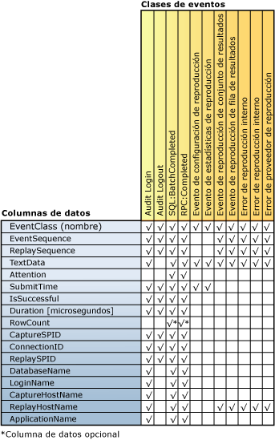

# Revisar los resultados de la reproducción

[!INCLUDE[appliesto-ss-xxxx-xxxx-xxx-md](../../includes/appliesto-ss-xxxx-xxxx-xxx-md.md)]

Una vez que la característica [!INCLUDE[msCoName](../../includes/msconame-md.md)] [!INCLUDE[ssNoVersion](../../includes/ssnoversion-md.md)] Distributed Replay completa una reproducción distribuida, la actividad de reproducción de cada cliente se puede capturar y guardar en los archivos de seguimiento de resultados de cada cliente. Para capturar esta actividad, debe usar el parámetro **-o** al ejecutar la herramienta de administración con la opción **replay** . Para obtener más información sobre la opción replay, vea [Opción Replay &#40;herramienta de administración de Distributed Replay&#41;](../../tools/distributed-replay/replay-option-distributed-replay-administration-tool.md).  
  
 El elemento XML `<ResultDirectory>` del archivo de configuración del cliente, `DReplayClient.xml`, ubicado en cada cliente, especifica la ubicación donde se almacenan los archivos de seguimiento de resultados. Los archivos de seguimiento del directorio de resultados del cliente se sobrescriben en cada reproducción.  
  
 Para especificar qué tipo de resultado se debería capturar en los archivos de seguimiento de resultados, modifique el archivo de configuración de reproducción, `DReplay.exe.replay.config`. Puede utilizar el elemento XML `<OutputOptions>` para especificar si se debería grabar el recuento de filas o el contenido del conjunto de resultados.  
  
 Para obtener más información sobre estas opciones de configuración, vea [Configurar Distributed Replay](../../tools/distributed-replay/configure-distributed-replay.md).  
  
## Clases de eventos capturadas en los archivos de seguimiento de resultados  
 En la tabla siguiente se enumeran todas las clases de eventos que se capturan el los datos de seguimiento de resultados.  
  
|Category|Nombre de clase de eventos|Frecuencia de captura|Punto de captura|  
|--------------|---------------------|-----------------------|----------------------|  
|Eventos reproducibles|Audit Login|Una vez por cada evento Audit Login en los datos de seguimiento originales|Al completar el evento correctamente o con error|  
||Audit Logout|Una vez por cada evento Audit Logout en los datos de seguimiento originales|Al completar el evento correctamente o con error|  
||SQL:BatchCompleted|Una vez por cada evento SQL:BatchStarting en los datos de seguimiento originales|Al completar el evento correctamente o con error|  
||RPC:Completed|Una vez por cada evento RPC:Starting en los datos de seguimiento originales|Al completar el evento correctamente o con error|  
|Estadísticas y resultados|Evento de configuración de reproducción|Una vez|El primer evento del seguimiento de resultados|  
||Evento de estadísticas de reproducción|Una vez|El último evento del seguimiento de resultados|  
||Evento de reproducción de conjunto de resultados|Una vez por cada evento SQL:BatchStarting y RPC:Starting.   Sólo se captura si el valor de la opción `<RecordResultSet>` en el archivo de configuración de reproducción está establecido en `Yes`.||  
||Evento de reproducción de fila de resultados|Una vez por cada fila del conjunto de resultados para los eventos SQL:BatchStarting y RPC:Starting.   Sólo se captura si el valor de la opción `<RecordResultSet>` en el archivo de configuración de reproducción está establecido en `Yes`.||  
|Errores y advertencias|Error de reproducción interno|Una vez por cada error interno|Cuando se produce una situación de error interno|  
||Error de proveedor de reproducción|Una vez por cada error de proveedor|Cuando se produce una situación de error de proveedor|  
  
 Tenga en cuenta lo siguiente:  
  
-   Para cada evento que se reproduce correctamente en el servidor de destino, hay una clase de eventos de salida correspondiente.  
  
-   Para cada evento de error o cancelación, pueden generarse varios errores.  
  
## Asignación de columnas de clase de eventos  
 La figura siguiente muestra las columnas del seguimiento de resultados que están disponibles para cada tipo de clase de eventos que se captura durante la reproducción.  
  
   
  
## Descripciones de columna para el seguimiento de resultados  
 En la tabla siguiente se describen las columnas de los datos de seguimiento de resultados.  
  
|Nombre de columna de datos|Tipo de datos|Descripción|Identificador de columna|  
|----------------------|---------------|-----------------|---------------|  
|EventClass|**nvarchar**|Nombre de la clase de eventos.|1|  
|EventSequence|**bigint**|Para los errores de proveedor y los errores internos y advertencias, este es el flujo de eventos de captura que corresponde al error o advertencia.   Para todas las demás clase de eventos, esta es la secuencia del evento en los datos de seguimiento originales.|2|  
|ReplaySequence|**bigint**|Para los errores de proveedor y los errores internos y advertencias, esta es el flujo de eventos de reproducción que corresponde al error o advertencia.   Para todas las demás clases de eventos, esta es la secuencia del evento que se asignó durante la reproducción.|3|  
|TextData|**ntext**|El contenido de TextData depende de EventClass.   En Audit Login y ExistingConnection, estas son las opciones de conjunto para la conexión.   En SQL:BatchStarting, este es el cuerpo de la solicitud del lote.   En RPC:Starting, este es el procedimiento almacenado al que se llamó.   En el evento de configuración de reproducción, esta columna contiene los valores que se definen en el archivo de configuración de reproducción.   En el evento de estadísticas de reproducción, esto contiene la información siguiente:   -El servidor SQL Server del destino de reproducción   -Número total de eventos reproducibles   -El número de errores del proveedor   -El número de errores internos   -Advertencias internas   -Número total de errores   -Índice de superación general   -El tiempo de reproducción (HH:MM:SS:MMM)   En el evento de reproducción de conjunto de resultados, esto muestra la lista de encabezados de columna de resultados devueltos.   En el evento de reproducción de fila de resultados, esto muestra el valor devuelto de todas las columnas para esa fila.   En la advertencia interna de reproducción y el error de proveedor de reproducción, esta columna contiene las advertencias o errores de proveedor.|4|  
|Atención|**bigint**|La duración de la atención (en microsegundos) para el evento. Esto se calcula a partir del evento de atención del seguimiento de captura. Si no se ha especificado el tiempo de espera de consulta para el evento, esta columna no está rellena (es null).|5|  
|SubmitTime|**datetime**|La hora en que el evento se envió a [!INCLUDE[ssNoVersion](../../includes/ssnoversion-md.md)].|6|  
|IsSuccessful|**int**|Una marca booleana que indica si un evento determinado se ejecutó correctamente y que los conjuntos de resultados se devolvieron al lado cliente.   Un evento que genera una advertencia (por ejemplo, cuando se cancela un evento debido a un evento de atención o al tiempo de espera especificado por el usuario) se considera correcto.   IsSuccessful puede ser uno de los valores siguientes:   1 = correcto   0 = error|7|  
|Duration [microsegundos]|**bigint**|Duración del tiempo de respuesta (en microsegundos) para el evento. La medición comienza cuando se envía el evento logon/log off/RPC/Language a [!INCLUDE[ssNoVersion](../../includes/ssnoversion-md.md)].   Si el evento se ejecuta correctamente, la medición comienza cuando se ha consumido el conjunto de resultados completo.   Si el evento no se ejecuta correctamente, la medición finaliza en el momento del error o cancelación del evento.|8|  
|RowCount|**bigint**|Se rellena según el valor de `<RecordRowCount>` en el archivo de configuración de reproducción:   Si `<RecordRowCount>` es igual a Yes, esta celda contiene el número de filas del conjunto de resultados devueltas por [!INCLUDE[ssNoVersion](../../includes/ssnoversion-md.md)].   Si `<RecordRowCount>` es igual a No, esta celda no está rellena (es null).|9|  
|CaptureSPID|**int**|El id. de la sesión de captura del evento.|10|  
|ConnectionID|**int**|El id. de la conexión de captura del evento.|11|  
|ReplaySPID|**int**|El id. de la sesión de reproducción del evento.|12|  
|DatabaseName|**nvarchar**|Nombre de la base de datos en que se ejecuta la instrucción del usuario.|13|  
|LoginName|**nvarchar**|El nombre de inicio de sesión de usuario. Puede ser un inicio de sesión de seguridad de [!INCLUDE[ssNoVersion](../../includes/ssnoversion-md.md)] o las credenciales de inicio de sesión de Microsoft Windows, con el formato *nombre_dominio*\\*nombre_usuario*.|14|  
|CaptureHostName|**nvarchar**|El nombre del equipo en el que se ejecuta el servicio de cliente durante la captura.|15|  
|ReplayHostName|**nvarchar**|El nombre del equipo en el que se ejecuta el cliente durante la reproducción.|16|  
|ApplicationName|**nvarchar**|El nombre de la aplicación cliente que creó la conexión de [!INCLUDE[ssNoVersion](../../includes/ssnoversion-md.md)] durante la captura.|17|  
  
## Consulte también  
 [SQL Server Distributed Replay](../../tools/distributed-replay/sql-server-distributed-replay.md)   
 [Distributed Replay Requirements](../../tools/distributed-replay/distributed-replay-requirements.md)   
 [Opciones de línea de comandos de la herramienta de administración &#40;utilidad Distributed Replay&#41;](../../tools/distributed-replay/administration-tool-command-line-options-distributed-replay-utility.md)   
 [Configurar Distributed Replay](../../tools/distributed-replay/configure-distributed-replay.md)  
  
  
